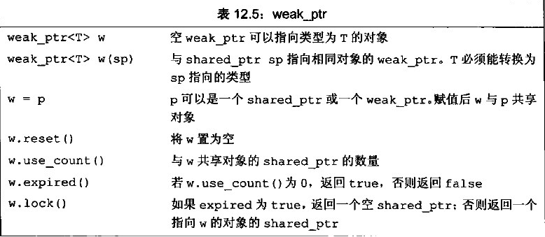

## std::unique_lock std::lock_guard

std::unique_lock 与std::lock_guard都能实现自动加锁与解锁功能，但是std::unique_lock要比std::lock_guard更灵活，但是更灵活的代价是占用空间相对更大一点且相对更慢一点。

1. 回顾采用RAII手法管理mutex的std::lock_guard其功能是在对象构造时将mutex加锁，析构时对mutex解锁，这样一个栈对象保证了在异常情形下mutex可以在lock_guard对象析构被解锁，lock_guard拥有mutex的所有权。

```c++
explicit lock_guard (mutex_type& m);	//必须要传递一个mutex作为构造参数
lock_guard (mutex_type& m, adopt_lock_t tag);	//tag=adopt_lock表示mutex已经在之前被上锁，这里lock_guard将拥有mutex的所有权
lock_guard (const lock_guard&) = delete;	//不允许copy constructor
lock_guard& operator=(lock_guard const&) = delete;
```

使用方法如下：

```c++
void XXX::funTest() {
  std::lock_guard<std::mutex> lk(mutex_);	// std::mutex mutex_;
  // do your logic
}
```

2. 再来看一个与std::lock_guard功能相似但功能更加灵活的管理mutex的对象 std::unique_lock，unique_lock内部持有mutex的状态：locked, unlocked。unique_lock比lock_guard***占用空间和速度慢一些***，因为其要维护mutex的状态。

```c++
unique_lock() noexcept;    // 可以构造一个空的unique_lock对象，此时并不拥有任何mutex
explicit unique_lock (mutex_type& m); // 拥有mutex，并调用mutex.lock()对其上锁
unique_lock (mutex_type& m, try_to_lock_t tag); // tag=try_lock表示调用mutex.try_lock()尝试加锁
unique_lock (mutex_type& m, defer_lock_t tag) noexcept; // tag=defer_lock表示不对mutex加锁，只管理mutex，此时mutex应该是没有加锁的
unique_lock (mutex_type& m, adopt_lock_t tag);//tag=adopt_lock表示mutex在此之前已经被上锁，此时unique_locl管理mutex
template <class Rep, class Period>
unique_lock (mutex_type& m, const chrono::duration<Rep,Period>& rel_time);//在一段时间rel_time内尝试对mutex加锁,mutex.try_lock_for(rel_time)
template <class Clock, class Duration>
unique_lock (mutex_type& m, const chrono::time_point<Clock,Duration>& abs_time);//mutex.try_lock_until(abs_time)直到abs_time尝试加锁
unique_lock (const unique_lock&) = delete; // 禁止拷贝构造
unique_lock (unique_lock&& x); // 获得x管理的mutex，此后x不再和mutex相关，x此后相当于一个默认构造的unique_lock,移动构造函数，具备移动语义,movable but not copyable
```

说明：其中2和5拥有mutex的所有权，而1和4永远不用有mutex的所有权，3和7及9若尝试加锁成功则拥有mutex的所有权。

unique_lock 在使用上比lock_guard更具有弹性，和 lock_guard 相比，unique_lock 主要的特色在于：
* unique_lock 不一定要拥有 mutex，所以可以透过 default constructor 建立出一个空的 unique_lock。
* unique_lock 虽然一样不可复制（non-copyable），但是它是可以转移的（movable）。所以，unique_lock 不但可以被函数回传，也可以放到 STL 的 container 里。

另外，unique_lock 也有提供 lock()、unlock() 等函数，可以用来加锁解锁mutex，也算是功能比较完整的地方。
unique_lock本身还可以用于std::lock参数，因为其具备lock、unlock、try_lock成员函数,这些函数不仅完成针对mutex的操作还要更新mutex的状态。


## shared_from_this

c++11中的shared_from_this()来源于[boost](https://so.csdn.net/so/search?q=boost&spm=1001.2101.3001.7020)中的enable_shared_form_this类和shared_from_this()函数，功能为返回一个当前类的std::share_ptr,使用方法如下：

```c++
#include<memory>
class Test: public std::enable_shared_from_this<Test>
{
 public:  
  Test();
  ~Test();
  std::shared_ptr<Test> getSharedFromThis(){return shared_from_this();}
}
```

##### 使用场合：

当类<font color="red">被share_ptr管理</font>，且在类的成员函数里需要把当前类对象作为参数传给其他函数时，就需要传递一个指向自身的share_ptr。

我们就使类继承enable_share_from_this，然后通过其成员函数share_from_this()返回当指向自身的share_ptr。


## std::bind  std::function

参考：https://www.cnblogs.com/leijiangtao/p/12051730.html#:~:text=std%3A%3Abind%E7%94%A8%E6%9D%A5,%E4%BB%BB%E4%BD%95%E6%88%91%E4%BB%AC%E9%9C%80%E8%A6%81%E7%9A%84%E6%97%B6%E5%80%99%E3%80%82

std::bind函数定义在头文件functional中，是一个函数模板，它就像一个函数适配器，接受一个可调用对象（callable object），生成一个新的可调用对象来“适应”原对象的参数列表。

std::bind返回一个基于f的函数对象，其参数被绑定到args上。
f的参数要么被绑定到值，要么被绑定到placeholders（占位符，如_1, _2, ..., _n）。

主要有两大作用：

　　1).将可调用对象与其参数一起绑定成一个仿函数。

　　2).将多元（参数个数为n,n>1)可调用对象转成一元或者（n-1)元可调用对象，即只绑定部分参数。

std::bind用法：

```c++
#include <iostream>
#include <functional>
 
void fn(int n1, int n2, int n3) {
	std::cout << n1 << " " << n2 << " " << n3 << std::endl;
}
 
int fn2() {
	std::cout << "fn2 has called.\n";
	return -1;
}
 
int main()
{
	auto bind_test1 = std::bind(fn, 1, 2, 3);
	auto bind_test2 = std::bind(fn, std::placeholders_1, std::placeholders_2, std::placeholders_3);
	auto bind_test3 = std::bind(fn, 0, std::placeholders_1, std::placeholders_2);
	auto bind_test4 = std::bind(fn, std::placeholders_2, 0, std::placeholders_1);
 
	bind_test1();	// 输出1 2 3
	bind_test2(3, 8, 24);// 输出3 8 24
	bind_test2(1, 2, 3, 4, 5);// 输出1 2 3，4和5会被丢弃
	bind_test3(10, 24);// 输出0 10 24
	bind_test3(10, fn2());// 输出0 10 -1
	bind_test3(10, 24, fn2());// 输出0 10 24，fn2会被调用，但其返回值会被丢弃
	bind_test4(10, 24);// 输出24 0 10
	return 0;
}
```


std::function是可调用对象的包装器。它是一个类模板，可以容纳除了类成员（函数）指针之外的所有可调用对象。通过指定它的模板参数，它可以用统一的方式处理函数，函数对象，函数指针，并允许保存和延迟执行它们。

std::function的使用方法：我们给std::function<font color="red">填入合适的函数签名</font> （即一个函数类型，只需要包括返回值和参数表）之后，它就变成了一个可以容纳所有这一类调用方式的“函数包装器”。

```c++
#1include <iostream>
 #include <functional>
 
 using namespace std;
 
 void func(void){
     cout << __FUNCTION__ << "(" << a << ") ->: ";
 }
 
 class Foo
 {
 public:
     static int foo_func(int a){
         cout << __FUNCTION__ << "(" << a << ") ->: ";
         return a;
     }
 };
 
 class bar
 {
 public:
     int operator()(int a){
         cout << __FUNCTION << "(" << a << ") ->: ";
         return a;
     }
 };
 
 int main(){
     // 绑定一个普通函数
     std::function<void(void)> fry = func;
     fr1();
 
     
     // 绑定一个类的静态成员函数
     std::function<int(int)> fr2 = Foo::foo_func;
     cout << fr2(123) << endl;
     
     // 绑定一个仿函数
     Bar bar;
     fr2 = bar;
     cout << fr2(123) <<endl;
 
     return 0;
 }
```

取代函数指针用法（类似Java的Runnable或lamada表达式）：

```c++
#include <iostream>
 #include <functional>
 
 using namespace std;
 
 class A
 {
 public:
     A(const std::function<void()>& f){
         :callback_(f){}
     
     void notify(void){
         callback_();
     }
 private:
     std::function<void()> callback_;
 };
 
 class Foo
 {
 public:
     void operator()(void){
         cout << __FUNCTION__<< endl;
     }
 };
 
 int main(){
     Foo foo;
     A aa(foo);	// 把重载的运算符函数（仿函数）作为callback传入
     aa.notify();
     
     return 0;
 }
```

std::function可以取代函数指针的作用。因为它可以保存函数延迟执行，所以比较适合作为回调函数，也可以把它看做类似于C#中特殊的委托（只有一个成员的委托）。std::function还可以作为函数入参，这样可以在函数外部控制函数的内部行为了，让我们的函数变得更加灵活。


std::bind用来将可调用对象与其参数一起进行绑定。绑定后的结果可以使用std::function进行保存，并延迟调用到任何我们需要的时候。

function模板类和bind模板函数，都可以实现类似函数指针的功能，但却却比函数指针更加灵活，特别是函数指向类的非静态成员函数时。

　　1).std::function可以绑定到全局函数/类静态成员函数(类静态成员函数与全局函数没有区别)。

　　2).绑定到类的非静态成员函数，则需要使用std::bind。

示例：

```c++
class A {
public:
  void setXXXListener(std::function<void(std::shared_ptr<Error>& err, float f_value)> notify_listener) {
    notify_listener_ = notify_listener;
  }
  
  void trigger() {
    if (notify_listener_) {
      ErrorCode err_code(kErrorIDoNotKnown);
      std::shared_ptr<Error> err = std::make_shared<Error>(err_code);
      err->setDescription("why this happened?");
      notify_listener_(err_code, 0.0f);
    }
  }
private:
  std::function<void(std::shared_ptr<Error>& err, float f_value)> notify_listener_;
};

class B {
public:
  void notify(std::shared_ptr<Error>& err, float f_value) {
  }
  
  void logic() {
    std::function<void(std::shared_ptr<Error>& err, float f_value)> fun = std::bind(&B::notify, this, std::placeholders::_1, std::placeholders::_2);
    a->setXXXListener(fun);
  }
}；
```


## std::future  std::promise

参考https://www.cnblogs.com/linuxAndMcu/p/14577275.html

引入原因：

我们经常会遇到需要从线程中返回异步任务结果的情况。例如在程序中，我们创建了一个压缩给定文件夹的线程，并且我们希望该线程能够返回新的 zip 文件的名称和大小。

在 C++11 之前的老方法是使用指针在线程间共享数据：

- 传递一个指针到新的线程中，该线程将在其中设置数据。直到主线程继续等待使用条件变量。当新线程设置数据并通知条件变量时，主线程将唤醒并从该指针处获取数据。
- 为了实现这一简单功能，我们使用了一个条件变量、一个 mutex 锁和一个指针，来实现捕获返回值。

```C++
#include<iostream>
#include<thread>
#include<mutex>

void fun(int x, int y, int* ans) {
	*ans = x + y;
}

int main()
{
	int a = 10;
	int b = 8;

	int* sum = new int(0);
	std::thread t(fun, a, b, sum);
	t.join();

	// 获取线程的"返回值"
	std::cout << *sum << std::endl; // 输出：18
	delete sum;
    
	system("pause");
	return 0;
}
```


C++11 提供了`std::future`类模板，future 对象提供访问异步操作结果的机制，很轻松解决从异步任务中返回结果。

在 C++ 标准库中，有两种“期望”，使用两种类型模板实现（这里主要介绍的是唯一期望）：

- 唯一期望(`unique futures`，`std::future<>`) 实例只能与一个指定事件相关联。
- 共享期望(`shared futures`, `std::shared_future<>`) 实例能关联多个事件。

事实上，一个`std::future`对象在内部存储一个将来会被某个 provider 赋值的值，并提供了一个访问该值的机制，通过`get()`成员函数实现。但如果有人试图在`get()`函数可用之前通过它来访问相关的值，那么`get()`函数将会阻塞，直到该值可用。

一个有效的`std::future`对象通常由以下三种 Provider 创建，并和某个共享状态相关联。Provider 可以是函数或者类，他们分别是：

- `std::async`函数，本文后面会介绍
- `std::promise::get_future`，get_future 为 promise 类的成员函数
- `std::packaged_task::get_future`，此时 get_future为 packaged_task 的成员函数

C++11 提供的 <future> 头文件中包含了以下几个类和函数：

- Providers 类：std::promise, std::package_task
- Futures 类：std::future, shared_future.
- Providers 函数：std::async()
- 其他类型：std::future_error, std::future_errc, std::future_status, std::launch


##### std::future构造函数

`std::future`一般由上面三种 Provider 创建，不过也提供了构造函数：

不过`std::future`的拷贝构造函数是被禁用的，只提供了默认的构造函数和 move 构造函数（注：C++ 新特性，参考https://www.cnblogs.com/qingergege/p/7607089.html）。另外，`std::future`的普通赋值操作也被禁用，只提供了 move 赋值操作。如下代码所示：

```c++
// default
future() noexcept;
// copy [deleted] 
future (const future&) = delete;
// move
future (future&& x) noexcept;

std::future<int> fut;           // 默认构造函数
fut = std::async(do_some_task);   // move-赋值操作。
```


##### std::future成员函数

其成员函数如下：

- `std::future::valid()`

  检查 future 对象是否拥有共享状态，参照构造函数只有两种可用，由默认构造函数创建的 future 对象显然不具有共享状态，即`valid()=false`，除非它被 move 赋值过；而移动构造函数创建的 future 对象往往拥有共享状态，只不过是否可以立即调用 get() 访问还需要确认共享状态标志是否已被设置为 ready。

- `std::future::get()`

  阻塞式获得共享状态的值，如果 future 对象调用 get() 时，共享状态标志尚未被设置为 ready，那么本线程将阻塞至其变为 ready。

- `std::future::wait()`

  等待共享状态标志变为 ready，在此之前线程将会一直阻塞。

- `std::future::wait_for()`

  与 wait() 不同，wait_for() 只会允许为此等待一段时间 _Rel_time，耗尽这个时间共享状态标志仍不为 ready，wait_for() 一样会返回。

- `std::future::wait_until()`

  与 wait_for() 类似的逻辑，只不过 wait_until() 参考的是绝对时间点。到达时间点 _Abs_time 的时候，wait_until() 就会返回，如果没等到 ready 的话，wait_until 一样会返回。

- `std::future::share()`

  返回一个 std::shred_future 对象，调用该函数之后，future 对象不和任何共享状态关联，也就不再是 valid 的了。

其中`std::future::wait_for()`和`std::future::wait_until()`的返回值如下：

- future_status::ready：共享状态的标志已经变为 ready，即 Provider 在共享状态上设置了值或者异常。
- future_status::timeout：超时，即在规定的时间内共享状态的标志没有变为 ready。
- future_status::deferred：共享状态包含一个 deferred 函数。

上面只是对各函数的简单介绍，具体示例请参考：[C++11 并发指南四( 详解三 std::future & std::shared_future)](http://www.cnblogs.com/haippy/p/3280643.html)


##### std::promise介绍

`std::promise`的作用就是提供一个不同线程之间的数据同步机制，它可以存储一个某种类型的值，并将其传递给对应的 future， 即使这个 future 与 promise 不在同一个线程中也可以安全的访问到这个值。

可以通过`get_future()`来获取与该 promise 对象相关联的 future 对象，调用该函数之后，两个对象共享相同的共享状态(shared state)。`set_value()`可以设置共享状态的值，此后 promise 的共享状态标志变为 ready。

- promise 对象是异步 Provider，它可以在某一时刻设置共享状态的值。
- future 对象可以异步返回共享状态的值，或者在必要的情况下阻塞调用者并等待共享状态标志变为 ready，然后才能获取共享状态的值。

更多内容请参考：[C++11 中std::promise 介绍](https://www.jb51.net/article/179682.htm)


##### future与promise配合使用示例

```c++
#include<iostream>
#include<thread>
#include<mutex>
#include<atomic>
#include<future>  //std::future std::promise

void fun(int x, int y, std::promise<int>& promiseObj) {
	promiseObj.set_value(x + y);
}

int main()
{
	int a = 10;
	int b = 8;

	// 声明一个promise类
	std::promise<int> promiseObj;
	// 将future和promise关联
	std::future<int> futureObj = promiseObj.get_future();
	// 模板传参的时候使用ref，否则传参失败
	std::thread t(fun, a, b, std::ref(promiseObj));
	t.join();
    
	// 获取线程的"返回值"
	int sum = futureObj.get();
	std::cout << "sum=" << sum << std::endl; // 输出：18

	std::system("pause");
	return 0;
}
```


## weak_ptr

为了更容易(同时也更安全)地使用动态内存，C++11标准库提供了两种智能指针(smart pointer)类型来管理动态对象。智能指针的行为类似常规指针，重要的区别是它负责自动释放所指的对象。

C++11标准库提供的这两种智能指针的区别在于管理底层指针的方式：shared_ptr允许多个指针指向同一个对象；unique_ptr则"独占"所指向的对象。

C++11标准库还定义了一个名为weak_ptr的辅助类，它是一种弱引用，指向shared_ptr所管理的对象。这三种类型都定义在memory头文件中。

智能指针是模板类而不是指针。类似vector，智能指针也是模板，当创建一个智能指针时，必须提供额外的信息即指针可以指向的类型。默认初始化的智能指针中保存着一个空指针。智能指针的使用方式与普通指针类似。解引用一个智能指针返回它指向的对象。如果在一个条件判断中使用智能指针，效果就是检测它是否为空。

 weak_ptr被设计为与shared_ptr共同工作，可以从一个shared_ptr或者另一个weak_ptr对象构造，***获得资源的观测权。但weak_ptr没有共享资源，它的构造不会引起指针引用计数的增加***。同样，在weak_ptr析构时也不会导致引用计数的减少，它只是一个静静地观察者。weak_ptr没有重载operator*和->，这是特意的，因为它不共享指针，不能操作资源，这是它弱的原因。但它可以使用一个非常重要的成员函数<font color="red">lock()<font>从被观测的shared_ptr获得一个可用的shared_ptr对象，从而操作资源。

 weak_ptr用于解决”引用计数”模型循环依赖问题，weak_ptr指向一个对象，并不增减该对象的引用计数器。weak_ptr用于配合shared_ptr使用，并不影响动态对象的生命周期，即其存在与否并不影响对象的引用计数器。weak_ptr并没有重载operator->和operator *操作符，因此不可直接通过weak_ptr使用对象。weak_ptr提供了expired()与lock()成员函数，前者用于判断weak_ptr指向的对象是否已被销毁，后者返回其所指对象的shared_ptr智能指针(对象销毁时返回”空”shared_ptr)。

 weak_ptr是一种不控制所指向对象生存期的智能指针，它指向由一个shard_ptr管理的对象。将一个weak_ptr绑定到一个shared_ptr不会改变shared_ptr的引用计数。一旦最后一个指向对象的shared_ptr被销毁，对象就会被释放。即使有weak_ptr指向对象，对象也还是会被释放。

当创建一个weak_ptr时，要用一个shared_ptr来初始化它。不能使用weak_ptr直接访问对象，而必须调用lock。此函数检查weak_ptr指向的对象是否仍存在。如果存在，lock返回一个指向共享对象的shared_ptr。与任何其它shared_ptr类似，只要此shared_ptr存在，它所指向的底层对象也就会一直存在。

 下图列出了weak_ptr支持的操作(来源于C++ Primer Fifth Edition 中文版)：



