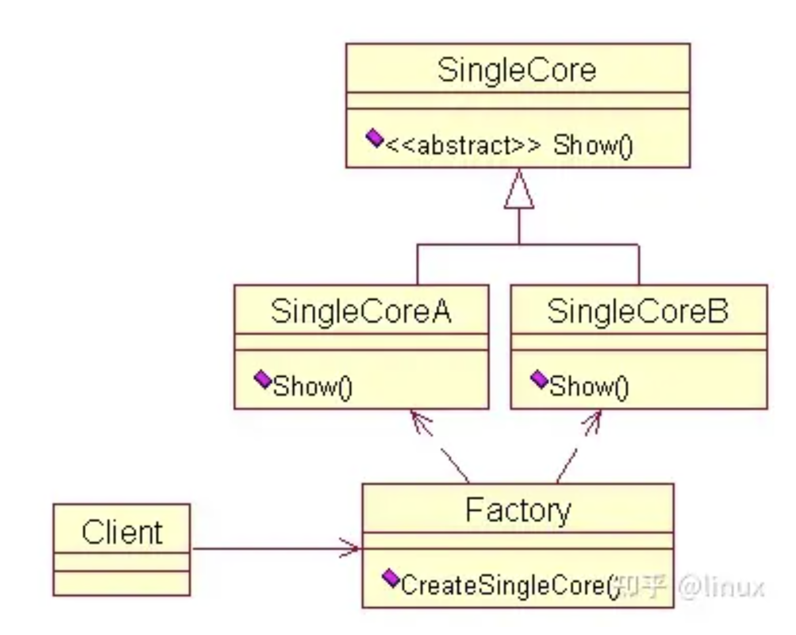
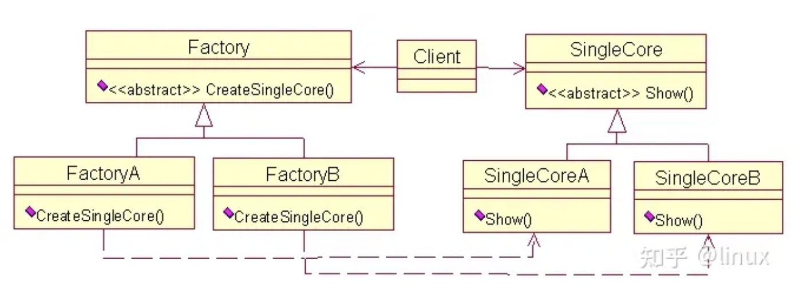
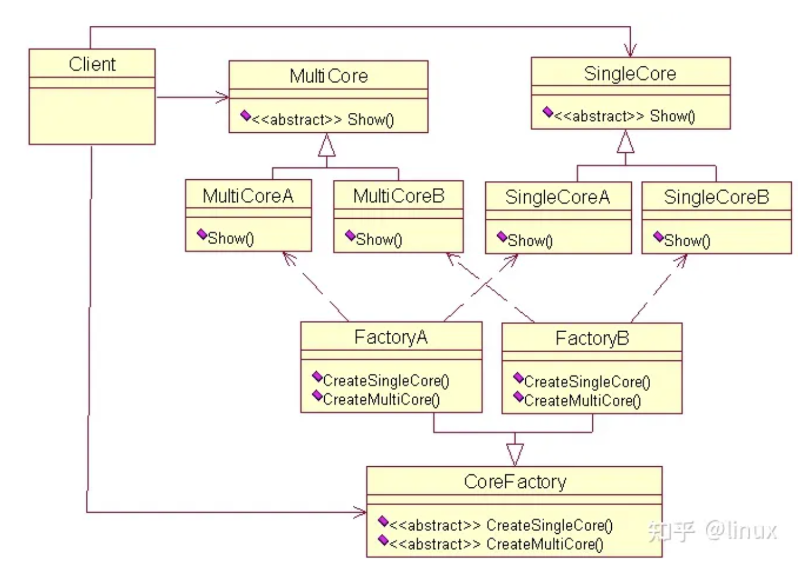

[C++各类设计模式及实现详解 - 知乎 (zhihu.com)](https://zhuanlan.zhihu.com/p/431714886)

软件领域中的设计模式为开发人员提供了一种使用专家设计经验的有效途径。设计模式中运用了面向对象编程语言的重要特性：封装、继承、多态，真正领悟设计模式的精髓是可能一个漫长的过程，需要大量实践经验的积累。最近看设计模式的书，对于每个模式，用C++写了个小例子，加深一下理解。

**推荐视频：**

[大厂面试必备技术—设计模式篇](https://link.zhihu.com/?target=https%3A//www.bilibili.com/video/BV1V5411P7uy/)

[C++后台开发的八股文（网络，语言），面试如何表现自己的技术](https://link.zhihu.com/?target=https%3A//www.bilibili.com/video/BV1m64y1h7of/)

学习地址：[c/c++ linux服务器开发/后台架构师](https://link.zhihu.com/?target=https%3A//ke.qq.com/course/417774%3FflowToken%3D1013300)


## 一、设计模式的分类

总体来说设计模式分为三大类

创建型模式，共五种：工厂方法模式、抽象工厂模式、单例模式、建造者模式、原型模式。

结构型模式，共七种：适配器模式、装饰器模式、代理模式、外观模式、桥接模式、组合模式、享元模式。

行为型模式，共十一种：策略模式、模板方法模式、观察者模式、迭代子模式、责任链模式、命令模式、备忘录模式、状态模式、访问者模式、中介者模式、解释器模式。

其实还有两类：并发型模式和线程池模式。


## 二、设计模式的六大原则

总原则：开闭原则（Open Close Principle）

开闭原则就是说对扩展开放，对修改关闭。在程序需要进行拓展的时候，不能去修改原有的代码，而是要扩展原有代码，实现一个热插拔的效果。所以一句话概括就是：为了使程序的扩展性好，易于维护和升级。想要达到这样的效果，我们需要使用接口和抽象类等，后面的具体设计中我们会提到这点。

1、单一职责原则

不要存在多于一个导致类变更的原因，也就是说每个类应该实现单一的职责，如若不然，就应该把类拆分。

2、里氏替换原则（Liskov Substitution Principle）

里氏代换原则(Liskov Substitution Principle LSP)面向对象设计的基本原则之一。 里氏代换原则中说，任何基类可以出现的地方，子类一定可以出现。 LSP是继承复用的基石，只有当衍生类可以替换掉基类，软件单位的功能不受到影响时，基类才能真正被复用，而衍生类也能够在基类的基础上增加新的行为。里氏代换原则是对“开-闭”原则的补充。实现“开-闭”原则的关键步骤就是抽象化。而基类与子类的继承关系就是抽象化的具体实现，所以里氏代换原则是对实现抽象化的具体步骤的规范。

历史替换原则中，子类对父类的方法尽量不要重写和重载。因为父类代表了定义好的结构，通过这个规范的接口与外界交互，子类不应该随便破坏它。

3、依赖倒转原则（Dependence Inversion Principle）

这个是开闭原则的基础，具体内容：面向接口编程，依赖于抽象而不依赖于具体。写代码时用到具体类时，不与具体类交互，而与具体类的上层接口交互。

4、接口隔离原则（Interface Segregation Principle）

这个原则的意思是：每个接口中不存在子类用不到却必须实现的方法，如果不然，就要将接口拆分。使用多个隔离的接口，比使用单个接口（多个接口方法集合到一个的接口）要好。

5、迪米特法则（最少知道原则）（Demeter Principle）

就是说：一个类对自己依赖的类知道的越少越好。也就是说无论被依赖的类多么复杂，都应该将逻辑封装在方法的内部，通过public方法提供给外部。这样当被依赖的类变化时，才能最小的影响该类。

最少知道原则的另一个表达方式是：只与直接的朋友通信。类之间只要有耦合关系，就叫朋友关系。耦合分为依赖、关联、聚合、组合等。我们称出现为成员变量、方法参数、方法返回值中的类为直接朋友。局部变量、临时变量则不是直接的朋友。我们要求陌生的类不要作为局部变量出现在类中。

6、合成复用原则（Composite Reuse Principle）

原则是尽量首先使用合成/聚合的方式，而不是使用继承。


## 1.工厂模式

工厂模式属于创建型模式，大致可以分为三类，简单工厂模式、工厂方法模式、抽象工厂模式。听上去差不多，都是工厂模式。下面一个个介绍，首先介绍简单工厂模式，它的主要特点是需要在工厂类中做判断，从而创造相应的产品。当增加新的产品时，就需要修改工厂类。有点抽象，举个例子就明白了。有一家生产处理器核的厂家，它只有一个工厂，能够生产两种型号的处理器核。客户需要什么样的处理器核，一定要显示地告诉生产工厂。下面给出一种实现方案。

```c++
enum CTYPE {COREA, COREB};     
class SingleCore    
{    
public:    
    virtual void Show() = 0;  
};    
//单核A    
class SingleCoreA: public SingleCore    
{    
public:    
    void Show() { cout<<"SingleCore A"<<endl; }    
};    
//单核B    
class SingleCoreB: public SingleCore    
{    
public:    
    void Show() { cout<<"SingleCore B"<<endl; }    
};    
//唯一的工厂，可以生产两种型号的处理器核，在内部判断    
class Factory    
{    
public:     
    SingleCore* CreateSingleCore(enum CTYPE ctype)    
    {    
        if(ctype == COREA) //工厂内部判断    
            return new SingleCoreA(); //生产核A    
        else if(ctype == COREB)    
            return new SingleCoreB(); //生产核B    
        else    
            return NULL;    
    }    
};   
```

这样设计的主要缺点之前也提到过，就是要增加新的核类型时，就需要修改工厂类。这就违反了开放封闭原则：软件实体（类、模块、函数）可以扩展，但是不可修改。于是，工厂方法模式出现了。所谓工厂方法模式，是指定义一个用于创建对象的接口，让子类决定实例化哪一个类。Factory Method使一个类的实例化延迟到其子类。

听起来很抽象，还是以刚才的例子解释。这家生产处理器核的产家赚了不少钱，于是决定再开设一个工厂专门用来生产B型号的单核，而原来的工厂专门用来生产A型号的单核。这时，客户要做的是找好工厂，比如要A型号的核，就找A工厂要；否则找B工厂要，不再需要告诉工厂具体要什么型号的处理器核了。下面给出一个实现方案。

```c++
class SingleCore    
{    
public:    
    virtual void Show() = 0;  
};    
//单核A    
class SingleCoreA: public SingleCore    
{    
public:    
    void Show() { cout<<"SingleCore A"<<endl; }    
};    
//单核B    
class SingleCoreB: public SingleCore    
{    
public:    
    void Show() { cout<<"SingleCore B"<<endl; }    
};    
class Factory    
{    
public:    
    virtual SingleCore* CreateSingleCore() = 0;  
};    
//生产A核的工厂    
class FactoryA: public Factory    
{    
public:    
    SingleCoreA* CreateSingleCore() { return new SingleCoreA; }    
};    
//生产B核的工厂    
class FactoryB: public Factory    
{    
public:    
    SingleCoreB* CreateSingleCore() { return new SingleCoreB; }    
};    
```

工厂方法模式也有缺点，每增加一种产品，就需要增加一个对象的工厂。如果这家公司发展迅速，推出了很多新的处理器核，那么就要开设相应的新工厂。在C++实现中，就是要定义一个个的工厂类。显然，相比简单工厂模式，工厂方法模式需要更多的类定义。

既然有了简单工厂模式和工厂方法模式，为什么还要有抽象工厂模式呢？它到底有什么作用呢？还是举这个例子，这家公司的技术不断进步，不仅可以生产单核处理器，也能生产多核处理器。现在简单工厂模式和工厂方法模式都鞭长莫及。抽象工厂模式登场了。它的定义为提供一个创建一系列相关或相互依赖对象的接口，而无需指定它们具体的类。具体这样应用，这家公司还是开设两个工厂，一个专门用来生产A型号的单核多核处理器，而另一个工厂专门用来生产B型号的单核多核处理器，下面给出实现的代码。

```c++
//单核    
class SingleCore     
{    
public:    
    virtual void Show() = 0;  
};    
class SingleCoreA: public SingleCore      
{    
public:    
    void Show() { cout<<"Single Core A"<<endl; }    
};    
class SingleCoreB :public SingleCore    
{    
public:    
    void Show() { cout<<"Single Core B"<<endl; }    
};    
//多核    
class MultiCore      
{    
public:    
    virtual void Show() = 0;  
};    
class MultiCoreA : public MultiCore      
{    
public:    
    void Show() { cout<<"Multi Core A"<<endl; }    
    
};    
class MultiCoreB : public MultiCore      
{    
public:    
    void Show() { cout<<"Multi Core B"<<endl; }    
};    
//工厂    
class CoreFactory      
{    
public:    
    virtual SingleCore* CreateSingleCore() = 0;  
    virtual MultiCore* CreateMultiCore() = 0;  
};    
//工厂A，专门用来生产A型号的处理器    
class FactoryA :public CoreFactory    
{    
public:    
    SingleCore* CreateSingleCore() { return new SingleCoreA(); }    
    MultiCore* CreateMultiCore() { return new MultiCoreA(); }    
};    
//工厂B，专门用来生产B型号的处理器    
class FactoryB : public CoreFactory    
{    
public:    
    SingleCore* CreateSingleCore() { return new SingleCoreB(); }    
    MultiCore* CreateMultiCore() { return new MultiCoreB(); }    
}; 
```

至此，工厂模式介绍完了。给出三种工厂模式的UML图，加深印象。

简单工厂模式的UML图：



工厂方法的UML图：



抽象工厂模式的UML图：




## 2.策略模式

策略模式是指定义一系列的算法，把它们一个个封装起来，并且使它们可相互替换。本模式使得算法可独立于使用它的客户而变化。也就是说这些算法所完成的功能一样，对外的接口一样，只是各自实现上存在差异。用策略模式来封装算法，效果比较好。下面以高速缓存（Cache）的替换算法为例，实现策略模式。

什么是Cache的替换算法呢？简单解释一下， 当发生Cache缺失时，Cache控制器必须选择Cache中的一行，并用欲获得的数据来替换它。所采用的选择策略就是Cache的替换算法。下面给出相应的UML图。