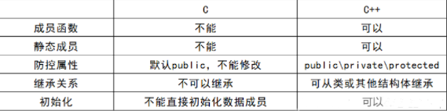
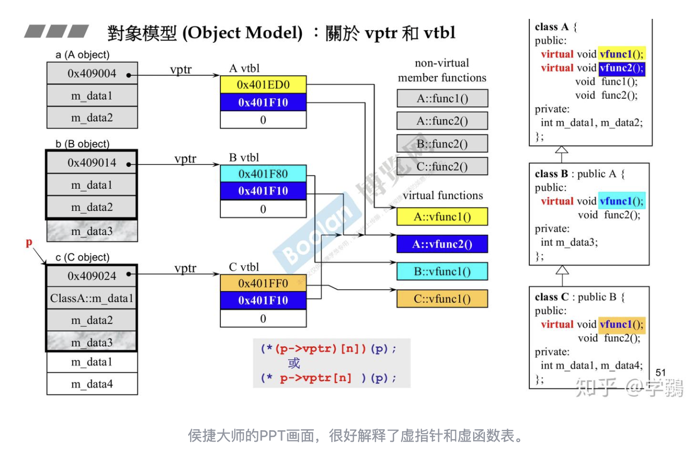

## 1. 指针和引用的区别

（1）指针有自己的一块空间，而引用只是一个别名；

（2）使用 sizeof 看一个指针的大小为4字节（32位，如果要是64位的话指针为8字节），而引用则是被引用对象的大小。

（3）指针可以被初始化为 NULL，而引用必须被初始化且必须是一个已有对象的引用。

（4）作为参数传递时，指针需要被解引用才可以对对象进行操作，而直接对引用的修改都会改变引用所指向的对象。

（5）指针在使用中可以指向其他对象，但是引用只能是一个对象的引用，不能被改变。

（6）指针可以是多级，而引用没有分级

（7）如果返回动态分配内存的对象或者内存，必须使用指针，引用可能引起内存泄漏。


## 2. new 和 delete 是如何实现的，与 malloc 和 free有什么异同？

**new操作针对数据类型的处理，分为两种情况：**

（1） 简单数据类型（包括基本数据类型和不需要构造函数的类型）

* 简单类型直接调用 operator new 分配内存；

* 可以通过new_handler 来处理 new 失败的情况；

* new 分配失败的时候不像 malloc 那样返回 NULL，它直接抛出异常（bad_alloc）。要判断是否分配成功应该用异常捕获的机制；


（2）复杂数据类型（需要由构造函数初始化对象）

* new 复杂数据类型的时候先调用operator new，然后在分配的内存上调用构造函数


**delete也分为两种情况：**

（1） 简单数据类型（包括基本数据类型和不需要析构函数的类型）

*  delete简单数据类型默认只是调用free函数。


（2）复杂数据类型（需要由析构函数销毁对象）

* delete复杂数据类型先调用析构函数再调用operator delete。


***与malloc 和 free 的区别：***

（1）属性上：new / delete 是c++关键字，需要编译器支持。malloc/free是库函数，需要c的头文件支持。

（2）参数：使用new操作符申请内存分配时无须制定内存块的大小，编译器会根据类型信息自行计算。而mallco则需要显式地指出所需内存的尺寸。

（3）返回类型：new操作符内存分配成功时，返回的是对象类型的指针，类型严格与对象匹配，故new是符合类型安全性的操作符。而malloc内存成功分配返回的是void *，需要通过类型转换将其转换为我们需要的类型。

（4）分配失败时：new内存分配失败时抛出bad_alloc异常；malloc分配内存失败时返回 NULL。

（5）自定义类型：new会先调用operator new函数，申请足够的内存（通常底层使用malloc实现）。然后调用类型的构造函数，初始化成员变量，最后返回自定义类型指针。delete先调用析构函数，然后调用operator delete函数释放内存（通常底层使用free实现）。malloc/free是库函数，只能动态的申请和释放内存，无法强制要求其做自定义类型对象构造和析构工作。

（6）重载：C++允许重载 new/delete 操作符。而malloc为库函数不允许重载。

（7）内存区域：new操作符从自由存储区（free store）上为对象动态分配内存空间，而malloc函数从堆上动态分配内存。其中自由存储区为：C++基于new操作符的一个抽象概念，凡是通过new操作符进行内存申请，该内存即为自由存储区。而堆是操作系统中的术语，是操作系统所维护的一块特殊内存，用于程序的内存动态分配，C语言使用malloc从堆上分配内存，使用free释放已分配的对应内存。自由存储区不等于堆，如上所述，布局new就可以不位于堆中。


## 3. struct 和 class 的区别？

（1）首先说一下C中的结构体和C++中的结构体的异同：

 

（2）C++中 struct 与 class 的区别：

* 内部成员变量及成员函数的默认访问属性：struct 默认防控属性是 public 的，而 class 默认的访问属性是private的

* 继承关系中默认访问属性的区别：在继承关系，struct 默认是 public 的，而 class 是 private

* class这个关键字还可用于定义模板参数，就等同于 typename；而struct不用与定义模板参数

  

## 4. 虚函数

* 只有虚函数才能正确重写，否则override时调的还是父类的方法；

* 通过虚函数表和动态联编实现重写，会有性能损耗，但可以忽略；

* C++11提供关键字override，只用于做个标记，防止误写重写方法；


#### 内存模型

先看几个例子

```c++
#include<iostream>
using namespace std;

class A
{
private:
public:
    A(){};
   ~A(){};
};

int main()
{
    A a;
    cout<<sizeof(a)<<endl; //输出为1
    return 0;
}
```

这段代码中，类A中没有任何成员变量，那么他的对象的大小是否是0？不是的，这个代码的输出是1！因为没有地址就没法存储这个对象，c++为没有成员变量的函数都开辟了一个字节的地址。

```c++
#include<iostream>
using namespace std;

class A
{
private:
    int data;
public:
    A(){};
   ~A(){};
};

int main()
{
    A a;
    cout<<sizeof(a)<<endl; //输出是4
    return 0;
}
```

```C++
#include<iostream>
using namespace std;


class A
{
private:
    
public:
    A(){};
   virtual ~A(){};
};

int main()
{
    A a;
    cout<<sizeof(a)<<endl; //输出居然是8！
    return 0;
}

```

上面的代码中我们把析构函数设置为虚函数，对象的居然有8个字节，这8个字节就是我们要介绍的虚指针的大小。

c++的内存模型由于涉及到对齐的问题，这里不详细介绍。

#### 虚指针

任何含有虚函数的类中，不论这个虚函数是继承的还是定义的，都有一个函数指针指向一个虚函数表，虚函数表是一个数组，数组中的每个元素都是一个虚函数指针。

```c++
#include<iostream>
using namespace std;

class A
{
private:
    int data1;
    int data2;
public:
    A(){};
   virtual ~A(){};
};

class B :public A
{
};
int main()
{
    A a;
    B b;
    cout<<sizeof(a)<<endl; //16
    cout<<sizeof(b)<<endl; //16
    return 0;
}
```

B继承了A，虽然没有显式声明，其依然继承了A的所有的元素, 包含两个int类型的成员变量和一个虚指针，因此内存大小是16。

#### 虚函数表

虚指针指向的就是虚函数表，本质是一个数组，存着所有的虚函数指针。

如果父类的虚函数没有被子类改写， 那么子类的虚函数表中的元素就是父类的对应的虚函数指针；相反，如果子类改写了父类的虚函数，那么对应的虚函数表中的元素就是自己的虚函数指针，决议这个指向的过程发生在运行时，就是所谓的动态绑定！

虚函数中的元素的顺序就是按照虚函数定义的方式存储。




## 5. 左值引用和右值引用

#### 5.1 **左值和右值**

在C++11中**可以取地址的、有名字的就是左值**，反之，**不能取地址的、没有名字的就是右值**（将亡值或纯右值）。

举个例子，int a = b+c, a 就是左值，其有变量名为a，通过&a可以获取该变量的地址；表达式b+c、函数int func()的返回值是右值，在其被赋值给某一变量前，我们不能通过变量名找到它，＆(b+c)这样的操作则不会通过编译。

**左值是可以放在赋值号左边可以被赋值的值；左值必须要在内存中有实体；**

右值当在赋值号右边取出值赋给其他变量的值；右值可以在内存也可以在CPU寄存器。

**一个对象被用作右值时，使用的是它的内容(值)，被当作左值时，使用的是它的地址。**


#### 5.2 **左值引用**

**左值引用就是我们平常使用的“引用”。**引用是为对象起的别名，必须被初始化，与变量绑定到一起，且将一直绑定在一起。

我们通过 & 来获得左值引用，  
*type &引用名 = 左值表达式；* 
可以把引用绑定到一个左值上，而不能绑定到要求转换的表达式、字面常量或是返回右值的表达式。举个例子：

```c++
int i = 42;
int &r = i;    // 正确，左值引用
int &r1 = i * 42;   // 错误， i*42是一个右值
const int &r2 = i * 42; // 正确，可以将一个const的引用绑定到一个右值上
```


#### 5.3 **右值引用**

右值引用是C++11中引入的新特性 , 它实现了**转移语义和精确传递**。

它的主要目的有两个方面：

1. **消除两个对象交互时不必要的对象拷贝，节省运算存储资源，提高效率。**
2. **能够更简洁明确地定义泛型函数。**

右值引用就是必须绑定到右值的引用，他有着与左值引用完全相反的绑定特性，我们通过 && 来获得右值引用。

右值引用的基本语法*type &&引用名 = 右值表达式；*

右值有一个重要的性质——只能绑定到一个将要销毁的对象上。举个例子：

```c++
int &&rr = i;  //错误，i是一个变量，变量都是左值
int &&rr1 = i *42;  //正确，i*42是一个右值
```


#### 5.4 右值引用和左值引用的区别

1. 左值可以寻址，而右值不可以。
2. 左值可以被赋值，右值不可以被赋值，可以用来给左值赋值。
3. 左值可变,右值不可变（仅对基础类型适用，用户自定义类型右值引用可以通过成员函数改变）。

参考链接：  *https://blog.csdn.net/qq_41181857/article/details/107581632*


## 6. 野指针和悬空指针

**野指针**：

野指针指向**一个已删除的对象或未申请访问受限内存区域的指针**。

与空指针不同，野指针无法通过简单地判断是否为NULL避免，而只能通过养成良好的编程习惯来尽力减少。对野指针进行操作很容易造成程序错误。

（1）成因

**野指针主要是因为这些疏忽而出现的删除或申请访问受限内存区域的指针。**

a.**指针变量未初始化**：任何指针变量刚被创建时不会自动成为NULL指针，它的缺省值是随机的，它会乱指一气。

所以，指针变量在创建的同时应当被初始化，要么将指针设置为NULL，要么让它指向合法的内存。

b.**指针释放之后未置空**：有时指针在free或delete后未赋值 NULL，便会使人以为是合法的。别看free和delete的名字（尤其是delete），它们只是把指针所指的内存给释放掉，但并没有把指针本身干掉。此时指针指向的就是“垃圾”内存。释放后的指针应立即将指针置为NULL，防止产生“野指针”。

c.**指针操作超越变量作用域**：**不要返回指向栈内存的指针或引用，因为栈内存在函数结束时会被释放**。示例程序如下：

```c++
class A {
public:
  void Func(void){ cout << “Func of class A” << endl; }
};
class B {
public:
  A *p;
  void Test(void) {
    A a;
    p = &a; // 注意 a 的生命期 ，只在这个函数Test中，而不是整个class B
  }
  void Test1() {
  p->Func(); // p 是“野指针”
  }
};
```

函数 Test1 在执行语句 p->Func()时，p 的值还是 a 的地址，对象 a 的内容已经被清除，所以 p 就成了“野指针” 。

（2）规避

a.初始化时置 NULL

指针变量一定要 初始化为NULL，因为任何指针变量(除了static修饰的指针变量)刚被创建时不会自动成为NULL指针，它的 缺省值是随机的。

b. 释放时置 NULL

当指针p指向的内存空间释放时，没有设置指针p的值为NULL。delete和free只是把内存空间释放了，但是并没有将指针p的值赋为NULL。通常判断一个指针是否合法，都是使用if语句测试该指针是否为NULL。例如：

```c++
int *p=newint(6);
delete p;
// 应加入 p=NULL; 以防出错
// ...
if(p != NULL)
{
  *p=7;
  cout << p << endl;
}
```

对于使用 free 的情况，常常定义一个宏或者函数 xfree 来代替 free 置空指针：

```c++
#define xfree(x) free(x); x = NULL;
// 在 C++ 中应使用 nullptr 指代空指针
// 一些平台上的 C/C++ 已经预先添加了 xfree 拓展，如 GNU 的 

libiberty
xfree(p);
// 用函数实现，例如 GitHub 上的 AOSC-Dev/Anthon-Starter #9：
static inline void *Xfree(void *ptr) {
    free(ptr);
#ifdef __cplusplus
    return nullptr;
#else
    return NULL;
#endif
}
q=Xfree(q);
```

所以动态分配内存后，如果使用完这个动态分配的内存空间后，必须习惯性地使用delete操作符取释放它。

**悬空指针：**

在C/C++等语言中，悬空指针（Dangling Pointer）指的是：**一个指针的指向对象已被删除，那么就成了悬空指针**。野指针是那些未初始化的指针。

```c++
int main(){
char*dp = NULL;
for(i=0;i<1;i++) {
char c;
dp =&c;
}
/* 注意c的声明周期 */
/* dp 此时为悬空指针 */
}
//这里for循环只是说明c是局部变量
void f(){
char*dp;
/* dp 未初始化，是野指针 */
}
```

len值都为0，如何判断是空指针还是空串导致其值为0？

null与空串的区别

1, null不占用空间,空字符串占用一定内存空间

2, null可以赋值给任何对象,而空字符串""只能赋值给String

3, 调用null的方法会返回nullpointerexception,调用空字符串的方法不会报错

4, null本身就是个对象,但它是一个不确定的对象,只能给引用形变量赋值,不能给基本类型赋值.(如 int a=null;是错误的)

> *原文链接: https://blog.csdn.net/bqxdrs012/article/details/7853135*


