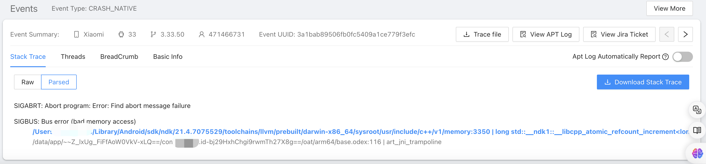
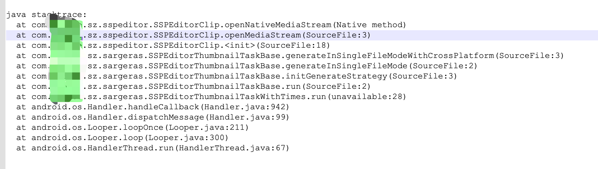
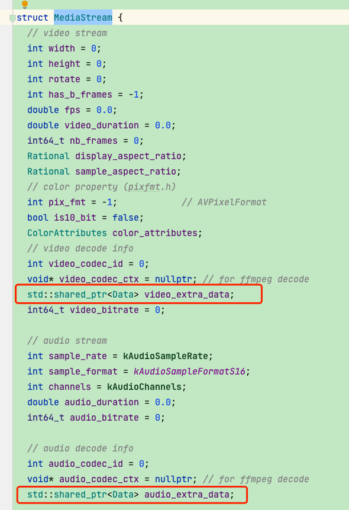
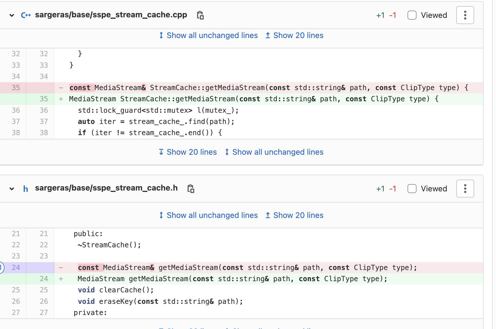

## 挂在智能指针引用计数

线上有一个量很多的崩溃，崩溃堆栈信息寥寥，只有2行如图：

SIGABRT: Abort program: Error: Find abort message failure

- SIGBUS: Bus error (bad memory access)
  - /Users/xx-toc/Library/Android/sdk/ndk/21.4.7075529/toolchains/llvm/prebuilt/darwin-x86_64/sysroot/usr/include/c++/v1/memory:3350 | long std::__ndk1::__libcpp_atomic_refcount_increment<long>(long&)
  - /data/app/~~Z_lxUg_FiFfAoW0VkV-xLQ==/com.xx.id-bj29HxhChgi9rwmTh27X8g==/oat/arm64/base.odex:116 | art_jni_trampoline

下载trace文件的末尾可以看到挂在：

只能确定挂在MediaStream中智能指针的引用计数相关libcpp_atomic_refcount_increment。MediaStream结构体如图，里面有两个智能指针对象：

最后修复的方式为：

虽然getMediaStream和clearCache都有锁保护，但由于最初getMediaStream返回的是一个const MediaStream& 对象。在getMediaStream函数执行完，会执行重载的=赋值运算符，触发拷贝构造函数导致MediaStrem结构体里的智能指针对象的引用计数增加，但如果同时有多线程在调用clearCache，导致MediaStream对象已经被析构，而智能指针还在做libcpp_atomic_refcount_increment。就有可能崩溃。

可以写一个测试Demo去造出这样的崩溃，比如开两个线程不断去get和clear。这个锁是无法保护到的。