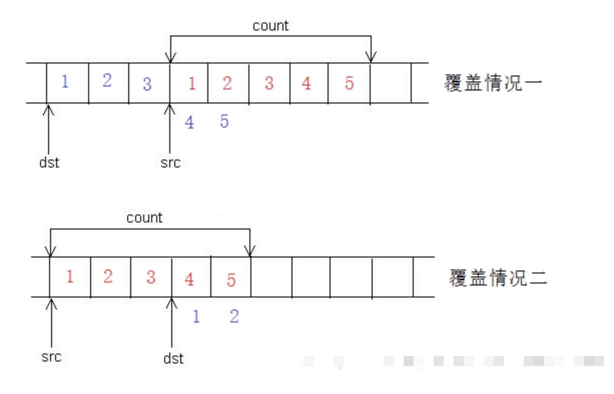

参考https://zhuanlan.zhihu.com/p/629336564?utm_campaign=shareopn&utm_medium=social&utm_psn=1847025857916444672&utm_source=wechat_session

## 面试题目录

1. `final`和`override`的作用？`final`为什么能提高代码执行效率？
2. `static`的三种作用？
3. `thread_local`变量作用？存放位置？生命周期？
4. 一个变量可以既是`const`又是`volatile`吗？
5. `NULL`和`nullptr`区别？为什么要引入`nullptr`？
6. 为什么`noexcept`能提高性能？
7. `delete[]`是怎样知道数组长度的？
8. `new`，`placement new`，`operator new`的区别？怎么在把对象new在栈上？
9. `__cdecl`和`__stdcall`区别？
10. 重载类的`delete`运算符，`delete`这个对象的时候会发生什么？
11. 函数调用压栈流程？
12. 声明和定义的作用，从编译角度说明？
13. 现代大部分编程语言都没有头文件，c++为什么有头文件？头文件和模块的优劣比较？`#include`和前置声明的区别？
14. c++11为什么引入枚举类？
15. 程序是从`main` 函数开始执行的吗？
16. 虚函数怎么实现的，性能？真的更慢吗？
17. 构造函数、析构函数、重载运算符函数可以是虚函数吗？类成员函数模板可以是虚函数吗？
18. 成员函数指针和普通函数指针区别？
19. 各种变量存放在虚拟内存的哪个分区？
20. 对象的内存模型？发生继承时候的对象内存模型？
21. 什么是标准布局类型和`trivial`类型？有什么用？
22. 什么是类型擦除？有哪些实现方式？
23. 什么是多态？静态和动态多态的实现原理？
24. `inline`的作用？优劣？为什么不会引发符号重定义错误？
25. `inline`用作内联展开这层含义的时候，构造函数、析构函数、虚函数可以被`inline`修饰吗？可以获取`inline`函数的指针吗？`static inline`和`extern inline`含义？
26. `malloc`和`new`区别？`malloc`实现原理？`free`后，内存被立即释放了吗？
27. 谈谈`lambda`函数？
28. `union`和`struct`和`class`的区别？
29. 什么是零三五原则？
30. C++可调用类型有哪些？
31. 为什么需要把析构函数定义为虚函数？
32. 具有类成员和基类的类，在实例化和销毁的时候，构造函数和析构函数的调用顺序？
33. 指针和引用的区别？
34. 符号重定义的解决方法有哪些？
35. 四种指针类型转换的区别？
36. 知道什么是RVO吗？
37. RTTI的实现原理？
38. `extern C`的作用？
39. 可以在运行时访问`private`成员吗？
40. C++编译流程？
41. 动态库和静态库的区别？知道动态库延迟加载优化吗？
42. 智能指针是什么？几种智能指针的区别？
43. 四种智能指针的简单实现？
44. 什么是左值和右值？它们是C++11才有的吗？string literal是左值还是右值？`i++`和`++i`是左值还是右值？
45. 什么是左右值引用？和左右值有关系吗？右值引用适合什么场景下用？
46. 基本类型的长度？
47. 内存对齐规则？为什么要内存对齐？应用场景？
48. 通过指针访问数组，系统是如何知道指针越界的？
49. 断言是什么？断言和条件语句的优劣？
50. 继承和组合的优劣？


## 题目

**(1)`final`和`override`的作用？`final`为什么能提高代码执行效率？**

> `override`：保证在派生类中声明的重载函数，与基类的虚函数有相同的签名，作用就是用于编译期代码检查。
> `final`：阻止类的进一步派生和虚函数的进一步重写，同时也是一种名为去虚拟化的优化技巧，相当于把运行期多态转换为了编译期多态，提高了执行效率。

**(2)`static`的3种作用？**

> 修饰局部变量，这意味着该变量只被初始化一次，并保留其值直到程序结束。
> 修饰全局变量，这意味着该变量具有文件作用域。
> 修饰成员变量，这意味着变量不会绑定到对象上。

**(3)`thread_local`作用和原理？**

> `thread_local`用来定义一个线程本地变量，每个线程都拥有自己的`thread_local`对象副本，这些副本放在各个线程自己的TLS空间。`thread_local`描述的对象在thread开始时分配，而在thread结束时释放。

**(4)一个变量可以既是`const`又是`volatile`吗？**

> 可以。`const`的作用是告诉编译器，编译期间不允许对变量进行修改，编译器在编译期间往往会对`const`变量执行一种名为字符替换的优化。`volatile`的作用是告诉编译器，第一，编译期间不要对该变量进行优化；第二，运行期间，每次必须从内存中加载变量的值。`const volatile`表示一个变量在程序编译期不能被修改且不能被优化；在程序运行期，每次必须从内存中加载变量的值。

**(5)`NULL`和`nullptr`区别？为什么要引入`nullptr`？**

> 主流编译器中，`NULL` 实际上是一个整数常量，被定义为 `0`，在 C++11 之前，当我们想要将一个指针初始化为空时，我们通常使用 `NULL`；`nullptr` 是 C++11 中引入的新的关键字，专门用于表示空指针，它不是整数类型，而是特殊的指针类型`nullptr_t`。之所以引入`nullptr`，第一，`NULL`是整数类型，用户调用foo(NULL)的时候，不能区分调用的是`foo(int)`还是`foo(int*)`函数；第二，主流编译器中`NULL`值为`0`，通过`0`表示一个无效地址，但是有的架构下，`0`地址有特定用途，而`nullptr`指向的永远是一个无效地址。

**(6)为什么`noexcept`能提高性能？**

> 使用 `noexcept `可以让编译器对代码进行优化，从而提高代码的性能。具体来说，为实现异常捕获的功能，c++引入了“栈回退”机制，编译器在编译函数的时候，会为函数生成额外的叫做“栈回退”的代码，使用`noexcept` 可以避免生成额外的代码来处理异常情况，这样可以减少代码量和执行时间。关闭异常捕获是比较危险的行为，一般只建议用在构造函数。

**(7)`delete[]`是怎样知道数组长度的？**

> 没有标准实现，一种常见的实现方法是，申请内存时，会在返回的指针前面存放这段内存的大小，调用`delete[]`的时候，就可以知道数组长度了。

**(8)`new`，`placement new`，`operator new`的区别？怎么在把对象new在栈上？**

> `operator new`作用是分配一块内存，`placement new`作用是在已分配内存地址处，创建一个对象，`new`的作用则等于`operator new` + `placement new`。先在栈上声明一个数组，然后通过`placement new` 在这段地址处创建对象，这就实现了在栈上new一个对象。

**(9)`__cdecl`和`__stdcall`区别？**

> 都是 Microsoft Visual C++ 中用于声明函数调用约定的关键字。`__cdecl` 是 C/C++ 默认的调用约定，在 `__cdecl` 调用约定下，参数从右往左入栈，由调用方负责清理堆栈；在`__stdcall` 调用约定下，函数参数从右向左压入堆栈中，函数堆栈的清除工作由被调用方负责。这些关键字主要用于跨语言调用，以确保参数传递和堆栈清理的一致性。

**(10)重载类的delete运算符，delete的时候会发生什么？**

> `new`的默认行为是先分配一段内存，然后调用对象的构造函数，把对象创建在这段内存上；`delete`的默认行为是先调用析构函数，然后释放内存。重载全局`new`和`delete`运算符号，会修改所有的`new`和`delete`内存行为，重载类的`new`和`delete`运算符，会修改针对这个类的`new`和`delete`内存行为。

**(11)函数调用压栈流程？**

> 不同系统下压栈的具体操作不同，但大致都有这么个过程：函数调用的时候，把被调用函数参数压栈，把预留的返回值存放位置压栈，把当前函数上下文，比如栈地址相关的寄存器和指令地址相关的寄存器内容压栈，函数返回的时候，弹出函数参数和返回值，弹出函数上下文内容到寄存器，恢复现场。

**(12)声明和定义的作用，从编译角度说明？**

> 声明的作用主要两点，第一，提供链接时需要的符号信息，这些信息存储在目标文件的重定位表和符号表当中；第二，提供类型大小信息，c++采取的是单文件编译策略，当不知道某个符号对应类型的定义的时候，需要在链接前预留出合适大小的内存空间，供链接时填充。

**(13)现代大部分编程语言都没有头文件，c++为什么有头文件？头文件和模块的优劣比较？#include和前置声明的区别？**

> c++和采取模块机制的编程语言的一个重大区别在于，c++把函数和变量签名这部分信息保存在头文件内，而采取模块机制的编程语言把这部分信息保存在库内。头文件和模块相比，会拷贝很多无用的声明信息到当前文件内，从而导致编译非常慢，另一个缺点就是头文件机制很容易引发符号重定义错误。c++之所以采用头文件机制是因为，早期计算机的内存资源非常珍贵，如果把函数和变量签名信息都保存到二进制库中，会浪费更多的内存资源。
> `#include`和前置声明本质上都是声明，区别在于`#include`在预处理期间做了一次拷贝声明的操作，前置声明的优势在于可以按需导入函数，而且可以解决循环依赖问题。

**(14)C++11为什么引入枚举类？**

> 传统的 C++ 枚举类型会将枚举值暴露在命名空间中，容易造成命名冲突，而枚举类则通过引入了作用域限定符来解决这个问题。其次，传统的 C++ 枚举类型是基于整数的，可以进行隐式的类型转换和比较操作，这可能会导致一些意想不到的错误，而枚举类则可以避免这个问题，因为它们只能进行显式的类型转换和比较操作。

**(15)程序是从`main` 函数开始执行的吗？**

> 不是，程序在执行前，会经历一个从磁盘加载程序到内存的过程，这个过程会执行全局变量的初始化。

**(16)虚函数怎么实现的？真的更慢吗？**

> 虚函数是通过虚函数表实现的，每个类都有自己的虚表，对象的首地址处存放有指向虚表的指针。当具体调用哪个虚函数可以在编译期间确定的时候，虚函数不一定更慢。

**(17)构造函数、析构函数、重载运算符函数可以是虚函数吗？类成员函数模板可以是虚函数吗？**

> 析构函数和重载运算符函数都可以是虚函数，而构造函数不能是虚函数，首先C++编译器层面不允许这种操作，第二构造函数不需要动态多态，C++引入虚函数的目的就是为了解决编译期间无法确定调用对象的问题，而对于构造函数这类特殊函数，编译期间就已经明确知道需要创建的对象类型。类成员函数模板不能是虚函数，因为C++在链接前是不知道成员函数模板被实例化多少次的，这就会导致编译器无法在编译期间确定虚表的大小。

**(18)成员函数指针和普通函数指针区别？**

> 普通函数指针属于指针类型，成员函数指针不是指针类型。通常来说，函数指针的长度等于机器字长，而成员函数指针长度比函数指针更长，其内部存放了对象地址和成员函数地址信息。在没有给出对象地址的情况下，调用成员函数指针会报错。

**(19)各种变量存放在虚拟内存的哪个分区？**

> 直接声明的变量、函数实参存储在栈区；new创建的对象，较小的对象存放在堆 区，较大的对象存放在共享内存区；常量和静态变量存放在静态存储区中的非代码区；所有函数存放在静态存储区中的代码区；字符常量也存放在代码区。

**(20)对象的内存模型？发生继承时候的对象内存模型？**

> 成员函数存放在代码区；静态成员变量存放在静态存储区；普通成员变量存放在对象内，且按照声明顺序依次存放；如果类声明了虚函数，那么对象的首地址处往往会存放一个指向虚表的指针，另外访问权限关键字可能会影响对象的内存布局，至于怎么影响，标准没有规定，不同编译器的实现可能不同。发生继承的时候，基类对象怎样存放，标准也没有规定，一般是按照继承顺序依次存放在内存当中，每个对象都可以有自己的虚表。

**(21)什么是标准布局类型和`trivial`类型？有什么用？**

> 引入标准布局类型是为了向C语言兼容，使得用户能够通过对象第一个成员的指针类型指向对象；引入`trivial`类型是为了提高对象初始化效率，`memcpy`比构造函数初始化效率效率更高。不考虑继承，一个类没有虚函数、所有非静态变量的访问权限相同，则是标准布局类型；不考虑继承，一个类没有自定义构造、自定义析构函数，没有虚函数，则是`trivial`类型。

**(22)什么是类型擦除？实现方式？**

> 类型擦除是一种，使得不同类型变量能够得到统一处理的技术。实现方式上可分为静态类型擦除了动态类型擦除，静态类型擦除通过模板或者宏实现，动态类型擦除可通过继承虚函数或者void类型实现。

**(23)什么是多态？实现方式？**

> 多态指的是一种相同的形式表现出不同行为的概念，分为静态多态和动态多态。代码层面，静态多态通过重载（overload）实现，动态多态通过覆盖（override）实现；原理层面，静态多态通过name mangling实现，动态多态通过虚表实现。

**(24)`inline`的作用和原理？**

> c++17以前，`inline`关键字主要有两个作用：第一，作为内联优化建议，告诉编译器在调用处展开函数，只不过是否展开函数还是由编译器决定；第二，解决符号重定义问题，不同文件内定义了同签名的函数，若被inline关键字修饰，则不会引发符号重定义错误。c++17开始，inline只保留第二个作用，若用户希望函数内联展开，则可以使用`__attribute((always_inline))__ `关键字，它是 GCC 和 Clang 中的一个扩展，用于强制内联函数。。
> 原理上，第一，内联展开相比于普通函数调用，少了函数上下文压栈的过程，因此效率更高，缺点就是容易引起代码膨胀。第二，被`inline`关键字修饰的函数名，编译期间会被标记为weak符号，链接目标文件的时候，多个同签名weak符号不会引发编译器报错，运行期间，会选取其中一个函数进行调用。

**(25)`inline`用作内联展开这层含义的时候，构造函数、析构函数、虚函数可以被`inline`修饰吗？可以获取`inline`函数的指针吗？`static inline`和`extern inline`含义？**

> 任何函数都可以被`inline`修饰，包括构造函数、析构函数、虚函数。这里提一下为什么虚函数可以内联，`inline`函数涉及到的是编译期解析，虚函数地址大多数情况下在运行期解析，但是某些情况下，具体调用哪个虚函数可以在编译期间确定，这个时候虚函数就能内联展开了。
> `inline`只作为内联建议，是否展开由编译器决定，因此是可以获取`inline`函数指针的。
> `static inline`指的是具有文件作用域的`inline`函数；`extern inline`作用比较特殊，外部单元把它当作普通函数进行调用，同单元内把它当作`inline`函数调用。

**(26)`malloc`和`new`区别？`malloc`实现原理？`free`后，内存被释放了吗？**

> `malloc`只分配一段内存，`new`会先分配一段内存，然后在这段内存上创建对象。`malloc`实现上，先从用户态切换到内核态，分配一段空闲物理内存，接着在虚拟内存堆空间或者共享内存空间分配一段虚拟内存，然后填充页表，把虚拟内存映射到物理内存，最后返回用户态。`free`后，内存没有被立即释放，而是保留在内存当中，作为内存池的一部分供下次使用。

**(27)谈谈lambda函数？**

> lambda函数可以看作是函数对象的语法糖，可以随地定义和调用。可通过lambda和智能指针实现闭包，c++17以前，lambda不支持`*this`捕获，c++17开始支持`*this`捕获，即非静态成员函数内部定义的lambda函数不需要通过显式指定this，就可以访问对象成员。

**(28)`union`和`struct`和`class`的区别？**

> `struct`和`class`都可以用来定义类，`struct`成员默认`public`，`class`成员默认`private`，只不过从语义上来说，建议用`struct`定义数据块，`class`定义类。`struct` 每个成员变量都有自己的内存地址；`union` 内存占用大小为其成员中需要空间最大者，每个成员变量都占用相同的内存单元。

**(29)什么是零三五原则？**

> 零之法则：对于不需要通过析构函数回收资源的类，只定义普通构造函数。
> 三之法则：如果某个类需要用户定义析构函数回收资源，那么这个类除了要定义普通构造函数外，也一定要定义复制构造函数、赋值运算函数。
> 五之法则：因为用户定义的析构函数、复制构造函数或复制赋值运算符的存在会阻止移动构造函数和移动赋值运算符的隐式定义，所以任何想要移动语义的类必须声明全部五个特殊成员函数

**(30)C++可调用类型有哪些？**

> 函数指针、函数对象、lambda表达式、成员函数指针。

**(31)为什么把析构函数定义为虚函数？**

> 解决`delete` 指向子类对象的基类指针的时候，只析构基类、不析构子类的问题。

**(32)构造函数和析构函数的调用顺序？**

> 创建对象过程，先调用基类的构造函数，然后依次调用类非静态成员的构造函数，最后调用自己的构造函数；销毁对象过程，先调用自己的析构函数，然后依次调用非静态成员的析构函数，最后调用基类的析构函数。

**(33)指针和引用的区别？**

> 引用和指针在汇编层面都是内存地址，引用可以看作是指针常量，只能在声明的时候初始化，相比于指针，引用的优势在于编译器帮我们检查地址是否初始化。

**(34)符号重定义的解决方法？**

> 通过`extern`，`static`，`inline`，`const`关键字都可以解决符号重定义问题，也可以通过命名空间、前置声明、`#ifndef`和`#pragma once`宏解决这个问题。

**(35)四种指针类型转换的区别？**

> `reinterpret_cast`用于任意指针（引用）类型之间的转换，不进行类型检查。
> `static_cast`用于基类和子类指针（引用）之间的转换，编译期进行类型检查。
> `dynamic_cast`用于基类和子类指针（引用）之间的转换，运行期进行类型检查。
> `const_cast`用于指针（引用）类型，用于删除限定符，不进行类型检查。

**(36)知道什么是RVO吗？**

> RVO是一种返回值优化手段，它通过避免创建临时对象来提高代码性能。当一个函数返回一个非引用类型的变量时，编译器会尝试将该对象直接构造在调用者的栈帧空间中，而不是为该对象分配新的内存并在函数返回后再将其拷贝到调用者的栈帧空间中。

**(37)RTTI的实现原理？**

> RTTI指的是运行时类型识别，通过虚表实现，指向类型信息的指针存放在虚表上。

**(38)extern C的作用？**

> `extern "C"` 是 C++ 提供的一个关键字，用于指示编译器将某个函数或变量的名称按照 C 语言的方式进行处理，以便与C语言进行交互。其原理上就是关闭编译器的name mangling。

**(39)可以在运行时访问private成员吗？**

> 可以，访问权限关键字只在编译期有效，运行期是没有访问权限关键字这些概念的，可以在运行时访问对象内的任何成员。

**(40)C++的编译流程？**

> 先预处理，然后编译成目标文件，接着把目标文件链接成库文件或者可执行文件。

**(41)动态库和静态库的区别？知道动态库延迟加载优化吗？**

> 链接动态库和静态库的时候，静态库会被复制到可执行程序当中，而动态库不会。相比动态库，静态库的执行效率更高，但占用磁盘空间更多，不方便更新。动态库的延迟加载指的是，在运行时按需加载动态链接库中的函数和数据，而不是在启动的时候加载库函数和数据，从而降低启动时间，在linux系统下，延迟加载是通过PLT表和GOT表配合实现的。

**(42)智能指针是什么？几种智能指针的区别？**

> 智能指针是RAII思想的一种应用，`shared_ptr`是最常用的智能指针，但是，第一，效率低，可以通过在特定场合使用`unique_ptr`弥补这点；第二，有循环引用的问题，故引入`weak_ptr`；第三，不能直接封装this并返回，否则会引起引用计数错误，故引入`enable_shared_from_this`。

**(43)四种智能指针的简单实现？**

> 不考虑删除器的实现，`unique_ptr`内部封装一个指针，在构造函数内把地址传给指针，析构函数内销毁指针指向的对象；`shared_ptr`内部封装一个指针，和一个存放在堆空间的引用计数，重新实现构造、拷贝构造、赋值构造、析构函数，每次调用构造函数、赋值构造函数、拷贝构造函数的时候，通过原子操作，对引用计数加1，每次调用析构函数，通过原子操作对引用计数减1，计数为0则销毁对象；`weak_ptr`实现和`shared_ptr`类似，不同在于它不影响引用计数；`enable_shared_from_this`通过CRTP实现。

**(44)什么是左值和右值？它们是C++11才有的吗？`string literal`是左值还是右值？`i++`和`++i`是左值还是右值**

> 左值是可以取地址的值，右值是不可取地址的值，右值之所以不能取地址，往往是因为这些值可能在寄存器上、可能是指令的一部分、可能是栈上的匿名变量。左右值是C语言出现开始，一直都有的概念，只是没有给他们明确下定义。`string literal`是左值，`++i`是返回值是`i`本身，是左值，`i++`会返回一个临时变量，是右值。

**(45)什么是左右值引用？和左右值有关系吗？右值引用适合什么场景下用？**

> 左值引用和右值引用在汇编层面都是地址，右值引用的出现是伴随着移动构造函数出现的，之所以引入右值引用类型的语法，是为了区分拷贝构造函数和移动构造函数，更准确地来说是为了区分深拷贝和浅拷贝。只有右值才可以赋值给右值引用，但是右值和右值引用没有严格意义上的关系，把右值赋值给右值引用往往是不合理的，反而会降低运行效率，不要把字面值赋值给右边值引用，不要以右值引用的方式返回函数返回值。右值引用仅仅适用于把将亡值传递给函数参数这类场景。

**(46)基本类型的长度？**

> 这些长度可能会因编译器、操作系统和计算机体系结构的不同而有所变化。`char`长度是1字节；`short`长度至少2字节，大多情况下2字节；`int`长度至少2字节，大多数情况下4字节；`long int`长度大于等于`int`长度；`float`长度4字节；`double`长度8字节。所以为了移植性，一般不建议直接使用这些类型，建议使用`int8_t`，`int16_t`，`int32_t`等类型。

**(47)内存对齐规则？为什么要内存对齐？**

> 内存对齐有两个要求，第一，C++中有对齐系数这个概念，任何类型在内存中的首地址必须是自身对齐系数的整数倍，基本类型的对齐系数等于自身大小，结构体类型的内存对齐系数等于内存占用最大的基本类型成员的大小；第二，结构体内类型，相对于结构体首地址的偏移必须等于自身对齐系数的整数倍。引入内存对齐，是为了<b>减少CPU访问内存数据的次数，提高取数据的效率。</b>

**(48)通过指针访问数组，系统是如何知道指针越界的？**

> 编译器编译代码期间会增加额外的代码用于检测数组是否越界。生成下标越界检查代码，C语言默认关闭；C++默认开启。

**(49)断言是什么？断言和条件语句的优劣？**

> 断言用于在代码编译或者执行期间检查特定条件是否成立，不成立则报错终止。静态断言和动态断言是两种不同类型的断言。静态断言在代码编译期间进行验证，并在发现问题时引发编译时错误；动态断言在代码运行期间进行验证，并在发现问题时引发异常或错误。C++内，动态断言通常只在调试模式下启用，而在发布模式下会被忽略。断言相比于条件语句，效率更高，但降低了程序安全性。

**(50)继承和组合的优劣？**

> 继承和组合都是代码复用的方案，继承的耦合性更高，但提供了更多复用特性，比如`public`和`private`复用、比如多态。


参考https://zhuanlan.zhihu.com/p/514955519?utm_campaign=shareopn&utm_medium=social&utm_psn=1844494877372588032&utm_source=wechat_session

## 变量的声明和定义有什么区别

为变量分配地址和存储空间的称为定义，不分配地址的称为声明。一个变量可以在多个地方声明，

但是只在一个地方定义。加入 extern 修饰的是变量的声明，说明此变量将在文件以外或在文件后面部分定义。说明：很多时候一个变量，只是声明不分配内存空间，直到具体使用时才初始化，分配内存空间，如外部变量。


## sizeof 和 [strlen](https://zhida.zhihu.com/search?content_id=202566847&content_type=Article&match_order=1&q=strlen&zhida_source=entity) 的区别

1 sizeof 是一个操作符，strlen 是库函数。

2 sizeof 的参数可以是数据的类型，也可以是变量，而 strlen 只能以结尾为‘\0‘的字符串作参数。

3 编译器在<font color="red">编译时</font>就计算出了 sizeof 的结果。而 [strlen 函数](https://zhida.zhihu.com/search?content_id=202566847&content_type=Article&match_order=1&q=strlen+函数&zhida_source=entity)必须在运行时才能计算出来。并且 sizeof 计算的是数据类型占内存的大小，而 strlen 计算的是字符串实际的长度。

4 数组做 sizeof 的参数不<font color="red">退化</font>，传递给 strlen 就退化为指针了。

注意：有些是操作符看起来像是函数，而有些函数名看起来又像操作符，这类容易混淆的名称一定要加以区分，否则遇到数组名这类特殊数据类型作参数时就很容易出错。最容易混淆为函数的操作符就是 sizeof。

### 参数退化的概念

1. **数组到指针的退化**：

   - 当一个数组被用作函数参数时，它会退化为指向该数组首元素的指针。例如，定义一个函数接收一个数组：

     ```c++
     void func(int arr[]) { }
     ```

     在这个函数中，arr实际上是一个指向int的指针 (int*)，而不是完整的数组。这意味着在函数内部无法获取到数组的大小信息。

2. **函数到指针的退化**：

   - 当函数被传递作为参数时，也会退化为指向该函数的指针。比如：

     ```c++
     void func() { }
     void (*funcPtr)() = func; // func 退化为指针
     ```

- **`sizeof`操作符**：

  - `sizeof` 是一个编译时操作符，它可以在编译时期测量出对象的大小。当你传递一个数组给 `sizeof` 时，它不会退化为指针，而是保持数组的类型，返回该数组的实际大小（以字节为单位）。

  - 例如：

    ```c++
    int arr[10];
    std::cout << sizeof(arr); // 输出：40 （假设每个int占4字节）
    ```

- **`strlen`函数**：

  - `strlen` 是一个函数，用于计算以'\0' 终止的字符串的长度。当你将数组传递给 `strlen` 时，由于数组的退化性质，`arr` 退化为指向它首元素的指针（即 `char*`）。

  - 例如：

    ```c++
    char arr[] = "Hello";
    std::cout << strlen(arr); // 输出：5
    ```

    尽管arr是一个数组，但在strlen的上下文中，它退化为了指针，只能传递函数所需的内容（即字符的指针），而不会保持数组的规模。


## C 语言的关键字 static 和 C++ 的关键字 static 有什么区别

在 C 中 static 用来修饰局部静态变量和外部静态变量、函数。而 C++中除了上述功能外，还用来定义类的成员变量和函数。即静态成员和[静态成员函数](https://zhida.zhihu.com/search?content_id=202566847&content_type=Article&match_order=1&q=静态成员函数&zhida_source=entity)。

注意：编程时 static 的记忆性，和全局性的特点可以让在不同时期调用的函数进行通信，传递信息，而 C++的静态成员则可以在多个对象实例间进行通信，传递信息。


## Ｃ中的 [malloc](https://zhida.zhihu.com/search?content_id=202566847&content_type=Article&match_order=1&q=malloc&zhida_source=entity) 和Ｃ＋＋中的 new 有什么区别

malloc 和 new 有以下不同：

（1） new、delete 是操作符，可以重载，只能在 C++中使用。

（2） malloc、free 是函数，可以覆盖，C、C++中都可以使用。

（3） new 可以调用对象的构造函数，对应的 delete 调用相应的析构函数。

（4） malloc 仅仅分配内存，free 仅仅回收内存，并不执行构造和析构函数

（5） new、delete 返回的是某种数据类型指针，malloc、free 返回的是 void 指针。

注意：malloc 申请的内存空间要用 free 释放，而 new 申请的内存空间要用 delete 释放，不要混用。

因为两者实现的机理不同。


## 写一个“标准”宏 MIN

\#define min(a,b)((a)<=(b)?(a):(b))

注意：在调用时一定要注意这个宏定义的副作用，如下调用：

((++*p)<=(x)?(++*p):(x)

p 指针就自加了两次，违背了 MIN 的本意。


## 一个指针可以是 volatile 吗

可以，因为指针和普通变量一样，有时也有变化程序的不可控性。常见例：[子中断服务子程序](https://zhida.zhihu.com/search?content_id=202566847&content_type=Article&match_order=1&q=子中断服务子程序&zhida_source=entity)修改一个指向一个 buffer 的指针时，必须用 volatile 来修饰这个指针。

说明：指针是一种普通的变量，从访问上没有什么不同于其他变量的特性。其保存的数值是个整型数据，和整型变量不同的是，这个整型数据指向的是一段内存地址。


## a 和&a 有什么区别

```c
#include<stdio.h>

void main( void )
{
  int a[5]={1,2,3,4,5};
  int *ptr=(int *)(&a+1);
  printf("%d,%d",*(a+1),*(ptr-1));

  return;
}
```

输出结果：2，5。

注意：数组名 a 可以作数组的首地址，而&a 是数组的指针。思考，将原式的 int *ptr=(int *)(&a+1); 改为 int *ptr=(int *)(a+1);时输出结果将是什么呢？


## 简述 C、C++程序编译的内存分配情况

C、C++中内存分配方式可以分为三种：

（1） 从静态存储区域分配：

内存在程序编译时就已经分配好，这块内存在程序的整个运行期间都存在。速度快、不容易出错，因为有系统会善后。例如全局变量，static 变量等。

（2） 在栈上分配：

在执行函数时，函数内局部变量的存储单元都在栈上创建，函数执行结束时这些存储单元自动被释放。栈内存分配运算内置于处理器的指令集中，效率很高，但是分配的内存容量有限。

（3） 从堆上分配：

即动态内存分配。程序在运行的时候用 malloc 或 new 申请任意大小的内存，程序员自己负责在何时用 free 或 delete 释放内存。动态内存的生存期由程序员决定，使用非常灵活。如果在堆上分配了空间，就有责任回收它，否则运行的程序会出现内存泄漏，另外频繁地分配和释放不同大小的堆空间将会产生堆内碎块。

一个 C、C++程序编译时内存分为 5 大存储区：堆区、栈区、全局静态区、文字常量区、程序代码区。


## 简述 strcpy、[sprintf](https://zhida.zhihu.com/search?content_id=202566847&content_type=Article&match_order=1&q=sprintf&zhida_source=entity) 与 memcpy 的区别

三者主要有以下不同之处：

（1） 操作对象不同，strcpy 的两个操作对象均为字符串，sprintf 的操作源对象可以是多种数据类型，目的操作对象是字符串，memcpy 的两个对象就是两个任意可操作的内存地址，并不限于何种数据类型。

（2） 执行效率不同，memcpy 最高，strcpy 次之，sprintf 的效率最低。

（3） 实现功能不同，strcpy 主要实现字符串变量间的拷贝，sprintf 主要实现其他数据类型格式到字符串的转化，memcpy 主要是内存块间的拷贝。

说明：strcpy、sprintf 与 memcpy 都可以实现拷贝的功能，但是针对的对象不同，根据实际需求，来选择合适的函数实现拷贝功能。

```c++
char *strcpy(char *strDest, const char *strSrc)	// 加分点1：const
{
  if (strDest == NULL || strSrc == NULL) // 加分点2:判空
  	return NULL ;
  if (strDest == strSrc)
  	return strDest ;
  char *ret = strDest;	// 加分点3
  while( (*strDest++ = *strSrc++) != '\0');
  
  return ret;
}
```


## memcpy和memmove区别，如何实现高性能的memmove

memmove和memcpy一样都是C语言自带的函数，可实现内存数据的移动，不同的是，memcpy在使用时有可能会出现内存重叠现象，导致数据移动错误，而memmove就是为了解决内存重叠而存在的。

void *memcpy(void *dst, const void *src, size_t count);
void *memmove(void *dst, const void *src, size_t count);

两者的参数一样，都是数据拷贝的源地址，目的地址以及拷贝数据的长度。
对于内存重叠，指的是拷贝数据的源地址和目的地址存在重叠现象，如下:



如果我们将数据由高地址往低地址拷贝，即使出现数据重叠（情况1），两个函数都能正确的实现拷贝功能。但是如果我们把数据从低地址往高地址拷贝（情况2），如果出现数据重叠，那么就会出现拷贝的数据出错，如上图的情况2，则会出现原来的1 2覆盖掉源内存的4 5，导致拷贝 4 和5 地址的时候拷贝的数据是1和2.
这种情况需要使用memmove函数。
memmove函数中存在地址判断，如果判断出地址会重叠，则会有相应处理，因此，在使用内存数据移动时，可根据自己拷贝的数据需要，合理选择这两个函数使用。

常规实现：

```c++
void* my_memmove(void* dest, void* src, size_t num) 
{
    //dest落在了src的左边，从前往后拷贝
    //dest落在了src的右边，同时没有超过那个重叠的边界的时候，从后往前拷贝
    assert(dest != NULL);
    assert(src != NULL);
    void* rest = dest;
    // void* 不能直接解引用，那么如何复制呢？
    // 给了num个字节，也就是需要复制num个字节
    // 那就转换成char*，一个一个字节的复制过去
    if (dest < src) 
    //if (dest < src || dest > (char*)src + num) 
    {
    	//dest落在了src的左边，从前往后拷
    	while (num--)
    	{
    	    *(char*)dest = *(char*)src;
    	    //++(char*)dest;
    	    //++(char*)src;
    	    ((char*)dest)++;
    	    ((char*)src)++;
    	}
    }
    else 
    {
    	// 从后往前拷
    	// 找到最后一个字节
    	while (num--) 
    	{
    	    *((char*)dest + num) = *((char*)src + num);
    	}

    }
    return rest;
}
```

高性能实现：

为了实现一个高性能的 `memmove`，需要考虑几个关键因素，包括字长对齐、内存拷贝的方向和使用更快的拷贝方法（如 SIMD 指令或循环展开）。

在实现 `memmove` 时，需要注意以下几点：

1. **字长对齐**：内存字长（如 32 位或 64 位）的对齐可以影响性能。对齐的内存访问通常比未对齐的访问更快。因此，最佳实践是在实现中考虑字长对齐，尽可能使用指针以增加对齐。
2. **内存拷贝的方向**：如果源和目标内存区域重叠，你可能需要按从后往前的顺序进行拷贝，以避免数据覆盖。
3. **循环展开和 SIMD**：可以使用循环展开或 SIMD 指令来提高效率。现代处理器通常支持这些技术，可以显著加快内存操作。

以下是 C++ 和 Java 的高性能 `memmove` 实现的示例。

```c++
#include <cstddef>
#include <cstring>
#include <cstdint>
#include <algorithm>

void* highPerformanceMemmove(void* dest, const void* src, std::size_t num) {
    if (dest == nullptr || src == nullptr) {
        return nullptr; // 如果目标或源是空指针，直接返回
    }
  	if (dest == src) {
      	return dest;
    }

    uint8_t* d = static_cast<uint8_t*>(dest);
    const uint8_t* s = static_cast<const uint8_t*>(src);

    if (d < s) {
        // 正向拷贝
        std::copy(s, s + num, d);
    } else {
        // 反向拷贝
        for (std::size_t i = num; i > 0; --i) {
            d[i - 1] = s[i - 1]; // 从后往前拷贝
        }
    }

    return dest;
}
```

### Java 高性能实现

在 Java 中，没有直接的内存控制，但我们可以通过使用 `System.arraycopy` 来实现类似的性能，因为这是一个经过优化的本地方法。

```java
public class Memmove {
    public static void highPerformanceMemmove(byte[] dest, byte[] src, int num) {
        if (dest == null || src == null) {
            throw new NullPointerException("Source or destination array is null");
        }

        if (dest == src) {
            return; // 源和目标相同，不需要拷贝
        }

        if (dest.length < num || src.length < num) {
            throw new ArrayIndexOutOfBoundsException("Not enough space in source or destination array");
        }

        if (dest < src || dest >= (src.length + src)) {
            // 正向拷贝
            System.arraycopy(src, 0, dest, 0, num);
        } else {
            // 反向拷贝
            for (int i = num - 1; i >= 0; i--) {
                dest[i] = src[i];
            }
        }
    }

    public static void main(String[] args) {
        byte[] src = {0, 1, 2, 3, 4, 5};
        byte[] dest = new byte[6];

        highPerformanceMemmove(dest, src, 6);

        for (byte b : dest) {
            System.out.print(b + " ");
        }
    }
}
```

1. **C++ 实现**：
   - 使用 `uint8_t` 指针进行字节操作。
   - 通过检查目标和源的地址顺序决定使用顺序拷贝还是反向拷贝。
   - 采用标准库的 `std::copy` 进行前向拷贝时，利用 C++ 的拷贝算法（可以进行优化）。
   - 反向拷贝使用简单的循环。
2. **Java 实现**：
   - 使用 `System.arraycopy` 方法对于内存拷贝进行了优化，Java 内部会使用本地方法进行这些操作。
   - 反向拷贝使用简单的循环操作。


## 设置地址为 0x67a9 的整型变量的值为 0xaa66

int *ptr;

ptr = (int *)0x67a9;

*ptr = 0xaa66;

说明：这道题就是[强制类型转换](https://zhida.zhihu.com/search?content_id=202566847&content_type=Article&match_order=1&q=强制类型转换&zhida_source=entity)的典型例子，无论在什么平台地址长度和整型数据的长度是一样的，即一个整型数据可以强制转换成地址指针类型，只要有意义即可。


## C++的空类有哪些成员函数

 [缺省构造函数](https://zhida.zhihu.com/search?content_id=202566847&content_type=Article&match_order=1&q=缺省构造函数&zhida_source=entity)。

 缺省拷贝构造函数。

 缺省析构函数。

 缺省赋值运算符。

 缺省取址运算符。

 缺省取址运算符 const。

注意：有些书上只是简单的介绍了前四个函数。没有提及后面这两个函数。但后面这两个函数也是空类的默认函数。另外需要注意的是，只有当实际使用这些函数的时候，编译器才会去定义它们。


## 谈谈你对拷贝构造函数和赋值运算符的认识

（1） 拷贝构造函数生成新的类对象，而赋值运算符不能。

（2） 由于拷贝构造函数是直接构造一个新的类对象，所以在初始化这个对象之前不用检验源对象是否和新建对象相同。而赋值运算符则需要这个操作，另外赋值运算中如果原来的对象中有内存分配要先把内存释放掉

注意：当有类中有指针类型的成员变量时，一定要重写拷贝构造函数和赋值运算符，不要使用默认的。

### 默认的赋值运算符

- 默认的赋值运算符是在没有显式定义赋值运算符时编译器自动生成的一个特定函数。它的作用是<font color="red">将一个对象的所有非静态成员的值复制到另一个对象</font>。这个操作完成的是**成员逐一赋值**，而不是创建一个新的对象。

- 当你进行赋值操作时，例如：

  ```c++
  MyClass obj1;
  MyClass obj2;
  obj2 = obj1; // 这会调用默认的赋值运算符
  ```

  在这个例子中，`obj2` 的所有成员将被赋值为 `obj1` 中对应成员的值。

### 拷贝构造函数

- 拷贝构造函数是在创建新对象时用来初始化新对象的构造函数，通常在以下情况下被调用：

  - 通过值传递对象，如在函数参数中。
  - 返回对象时（如从函数中返回）。
  - 显式地创建一个对象为另一个对象的副本。

- 示例：

  ```c++
  MyClass obj1; // 构造对象
  MyClass obj2 = obj1; // 这会调用拷贝构造函数
  ```

- 默认的赋值运算符不会调用拷贝构造函数。它只是简单地将一个对象的成员逐一赋值给另一个对象。该操作是在两者已经存在的前提下进行的。
- 拷贝构造函数是在创建新对象的过程中实现对象的复制的，通常在对象的创建（而不是赋值）时被调用。

如果你需要自定义行为（例如深拷贝等），你通常需要自己定义拷贝构造函数和赋值运算符。


## 用 C++设计一个不能被继承的类

```c++
template <typename T> class A {
  friend T; 
private:
  A() {}
  ~A() {}
};

class B : virtual public A<B>{
public:
  B() {}
  ~B() {}
};

class C : virtual public B
{
public:
  C() {}
  ~C() {}
};

void main( void )
{
  B b; //C c;
  return;
}
```

注意：构造函数是继承实现的关键，每次子类对象构造时，首先调用的是父类的构造函数，然后才是自己的。


## **访问基类的私有虚函数**

写出以下程序的输出结果：

```c++
#include <iostream.h>

class A
{
  virtual void g()
  {
    cout << "A::g" << endl;
  }

private:
  virtual void f()
  {
    cout << "A::f" << endl;
  }
};

class B : public A
{
  void g()
  {
    cout << "B::g" << endl;
  }

  virtual void h()
  {
    cout << "B::h" << endl;
  }
};

typedef void( *Fun )( void ); 
void main()
{
  B b;
  Fun pFun;
  for(int i = 0 ; i < 3; i++)
  {
    pFun = ( Fun )*( ( int* ) * ( int* )( &b ) + i );
    pFun();
  }
}
```

输出结果：

B::g

A::f

B::h

注意：本题主要考察了面试者对虚函数的理解程度。一个对虚函数不了解的人很难正确的做出本题。

在学习面向对象的多态性时一定要深刻理解[虚函数表](https://zhida.zhihu.com/search?content_id=202566847&content_type=Article&match_order=1&q=虚函数表&zhida_source=entity)的工作原理。


## 简述类成员函数的重写、重载和隐藏的区别

（1）重写和重载主要有以下几点不同。

 范围的区别：被重写的和重写的函数在两个类中，而重载和被重载的函数在同一个类中。

 参数的区别：被重写函数和重写函数的参数列表一定相同，而被重载函数和重载函数的参数列表一定不同。

 virtual 的区别：重写的基类中被重写的函数必须要有 virtual 修饰，而重载函数和被重载函数可以被

virtual 修饰，也可以没有。


（2）隐藏和重写、重载有以下几点不同。

 与重载的范围不同：和重写一样，隐藏函数和被隐藏函数不在同一个类中。

 参数的区别：隐藏函数和被隐藏的函数的参数列表可以相同，也可不同，但是函数名肯定要相同。当参数不相同时，无论基类中的参数是否被 virtual 修饰，基类的函数都是被隐藏，而不是被重写。

说明：虽然重载和覆盖都是实现多态的基础，但是两者实现的技术完全不相同，达到的目的也是完全不同的，覆盖是动态态绑定的多态，而重载是静态绑定的多态。

如果子类重写（或称为覆盖）父类的非虚函数，会产生以下几个重要的特性和行为：

### 1. 函数隐藏

- 当子类定义一个与父类同名且参数列表相同的非虚函数时，子类的函数将隐藏父类的同名函数。这意味着在子类的上下文中，调用该函数时，会优先调用子类的实现。
- 然而，父类的函数依然存在，如果需要，可以通过作用域解析运算符（`::`）来访问。例如：

```c++
class Base {
public:
    void display() {
        std::cout << "Base display" << std::endl;
    }
};

class Derived : public Base {
public:
    void display() { // This hides Base::display()
        std::cout << "Derived display" << std::endl;
    }
};

// 使用示例
Derived d;
d.display(); // 输出: "Derived display"

// 若仍希望调用Base的display，可以这样做:
d.Base::display(); // 输出: "Base display"
```

### 2. 绑定时机

- 非虚函数的绑定在编译时进行（静态绑定），而不是在运行时（动态绑定）。这意味着，函数的具体调用是依赖于声明的对象类型而不是对象的实际类型。
- 在上面的例子中，如果你有一个指向 `Base` 类型的指针或引用，它调用 `display()`时将始终执行 `Base` 的实现，而不是 `Derived` 的实现：

```c++
Base* b = new Derived();
b->display(); // 输出: "Base display" - 调用Base的display()，而不是Derived的。
```

### 3. 形参类型的影响

- 如果子类和父类的同名函数参数不完全相同（例如参数个数或类型不同），这实际上并不是重写，而是函数重载。重载会导致子类函数和父类函数共存：

```c++
class Base {
public:
    void display(int x) {
        std::cout << "Base display with int: " << x << std::endl;
    }
};

class Derived : public Base {
public:
    void display(double x) { // 这是重载，而非重写
        std::cout << "Derived display with double: " << x << std::endl;
    }
};

// 使用示例
Derived d;
d.display(10.5); // 输出: "Derived display with double: 10.5"
d.display(5);    // 输出: "Base display with int: 5"
```

### 总结

- **隐藏**：子类的非虚函数可以隐藏父类的同名函数，但不会真正重写它。
- **静态绑定**：调用的具体函数在编译时决定，基于指针或引用的声明类型，而不是实际对象类型。
- **返回类型**：如果返回类型不同，仍会导致函数重载，并不会对父类的函数产生影响。

如果想要实现动态多态性，应该使用虚函数。在这种情况下，子类的虚函数可以覆盖父类的虚函数，从而根据实际对象类型在运行时决定调用哪个实现。


## 简述多态实现的原理

编译器发现一个类中有虚函数，便会立即为此类生成虚函数表 vtable。虚函数表的各表项为指向对应虚函数的指针。编译器还会在此类中隐含插入一个指针 vptr（对 vc 编译器来说，它插在类的第一个位置上）指向虚函数表。调用此类的构造函数时，在类的构造函数中，编译器会隐含执行 vptr 与 vtable 的关联代码，将 vptr 指向对应的 vtable，将类与此类的 vtable 联系了起来。另外在调用类的构造函数时，指向基础类的指针此时已经变成指向具体的类的 this 指针，这样依靠此 this 指针即可得到正确的 vtable，。

如此才能真正与函数体进行连接，这就是[动态联编](https://zhida.zhihu.com/search?content_id=202566847&content_type=Article&match_order=1&q=动态联编&zhida_source=entity)，实现多态的基本原理。

注意：一定要区分虚函数，纯虚函数、虚拟继承的关系和区别。牢记虚函数实现原理，因为多态

C++面试的重要考点之一，而虚函数是实现多态的基础。

#### 构造函数能否为虚函数？

构造函数不能是虚函数。而且不能在构造函数中调用虚函数，因为那样实际执行的是父类的对应函数，因为自己还没有构造好。析构函数可以是虚函数，而且，在一个复杂类结构中，这往往是必须的。

析构函数也可以是纯虚函数，但纯虚析构函数必须有定义体，因为析构函数的调用是在子类中隐含的。

说明：虚函数的动态绑定特性是实现重载的关键技术，动态绑定根据实际的调用情况查询相应类的虚函数表，调用相应的虚函数。

##### c++之哪些成员函数不能被继承？

1. 构造函数：在创建子类对象时，为了初始化从父类继承来的数据成员，**系统需要调用其父类的构造方法**。如果没有显式的构造函数，编译器会给一个默认的构造函数，并且该默认的构造函数仅仅在没有显式地声明构造函数情况下创建。
2. 析构函数：**析构函数也不会被子类继承，只是在子类的析构函数中会调用父类的析构函数**。
3. 运算符重载赋值函数：赋值运算符重载函数也不会被子类继承，只是在子类的赋值运算符重载函数中会调用父类的赋值运算符重载函数。


## 虚继承

C++ 中的虚继承（virtual inheritance）是一种解决多重继承中的“菱形问题”（diamond problem）的一种技术。菱形问题出现在一个类的两个不同派生类继承自同一个基类，然后又有一个类从这两个派生类派生出来的情况下。在这种情况下，派生类会有两个基类的副本，这可能导致不一致和冗余的数据。

虚继承确保在整个继承链中只有一个基类的实例，从而避免了菱形问题的复杂性。

### 虚继承实现原理

虚继承的实现原理包括以下几个关键点：

1. **虚基类**： 当一个类以虚方式继承另一个类时，称被继承的类为虚基类。虚基类的声明形式是使用 `virtual` 关键字。

   ```c++
   class Base {
   public:
       int baseValue;
   };
   
   class Derived1 : virtual public Base {
   };
   
   class Derived2 : virtual public Base {
   };
   
   class MostDerived : public Derived1, public Derived2 {
   };
   ```

2. **共享基类的地址**： 使用虚继承时，编译器确保在每个派生类中只有一个基类的实例。在 `MostDerived` 类的情况下，`Derived1` 和 `Derived2` 都共享同一个 `Base` 的实例，而不是各自持有自己的 `Base` 副本。

3. **虚表指针（vptr）**： <font color="red">每个包含虚基类的对象中都有一个指向该对象的虚表的指针</font>。当类的对象被创建时，构造函数会设置虚表指针，因此在运行时可以正确解析虚基类的方法和成员。

4. **内存布局**： 编译器会根据类的继承关系调整对象的内存布局，以确保在对象中具有一致的虚基类对象。例如，在 `MostDerived` 对象中只有一个 `Base` 的存在，所有对 `Base` 成员的访问都会经过这个唯一的 `Base` 实例。

5. **构造和析构**： 当对象创建或者销毁时，虚基类的构造函数和析构函数的调用顺序也有所不同。最底层的派生类（如 `MostDerived`）的构造函数首先调用，然后是直接的虚基类构造，然后是其他基类构造。


## short i = 0; i = i + 1L；这两句有错吗

代码一是错的，代码二是正确的。

说明：在数据安全的情况下大类型的数据向小类型的数据转换一定要显示的强制类型转换。


## C++的引用和 C 语言的指针有什么区别

指针和引用主要有以下区别：

（1） 引用必须被初始化，但是不分配存储空间。指针不声明时初始化，在初始化的时候需要分配存储空间。

（2） 引用初始化以后不能被改变，指针可以改变所指的对象。

（3） 不存在指向空值的引用，但是存在指向空值的指针。

注意：引用作为函数参数时，会引发一定的问题，因为让引用作参数，目的就是想改变这个引用所指向地址的内容，而函数调用时传入的是实参，看不出函数的参数是正常变量，还是引用，因此可能会引发错误。所以使用时一定要小心谨慎。


## typedef 和 define 有什么区别

（1） 用法不同：typedef 用来定义一种数据类型的别名，增强程序的可读性。define 主要用来定义常量，以及书写复杂使用频繁的宏。

（2） 执行时间不同：typedef 是编译过程的一部分，有类型检查的功能。define 是宏定义，是预编译的部分，其发生在编译之前，只是简单的进行字符串的替换，不进行类型的检查。

（3） 作用域不同：typedef 有作用域限定。define 不受作用域约束，只要是在 define 声明后的引用都是正确的。

（4） 对指针的操作不同：typedef 和 define 定义的指针时有很大的区别。

注意：typedef 定义是语句，因为句尾要加上分号。而 define 不是语句，千万不能在句尾加分号。


## const, static, extern

const 用来定义一个只读的变量或对象。主要优点：便于类型检查、同宏定义一样可以方便地进行参数的修改和调整、节省空间，避免不必要的内存分配、可为函数重载提供参考。

说明：const 修饰函数参数，是一种编程规范的要求，便于阅读，一看即知这个参数不能被改变，实现时不易出错。 const修饰成员函数不可修改成员变量。


static 在 C 中主要用于定义全局静态变量、定义局部静态变量、定义静态函数。在 C++中新增了两种作用：定义静态数据成员、静态函数成员。

注意：因为 static 定义的变量分配在静态区，所以其定义的变量的默认值为 0，普通变量的默认值为随机数，在定义指针变量时要特别注意。


extern 标识的变量或者函数声明其定义在别的文件中，提示编译器遇到此变量和函数时在其它模块中寻找其定义。


## 流操作符重载为什么返回引用

在程序中，流操作符>>和<<经常连续使用。因此这两个操作符的返回值应该是一个仍旧支持这两个操作符的流引用。其他的数据类型都无法做到这一点。

注意：除了在赋值操作符和流操作符之外的其他的一些操作符中，如+、-、*、/等却千万不能返回引用。因为这四个操作符的对象都是右值，因此，它们必须构造一个对象作为返回值。

流操作符重载是在 C++ 中对输入输出流操作符（如 `<<` 和 `>>`）进行重新定义，以便可以方便地将自定义对象与流（如 `std::cout` 或 `std::cin`）进行交互。通过流操作符重载，可以控制如何打印对象的信息或从流中提取对象的值。


### 为什么要重载流操作符？

重载流操作符的主要目的是为了简化对象的输入输出操作，使得它们能够像内置类型一样使用。例如，如果你有一个自定义的类，你可以通过重载 `<<` 和 `>>` 操作符来实现对象的可读性和可写性。

### 返回引用的原因

流操作符重载通常会返回流的引用（如 `std::ostream&` 或 `std::istream&`），这样做的原因包括：

1. **链式操作**：返回流的引用允许连续调用。例如，可以连续使用多个输出操作符来打印多个对象或信息，而不需要中断流操作。

   ```c++
   std::cout << obj1 << obj2 << obj3; // 链式输出
   ```

2. **维护状态**：返回引用能够保持流对象的状态，确保在每次调用后，流的状态不会受到影响。

### 举例说明

以下是一个简单的例子，演示如何重载 `<<` 和 `>>` 操作符来处理一个自定义的 `Point`类。

```c++
#include <iostream>

class Point {
public:
    int x, y;
    Point(int x = 0, int y = 0) : x(x), y(y) {}

    // 重载输出操作符 <<
    friend std::ostream& operator<<(std::ostream& os, const Point& p) {
        os << "(" << p.x << ", " << p.y << ")";
        return os; // 返回输出流
    }

    // 重载输入操作符 >>
    friend std::istream& operator>>(std::istream& is, Point& p) {
        char ch; // 用于读取括号
        is >> ch >> p.x >> ch >> p.y >> ch; // 读取格式"(x, y)"
        return is; // 返回输入流
    }
};

int main() {
    Point p(1, 2);
    std::cout << "Initial Point: " << p << std::endl; // 使用重载的<<
    
    std::cout << "Enter a point in the format (x, y): ";
    Point p2;
    std::cin >> p2; // 使用重载的>>
    
    std::cout << "You entered: " << p2 << std::endl;
    return 0;
}
```

在这个例子中：

1. `operator<<` 被重载为将 `Point` 对象的 `x` 和 `y` 值以 `(x, y)` 的格式写入输出流。
2. `operator>>` 被重载为从输入流中读取一个 `Point` 格式为 `(x, y)` 的输入。
3. `main` 函数展示了如何使用这些重载操作符。

### 总结

- 流操作符重载使得自定义对象能够与流进行交互，增强了类的易用性和可读性。
- 返回引用可以支持链式操作，并维护流的状态。
- 通常通过友元函数实现重载，因为它允许访问对象的私有成员。


## 如何避免“[野指针](https://zhida.zhihu.com/search?content_id=202566847&content_type=Article&match_order=1&q=野指针&zhida_source=entity)”

“野指针”产生原因及解决办法如下：

（1） 指针变量声明时没有被初始化。解决办法：指针声明时初始化，可以是具体的地址值，也可让它指向 NULL。

（2） 指针 p 被 free 或者 delete 之后，没有置为 NULL。解决办法：指针指向的内存空间被释放后指针应该指向 NULL。

（3） 指针操作超越了变量的作用范围。解决办法：在变量的作用域结束前释放掉变量的地址空间并且让指针指向 NULL。

注意：“野指针”的解决方法也是编程规范的基本原则，平时使用指针时一定要避免产生“野指针”，在使用指针前一定要检验指针的合法性。


## 常引用有什么作用

常引用的引入主要是为了避免使用变量的引用时，在不知情的情况下改变变量的值。常引用主要用于定义一个普通变量的只读属性的别名、作为函数的传入形参，避免实参在调用函数中被意外的改变。

说明：很多情况下，需要用常引用做形参，被引用对象等效于常对象，不能在函数中改变实参的值，这样的好处是有较高的易读性和较小的出错率。


## c++11 auto作为返回值和模板一起怎么用，函数指针能和auto混用吗

`auto` 可以用作函数的返回类型，以及与模板结合使用。C++11 引入的后置返回类型允许使用 `auto` 与 `decltype` 等关键字来推导返回类型。例如：

```c++
#include <iostream>
#include <vector>
#include <type_traits>

// 模板函数，返回std::vector的迭代器类型
template <typename T>
auto getFirstElement(std::vector<T>& vec) -> decltype(vec.begin()) {
    return vec.begin();
}

int main() {
    std::vector<int> vec = {1, 2, 3, 4, 5};
    auto it = getFirstElement(vec);
    std::cout << *it; // 输出：1
}
```

在上述例子中，`decltype` 被用来获取 `vec.begin()` 的返回类型，并使得 `getFirstElement` 返回适当的迭代器类型。


### 函数指针与 auto 的混用

`auto` 可以用于声明函数指针，C++11 允许指定 `auto` 类型来推导函数指针的类型。

例如，使用 `auto` 来声明一个指向函数的指针：

```c++
#include <iostream>

// 一个简单的函数
void myFunction(int x) {
    std::cout << "Value: " << x << std::endl;
}

int main() {
    // 使用 `auto` 来声明函数指针
    auto funcPtr = &myFunction;

    // 调用函数通过函数指针
    funcPtr(10); // 输出：Value: 10
}
```

在这个例子中，`funcPtr` 是指向 `myFunction` 的函数指针，通过 `auto` 声明的指针类型会在编译时自动推导。


## 动态库和静态库的区别

主要区别：

### 1. 生成方式

- **静态库 (Static Library)**：
  - 静态库是一种在编译时就被链接到应用程序的库。
  - 文件扩展名通常是 `.lib`（Windows）或 `.a`（Unix/Linux）。
  - 当你编译程序时，编译器会将静态库的代码直接嵌入到生成的可执行文件中。
- **动态库 (Dynamic Library)**：
  - 动态库是在运行时被加载到程序中的库。
  - 文件扩展名通常是 `.dll`（Windows）或 `.so`（Unix/Linux）或 `.dylib`（macOS）。
  - 编译时只创建一个包含动态库引用的可执行文件，动态库的实际代码在程序运行时被加载。

### 2. 内存使用

- **静态库**：
  - 在程序编译时将所有需要的代码嵌入到可执行文件中，导致生成的可执行文件较大。
  - 程序的每个实例都有自己的一份库代码，内存使用比较高。
- **动态库**：
  - 只在运行时加载，程序可以共享同一实例的库文件，减少内存占用。
  - 多个程序可以共享同一个动态库的代码。

### 3. 更新和维护

- **静态库**：
  - 更新库时需要重新编译所有使用该库的程序。
  - 通常不容易维护，因为每个使用静态库的程序都包含一份库的拷贝。
- **动态库**：
  - 更新库时，只需替换库文件，所有依赖于该库的程序都能自动使用更新的版本。
  - 维护相对简单，能够减少库版本管理的工作。

### 4. 性能

- **静态库**：
  - 由于静态库代码在编译时就被直接链接，程序启动时执行速度较快。
  - 由于全部代码都嵌入可执行文件中，在加载时不需要额外的查找和加载过程。
- **动态库**：
  - 程序运行时需要查找和加载库代码，启动速度可能稍慢。
  - 但是，动态库可以在运行期间被多个程序共享，从而节省资源。

### 5. 兼容性

- **静态库**：
  - 由于库的代码已被嵌入，可能会导致与库的版本不兼容的问题（即如果库的接口发生变化，则所有编译过的应用程序都需要重新编译）。
- **动态库**：
  - 更容易管理版本兼容性，能够处理多个版本的动态库。只要保持向后兼容性，就可以在不修改程序的情况下更新库。

### 总结

- **静态库**是将库代码嵌入程序的方式，适合于需要独立的、快速启动的应用场景，生成的可执行文件较大，更新和维护较为复杂。
- **动态库**是运行时加载的方式，适合需要共享和动态更新的场景，能够节省内存和维护成本，但启动速度可能稍慢。


## 直接创建Shared_ptr对象和make_shared区别


## Java对象如何管理C++对象

