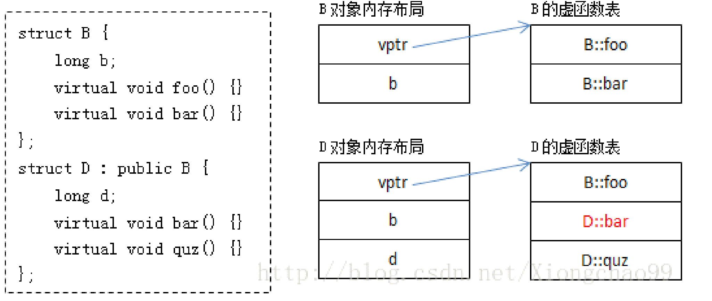
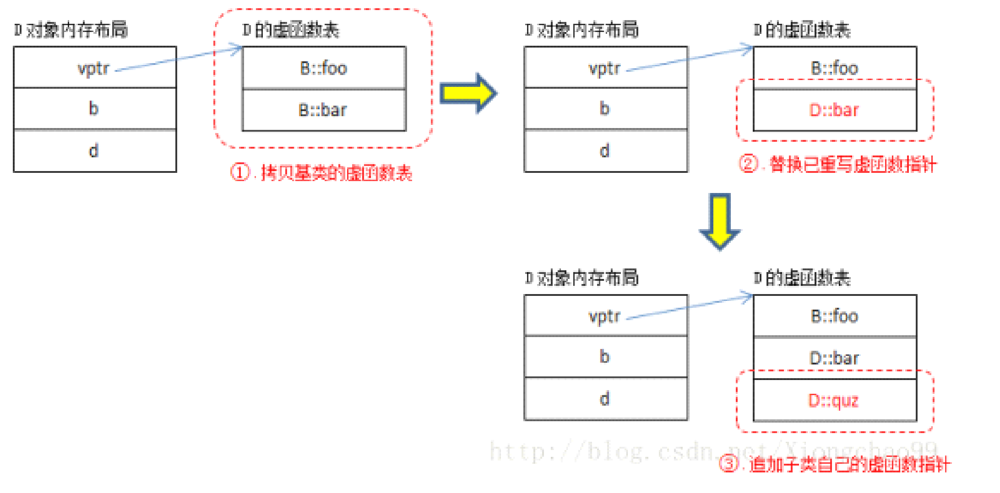
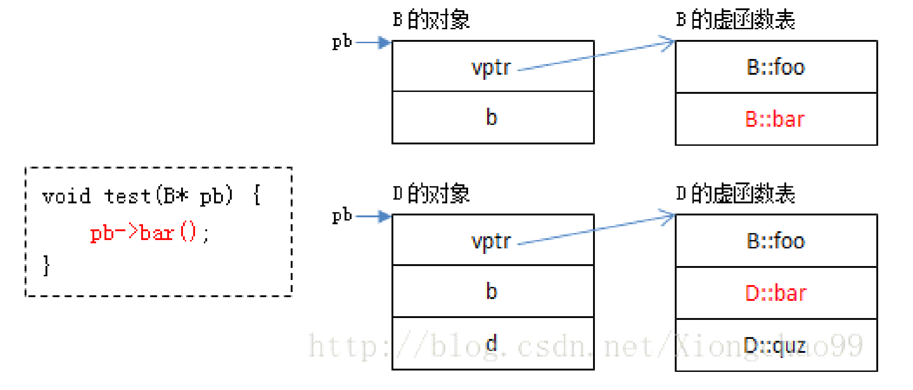

## 带虚函数空类的大小

**1. 空类**

```cpp
class A
{
};

void main()
{
    printf("sizeof(A): %d\\n", sizeof(A));
    getchar();
}
```

得到结果为：1。

类的实例化就是给每个实例在内存中分配一块地址。空类被实例化时，会由编译器隐含的添加一个字节。所以空类的size为1。

**2.虚函数**

```cpp
class A
{
    virtual void FuncA();    virtual void FuncB(); 
};
```

得到结果：4

当C++ 类中有虚函数的时候，会有一个指向虚函数表的指针（vptr），在32位系统分配指针大小为4字节。所以size为4.

**3.静态数据成员**

```cpp
class A
{
  int a;
  static int b;
  virtual void FuncA();
};
```

得到结果：8

**静态数据成员被编译器放在程序的一个global data members中，它是类的一个数据成员．但是它不影响类的大小**，不管这个类实际产生了多少实例，还是派生了多少新的类，静态成员数据在类中永远只有一个实体存在。

**而类的非静态数据成员只有被实例化的时候，他们才存在．但是类的静态数据成员一旦被声明，无论类是否被实例化，它都已存在．可以这么说，类的静态数据成员是一种特殊的全局变量．**

所以该类的size为：int a型4字节加上虚函数表指针4字节，等于8字节。

**4.普通成员函数**

```cpp
class A
{
    void FuncA();
}
```

结果：1

**类的大小与它的构造函数、析构函数和其他成员函数无关，只已它的数据成员有关。**

**5.普通继承**

```cpp
class A
{
    int a;
};
class B
{
  int b;
};
class C : public A, public B
{
  int c;
};
```

结果为：sizeof(C) =12.

**可见普通的继承，就是基类的大小，加上派生类自身成员的大小。**

**6.虚拟继承**

```cpp
class C : virtual public A, virtual public B
{
  int c;
};
```

结果：16.

**当存在虚拟继承时，派生类中会有一个指向虚基类表的指针**。所以其大小应为普通继承的大小（12字节），再加上虚基类表的指针大小（4个字节），共16字节。


C++的多态性用一句话概括：在基类的函数前加上 virtual 关键字，在派生类中重写该函数，运行时将会根据对象的实际类型来调用相应的函数。如果对象类型是派生类，就调用派生类的函数；如果对象类型是基类，就调用基类的函数。


**阐释 c++虚函数的实现**

简单地说，每一个含有虚函数（无论是其本身的，还是继承而来的）的类都至少有一个与之对应的虚函数表，其中存放着该类所有的虚函数对应的函数指针。



其中：

B 的虚函数表中存放着 B::foo 和 B::bar 两个函数指针。

D 的虚函数表中存放的既有继承自 B 的虚函数 B::foo，又有重写（override）了基类虚函数 B::bar 的 D::bar，还有新增的虚函数 D::quz。

虚函数表构造过程：

从编译器的角度来说，B 的虚函数表很好构造，D 的虚函数表构造过程相对复杂。下面给出了构造 D 的虚函数表的一种方式（仅供参考）：



虚函数调用过程




