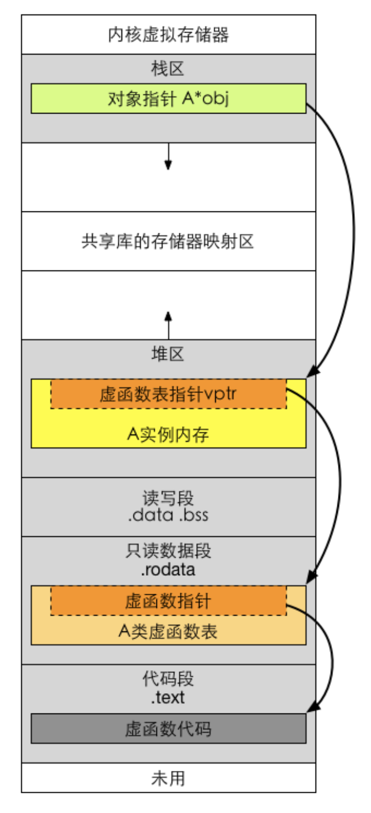

参考https://zhuanlan.zhihu.com/p/675399586?utm_campaign=shareopn&utm_medium=social&utm_psn=1844038789799997441&utm_source=wechat_session


# 面经挑选

### 4.4. [显式转换](https://zhida.zhihu.com/search?content_id=238218812&content_type=Article&match_order=1&q=显式转换&zhida_source=entity)

- `static_cast`: 任何具有明确定义的类型转换, 只要不包含底层`const`, 都可以使用`static_cast`.
- `dynamic_cast`: 用于(动态)多态类型转换. 只能用于含有虚函数的类, 用于类层次间的向上向下转化.
- `const_cast`: 去除"指向常量的指针"的`const`性质.
- `reinterpret_cast`: 为运算对象的位模式提供较低层次的重新解释, 常用于[函数指针](https://zhida.zhihu.com/search?content_id=238218812&content_type=Article&match_order=1&q=函数指针&zhida_source=entity)的转换.


**6.1.2. `static`**

- 修饰[局部变量](https://zhida.zhihu.com/search?content_id=238218812&content_type=Article&match_order=1&q=局部变量&zhida_source=entity): 使得被修饰的变量成为[静态变量](https://zhida.zhihu.com/search?content_id=238218812&content_type=Article&match_order=1&q=静态变量&zhida_source=entity), 存储在静态区. 存储在静态区的数据生命周期与程序相同, 在`main`函数之前初始化, 在程序退出时销毁. 默认初始化为 0.

- 修饰全局变量: 限制了链接属性, 使得全局变量只能在声明它的源文件中访问.

- 修饰普通函数: 使得函数只能在声明它的源文件中访问.

- 修饰类的成员变量和成员函数: 使其只属于类而不是属于某个对象. 对多个对象来说, 静态[数据成员](https://zhida.zhihu.com/search?content_id=238218812&content_type=Article&match_order=1&q=数据成员&zhida_source=entity)只存储一处, 供所有对象共用.

- - 静态成员调用格式`<类名>::<静态成员>`
  - 静态成员函数调用格式`<类名>::<静态成员函数名>(<参数表>)`


## 7. 类

### 7.1. 定义[抽象数据类型](https://zhida.zhihu.com/search?content_id=238218812&content_type=Article&match_order=1&q=抽象数据类型&zhida_source=entity)

**7.1.1. `this`指针**

- `this`指针是一个隐含于每一个非静态成员函数中的特殊指针. 它指向调用该成员函数的那个对象.
- `this`的目的总是指向"这个"对象, 所以`this`是一个常量指针, 被隐含地声明为:`ClassName *const this`, 这意味着不能给`this`指针赋值;
- 在`ClassName`类的`const`成员函数中, `this`指针的类型为:`const ClassName* const`, 这说明不能对`this`指针所指向对象进行修改.

- 当对一个对象调用成员函数时, 编译程序先将对象的地址赋给`this`指针, 然后调用成员函数, 每次成员函数存取数据成员时, 都隐式使用`this`指针.

- 当一个成员函数被调用时, 自动向它传递一个隐含的参数, 该参数是一个指向这个成员函数所在的对象的指针.

- `this`并不是一个常规变量, 而是个右值, 所以不能取得`this`的地址(不能`&this`).

- 在以下场景中, 经常需要显式引用`this`指针:

- - 为实现对象的链式引用;
  - 为避免对同一对象进行赋值操作;
  - 在实现一些数据结构时, 如`list`.

**7.3.2. `explicit`**

- 用于类的构造函数, 阻止其执行隐式类型转换, 但是仍可以被用来进行显式类型转换.


## 9. 顺序容器

### 9.1. 容器库概览

**9.1.1. [迭代器](https://zhida.zhihu.com/search?content_id=238218812&content_type=Article&match_order=1&q=迭代器&zhida_source=entity)**

- 迭代器(Iterator)模式又称游标(Cursor)模式, 用于提供一种方法顺序访问一个聚合对象中各个元素, 而又不需暴露该对象的内部表示.
- 迭代器本质上是类模板, 只是表现地像指针.

### 9.2. 顺序容器操作

**9.2.1. `emplace`**

当调用`push`或`insert`成员函数时, 我们将元素类型的对象传递给它们, 这些对象被拷贝到容器中. 而当我们调用一个`emplace`成员函数时, 则是将参数传递给元素类型的构造函数. `emplace`成员使用这些参数在容器管理的内存空间中直接构造元素.

**9.2.2. `resize`/`reserve`**

- `resize`: 改变容器内含有元素的数量.
- `reserve`: 改变容器的最大容量.

**9.2.3. 容器操作可能使迭代器失效**

在向容器中添加元素后:

- 如果容器是`vector`或`string`, 且存储空间被重新分配, 则指向容器的迭代器, 指针和引用都会失效.
- 对于`deque`, 插入到除首尾位置之外的任何位置都会导致迭代器指针和引用失效.
- 对于`list`, 指向容器的迭代器指针和引用仍然有效.

从容器删除元素后:

- 对于`list`, 指向容器的迭代器指针和引用仍然有效.
- 对于`deque`, 在首尾之外的任何位置删除元素, 其他元素的迭代器也会失效.
- 对于`vector`或`string`, 被删元素之前的迭代器仍有效, 尾后迭代器失效.

对于[关联式容器](https://zhida.zhihu.com/search?content_id=238218812&content_type=Article&match_order=1&q=关联式容器&zhida_source=entity)(如`std::set` / `std::map`), 插入元素不会使任何迭代器失效.

对于无序关联式容器(如`std::unordered_set` / `std::unordered_map`), 插入元素之后如果发生了 Rehash([新元素](https://zhida.zhihu.com/search?content_id=238218812&content_type=Article&match_order=1&q=新元素&zhida_source=entity)的个数大于`max_load_factor() * bucket_count()`), 则所有迭代器将失效.

### 9.3. `vector`

```c++
//动态申请数组
const int M = 10;
const int N = 10;

//使用new申请一个一维数组.访问p_arr[i].
int* p_arr = new int[N];
//使用new申请一个二维数组.访问:p_arr[i][j].
int(*p_arr)[N] = new int[M][N];
//一维数组转化为二维数组.访问:p_arr[i*N+j].
int* p_arr = new int[M*N];
//指向指针的指针(指向一维指针数组).访问p[i][j]
int** p_arr = new int* [M]
for(int i = 0; i < M; i++)
    p_arr[i] = new int[N];
//回收内存
for(int i = 0; i < M; i++)
	delete []p_arr[i];
delete []p_arr;

//使用vector申请一个一维数组
vector<int> v_arr(n, 0);
vector<int> v_arr{1,0};
//使用vector申请一个二维数组, 如果不初始化, 使用[]会报错
vector<vector<int>> v_arr(m, vector<int>(n, 0));
vector<vector<int>> v_arr = {{1,0}};

//一维数组作为函数参数
void function(int* a);
void function(int a[]);
void function(int a[N]);
//二维数组作为函数参数,他们合法且等价
void function(int a[M][N]);
void function(int a[][N]);
void function(int (*a)[N])
```

- `std::vector` 的对象在定义（栈上）时会分配少量内存来存储自己的元数据，但其存储的元素始终在堆上动态分配内存。


### 9.4. `string`

```c++
string s("hello world")
string s2 = s.substring(0, 5); // s2 = hello
string s3 = s.substring(6);    // s3 = world
string s4 = s.substring(6, 11);// s4 = world
string s5 = s.substring(12);   // 抛出一个out_of_range异常

isalpha(ch); //判断一个字符是否是字母
isalnum(ch); //判断一个字符是数字或字母
tolower(ch); //将字母转化成小写
toupper(ch); //将字母转化为大写

string str = to_string(num); //将数字转换成字符串
```

### 9.5. `vector`对象是如何增长的

当不得不获取新的内存空间时, `vector`和`string`的实现通常会分配一个比新的空间需求更大的内存空间. 容器预留这些空间作为备用, 可以用来保存更多的新元素. 这样, 就不需要每次添加新元素都重新分配容器的内存空间了.

- `capacity`操作告诉我们容器在不扩张内存空间的情况下可以容纳多少个元素. `reserve`操作允许我们通知容器它应该准备保存多少个元素.

- 初始时刻`vector`的`capacity`为 0, 塞入第一个元素后`capacity`增加为 1.

- 不同的编译器实现的扩容方式不一样, [VS2015](https://zhida.zhihu.com/search?content_id=238218812&content_type=Article&match_order=1&q=VS2015&zhida_source=entity) 中以 1.5 倍扩容, [GCC](https://zhida.zhihu.com/search?content_id=238218812&content_type=Article&match_order=1&q=GCC&zhida_source=entity)以 2 倍扩容.

- - 从空间上分析, [扩容因子](https://zhida.zhihu.com/search?content_id=238218812&content_type=Article&match_order=1&q=扩容因子&zhida_source=entity)越大, 意味着预留空间越大, 浪费的空间也越多, 所以从空间考虑, 扩容因子因越小越好.
  - 从时间上分析, 如果预留空间不足的话, 就需要重新开辟一段空间, 把原有的数据复制到新空间, 如果扩容因子无限大的话, 那显然就不再需要额外开辟空间了. 所以时间角度看, 扩容因子越大越好.

### 9.6. 容器适配器

除了顺序容器外, [标准库](https://zhida.zhihu.com/search?content_id=238218812&content_type=Article&match_order=1&q=标准库&zhida_source=entity)还定义了三个顺序容器适配器: `stack`、`queue`和`priority_queue`.

本质上, 一个适配器是一种机制, 能使某种事物的行为看起来像另外一种事物一样.

默认情况下, `stack`和`queue`是基于`deque`实现的, `priority_queue`是在`vector`之上实现的.

**9.6.1. `priority_queue`**

```text
std::priority_queue<int> q1; // 默认大根堆
std::priority_queue<int, std::vector<int>, std::greater<int>>
    q2(data.begin(), data.end()); // 小根堆
// 使用lambda表达式
auto cmp = [](int left, int right) { return (left ^ 1) < (right ^ 1); };
std::priority_queue<int, std::vector<int>, decltype(cmp)> q3(cmp);
```


## 10. [泛型算法](https://zhida.zhihu.com/search?content_id=238218812&content_type=Article&match_order=1&q=泛型算法&zhida_source=entity)

### 10.1. lambda 表达式

一个 lambda 表达式表示一个可调用的代码单元. 我们可以将其理解为一个未命名的内联函数. 一个 lambda 表达式具有如下形式:

```c++
[capture list](parameter list) -> return type {function body}
```

其中`capture list`(捕获列表)是一个 lambda 所在函数中定义的局部变量的列表(通常为空); `return type`, `parameter list`和`function body`与任何普通函数一样, 分别表示返回类型、[参数列表](https://zhida.zhihu.com/search?content_id=238218812&content_type=Article&match_order=1&q=参数列表&zhida_source=entity)和函数体. 但是与普通函数不同, lambda 必须使用尾置返回来制定返回类新.

我们可以忽略参数列表和返回类型, 但必须包含捕获列表和函数体:

```c++
auto f = [] {return 42};
```


## 11. [关联容器](https://zhida.zhihu.com/search?content_id=238218812&content_type=Article&match_order=1&q=关联容器&zhida_source=entity)

- `map`: 关键字-值对; `set`: 关键字即值.
- `map`: 按关键字有序保存元素(底层为[红黑树](https://zhida.zhihu.com/search?content_id=238218812&content_type=Article&match_order=1&q=红黑树&zhida_source=entity)); `unordered_map`: [无序集合](https://zhida.zhihu.com/search?content_id=238218812&content_type=Article&match_order=1&q=无序集合&zhida_source=entity)(底层为哈系表).
- `map`: 关键字不可重复出现; `multimap`: 关键字可重复出现.


## 13. 拷贝控制

### 13.1. 对象移动

- [右值引用](https://zhida.zhihu.com/search?content_id=238218812&content_type=Article&match_order=1&q=右值引用&zhida_source=entity): 所谓右值引用就是必须绑定到右值的引用. 我们通过`&&`而不是`&`来获得右值引用. 右值引用有一个重要的性质: 只能绑定到一个将要销毁的对象.
- 左值持久, 右值短暂: 左值有持久的状态, 而右值要么是字面常量, 要么是在表达式求值过程中创建的临时对象.
- 通过调用`std::move`来获得绑定到左值上的右值引用.

```c++
int &&rr1 = 42;  // 正确: 字面常量是右值
int &&rr2 = rr1; // 错误: 表达式rr1是左值
int &&rr3 = std::move(rr1); // ok
```


### 15.2. 定义派生类和基类

**15.2.1. 初始化顺序**

- 每个类控制它自己的成员初始化过程
- 首先初始化基类的部分, 然后按照声明的顺序依次初始化派生类的成员.

**15.2.2. [静态多态](https://zhida.zhihu.com/search?content_id=238218812&content_type=Article&match_order=1&q=静态多态&zhida_source=entity)/动态多态**

- 静态多态是通过重载和模板技术实现,在编译的时候确定.
- 动态多态通过虚函数和继承关系来实现,执行动态绑定, 在运行的时候确定.
- 重载: 两个函数名相同,但是参数的个数或者类型不同.
- 重写: 子类继承父类,符类中函数被声明为虚函数,子类中重新定义了这个虚函数.

### 15.3. 虚函数

- 虚函数: 基类希望派生类覆盖的函数, 可以将其定义为虚函数, 这样每一个派生类可以各自定义适合自生的版本.

- - 当基类定义`virtual`函数的时候, 它希望派生类可以自己定义这个函数.
  - 如果使用`virtual`, 程序依据引用或者指针所指向对象的类型来选择方法(method).
  - 如果不使用`virtual`, 程序依据引用类型或者指针类型选择一个方法(method).

- 虚函数表指针: 在有虚函数的类的对象最开始部分是一个虚函数表的指针, 这个指针指向一个虚函数表.

- 虚函数表中放了虚函数的地址, 实际的虚函数在代码段(.text)中.

- 当子类继承了父类的时候也会继承其虚函数表, 当子类重写父类中虚函数时候, 会将其继承到的虚函数表中的地址替换为重新写的函数地址.

- 使用了虚函数, 会增加访问内存开销, 降低效率.



**15.3.1. [虚析构函数](https://zhida.zhihu.com/search?content_id=238218812&content_type=Article&match_order=1&q=虚析构函数&zhida_source=entity)**

Q: 析构函数为什么是虚函数?

A: 将可能会被继承的基类的析构函数设置为虚函数, 可以保证当我们`new`一个派生类, 然后使用基类指针指向该派生[类对象](https://zhida.zhihu.com/search?content_id=238218812&content_type=Article&match_order=1&q=类对象&zhida_source=entity), 基类指针时可以释放掉派生类的空间, 防止内存泄漏.

Q: 为什么 C++ 默认析构函数不是虚函数?

A: C++默认的析构函数不是虚函数是因为虚函数需要额外的虚函数表和虚表指针, 占用额外的内存; 所以只有当一个类会被用作基类时才将其设置为虚函数.


### 18. 多重继承与[虚继承](https://zhida.zhihu.com/search?content_id=238218812&content_type=Article&match_order=1&q=虚继承&zhida_source=entity)

- 虚继承是解决 C++ 多重继承问题的一种手段, 从不同途径继承来的同一基类, 会在子类中存在多份拷贝, 即浪费存储空间, 又存在[二义性](https://zhida.zhihu.com/search?content_id=238218812&content_type=Article&match_order=1&q=二义性&zhida_source=entity)的问题.
- 底层实现原理与编译器相关, 一般通过[虚基类](https://zhida.zhihu.com/search?content_id=238218812&content_type=Article&match_order=1&q=虚基类&zhida_source=entity)指针和虚基类表实现, 每个虚继承的子类都有一个虚基类指针(占用一个指针的存储空间, 4 字节)和虚基类表(不占用类对象的存储空间)(需要强调的是, 虚基类依旧会在子类里面存在拷贝, 只是仅仅最多存在一份而已, 并不是不在子类里面了); 当虚继承的子类被当做父类继承时, 虚基类指针也会被继承.
- 实际上, vbptr 指的是虚基类表指针(virtual base table pointer), 该指针指向了一个虚基类表(virtual table), 虚表中记录了虚基类与本类的[偏移地址](https://zhida.zhihu.com/search?content_id=238218812&content_type=Article&match_order=1&q=偏移地址&zhida_source=entity); 通过偏移地址, 这样就找到了虚基类成员, 而虚继承也不用像普通[多继承](https://zhida.zhihu.com/search?content_id=238218812&content_type=Article&match_order=1&q=多继承&zhida_source=entity)那样维持着公共基类(虚基类)的两份同样的拷贝, 节省了存储空间.


## 19. 特殊工具和技术

### 19.1. 控制内存分配

**19.1.1. `new` & `delete`**

```c++
string *sp = new string("a value); // 分配并初始化一个string对象
string *arr = new string[10];      // 分配10个默认初始化的string对象
```

当我们使用一条`new`表达式时, 实际执行了三步操作:

1. `new`表达式调用一个名为`operate new`(或者`operate new[]`)的标准库函数. 该函数(从自由存储区上)分配一块足够大的, 原始的, 未命名的内存空间(无需指定内存块的大小)以便存储特定类型的对象(或对象的数组).
2. 编译器运行相应的构造函数以构造这些对象, 并为其传入初值.
3. 对象被分配了空间并构造完成, 返回一个指向该对象的指针.

```c++
delete sp;  // 销毁*sp, 然后释放sp指向的内存空间
delete [] arr; // 销毁数组中的元素, 然后释放对应的内存空间
```

当我们使用一条`delete`表达式删除一个动态分配的对象时, 实际执行了两步操作:

1. 对`sp`所指的对象或者`arr`所指的数组中的元素执行对应的析构函数.
2. 编译器调用名为`operate delete`(或者`operate delete[]`)的标准库函数释放内存空间.

**19.1.2. `malloc`&`free`**

- `malloc`需要显式的指出内存大小: 函数接受一个表示待分配字节数的`size_t`.
- 返回指向分配空间的指针(`void*`)或者返回 0 以表示分配失败. (从堆上[动态分配内存](https://zhida.zhihu.com/search?content_id=238218812&content_type=Article&match_order=1&q=动态分配内存&zhida_source=entity))
- `free`函数接受一个`void*`, 它是`malloc`返回的指针的副本, `free`将相关内存返回给系统. 调用`free(0)`没有任何意义.

```c++
// operate new的一种简单实现
void *operater new(size_t size) {
    if (void *men = malloc(size))
        return mem;
    else
        throw bad_alloc();
}
// opearte delete的一种简单实现
void operator delete(void *mem) noexcept { free(mem); }
```


## 19.2. 固有的不可移植特性

**19.2.1. `volatile`**

- 当对象的值可能在程序控制或检测之外(操作系统、硬件、其它线程等)被改变时, 应该将该对象声名为`volatile`. 关键字`volatile`告诉编译器不应对这样的对象进行优化.
- `volatile`关键字声明的变量, 每次访问时都必须从内存中取出值(没有被`volatile`修饰的变量, 可能由于编译器的优化, 从 CPU 寄存器中取值).

**19.2.2. `extern`**

- 在多个文件之间共享对象.
- `extern "C"`的作用是让 C++ 编译器将`extern "C"`声明的代码当作 C 语言代码处理, 可以避免 C++ 因符号修饰导致代码不能和 C 语言库中的符号进行链接的问题.
  - **名称修饰**: C++ 支持函数重载（即可以有多个同名的函数，参数不同），为了解决名称冲突，C++ 编译器会对函数名进行名称修饰（mangling），而C语言则不进行名称修饰。这样，C++ 的函数在编译后可能与C语言中的函数名不同，导致链接时找不到对应的符号。
  - **链接问题**: 如果你想在C++代码中调用用C语言编写的库或模块，而不使用 `extern "C"`，那么会因为名字的不匹配而导致链接错误。


# 面试常问的 C/C++ 问题

## 一、用预处理指令 `#define` 声明一个常数，用以表明一年中有多少秒（忽略闰年问题）

```
#define SEC_YEAR  (365*24*60*60)UL
```

## 考察点

`#define` 语法的基本知识（例如：不能以分号结束，括号的使用，等等）

懂得预处理器将为你计算常数表达式的值，因此，直接写出你是如何计算一年中有多少秒而不是计算出实际的值，是更清晰而没有代价的。

意识到这个表达式将使一个 **16 位**机的整型数**溢出**-因此要用到长整型符号 `L` ,告诉编译器这个常数是的长整型数

如果你在你的表达式中用到 `UL` （表示无符号长整型），那么你有了一个好的起点。记住，第一印象很重要。


## 二、写一个"标准"宏 `MIN` ，这个宏输入两个参数并返回较小的一个。

```
#define MIN(a,b)  ((a)<=(b)?(a):(b))
```

## 考察点

标识 `#define` 在宏中应用的基本知识。这是很重要的。因为在 嵌入(`inline`)操作符 变为标准 C 的一部分之前，宏是方便产生嵌入代码的唯一方法，对于嵌入式系统来说，为了能达到**要求的性能**，嵌入代码经常是必须的方法。

懂得在宏中小心地把参数用括号括起来

我也用这个问题开始讨论宏的副作用，例如：当你写下面的代码时会发生什么事？

```
least = MIN(*p++, b);
```

宏定义的作用结果 `MIN(*p++,b) ((*p++)<(b)?(*p++),b)` 指针p会做**两次**自增操作

### 如何消除宏的副作用

```
#include <stdio.h>
#define min_i(x,y)    ((x)<=(y)?(x):(y))      //（1）
#define min_t(type,x,y) ({type _x = x;\       //（2）消除副作用
                        type _y = y;\
                        _x<_y?_x:_y;\
                        })
#define min(x,y)    {const typeof(x)  _x = (x);\  //（3）消除副作用
                    const typeof(y) _y = (y);\
                    (void)(&_x=&_y);\      //（4）
                    _x<_y?_x:_y;\
                    })

int main()
{
    int a = 10;
    int b = 20;
    printf("min_i(a++,b++)=%d\n",min_i(a++,b++));  //11
    printf("a=%d\n",a);  //12
    printf("b=%d\n",b);  //21

    a=10;
    b=20;
    printf("min_t(int,a++,b++)=%d\n",min_t(int,a++,b++));  //10
    printf("a=%d\n",a);  //11
    printf("b=%d\n",b);  //21

    a=10;
    b=20;
    printf("min(a++,b++)=%d\n",min(a++,b++));  //10
    printf("a=%d\n",a);  //11
    printf("b=%d\n",b);  //21

}
```

这个定义可能会计算 x 或 y 两次（**x 和 y 中的小者被计算两次**)，当参数有副作用时，将产生不正确的结果

使用语句表达式只计算参数一次，避免了可能的错误，语句表达式通常用于宏定义 typeof(x)表示x的值类型 检查参数x和y的类型是否相同(如果x和y的类型不同编译器将会发出warning，并不影响后面语句的运行

## 三、预处理器标识 `#error` 的目的是什么？

编译程序时，只要遇到 `#error` 就会跳出一个编译错误，既然是编译错误，要它干嘛呢？其目的就是**保证程序是按照你所设想的那样进行编译的。**

下面举个例子：程序中往往有很多的预处理指令

```
#ifdef XXX
  ...
#else
  ...
#endif
```

当程序比较大时，往往有些宏定义是在外部指定的（如 makefile ），或是在系统头文件中指定的，**当你不太确定当前是否定义了 XXX 时**，就可以改成如下这样进行编译：

```
#ifdef XXX
...
#error "XXX has been defined"
#else

#endif
```

这样,如果编译时出现错误,输出了 `XXX has been defined` ,表明宏 XXX 已经被定义了。

## 四、嵌入式系统中经常要用到无限循环，你怎么样用 C 编写死循环呢？

```
while(1)
{}
for(;;)
{}
loop:...

goto loop;
```

## 五、用变量 a 给出下面的定义

## a) 一个整型数（An integer）

```
int a;
```

## b) 一个指向整型数的指针（ A pointer to an integer）

```
int *a;
```

## c) 一个指向指针的的指针，它指向的指针是指向一个整型数（ A pointer to a pointer to an intege）

```
int **a;
```

## d) 一个有 10 个整型数的数组（ An array of 10 integers）

```
int a[10]
```

## e) 一个有 10 个指针的数组，该指针是指向一个整型数的。（An array of 10 pointers to integers）

```
int *a[10]
```

## f) 一个指向有 10 个整型数数组的指针（ A pointer to an array of 10 integers）

```
int (*a)[10]
```

## g) 一个指向函数的指针，该函数有一个整型参数并返回一个整型数（A pointer to a function that takes an integer as an argument and returns an integer）

```
int (*a)(int a)
```

## h) 一个有 10 个指针的数组，该指针指向一个函数，该函数有一个整型参数并返回一个整型数 （ An array of ten pointers to functions that take an integer argument and return an integer ）

```
int (*a[10])(int)
```

## 六、关键字 `static` 的作用是什么？

在 C 语言中，关键字 `static` 有三个明显的作用：

## 第一

在修饰变量的时候，`static` 修饰的静态局部变量只执行一次，而且延长了局部变量的生命周期，直到**程序运行结束**以后才释放。

## 第二

`static` 修饰全局变量的时候，这个全局变量只能在**本文件**中访问，不能在其它文件中访问，即便是 `extern` 外部声明也不可以。

## 第三

`static` 修饰一个函数，则这个函数的只能在本文件中调用，不能被其他文件调用。`static` 修饰的局部变量存放在**全局数据区**的**静态变量区**。初始化的时候自动初始化为 0 ；

- （1）不想被释放的时候，可以使用 `static` 修饰。比如修饰函数中存放在栈空间的数组。如果不想让这个数组在函数调用结束释放可以使用 `static` 修饰
- （2）考虑到数据安全性（当程序想要使用全局变量的时候应该先考虑使用 `static` ）

在 C++ 中 `static` 关键字除了具有 C 中的作用还有在类中的使用。在类中，`static` 可以用来修饰静态数据成员和静态成员方法

### 静态数据成员

- （1）静态数据成员可以实现多个对象之间的数据共享，它是类的所有对象的**共享成员**，它在内存中只占一份空间，如果改变它的值，则各对象中这个数据成员的值都被改变。
- （2）静态数据成员是在程序**开始运行**时被分配空间，到**程序结束**之后才释放，只要类中指定了静态数据成员，即使不定义对象，也会为静态数据成员分配空间。
- （3）静态数据成员可以被初始化，但是只能在**类体外**进行初始化（即不能 **中初** ^_^），若为对静态数据成员赋初值，则编译器会自动为其初始化为 0
- （4）静态数据成员既可以通过对象名引用，也可以通过类名引用。

### 静态成员函数

- （1）静态成员函数和静态数据成员一样，它们都属于类的静态成员，而不是对象成员。
- （2）非静态成员函数有 `this` 指针，而静态成员函数没有 `this` 指针。
- （3）静态成员函数主要用来访问**静态数据成员**而不能访问非静态成员。

## 七、关键字 `const` 有什么含意？

只要一个变量前用 `const` 来修饰，就意味着该变量里的数据只能被访问，而不能被修改，也就是意味着 `const` “只读”（readonly）。

**规则**：`const` 离谁近，谁就不能被修改；

`const` 修饰一个变量时，一定要给这个变量初始化，若不初始化，在后面也不能初始化。

## `const` 作用

- 可以用来定义常量，修饰函数参数，修饰函数返回值 ，且被 `const` 修饰的东西，都受到强制保护，可以预防其它代码无意识的进行修改，从而提高了程序的健壮性（是指系统对于规范要求以外的输入能够判断这个输入不符合规范要求，并能有合理的处理方式。**ps**：即所谓高手写的程序不容易死）；
- 使编译器保护那些不希望被修改的参数，防止无意代码的修改，减少 bug ；
- 给读代码的人传递有用的信息，声明一个参数，是为了告诉用户这个参数的应用目的；

## `const` 优点

- 编译器可以对 `const` 进行类型安全检查（所谓的类型安全检查，**能将程序集间彼此隔离开来，这种隔离能确保程序集彼此间不会产生负面影响，提高程序的可读性**）；
- 有些集成化的调试工具可以对 `const` 常量进行调试，使编译器对处理内容有了更多的了解，消除了一些隐患。eg：`void hanshu（const int i）{…….}` 编译器就会知道 `i` 是一个不允许被修改的常量
- 可以节省空间，避免不必要的内存分配，因为编译器通常不为 `const` 常量分配内存空间，而是将它保存在符号表中，这样就没有了存储于读内存的操作，使效率也得以提高；
- 可以很方便的进行参数的修改和调整，同时避免意义模糊的数字出现

## 八、关键字 `volatile` 有什么含意？并给出三个不同的例子。

一个定义为 `volatile` 的变量是说这变量可能会被意想不到地改变，这样，编译器就不会去假设这个变量的值了。精确地说就是，优化器在用到这个变量时必须每次都**小心地重新读取这个变量的值**，而不是使用保存在寄存器里的备份。

## 下面是 `volatile` 变量的几个例子：

- 并行设备的硬件寄存器（如：状态寄存器）
- 一个中断服务子程序中会访问到的非自动变量(Non-automatic variables)
- 多线程应用中被几个任务共享的变量

## 九、对变量或寄存器进行位操作

给定一个整型变量 `a`，写两段代码，第一个设置 `a` 的第三位 ，第二个清除 `a` 的第三位。在以上两个操作中，要保持其它位不变。

## 考察点

- 不知道如何下手。该被面者从没做过任何嵌入式系统的工作。
- 用 **bit fields**。Bit fields 是被扔到 C 语言死角的东西，它保证你的代码在不同编译器之间是**不可移植**的，同时也保证了的你的代码是不可重用的。

最近不幸看到 Infineon 为其较复杂的通信芯片写的驱动程序，它用到了 bit fields 因此完全对我无用，因为我的编译器用其它的方式来实现 bit fields 的。*从道德讲：永远不要让一个非嵌入式的家伙粘实际硬件的边。*

- 用 `#defines` 和 `bit masks` 操作。这是一个有**极高可移植性**的方法，是应该被用到的方法。最佳的解决方案如下：

```
#define BIT3 (0x1 << 3)
static int a;

void set_bit3(void)
{
    a |= BIT3;
}

void clear_bit3(void)
{
    a &= ~BIT3;
}
```

## 十、访问某特定的内存位置

在某工程中，要求设置一绝对地址为 `0x67a9` 的整型变量的值为 `0xaa66`。编译器是一个纯粹的 ANSI 编译器。写代码去完成这一任务。

## 考察点

这一问题测试你是否知道为了访问一绝对地址把一个整型数强制转换（typecast）为一指针是合法的。

```
int *ptr;
ptr = (int *)0x67a9;
*ptr = 0xaa55;

......

*(int *const)(0x67a9) = 0xaa66;
```

## 十一、标准 C 支持的中断

中断是嵌入式系统中重要的组成部分，这导致了很多编译开发商提供了扩展，具体表现是，产生了一个新的关键字 `__interrupt`。下面的代码就使用了 `__interrupt` 关键字去定义了一个**中断服务子程序(ISR)**，请评论一下这段代码的。

```
__interrupt double compute_area (double radius)
{
    double area = PI * radius * radius;
    printf("\nArea = %f", area);
    return area;
}
```

## 考察点

- **ISR 不能返回一个值**。如果你不懂这个，那么你不会被雇用的。
- **ISR 不能传递参数**。如果你没有看到这一点，你被雇用的机会等同第一项。
- 在许多的处理器/编译器中，浮点一般都是**不可重入**的。有些处理器/编译器需要让额处的寄存器入栈，有些处理器/编译器就是不允许在 ISR 中做浮点运算。此外，ISR 应该是短而有效率的，在 ISR 中做浮点运算是不明智的。
- 与第三点一脉相承，`printf()` 经常有重入和性能上的问题。如果你丢掉了第三和第四点，我不会太为难你的。不用说，如果你能得到后两点，那么你的被雇用前景越来越光明了。

## 十二、下面的代码输出是什么，为什么？

```
void foo(void)
{
    unsigned int a = 6;
    int b = -20;
    (a+b > 6) ? puts("> 6") : puts("<= 6");
}
```

## 考察点

这个问题测试你是否懂得 C 语言中的**整数自动转换**原则，我发现有些开发者懂得极少这些东西。

不管如何，这无符号整型问题的答案是输出是 ">6"。**原因** 是当表达式中存在*有符号类型*和*无符号类型*时所有的操作数都自动转换为*无符号类型*。

因此 -20 变成了一个非常大的正整数，所以该表达式计算出的结果大于 6 。这一点对于应当频繁用到无符号数据类型的嵌入式系统来说是非常重要的。

如果你答错了这个问题，你也就到了得不到这份工作的边缘。

## 十三、评价下面的代码片断

```
unsigned int zero = 0;
unsigned int compzero = 0xFFFF;
/*1's complement of zero */
```

## 考察点

对于一个 int 型**不是 16 位**的处理器为说，上面的代码是不正确的。应编写如下：

```
unsigned int compzero = ~0;
```

这一问题真正能揭露出应试者是否懂得处理器字长的重要性。在我的经验里，好的嵌入式程序员非常准确地明白硬件的细节和它的局限，然而 PC 机程序往往把硬件作为一个无法避免的烦恼。

到了这个阶段，应试者或者完全垂头丧气了或者信心满满志在必得。如果显然应试者不是很好，那么这个测试就在这里结束了。

但如果显然应试者做得不错，那么我就扔出下面的追加问题，这些问题是比较难的，我想仅仅非常优秀的应试者能做得不错。提出这些问题，我希望更多看到应试者应付问题的方法，而不是答案。不管如何，你就当是这个娱乐吧…

## 十四、嵌入式系统中，动态分配内存可能发生的问题是什么？

尽管不像非嵌入式计算机那么常见，嵌入式系统还是有从堆（heap）中动态分配内存的过程的。

这里，我期望应试者能提到**内存碎片**，**碎片收集**的问题，**变量的持行时间**等等。这个主题已经在 ESP 杂志中被广泛地讨论过了（主要是 P.J. Plauger, 他的解释远远超过我这里能提到的任何解释），回过头看一下这些杂志吧！让应试者进入一种虚假的安全感觉后，我拿出这么 一个小节目：下面的代码片段的输出是什么，为什么？

```
char *ptr;
if ((ptr = (char *)malloc(0)) == NULL)
  puts("Got a null pointer");
else
  puts("Got a valid pointer");
```

这是一个有趣的问题。最近在我的一个同事不经意把 0 值传给了函数 `malloc`，得到了一个**合法**的指针之后，我才想到这个问题。这就是上面的代码，该代码的输 出是 *"Got a valid pointer"* 。

我用这个来开始讨论这样的一问题，看看被面试者是否想到库例程这样做是正确。

得到正确的答案固然重要，但解决问题的方法和你做决定的基本原理更重要些。

## 十五、 思考一下下面的例子

`typedef` 在 C 语言中频繁用以声明一个已经存在的数据类型的同义字。也可以用预处理器做类似的事。例如，

```
#define dPS struct s *
typedef struct s * tPS;
```

以上两种情况的意图都是要定义 `dPS` 和 `tPS` 作为一个指向结构 `s` 指针。哪种方法更好呢？（如果有的话）为什么？

## 考察点

这是一个非常微妙的问题，任何人答对这个问题（正当的原因）是应当被恭喜的。答案是：`typedef` 更好。思考下面的例子：

```
dPS p1,p2;
tPS p3,p4;
```

第一个扩展为

```
struct s * p1, p2;
```

上面的代码定义 `p1` 为一个指向结构体的指针，`p2` 为一个实际的**结构体**，这也许不是你想要的。第二个例子正确地定义了 `p3` 和 `p4` 两个指针。

## 十六、C 语言同意一些令人震惊的结构,下面的结构是合法的吗，如果是它做些什么？

```
int a = 5, b = 7, c;
c = a+++b;
```

## 考察点

这个问题将作为这个测验的一个愉快的结尾。不管你相不相信，上面的例子是完全合乎语法的。问题是编译器如何处理它？水平不高的编译作者实际上会争论这个问题，根据最近处理原则，编译器应当能处理尽可能所有合法的用法。因此，上面的代码被处理成：

```
c = a++ + b;
```

因此, 这段代码持行后 a = 6, b = 7, c = 12 。

如果你知道答案，或猜出正确答案，做得好。如果你不知道答案，我也不把这个当作问题。我发现这个问题的最大好处是这是一个关于代码编写风格，代码的可读性，代码的可修改性的好的话题。

来源：https://juejin.cn/post/7058985470570528804

校正：ShaderJoy

原文：https://www.cnblogs.com/hjhgogo/p/9953506.html

