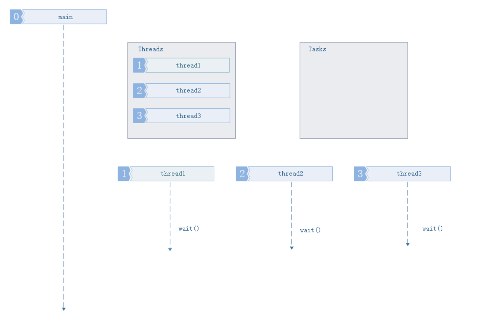
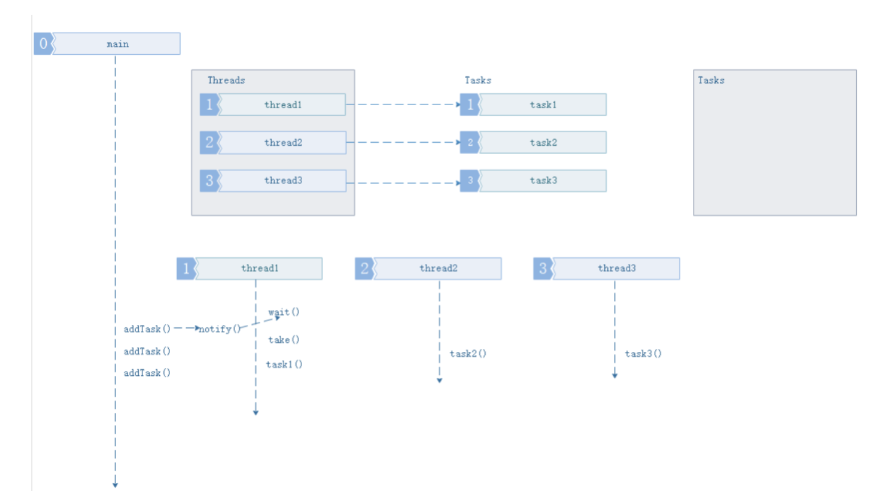
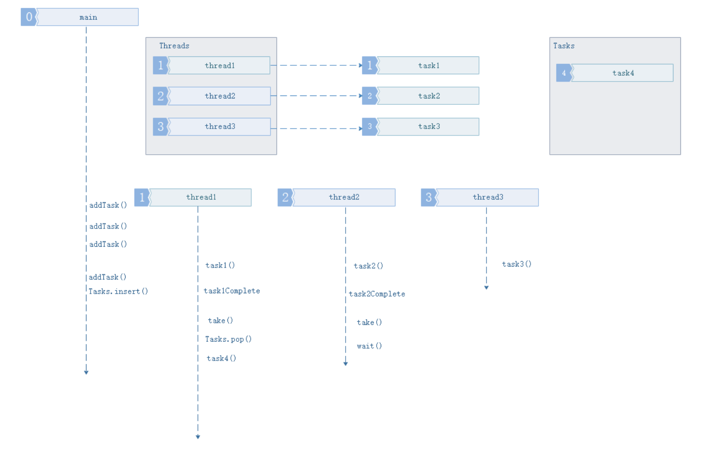
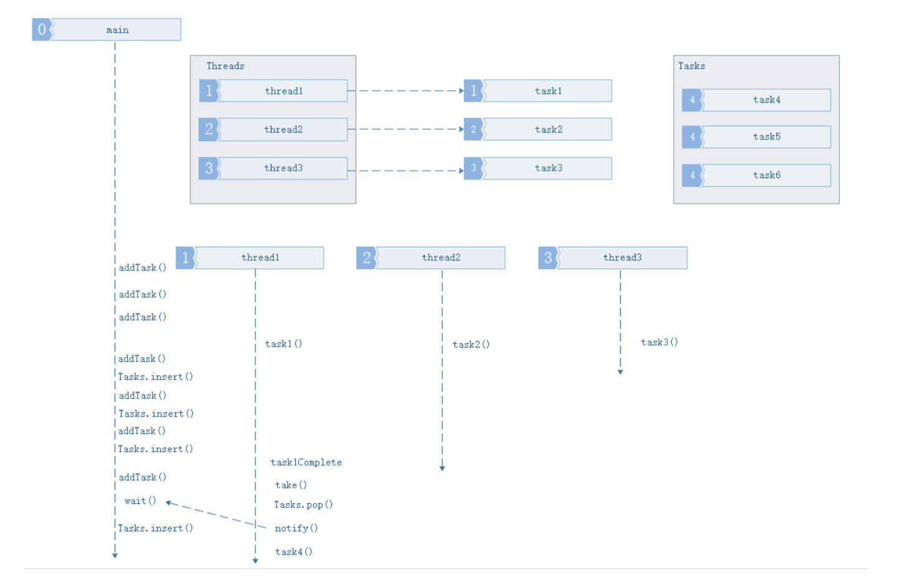
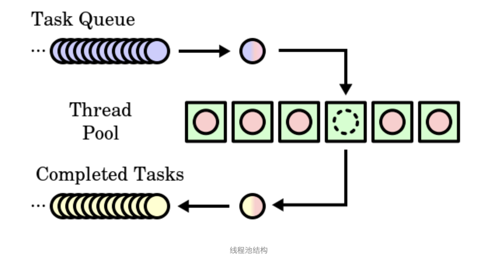

# C++ 线程池

参考链接：基于C++11实现线程池的工作原理;c++简单线程池实现https://www.cnblogs.com/ailumiyana/p/10016965.html https://www.cnblogs.com/yangang92/p/5485868.html


## 基础概念

**线程池:** 当进行并行的任务作业操作时，线程的建立与销毁的开销是，阻碍性能进步的关键，因此线程池，由此产生。使用多个线程，无限制循环等待队列，进行计算和操作。帮助快速降低和减少性能损耗。


## 线程池的组成

1. 线程池管理器：初始化和创建线程，启动和停止线程，调配任务；管理线程池
2. 工作线程：线程池中等待并执行分配的任务
3. 任务接口：添加任务的接口，以提供工作线程调度任务的执行。
4. 任务队列：用于存放没有处理的任务，提供一种缓冲机制，同时具有调度功能，高优先级的任务放在队列前面


## 线程池工作的四种情况

- **1. 没有任务要执行，缓冲队列为空**

 

空队列情况

- **2. 队列中任务数量，小于等于线程池中线程任务数量**

 

任务数量小于线程数量

- **3. 任务数量大于线程池数量,缓冲队列未满**

 

任务数量大于线程池数量

- **4. 任务数量大于线程池数量，缓冲队列已满**

 

缓冲队列已满


## 线程池的C++实现

*参考链接：*Thread pool; ThreadPool;



线程池的主要组成有上面三个部分：

- 任务队列(Task Quene)
- 线程池(Thread Pool)
- 完成队列(Completed Tasks)


### 队列

我们使用队列来存储工作，因为它是更合理的数据结构。我们希望以与发送它相同的顺序启动工作。但是，这个队列有点特殊。正如我在上一节中所说的，线程是连续的（好吧，不是真的，但我们假设它们是）查询队列要求工作。

当有可用的工作时，线程从队列中获取工作并执行它。如果两个线程试图同时执行相同的工作会发生什么？好吧，程序会崩溃。

为了避免这种问题，我在标准C ++ Queue上实现了一个包装器，它使用mutex来限制并发访问。让我们看一下SafeQueue类的一小部分示例：

```cpp
void enqueue(T& t) {
    std::unique_lock<std::mutex> lock(m_mutex);
    m_queue.push(t);
}
```

要排队我们做的第一件事就是锁定互斥锁以确保没有其他人正在访问该资源。然后，我们将元素推送到队列中。当锁超出范围时，它会自动释放。好吗，对吧？

这样，我们使Queue线程安全，因此我们不必担心许多线程在相同的“时间”访问和/或修改它。


### 提交函数

线程池最重要的方法是负责向队列添加工作的方法。我打电话给这个方法提交。不难理解它是如何工作的，但它的实现起初可能看起来很吓人。让我们考虑应该做什么，之后我们会担心如何做到这一点。什么：

- 接受任何参数的任何函数。
- 立即返回“东西”以避免阻塞主线程。此返回的对象最终应包含操作的结果。完整的提交函数如下所示：

```cpp
// Submit a function to be executed asynchronously by the pool template<typename F, typename...Args>

auto submit(F&& f, Args&&... args) -> std::future<decltype(f(args...))> {
    // Create a function with bounded parameters ready to execute

    std::function<decltype(f(args...))()> func = std::bind(std::forward<F>(f), std::forward<Args>(args)...);
    // Encapsulate it into a shared ptr in order to be able to copy construct // assign 

    auto task_ptr = std::make_shared<std::packaged_task<decltype(f(args...))()>>(func);
    // Wrap packaged task into void function

    std::function<void()> wrapper_func = [task_ptr]() {
      (*task_ptr)(); 
    };

    // Enqueue generic wrapper function

    m_queue.enqueue(wrapperfunc);
    // Wake up one thread if its waiting

    m_conditional_lock.notify_one();
    // Return future from promise

    return task_ptr->get_future();
}
```


### 队列完整源代码

```
// SafeQueue.h

#pragma once

#include <mutex>

#include <queue>

// Thread safe implementation of a Queue using a std::queue

template <typename T>
class SafeQueue {
private:
  std::queue<T> m_queue; //利用模板函数构造队列

  std::mutex m_mutex;//访问互斥信号量

public:
  SafeQueue() { //空构造函数


  }

  SafeQueue(SafeQueue& other) {//拷贝构造函数

    //TODO:
  }

  ~SafeQueue() { //析构函数

  }


  bool empty() {  //队列是否为空

    std::unique_lock<std::mutex> lock(m_mutex); //互斥信号变量加锁，防止m_queue被改变

    return m_queue.empty();
  }

  int size() {
    std::unique_lock<std::mutex> lock(m_mutex); //互斥信号变量加锁，防止m_queue被改变

    return m_queue.size();
  }
//队列添加元素

  void enqueue(T& t) {
    std::unique_lock<std::mutex> lock(m_mutex);
    m_queue.push(t);
  }
//队列取出元素

  bool dequeue(T& t) {
    std::unique_lock<std::mutex> lock(m_mutex); //队列加锁

    if (m_queue.empty()) {
      return false;
    }
    t = std::move(m_queue.front()); //取出队首元素，返回队首元素值，并进行右值引用

    m_queue.pop(); //弹出入队的第一个元素

    return true;
  }
};
```


### 线程池完整代码

*参考链接：* std::bind;std::forward;std::packaged_task

```cpp
//ThreadPool.h

#pragma once

#include <functional>

#include <future>

#include <mutex>

#include <queue>

#include <thread>

#include <utility>

#include <vector>

#include "SafeQueue.h"

class ThreadPool {
private:
  class ThreadWorker {//内置线程工作类

  private:
    int m_id; //工作id

    ThreadPool * m_pool;//所属线程池

  public:
    //构造函数

    ThreadWorker(ThreadPool * pool, const int id) 
      : m_pool(pool), m_id(id) {
    }
    //重载`()`操作

    void operator()() {
      std::function<void()> func; //定义基础函数类func

      bool dequeued; //是否正在取出队列中元素

      //判断线程池是否关闭，没有关闭，循环提取

      while (!m_pool->m_shutdown) {
        {
          //为线程环境锁加锁，互访问工作线程的休眠和唤醒

          std::unique_lock<std::mutex> lock(m_pool->m_conditional_mutex);
          //如果任务队列为空，阻塞当前线程

          if (m_pool->m_queue.empty()) {
            m_pool->m_conditional_lock.wait(lock); //等待条件变量通知，开启线程

          }
          //取出任务队列中的元素

          dequeued = m_pool->m_queue.dequeue(func);
        }
        //如果成功取出，执行工作函数

        if (dequeued) {
          func();
        }
      }
    }
  };

  bool m_shutdown; //线程池是否关闭

  SafeQueue<std::function<void()>> m_queue;//执行函数安全队列，即任务队列

  std::vector<std::thread> m_threads; //工作线程队列

  std::mutex m_conditional_mutex;//线程休眠锁互斥变量

  std::condition_variable m_conditional_lock; //线程环境锁，让线程可以处于休眠或者唤醒状态

public:
    //线程池构造函数

  ThreadPool(const int n_threads)
    : m_threads(std::vector<std::thread>(n_threads)), m_shutdown(false) {
  }

  ThreadPool(const ThreadPool &) = delete; //拷贝构造函数，并且取消默认父类构造函数

  ThreadPool(ThreadPool &&) = delete; // 拷贝构造函数，允许右值引用

  ThreadPool & operator=(const ThreadPool &) = delete; // 赋值操作

  ThreadPool & operator=(ThreadPool &&) = delete; //赋值操作

  // Inits thread pool

  void init() {
    for (int i = 0; i < m_threads.size(); ++i) {
      m_threads[i] = std::thread(ThreadWorker(this, i));//分配工作线程

    }
  }

  // Waits until threads finish their current task and shutdowns the pool

  void shutdown() {
    m_shutdown = true;
    m_conditional_lock.notify_all(); //通知 唤醒所有工作线程

    for (int i = 0; i < m_threads.size(); ++i) {
      if(m_threads[i].joinable()) { //判断线程是否正在等待

        m_threads[i].join();  //将线程加入等待队列

      }
    }
  }

  // Submit a function to be executed asynchronously by the pool
  //线程的主要工作函数，使用了后置返回类型，自动判断函数返回值

  template<typename F, typename...Args>
  auto submit(F&& f, Args&&... args) -> std::future<decltype(f(args...))> {
    // Create a function with bounded parameters ready to execute
    // 

    std::function<decltype(f(args...))()> func = std::bind(std::forward<F>(f), std::forward<Args>(args)...);//连接函数和参数定义，特殊函数类型,避免左、右值错误

    // Encapsulate it into a shared ptr in order to be able to copy construct // assign 
    //封装获取任务对象，方便另外一个线程查看结果

    auto task_ptr = std::make_shared<std::packaged_task<decltype(f(args...))()>>(func);

    // Wrap packaged task into void function
    //利用正则表达式，返回一个函数对象

    std::function<void()> wrapper_func = [task_ptr]() {
      (*task_ptr)(); 
    };

    // 队列通用安全封包函数，并压入安全队列

    m_queue.enqueue(wrapper_func);

    // 唤醒一个等待中的线程

    m_conditional_lock.notify_one();

    // 返回先前注册的任务指针

    return task_ptr->get_future();
  }
};
```

使用样例代码 *参考连接：* std::random_device;std::mt19937;std::uniform_int_distribution;;

```cpp
#include <iostream>

#include <random>

#include "../include/ThreadPool.h"

std::random_device rd; //真实随机数产生器

std::mt19937 mt(rd()); //生成计算随机数mt;

std::uniform_int_distribution<int> dist(-1000, 1000);//生成-1000到1000之间的离散均匀分部数

auto rnd = std::bind(dist, mt);

//设置线程睡眠时间

void simulate_hard_computation() {
  std::this_thread::sleep_for(std::chrono::milliseconds(2000 + rnd()));
}

// 添加两个数字的简单函数并打印结果

void multiply(const int a, const int b) {
  simulate_hard_computation();
  const int res = a * b;
  std::cout << a << " * " << b << " = " << res << std::endl;
}

//添加并输出结果

void multiply_output(int & out, const int a, const int b) {
  simulate_hard_computation();
  out = a * b;
  std::cout << a << " * " << b << " = " << out << std::endl;
}

// 结果返回

int multiply_return(const int a, const int b) {
  simulate_hard_computation();
  const int res = a * b;
  std::cout << a << " * " << b << " = " << res << std::endl;
  return res;
}


void example() {
  // 创建3个线程的线程池

  ThreadPool pool(3);

  // 初始化线程池

  pool.init();

  // 提交乘法操作，总共30个

  for (int i = 1; i < 3; ++i) {
    for (int j = 1; j < 10; ++j) {
      pool.submit(multiply, i, j);
    }
  }

  // 使用ref传递的输出参数提交函数

  int output_ref;
  auto future1 = pool.submit(multiply_output, std::ref(output_ref), 5, 6);

  // 等待乘法输出完成

  future1.get();
  std::cout << "Last operation result is equals to " << output_ref << std::endl;

  // 使用return参数提交函数

  auto future2 = pool.submit(multiply_return, 5, 3);

  // 等待乘法输出完成

  int res = future2.get();
  std::cout << "Last operation result is equals to " << res << std::endl;

  //关闭线程池
  pool.shutdown();
}
```

> *原文链接:* *https://wangpengcheng.github.io/2019/05/17/cplusplus_theadpool/*


推荐：

[面试常问的 C/C++ 问题，你能答上来几个？](http://mp.weixin.qq.com/s?__biz=MzIwNTIwMzAzNg==&mid=2654171217&idx=1&sn=bd15d47416f613c4064db23e2ecdca07&chksm=8cf3a362bb842a7492b152055e22bceea9d57d7c9bbd30ef3d5c9d479c9e12db98ff4834d017&scene=21#wechat_redirect)

[C++ 面试必问：深入理解虚函数表](http://mp.weixin.qq.com/s?__biz=MzIwNTIwMzAzNg==&mid=2654170900&idx=1&sn=b15a6489a59a524312724d37942eb9f0&chksm=8cf3bc27bb8435313ba48267123398309c1bc3e07ee481696a3cbcf27efab15377572ac3872e&scene=21#wechat_redirect)

[很多人搞不清 C++ 中的 delete 和 delete[ \] 的区别](http://mp.weixin.qq.com/s?__biz=MzIwNTIwMzAzNg==&mid=2654169948&idx=2&sn=5b74f25e31f554ceb57e6519ecf7a9d5&chksm=8cf3b86fbb843179c2dee4f435823eebdae94b71a9636c19f2b539599da4888ba033e19b0fbd&scene=21#wechat_redirect)

[看懂别人的代码，总得懂点 C++ lambda 表达式吧](http://mp.weixin.qq.com/s?__biz=MzIwNTIwMzAzNg==&mid=2654169382&idx=1&sn=e3eb4c9002bb3e1c740b884c0bfee137&chksm=8cf3ba15bb843303f3ca96103dcf1080de6924205b70a608f1d25e96fadf3c320b0d4c572652&scene=21#wechat_redirect)

[Java、C++ 内存模型都不知道，还敢说自己是高级工程师？](http://mp.weixin.qq.com/s?__biz=MzIwNTIwMzAzNg==&mid=2654169197&idx=1&sn=8c21989f5316152a81a07ce42d8abd28&chksm=8cf3bb5ebb8432480e4f74d10a3f87433a710cb41ec1692be4d5ea39d185d2839f5392a9bd09&scene=21#wechat_redirect)

[C++ std::thread 必须要熟悉的几个知识点](http://mp.weixin.qq.com/s?__biz=MzIwNTIwMzAzNg==&mid=2654169175&idx=1&sn=3bdcfd23d254607adb72433b6e6cb79e&chksm=8cf3bb64bb843272c34c41f47e6126ebfc7d3da855c9edccf211b48ec608aea57b374d70c682&scene=21#wechat_redirect)

[现代 C++ 并发编程基础](http://mp.weixin.qq.com/s?__biz=MzIwNTIwMzAzNg==&mid=2654169070&idx=2&sn=71b0c03de175c837faf16668ff7b6a3e&chksm=8cf3b4ddbb843dcb1e10a0806a4c0e52f2c1d019295c669f945d126babc844413ebeb7dc2a12&scene=21#wechat_redirect)

[现代 C++ 智能指针使用入门](http://mp.weixin.qq.com/s?__biz=MzIwNTIwMzAzNg==&mid=2654168989&idx=1&sn=6bc78f5e72f6e288a29c536fbc06bfda&chksm=8cf3b4aebb843db82acf95dc5a0884a3063531cdfe8e6b78d3e307557a111566ec8af0278f56&scene=21#wechat_redirect)

[c++ thread join 和 detach 到底有什么区别？](http://mp.weixin.qq.com/s?__biz=MzIwNTIwMzAzNg==&mid=2654168939&idx=2&sn=1b497a5600a2cba54e26580f740fae97&chksm=8cf3b458bb843d4ebcad25044847c77dfef31149e7764b9a966e808082c97adedb7aac3d1e45&scene=21#wechat_redirect)

[C++ 面试八股文：list、vector、deque 比较](http://mp.weixin.qq.com/s?__biz=MzIwNTIwMzAzNg==&mid=2654171463&idx=1&sn=84ac672ae1be30611bc6c0a00544d4e2&chksm=8cf3a274bb842b6277ff83b524126b8ee92ea1d7166a9e2bf5144b2eb744195688afc76b2e7c&scene=21#wechat_redirect)

[C++经典面试题（最全，面中率最高）](http://mp.weixin.qq.com/s?__biz=MzIwNTIwMzAzNg==&mid=2654171270&idx=1&sn=fcb8b4991555beded28db25f5cac8d44&chksm=8cf3a3b5bb842aa3350bd039fe86c712b5a9990fa528af285ba079dfd0024b96ba48c81b7020&scene=21#wechat_redirect)

[C++ STL deque 容器底层实现原理（深度剖析）](http://mp.weixin.qq.com/s?__biz=MzIwNTIwMzAzNg==&mid=2654171934&idx=1&sn=3081d579df5f65110fb11f5e262504e5&chksm=8cf3a02dbb84293b700f10eea0db9fa5f74db6757da19a5c23217e687a3bf7cd34d1bd47d8d4&scene=21#wechat_redirect)

[STL vector push_back 和 emplace_back 区别](http://mp.weixin.qq.com/s?__biz=MzIwNTIwMzAzNg==&mid=2654171981&idx=1&sn=c5e89f01ddfbafb5afa07d8388d537dd&chksm=8cf3a07ebb842968eba1f666949d4d09805ccf5d0763f9c3c1d5591fba2f9ccb3427132f6c65&scene=21#wechat_redirect)

[了解 C++ 多态与虚函数表](http://mp.weixin.qq.com/s?__biz=MzIwNTIwMzAzNg==&mid=2654171932&idx=1&sn=5c7128f307804dae21f87600195e9892&chksm=8cf3a02fbb8429391b9b2a37d0a28a54a89389abcbaad428a4a79f9a0fe147a2199f5eb749c9&scene=21#wechat_redirect)

[C++ 面试被问到的“左值引用和右值引用”](http://mp.weixin.qq.com/s?__biz=MzIwNTIwMzAzNg==&mid=2654171986&idx=1&sn=e0fce25427a881c115f32c6f40d29fad&chksm=8cf3a061bb84297769a9f3f194ffb608c39c95104239aaed7c0881bb3e79e491cea39837fcb3&scene=21#wechat_redirect)