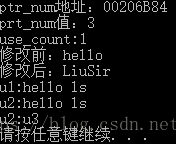

## C++ 11 智能指针

 C++98中，智能指针采用auto_ptr ,拷贝的时候返回的是一个左值，且不能调用delete[], C++11 已经废弃,改用如下三种智能指针：

- unique_ptr：拥有管理内存的所有权，没有拷贝构造函数，只有移动构造函数，不能多个unique_ptr对象共享一段内存，可以自定义delete函数，从而支持delete [] 。
- share_ptr：通过计数方式多个share_ptr可以共享一段内存，当计数为0的时候，所管理内存会被删除，可以自定义delete函数，从而支持delete[] 。
- weak_ptr：观察shared_ptr管理的内存对象 ，只观察但不拥有。成员函数lock返回shared_ptr对象，若对应内存已经删除，则shared_ptr对象==nullptr，weak_ptr对象可以拷贝构造，拷贝构造出来的对象和原对象观察的是同一段内存。成员函数reset可以解除对内存的观察，注意，是解除观察，并不会删除对应内存对象。可以避免因shared_ptr的循环引用而引起的内存泄露。


## shared_ptr 类

 shared_ptr 允许多个指针指向同一个对象，智能指针也是模板，定义如下：

```c++
shared_ptr<string> p1;      // 可以指向string
shared_ptr<list<int>> p2;   // 可以指向int的list
```

智能指针的使用方式与普通指针类似，解引用一个智能指针返回它指向的对象。例如判断是否为空：

```c++
// 如果p1不为空，检查它是否指向一个空string
if (p1 && p1->empty())
    *p1 = "name";         // 如果p1指向一个空string，解引用p1，赋新值
```


## shared_ptr 和 unique_ptr 共有操作

| **操作**           | **说明**                                                 |
| :----------------- | :------------------------------------------------------- |
| shared_ptr`<T>` sp | 空智能指针，可以指向类型为T的对象                        |
| unique_ptr`<T>` up | 同上                                                     |
| p                  | 将p用作一个条件判断，若p指向一个对象，则为true           |
| *p                 | 解引用p，获得它指向的对象                                |
| p->mem             | 等价于(*p).mem                                           |
| p.get()            | <font color="red">返回p中保存的指针，要小心使用。</font> |
| swap(p, q)         | 交换p和q中的指针                                         |
| p.swap(q)          | 同上                                                     |


## shared_ptr 独有操作

| **操作**                | **说明**                                                     |
| :---------------------- | :----------------------------------------------------------- |
| make_shared`<T>` (args) | 返回一个shared_ptr，指向一个动态分配的类型为T的对象          |
| shared_ptr`<T>` p(q)    | p是shared_ptr q的拷贝；此操作会增加q中的计数器               |
| p=q                     | p和q都是shared_ptr，所保存的指针必须能相互转换。此操作会递减p的引用计数，递增q的引用计数；若p的引用计数变为0，则将其管理的原内存释放 |
| p.unique()              | 若p.use_count()为1，返回true；否则返回false                  |
| p.use_count()           | 返回与p 共享对象的智能指针数量；可能很慢，主要用于调试       |


## make_shared 函数

 最安全的分配和使用动态内存的方法是调用一个名为`make_shared`的标准库函数。<font color="red">此函数在动态内存中分配一个对象并初始化它</font>，返回指向此对象的`shared_ptr`。

 当要用**make_shared**时，必须指定想要创建的对象的类型，如下：

```c++
//指向一个值为42的int的shared_ptr
shared_ptr<int> p3 = make_shared<int>(42);
//p4指向一个值为"9999999999"的string
shared_ptr<string> p4 = make_shared<string>(10,'9');
//p5指向一个值初始化的int,值为0
shared_ptr<int> p5 = make_shared<int>();
```

 也可以使用**auto**定义一个对象来保存make_shared的结果，更为简单：

```c++
//p6指向一个动态分配的空vector<string>
auto p6 = make_shared<vector<string>>();
```

 当进行拷贝或赋值操作时，每个shared_ptr都会记录有多少个其他shared_ptr指向相同的对象：

```c++
auto p = make_shared<int>(42);      // p指向的对象只有p一个引用者
auto q(p);                          // p和q指向相同对象，此对象有两个引用者    
```

我们可以认为每个shared_ptr都有一个关联的计数器，通常称其为**引用计数**。无论何时我们拷贝一个shared_ptr，计数器都会递增。


## unique_ptr 类

unique_ptr 独占所指向的对象。与shared_ptr不同，某个时刻只能有一个unique_ptr指向一个给定对象。当unique_ptr被销毁时，它所指向的对象也被销毁。

 与shared_ptr不同，没有类似make_shared的标准库函数返回一个unique_ptr。所以初始化unique_ptr必须采用直接初始化形式， 由于unique_ptr拥有它指向的对象，因此unique_ptr不支持普通的拷贝或赋值操作。如下：

```c++
unique_ptr<double> p1;      //可以指向一个double的unique_ptr
unique_ptr<int> p2(new int(42));    //p2指向一个值为42的int

unique_ptr<string> p1(new string("hello"));
unique_ptr<string> p2(p1);          //错误：unique_ptr不支持拷贝
unique_ptr<string> p3;
p3 = p2;                           //错误：unique_ptr不支持赋值
```


## unique_ptr 独有操作

| **操作**               | **说明**                                                     |
| :--------------------- | :----------------------------------------------------------- |
| unique_ptr`<T>` u1     | 空unique_ptr，可以指向类型为T的对象。u1会使用delete来释放它的指针 |
| unique_ptr`<T,D>` u2   | 同上。u2会使用一个类型为D的可调用对象来释放它的指针          |
| unique_ptr`<T,D>` u(d) | 空unique_ptr，可以指向类型为T的对象，<font color="red">用类型为D的对象d代替delete</font> |
| u=nullptr              | 释放u指向的对象，将u置为空                                   |
| u.release()            | u放弃对指针的控制权，返回指针，并将u置空                     |
| u.reset()              | 释放u指向的对象                                              |
| u.reset(q)             | 如果提供了内置指针q，令u指向这个对象；否则将u置空            |
| u.reset(nullptr)       |                                                              |

虽然我们不能拷贝或赋值unique_ptr，但可以通过调用release或者reset将指针的所有权从一个（非const）unique_ptr转移给两一个unique：

```c++
unique_ptr<string> u1(new string("hello ls"));
//将所有权从u1转移给u2;
unique_ptr<string> u2(u1.release());    //release将u1置空
unique_ptr<string> u3(new string("u3"));
//将所有权从u3转移给u2
u2.reset(u3.release());                 //reset释放了u2原来指向的内存
```

 release成员返回unique_ptr当前保存的指针并将其置空。因此，u2被初始化为u1原来保存的指针，而u1被置空。

 调用release会切断unique_ptr和它原来管理的对象间的联系。release返回的指针通常会被用来初始化另一个智能指针或给另一个智能指针赋值。如果我们不用另一个智能指针来保存release返回的指针，我们的程序就要负责资源的释放，如下：

```c++
auto u = u2.release();      //删除u2
delete(u);
```


## 示例程序：

```c++
#include <iostream>
#include <memory>
#include <string>
using namespace std;
int main()
{
    shared_ptr<int> ptr_num;
    ptr_num = make_shared<int>(3);      //shared_ptr数字为3
    cout << "ptr_num地址：" << ptr_num << endl;
    cout << "prt_num值：" << *ptr_num << endl;
    cout << "use_count:" << ptr_num.use_count() << endl;        //查看计数器

    shared_ptr<string> ptrStr = make_shared<string>("hello");   //string 类型
    cout << "修改前：" << *ptrStr << endl;
    if (ptrStr && !ptrStr->empty())
    {
        *ptrStr = "LiuSir";
    }
    cout << "修改后：" << *ptrStr << endl;

    unique_ptr<string> u1(new string("hello ls"));
    cout << "u1:" << *u1 << endl;
    //将所有权从u1转移给u2;
    unique_ptr<string> u2(u1.release());    //release将u1置空
    cout << "u2:" << *u2 << endl;
    unique_ptr<string> u3(new string("u3"));
    //将所有权从u3转移给u2
    u2.reset(u3.release());                 //reset释放了u2原来指向的内存
    cout << "u2:" << *u2 << endl;

    auto u = u2.release();      //删除u2
    delete(u);

    return 0;
}
```

运行结果：

 


## 手写shared_ptr

```c++
using namespace std;

template<typename T>
class shared_ptr {
private: 
    T *object;  // 指向管理的对象
    int *cnt;   // 引用计数
public:
    shared_ptr（）{
        cnt = new int(1);
        object = NULL;
    }
    
    shared_ptr(T *t) : object(t) {
        cnt = new int(1);
    }
    
    ~shared_ptr() {
        if (--(*cnt) == 0) {
            if (object) {
                delete object;
                object = NULL;
            }
            delete cnt;
            cnt = NULL;
        }
    }
    
    // 拷贝构造函数
    shared_ptr(const shared_ptr<T> &p) {
        ++(*p.cnt);
        
        // 要把前一个对象释放，才在后面赋值下一个对象
        if (--(*cnt) == 0) {
            if (object) {
                delete object;
                object = NULL;
            }
            delete cnt;
            cnt = NULL;
        }
        
        object = p.object;
        cnt = p.cnt;
    }
    
    shared_ptr<T> & operator = (const shared_ptr<T> & p) {
        ++(*p.cnt);
        
        if (--(*cnt) == 0) {
            if (object) {
                delete object;
                object = NULL;
            }
            delete cnt;
            cnt = NULL;
        }
        
        object = p.object;
        cnt = p.cnt;
        
        return *this;   // 运算符重载的返回值
    }
    
    int use_count() {
        return *(this->cnt);
    }
};
```


## weak_ptr

 观察shared_ptr管理的内存对象 ，只观察但不拥有。成员函数lock返回shared_ptr对象，若对应内存已经删除，则shared_ptr对象==nullptr，weak_ptr对象可以拷贝构造，拷贝构造出来的对象和原对象观察的是同一段内存。成员函数reset可以解除对内存的观察，注意，是解除观察，并不会删除对应内存对象。可以避免因shared_ptr的循环引用而引起的内存泄露，见如下对比使用方式：

```c++
#include <memory>
#include <string>
#include <iostream>

using namespace std;

class B;
class A
{
    public:
        shared_ptr<class B> m_spB;
};


class B
{
    public:
        shared_ptr<class A> m_spA;
};

class D;
class C
{
    public:
        weak_ptr<class D> m_wpD;
};


class D
{
    public:
        weak_ptr<class C> m_wpC;
};


void test_loop_ref()
{
    weak_ptr<class A> wp1;
    {
        auto pA = make_shared<class A>();
        auto pB = make_shared<class B>();

        pA->m_spB = pB;
        pB->m_spA = pA;

        wp1 = pA;
    }
    cout << "wp1 reference number: " << wp1.use_count() << "\n";// 存在内存泄露，打印如下，wp1 reference number:1

    weak_ptr<class C> wp2;
    {
        auto pC = make_shared<class C>();
        auto pD = make_shared<class D>();

        pC->m_wpD = pD;
        pD->m_wpC = pC;

        wp2 = pC;
    }
    cout << "wp2 reference number: " << wp2.use_count() << "\n";// 没有内存泄露，打印如下，wp2 reference number:0
}

int main()
{
    //std::weak_ptr 用来避免 std::shared_ptr 的循环引用
    test_loop_ref();

    return 0;
}
```


## 参考文献

https://blog.csdn.net/MissXy_/article/details/81029794

https://zhuanlan.zhihu.com/p/103258069