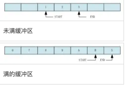
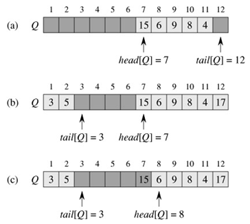

## 简介

环形缓冲器（ringr buffer），也称作圆形队列（circular queue），循环缓冲区（cyclic buffer），圆形缓冲区（circula buffer），是一种用于表示一个固定尺寸、头尾相连的缓冲区的[数据结构](https://baike.baidu.com/item/数据结构/1450)，适合缓存数据流。


多用于2个线程之间传递数据，是标准的先入先出(FIFO)模型。一般来说，对于多线程共享数据，需要使用mutex来同步，这样共享数据才不至于发生不可预测的修改/读取，然而，mutex的使用也带来了额外的系统开销，ring buffer/queue 的引入，就是为了有效地解决这个问题，因其特殊的结构及算法，可以用于2个线程中共享数据的同步，而且必须遵循1个线程push in，另一线程pull out的原则。


线程 A                  媒介                    线程 B
data in --> ring buffer/queue --> data out


## 用法

[圆形缓冲区](https://baike.baidu.com/item/圆形缓冲区/15563965)的一个有用特性是： <font color="red">当一个数据元素被用掉后，其余数据元素不需要移动其存储位置</font>。相反，一个非圆形[缓冲区](https://baike.baidu.com/item/缓冲区/4830555)（例如一个普通的队列）在用掉一个数据元素后，其余数据元素需要向前搬移。换句话说，圆形缓冲区适合实现先进先出缓冲区，而非圆形缓冲区适合后进先出缓冲区。

[圆形缓冲区](https://baike.baidu.com/item/圆形缓冲区/15563965)适合于事先明确了缓冲区的最大容量的情形。扩展一个圆形缓冲区的容量，需要搬移其中的数据。因此一个缓冲区如果需要经常调整其容量，用[链表](https://baike.baidu.com/item/链表/9794473)实现更为合适。

写操作覆盖圆形缓冲区中未被处理的数据在某些情况下是允许的。特别是在多媒体处理时。例如，音频的生产者可以覆盖掉声卡尚未来得及处理的音频数据。


## 工作过程

对于[圆形缓冲区](https://baike.baidu.com/item/圆形缓冲区/15563965)来说，最初的写入位置在哪里是无关紧要的。

由于[计算机内存](https://baike.baidu.com/item/计算机内存/9021807)是线性地址空间 [1] ，因此[圆形缓冲区](https://baike.baidu.com/item/圆形缓冲区/15563965)需要特别的设计才可以从逻辑上实现。


##### 读指针与写指针

一般的，圆形缓冲区需要4个指针 [2] ：

- 在内存中实际开始位置；
- 在内存中实际结束位置，也可以用缓冲区长度代替；
- 存储在缓冲区中的有效数据的开始位置（读指针）；
- 存储在缓冲区中的有效数据的结尾位置（写指针）。

读指针、写指针可以用整型值来表示。

 


## 区分缓冲区满或者空

缓冲区是满、或是空，都有可能出现读指针与写指针指向同一位置：

有多种策略用于检测缓冲区是满、或是空.

* 总是保持一个存储单元为空

  缓冲区中总是有一个存储单元保持未使用状态。缓冲区最多存入(size-1)个数据。如果读写指针指向同一位置，则缓冲区为空。如果写指针位于读指针的相邻后一个位置，则缓冲区为满。这种策略的优点是简单、鲁棒；缺点是语义上实际可存数据量与缓冲区容量不一致，测试缓冲区是否满需要做取余数计算。

* 使用数据计数

  这种策略不使用显式的写指针，而是保持着缓冲区内存储的数据的计数。因此测试缓冲区是空是满非常简单；对性能影响可以忽略。缺点是读写操作都需要修改这个存储数据计数，对于多线程访问缓冲区需要并发控制。

* 镜像指示位

  https://baike.baidu.com/item/%E7%8E%AF%E5%BD%A2%E7%BC%93%E5%86%B2%E5%99%A8/22701730?fr=aladdin

* 读写计数

  用两个有符号整型变量分别保存写入、读出缓冲区的数据数量。其差值就是缓冲区中尚未被处理的有效数据的数量。这种方法的优点是读线程、写线程互不干扰；缺点是需要额外两个变量。

* 记录最后的操作

  使用一位记录最后一次操作是读还是写。读写指针值相等情况下，如果最后一次操作为写入，那么缓冲区是满的；如果最后一次操作为读出，那么缓冲区是空。 这种策略的缺点是读写操作共享一个标志位，[多线程](https://baike.baidu.com/item/多线程/1190404)时需要[并发控制](https://baike.baidu.com/item/并发控制/3543545)。


## 循环队列实现(C++) Ring Buffer

https://www.cnblogs.com/diegodu/p/4619104.html

1.判断满：循环队列的满不再是rear=front 而是改成(rear-front+maxn)%maxn。
2.入队操作: data[rear] = x; rear = (rear+1)%maxn;

总体思想就是不让rear和front的值超过maxn的大小。于是就在rear和front自增时候模maxn。 

 

空队时指针（下标）front和rear在一起都指向队前方，当有元素进队，则rear后移；有元素出队，则front后移，最后，开始时分配给队的前端不再被利用。

<font color="red">注意：空队时rear等于front，满队时必须空一个位置。</font>

```C++
#include <iostream>
using namespace std;

template <class T>
class cycleQueue
{
    private: 
        unsigned int m_size;
        int m_front;
        int m_rear;
        T*  m_data;
    public:
        cycleQueue(unsigned size)
            :m_size(size),
            m_front(0),
            m_rear(0)
        {   
            m_data = new T[size];
        }   

        ~cycleQueue()
        {   
            delete [] m_data;
        }   

        bool isEmpty()
        {   
            return m_front == m_rear;
        }   

        bool isFull() 
        {   
            return m_front == (m_rear + 1) % m_size;
        }   

        void push(T ele) throw (bad_exception)
        {
            if(isFull())
            {
                throw bad_exception();
            }
            m_data[m_rear] = ele;
            m_rear = (m_rear + 1) % m_size;
        }

        T pop() throw(bad_exception)
        {
            if (isEmpty())
            {
                throw bad_exception();
            }
            T tmp = m_data[m_front];
            m_front = (m_front + 1) % m_size;
            return tmp;
        }
};

int main()
{
    cycleQueue<int> q(5);
    q.push(1);
    q.push(2);
    q.push(3);
    q.push(4);
    for (int i = 0; i < 4 ; i++)
        cout << q.pop() << endl;
    q.push(5);
    q.push(5);
    q.push(5);
    cout << q.pop() << endl;
    cout << q.pop() << endl;
    cout << q.pop() << endl;
    cout << q.pop() << endl;
    return 0;
}
```


## 开源案例

#### Linux内核的kfifo

在[Linux内核](https://baike.baidu.com/item/Linux内核/10142820)文件kfifo.h和kfifo.c中，定义了一个先进先出[圆形缓冲区](https://baike.baidu.com/item/圆形缓冲区/15563965)实现。如果只有一个读线程、一个写线程，二者没有共享的被修改的控制变量，那么可以证明这种情况下不需要并发控制。kfifo就满足上述条件。kfifo要求缓冲区长度必须为2的幂。读、写指针分别是无符号整型变量。把读写指针变换为缓冲区内的索引值，仅需要“按位与”操作：（指针值 按位与 （缓冲区长度-1））。这避免了计算代价高昂的“求余”操作。且下述关系总是成立：读指针 + 缓冲区存储的数据长度 == 写指针

即使在写指针达到了无符号整型的上界，上溢出后写指针的值小于读指针的值，上述关系仍然保持成立（这是因为无符号整型加法的性质）。 kfifo的写操作，首先计算缓冲区中当前可写入存储空间的数据长度：len = min{待写入数据长度, 缓冲区长度 - （写指针 - 读指针）}然后，分两段写入数据。第一段是从写指针开始向缓冲区末尾方向；第二段是从缓冲区起始处写入余下的可写入数据，这部分可能数据长度为0即并无实际数据写入。


#### Filament的CircularBuffer

https://github.com/google/filament/blob/main/filament/backend/include/private/backend/CircularBuffer.h


