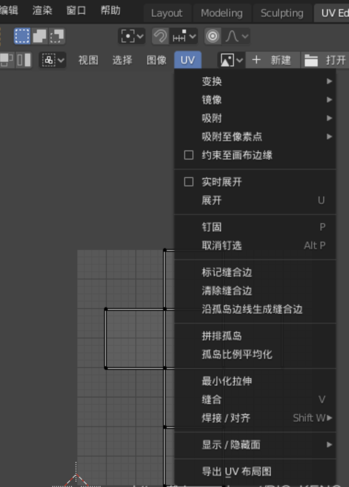
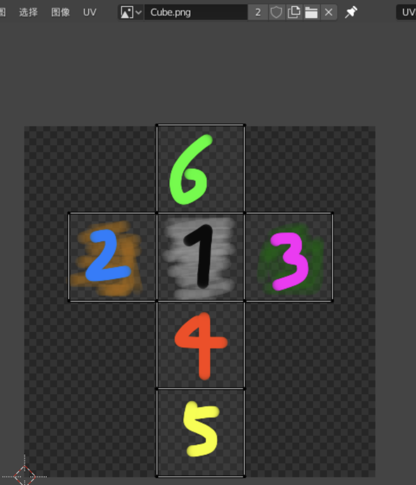
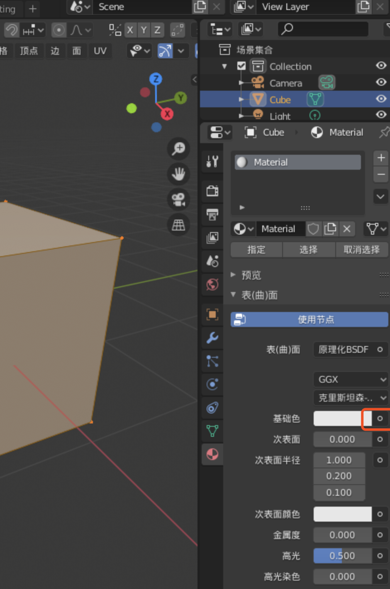
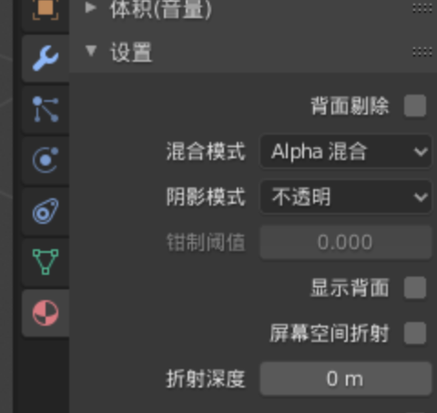
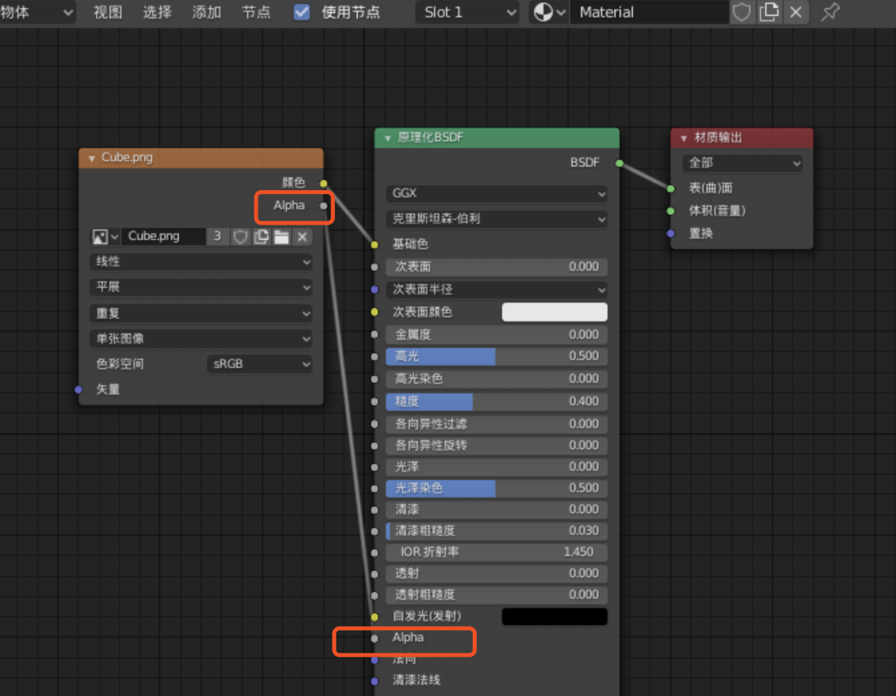
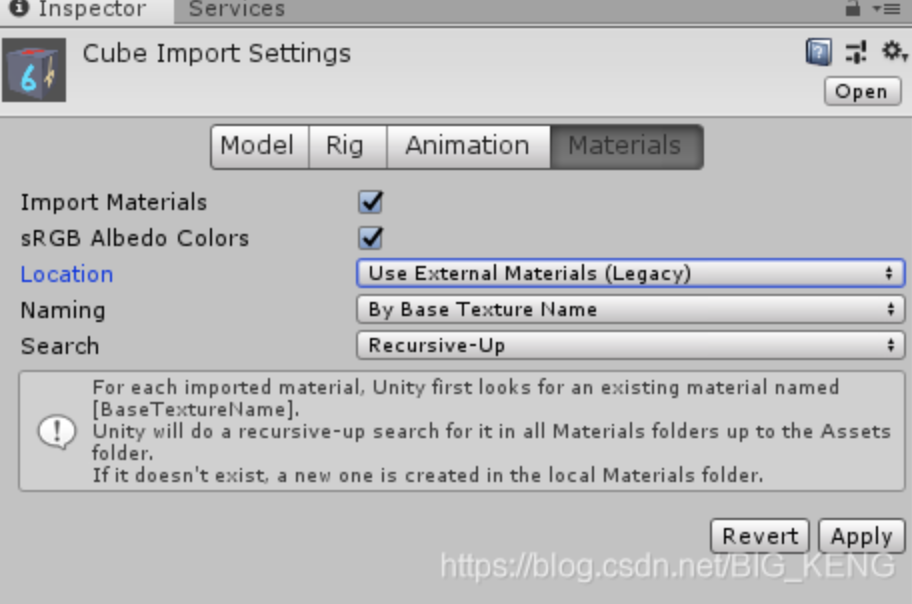
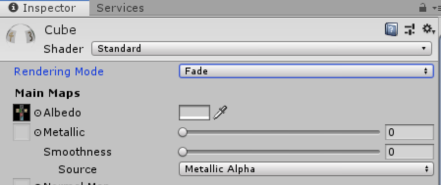

https://blog.csdn.net/BIG_KENG/article/details/106290741

### 1.UV设置

模型是一个简单的方块

打开UV界面，在编辑模式下全选整个方块，就可以看到它自己展开了UV，

然后点击UV界面的UV菜单，弹出的列表里最后一个选项就是**导出UV布局图**

 

导出UV布局图，弹出新窗口，将其导出为png格式，（记着文件位置）,用绘图软件打开刚刚导出的UV布局图,略做修改，再隐藏掉UV自带的方框，保存。

回到blender，点UV界面的**图像**菜单，打开刚刚保存的图片，可以看到UV已经变化了，但是模型还没变化，这是因为**图像纹理**还没导入到**材质**中。

 

### 2.材质设置

在blender右边找到**材质属性**一栏，最下面那个，图标是个圆球，

 

然后打开**表（曲）面**折叠选项，点击**基础色**右边的圆圈，这时弹出一个窗口，选择其中的**图像纹理。**然后可以看见**基础色**下面出现了一行新选项，点击第一个图标，关联上刚刚绘制的Cube图片，这时**材质**便被赋予了**纹理**。

再打开**材质预览模式**，可以看到模型已经增添了材质，发生了变化，但却不是透明的。

此时再回到右边**材质属性**那一栏，找到**设置**折叠项，把里面的混合模式改为 **Alpha混合**，并且取消掉**显示背面**，这时模型还不是透明，我们需要再调整下材质的输出属性。

 

点击上面的shading选项，打开其界面，

模型不是透明的，是因为没有输入图像纹理的Alpha信息，
在下面的大窗口中，有三个小窗口，**第一个**小窗口便是刚刚绘制的图像纹理 **Cube.png**，里面的**Alpha**没连线，所以我们需要把左边图像纹理的这个**Alpha**，连到右边窗口的**Alpha**上。这时可以看到方块变透明了。

 

### 3.导出fbx模型，再导入unity

导出fbx：**blender-文件-导出-FBX**，不要灯光和相机，
导入fbx：**fbx + 纹理图片 一起拖入unity资源框**，只把fbx导入unity是不行的，还需要导入它的纹理图片，最好两个一起导入，或者先导入图片再导入fbx。

接着把fbx模型拖入场景中，发现模型并不是透明的，还需要修改它材质的渲染模式。

先把fbx里包含的材质拆出来。
选择fbx资源后，在Inspector窗口打开Materials，Location那里选择下图里的选项，应用之后就会拆出里面的材质，材质会被untiy自动打包到Materials文件夹下（如果没有该文件夹，unity会自己创建）。

 

选择拆出来的材质，设置Inspector窗口里的Rendering Mode 为Fade，应用之后模型就会变透明。

 

