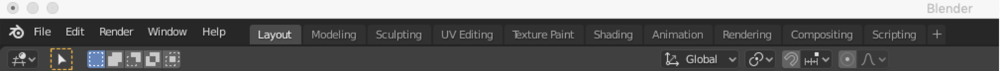
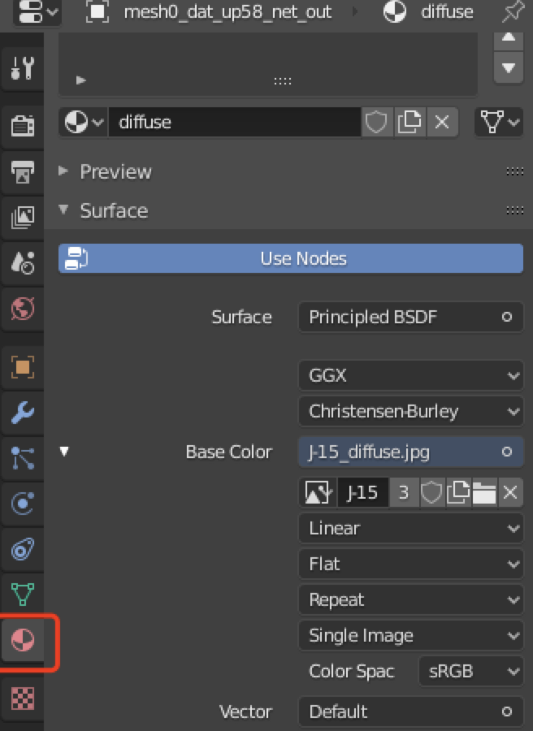
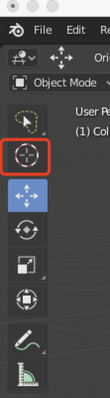
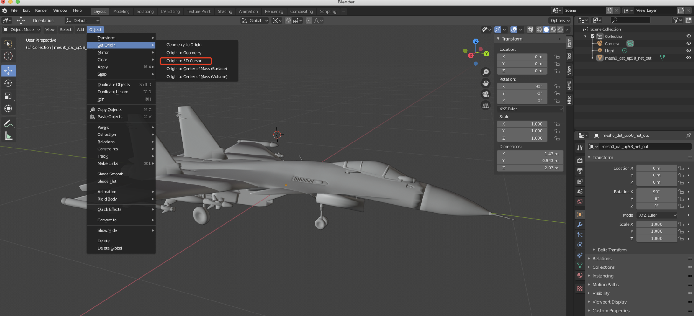
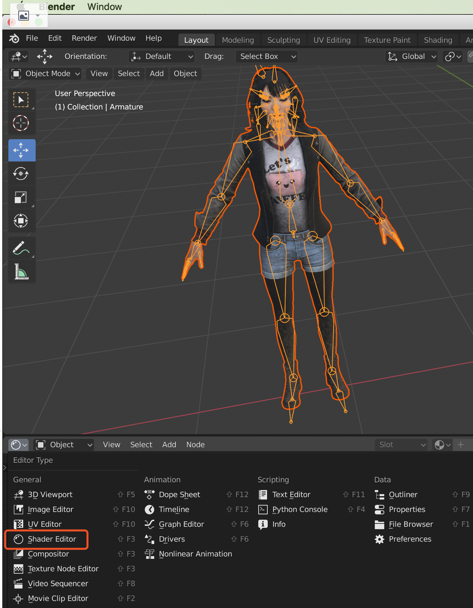

### 一、常用快捷键和基本操作

* 进入编辑模式： Tab

大部分编辑会在鼠标右键有，比如合并模型的Ctrl/Cmd+J (合并模型时，最后一个模型为parent模型)

* 创建Plane
  * Shift + A
  * 快捷键S缩放
  * 快捷键N调出Properties

* 挤出面片
  * 选中一个面，按tab进入编辑模式
  * 快捷键2切换线模式，选中要挤出面的边
  * E(xtrude)挤出
  * Z：只在Z移动
  * 数字：比如3，设置为3米高
  * 回车，完成。

### **二、常用菜单**

##### 1. 正常在Layout模式

如果要编辑UV，进入UV Editing模式等。

UV Editing可参考https://jingyan.baidu.com/article/363872ecf6367f2f4ba16f95.html

##### 2. 让材质生效

需要点击如下进入Viewport Shading，否则即使指定了材质显示也还是白色。或切换到Shader模式。

##### 3. 给模型赋予材质

参考https://jingyan.baidu.com/article/363872ecf6367f2f4ba16f95.html

https://blog.csdn.net/lin5165352/article/details/91436294

需要再Layout属性中，右边角有个材质属性，如下图：

##### 4. 改变轴心

左上角有个3D Cursor，选中后找到模型选一个想吧轴心移动到的点，然后选中 Object -> Set Origin -> Origin to 3D Cursor

##### 5. 材质贴图

这个非常难找，在下图位置，要点这个打开shader编辑器才能放图片材质。或者直接进入Shader模式编辑。

需要注意的是：如果是选中导入的模型，比如xps或mmd模型，需要选中模型内的具体数据才会出现材质编辑选项。

### **三、MMD**

##### 1. 插件安装方式如：

https://github.com/powroupi/blender_mmd_tools/tree/dev_test#download

注意的是，如果是2.79版本，需要在User Preferences -> addon tab ->在这里找到mmd_tools勾上，外面的界面才有mmd_tools。

特别注意：这里要放到目录的是blender_mmd_tools-dev_test解压后里面**子目录的mmd_tools**(包含.py的目录)，而不是把整个目录放进addon。

##### 2. 合并物体：

编辑模式下选中两个物体，mac和windows都是Ctrl+J。

这个操作极其困难，稍不注意就会出现no mesh data to join等乱七八糟的。首先不要在编辑模式，在Layout下，用a键选择所有物体，在Object下面有join按钮，只能多试试。不知道这个是怎么设计的。