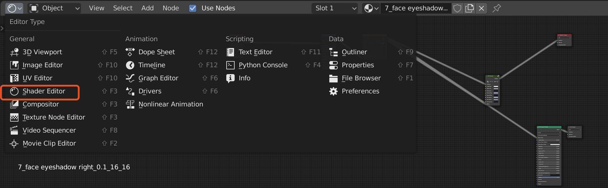
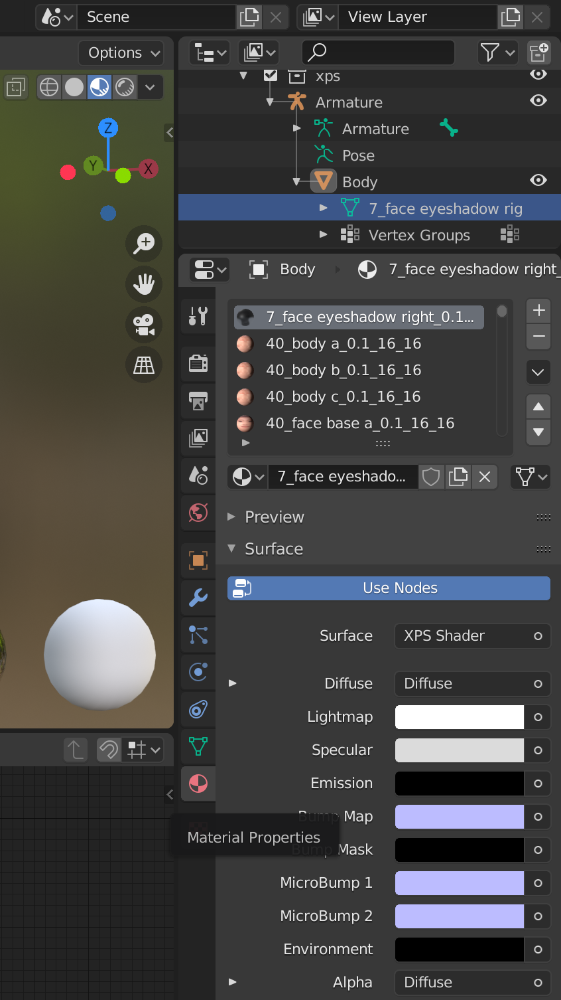
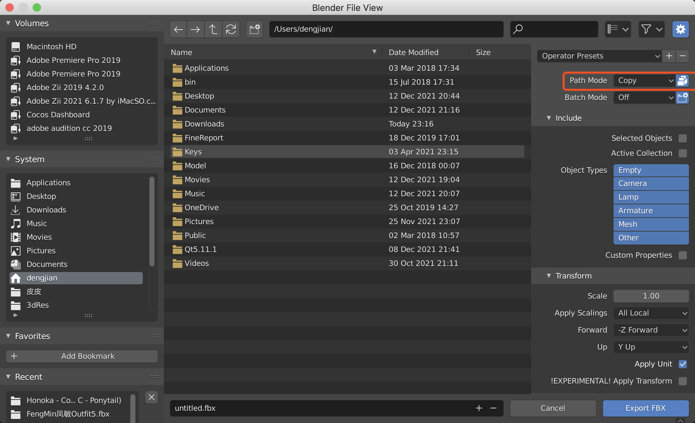
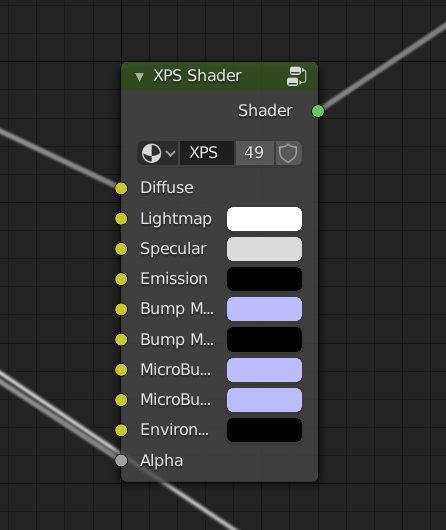
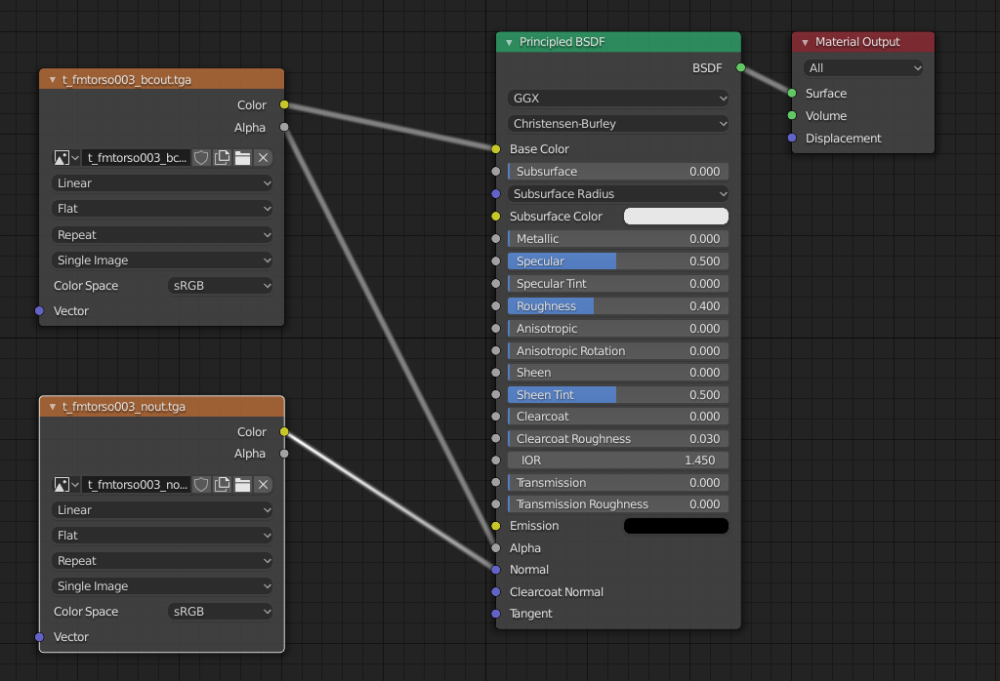

### 一、Blender导出带纹理的fbx

网上大部分是参考https://www.bilibili.com/video/av200826082/

或https://jingyan.baidu.com/article/1709ad807cdfad4634c4f009.html

这两篇。

步骤大致如下：

* 新建一个模型或面片；

* 进入Shading或在其他模式下打开Shader Editor，入口如下图：

  

* 选中模型的实体。如果是导入的pmx或xps模型，需要注意要选中Body下的元素，不然材质属性（Material Properties）按钮出不来。

  

* 创建一个材质（如果原来模型没有材质）

* 将图片拖到Shader Editor，会自动创建出Shader节点。然后用线连接到Shader节点的Diffuse(如果是漫反射贴图)或其他属性上。

* 最后一步，选择导出为fbx，注意Path Mode要选择Copy，并且要选中Copy后面的按钮。

  

### 二、Blender导入xps或pmx文件后再导出fbx的问题

按照前面的步骤，正常创建一个模型贴图后导出fbx是没问题的。但如果是导入的xps或pmx模型，会发现怎么都无法成功。如果导出gltf效果也一样。

折腾好久最后发现是默认shader类型的问题。以XPS模型为例，导入的xps模型默认是通过XPS Shader进行渲染。

这种类型的是无法保存到fbx内部的。需要删掉手动改成普通Shader。如下图所示：

### 三、通过Mixamo一键骨骼绑定

https://www.mixamo.com/

Adobe提供的这个网站太厉害了，使用这个都可以自己做一个ARPG游戏了。而且还提供了智能蒙皮骨骼的功能，让不会美工的我省去了很多工作。

### 四、Blender个人小结

要说Blender对新上手的人真心不友好，如果不习惯它的操作流程，真的会用的想砸电脑。虽然整体风格其实挺符合程序员的使用习惯的。但和其他3d工具的流程差别太大了。

但掌握好后，确实是一个非常好的工具。只有慢慢适应了。

