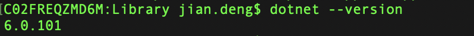

https://answers.unity.com/questions/1815046/how-to-attach-unity-debugger-in-vs-code.html

## .NET 本地安装

首先的确保你的 mac 安装了 .net 的 sdk，如果没有的话，请先去下载，下载网址https://www.microsoft.com/net/learn/get-started/macos

如果安装成功的话，可能需要重启电脑或重启终端，你在 terminal 上敲下面命令行：

dotnet --version
运行结果出现下面的提示，证明你的 dotnet 安装成功了。

 


## Unity 设置

打开你的 unity ,选择 Unity->Prefences->External Tools，做如下图的设置，使你的 unity 默认代码编辑器是 vs code。


关联成功之后，你双击 unity 项目中的 代码默认就打开 vscode了。


## 断点调试

打开 vs code 之后，点击 Debug->Install Additional Debuger…

在出来的列表中，定位到 Debugger for Unity, 点击安装，等待安装完成。


如果你点击调试按钮，vs code 右下角出现如下图示的错误：


这是因为你电脑没有安装mac mono 所造成的，这里说所的mono 并不是unity安装自带的monoDeveloper, 你可以下载mac mono 在如下地址：
http://www.mono-project.com/download/

点击左上角调试按钮，Attach 到 Unity。如果没有出现 Unity-Editor 的选择，先删除本地的（工程目录下，比如/GitHub/unity/MmdUnityProjs/RunningSanta/.vscode）的 .vscode/Launch.json, 然后重启vscode.


另外可能launch.json不会自动生成，可以配置下面的，也可以拷贝其它项目目录下的。其中path改为你自己工程目录的EditorInstance.json文件。

```json
{
    // Use IntelliSense to learn about possible attributes.
    // Hover to view descriptions of existing attributes.
    // For more information, visit: https://go.microsoft.com/fwlink/?linkid=830387
    "version": "0.2.0",
    "configurations": [
        {
            "name": "Unity Editor",
            "type": "unity",
            "path": "/Users/jian.deng/Github/Unity/MmdUnityProjs/RunningSanta/Library/EditorInstance.json",
            "request": "launch"
        },
        {
            "name": "Windows Player",
            "type": "unity",
            "request": "launch"
        },
        {
            "name": "OSX Player",
            "type": "unity",
            "request": "launch"
        },
        {
            "name": "Linux Player",
            "type": "unity",
            "request": "launch"
        },
        {
            "name": "iOS Player",
            "type": "unity",
            "request": "launch"
        },
        {
            "name": "Android Player",
            "type": "unity",
            "request": "launch"
        }
    ]
}
```

