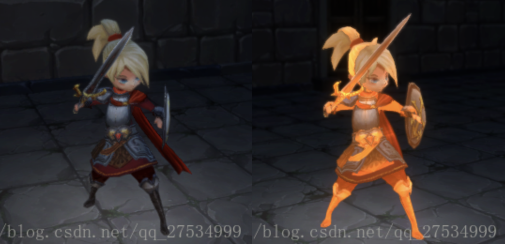
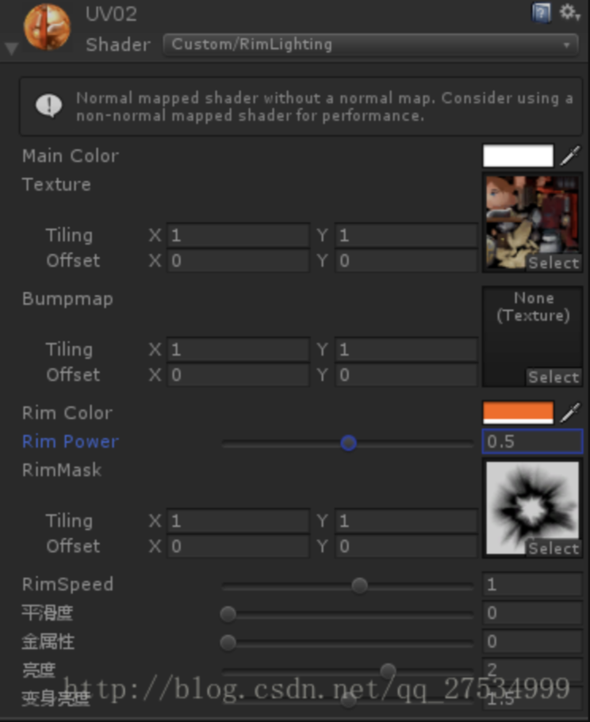

[Shader](https://so.csdn.net/so/search?q=Shader&spm=1001.2101.3001.7020)界面图：



因为特效师的攻击特效做得过为酷炫，不够朴素，于是打算增加“愤怒状态”这一设定，然后就需要一个特效来支撑这一设定。
上网查了一些文章，一开始想做边缘光的特效，发现效果不太理想，最后找到一篇动态边缘光的文章，发现效果不错，思路是通过一个噪声图对模型贴图颜色进行叠加，再加上基于时间的贴图纹理坐标改变来实现的。但是将代码照搬后导出游戏发现严重问题——人物贴图全部丢失不显示了！觉得是文章本身的代码就写得有问题，于是查找其他边缘光相关文章按着动态边缘光的思路用表面着色器重新修改了一遍，发现效果更好且能成功导出！
感叹国内博客中的BUG太多，估计他们也没有实际导出过，只是在编辑器里预览了一下而已……

以下是Shader源码：

```glsl
Shader "Custom/DynamicRimLighting" {  
         //属性域  
        Properties {  
            //纹理颜色  
             _MainColor ("Main Color", Color) = (1,1,1,1)  
              //主纹理属性  
              _MainTex ("Texture", 2D) = "white" {}  
              //法线贴图纹理属性  
              _BumpMap ("Bumpmap", 2D) = "bump" {}  
              //边缘光颜色值  
              _RimColor ("Rim Color", Color) = (1,1,1,1)  
              //边缘光强度值  
              _RimPower ("Rim Power", Range(0.0,1.0)) = 0.5  
              //
              _RimMask("RimMask", 2D) = "white"{}  
                 _RimSpeed("RimSpeed", Range(-10, 10)) = 1.0  
              _Glossiness ("平滑度", Range(0,1)) = 0.5
              _Metallic ("金属性", Range(0,1)) = 0.0
              _Brightness ("亮度", Range(0,3)) = 1.5
              _SpecialBrightness ("变身亮度", Range(0,3)) = 1.5
        }

        SubShader {  
              //标明渲染类型是不透明的物体  
              Tags { "RenderType" = "Opaque" }  
              //标明CG程序的开始  
              CGPROGRAM  
              //声明表面着色器函数  
              #pragma surface surf Standard
              //定义着色器函数输入的参数Input  
              struct Input {  
                  //主纹理坐标值  
                  float2 uv_MainTex;  
                  //法线贴图坐标值  
                  float2 uv_BumpMap;  
                  //视图方向  
                  float3 viewDir;  
              };  
              //声明对属性的引用  
              float4 _MainColor;  
              sampler2D _MainTex;  
              sampler2D _BumpMap;  
              float4 _RimColor;  
              float _RimPower;  
              sampler2D _RimMask;  
              float _RimSpeed;  
              half _Glossiness;
              half _Metallic;
              half _Brightness;
              half _SpecialBrightness;

              //表面着色器函数  
              void surf (Input IN, inout SurfaceOutputStandard o) {  
              fixed4 tex = tex2D(_MainTex, IN.uv_MainTex);  
              fixed rimMask = tex2D(_RimMask, IN.uv_MainTex + float2(0 , _Time.y *_RimSpeed)).r;  
                  //赋值颜色信息  
              o.Metallic = _Metallic;
              o.Smoothness = _Glossiness;
              o.Albedo = tex.rgb *_Brightness* _MainColor.rgb+_RimColor.rgb*_RimPower*(_SpecialBrightness-rimMask); 

              //赋值法线信息  
              o.Normal = UnpackNormal (tex2D (_BumpMap, IN.uv_BumpMap));  
              half rim = 1.0 - saturate(dot (normalize(IN.viewDir), o.Normal)); 
 
              //赋值自发光颜色信息  
              //o.Emission = _RimColor.rgb * pow (rim, _RimPower);  
              o.Emission = _RimColor.rgb *_RimPower*(_SpecialBrightness-rimMask);
              }  
              //标明CG程序的结束  
              ENDCG  
        }
        Fallback "Diffuse"
}
```

参考文章：
 Unity Shader-边缘光(RimLight)效果
 http://blog.csdn.net/puppet_master/article/details/53548134
Unity Shader 表面着色器边缘光(Rim Lighting)二
  http://blog.csdn.net/jk823394954/article/details/48983621
————————————————

版权声明：本文为CSDN博主「西河某人」的原创文章，遵循CC 4.0 BY-SA版权协议，转载请附上原文出处链接及本声明。
原文链接：https://blog.csdn.net/qq_27534999/article/details/79452680