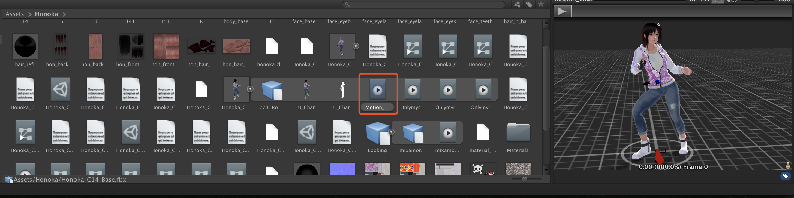
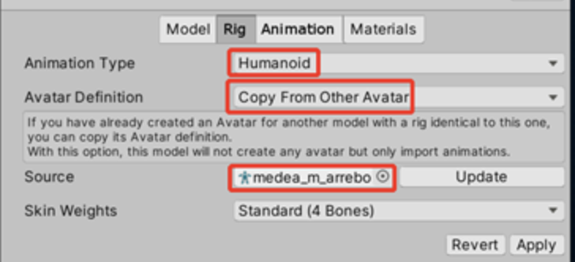

# Pmx模型及vmd动作导入Unity3D

#### 1. 使用blender_mmd_tools

https://github.com/sugiany/blender_mmd_tools

优点：导入导出方便，方便导入动作在blender中预览。

缺点：贴图丢失，需要手动修改。

#### 2. 使用cats-blender-plugin

https://github.com/absolute-quantum/cats-blender-plugin

优点：导入方便，还支持xps模型。可以一键修复模型，保留贴图，并将日语自动改为英语。

缺点：无法导出fbx之外的类型。导出后的fbx使用动作时没有物理效果。

方式可参考 ：https://blog.csdn.net/linxinfa/article/details/121370565

#### 3. 使用MMD4Mecanim

http://stereoarts.jp/

优点：一键生成fbx，可一次性绑定多个动作生成多个，无物理问题，贴图完美。

缺点：插件体积大，只能在Windows系统下操作。需要安装32位的.net frameworks，不然会报错找不到dll。

# Unity3D操作转换的fbx（MMD4Mecanim）

转换成功的fbx在unity的asset中如下图所示，可以预览动作效果。默认人物和动作的Rig都是Generic。如果用这种类型去使用其他通用动作会不生效。

操作可参考https://www.bilibili.com/video/BV1Db411e74e?spm_id_from=333.999.0.0

可以用Ctrl/Cmd + D将红框中的动作文件独立出来，独立出来之前，要改成人形动作，且要选择Copy From Other Avatar，如下：

# Unity3D中给fbx增加通用动作，人行动画

参考https://blog.csdn.net/weixin_43275631/article/details/105323289

我们从网上下载的人物资源大部分都是静态的，这里我推荐一个网站：
Adobe公司的Xixamo网站：https://www.mixamo.com/#/?page=1&query=Idel（不用翻墙）专门用于提供人物模型的动作，用户可以将自己的模型（类型可以是fox、obj、zip）导入网站中，网站会识别模型并有多种动作供用户选择，选择之后点击DOWNLOAD下载即可，下载的类型最好是fbx的即直接可以导进unity如图：（或者自己用C4d、Maya制作也可以）。

这个网站也可以上传自己的fbx模型。最好是上传自己的绑定好的fbx生成动作后的fbx。我按照

https://blog.csdn.net/linxinfa/article/details/121370565

这里下载without Skin的动作，导入到任何人形的人物模型中，都出现了人物嘴巴大张，无法闭合。且脚板变形等问题。

且这种方式，将模型和动作由Generic改成人形Humanaid时，都会提示模型不是T-pose，需要在Unity中强制转为T-pose后才能正常工作。如图：

