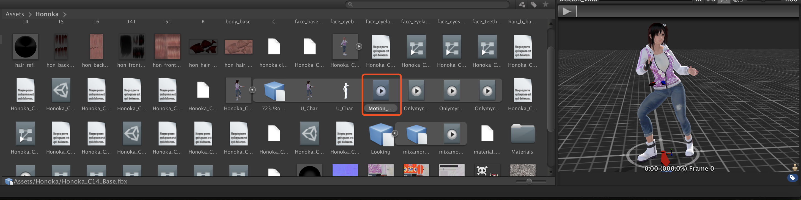
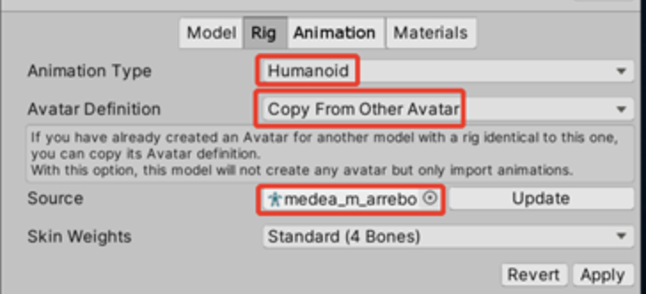
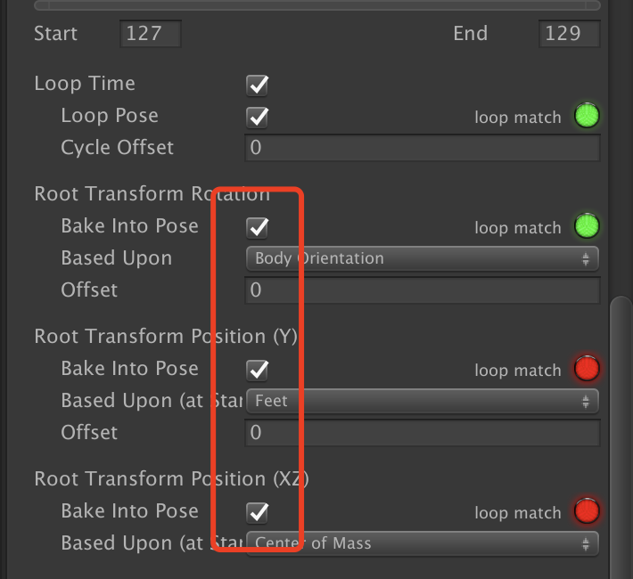

# Pmx模型及vmd动作导入Unity3D

#### 1. 使用blender_mmd_tools

https://github.com/sugiany/blender_mmd_tools

优点：导入导出方便，方便导入动作在blender中预览。

缺点：贴图丢失，需要手动修改。

#### 2. 使用cats-blender-plugin

https://github.com/absolute-quantum/cats-blender-plugin

优点：导入方便，还支持xps模型。可以一键修复模型，保留贴图，并将日语自动改为英语。

缺点：无法导出fbx之外的类型。导出后的fbx使用动作时没有物理效果。

方式可参考 ：https://blog.csdn.net/linxinfa/article/details/121370565

#### 3. 使用MMD4Mecanim

http://stereoarts.jp/

优点：一键生成fbx，可一次性绑定多个动作生成多个，无物理问题，贴图完美。

缺点：插件体积大，只能在Windows系统下操作。需要安装32位的.net frameworks，不然会报错找不到dll。

#### 4. MMD4Mecanim在移动端显示

https://blog.titanwolf.in/a?ID=00700-0e254dcb-709f-49cd-932e-9d4c61f75fa5

Today, when I combined MMD and unity to make Easy AR.

On the PC side, the model can be displayed normally, but after the release of Android, two problems were encountered:

MMD model cannot be displayed After the MMD model is displayed, the action cannot be played normally.

we solve the first problem:

The MMD model cannot be displayed. Tutorial reference: http://www.jiyuew.top/article/170141

1. Find the material map path Materials of MMD, hold down the shift key, and select all the textures of all models

  2. In the "Inspector" panel, change the shader attribute from the original MMD4Mecanim to "Toon/Basic".

(Some articles say that it is changed to "standard", but it will greatly affect the quality of the model texture)

At this point, after Android is released, the model can be displayed normally.

When I was about to celebrate, I encountered a second problem:

After the MMD model is displayed, the action cannot be played normally, and the model always remains in the initial state. Reference article: http://www.jiyuew.top/article/170141

1. In the "Hierarchy" panel, select your MMD model

2. In the inspector panel, there will be Animator. Next, we convert the Animator into the "Animation" property

3. In the Assets panel, select the model converted from the MMD4Mecanim plug-in.

4. In the "Inspector" of the model, under "Rig", change the "Animation Type" property to "Legacy" and click Apply.

5. At this time, the original Animator will be converted into the "Animation" attribute

Finally, thank you enthusiastic netizens who provide solutions.

Finally, appreciate the results of today's labor, hahahaha. The model is my favorite Yiyi, la la la. . .

# Unity3D操作转换的fbx（MMD4Mecanim）

转换成功的fbx在unity的asset中如下图所示，可以预览动作效果。默认人物和动作的Rig都是Generic。如果用这种类型去使用其他通用动作会不生效。

操作可参考https://www.bilibili.com/video/BV1Db411e74e?spm_id_from=333.999.0.0

可以用Ctrl/Cmd + D将红框中的动作文件独立出来，独立出来之前，要改成人形动作，且要选择Copy From Other Avatar，如下：

# Unity3D中给fbx增加通用动作，人行动画

参考https://blog.csdn.net/weixin_43275631/article/details/105323289

我们从网上下载的人物资源大部分都是静态的，这里我推荐一个网站：
Adobe公司的Mixamo网站：https://www.mixamo.com/#/?page=1&query=Idel（不用翻墙）专门用于提供人物模型的动作，用户可以将自己的模型（类型可以是fox、obj、zip）导入网站中，网站会识别模型并有多种动作供用户选择，选择之后点击DOWNLOAD下载即可，下载的类型最好是fbx的即直接可以导进unity如图：（或者自己用C4d、Maya制作也可以）。

这个网站也可以上传自己的fbx模型。最好是上传自己的绑定好的fbx生成动作后的fbx。我按照

https://blog.csdn.net/linxinfa/article/details/121370565

这里下载without Skin的动作，导入到任何人形的人物模型中，都出现了人物嘴巴大张，无法闭合。且脚板变形等问题。

且这种方式，将模型和动作由Generic改成人形Humanaid时，都会提示模型不是T-pose，需要在Unity中强制转为T-pose后才能正常工作。如图：

注意带贴图的fbx导入unity后，要在inspector面板的Materials一项把location改为**"Use External Materials(Legadcy)"**，并且把Naming改为**"From Model's Materials"**。Apply后才会生效。不然会丢失原来的贴图数据。

注意人形动画中有个坑，尤其和刚体一起作用时。人形动画，包括所有Mixamo下载的动画，在unity转换成Humanoid后，都会乱偏转，甚至一直有个往上的力，抵消掉重力。不知道专业名词叫什么，需要选中FBX或要修改的动作的动画文件，点击Edit，在动画里把下面几个选项勾选后，才会关掉这些乱七八糟的东西。

 
