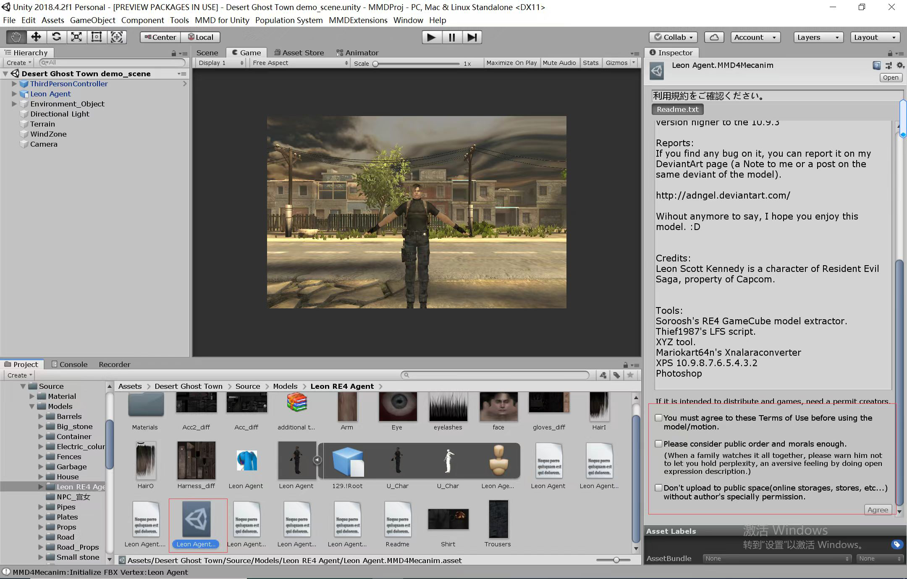
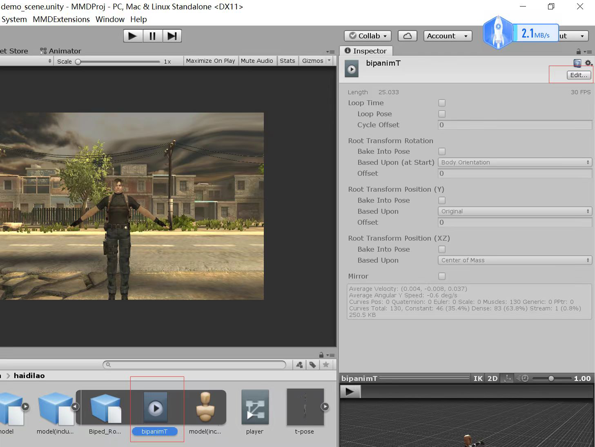
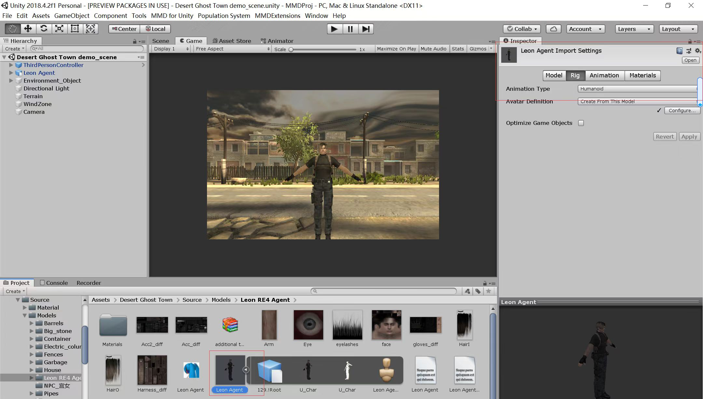
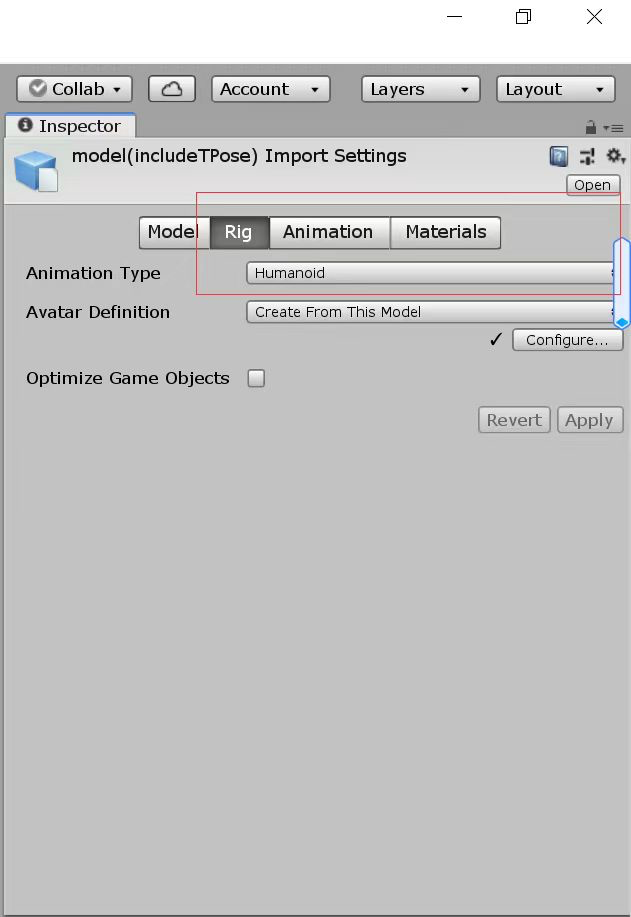

## MMD

需要一个MMD4Mecanim项目，导入到unity工程后。

.pmx的文件会自动生成一个.MMD4Mecanim的文件。

比如把Leon Agent.pmx文件放入unity工程目录，会生成一个Leon Agent.MMD4Mecanim.asset

勾选这3个框运行即可。

如果要把这个拿去跑其他通用的FBX动画，比如通过动作捕捉生成的fbx文件。

如果动画文件为model(includeTPose).fbx这样的针对Tpose的人形动画。需要点击下图的编辑这里改成Humanoid动画。

