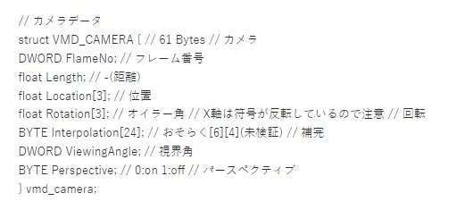
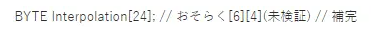
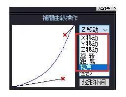
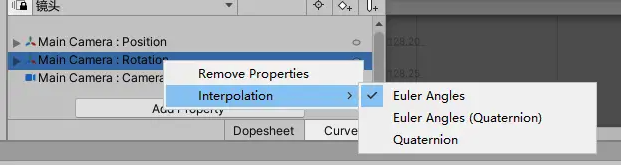

插件下载:https://github.com/cnscj/MMD2UnityTool

使用方式:右键VMD镜头数据->MMD2UnityTool->Export Camera Vmd To Anima

在网上搜索有关VMD镜头数据导入Unity相关内容的时候,发现并没有一个很好的解决方案,有的还需要借助第三方软件才能导入成功,不利于操作.本质探究学习的态度,决定自己写一个转换插件导出对应动画

希望想通过MMD学习Unity相关知识的朋友们这个插件能帮到大家

#### 镜头VMD数据结构如下:

 

本插件是借用了第三方开源插件mmd-for-unity写的,插件里已经有关于PMX和VMD的读取了,唯独没有镜头动画的导出,但是这个插件已经没人维护了,这里就直接使用该插件读取VMD镜头数据,下面是关于一些问题总结

#### 单位转化问题:

在Unity中与在MMD中使用的单位并不是1:1对应的,这里经过测试,实际比例大致接近与

Unity : MMD = 0.085 : 1

并没有官方文档说明,我也是经过大量数据得出的结论

#### 关于插值数据:

在MMD所给出的插值数据结构中

 

并没有对6*4几组数据进行说明(实际上MMD的数据结构作者并没有给出,都是民间大神给出的)

这几组数据分别是对应下面6个曲线,4个数据对应2个控制点坐标,顺序为x1,x2,y1,y2,剩下的p0,p1分别是(0,0),(127,127) 

#### 关于欧拉角动画插值问题:

 

由于MMD中旋转的数据记录的是欧拉角,所以生成动画时需要修改插值方式为Euler Angle

在代码中修改曲线记录的propertyName设置为localEulerAnglesRaw就行了

#### 参考资料:

Unity动画关键帧插值 https://blog.csdn.net/seizeF/article/details/96368503

【MMD】用python解析VMD格式读取 https://www.jianshu.com/p/ae312fb53fc3

Unity AnimationCurve with Easing Functions https://qwe321qwe321qwe321.github.io/2020/11/22/Unity-AnimationCurve-with-Easing-Functions/#bezier-curve-to-animationcurve

Unity 录制动画欧拉角四元素插值会遇到的问题 https://www.bilibili.com/video/av286316296/

how to change the AnimationCurve interpolation (Quad VS. Euler) using script?? https://answers.unity.com/questions/26447/how-to-change-the-animationcurve-interpolation-qua.html

https://github.com/akof1314/AnimationPath/commit/ca49ccaece43a2fafb033e0687d88a625a05919d
