https://www.bilibili.com/read/cv6738571/

今天我们来了解和学习魔兽模型中的贴图，学习把“狗”变成“人”【没看过前面章节的学员朋友建议先看完1-4讲再观看本章】

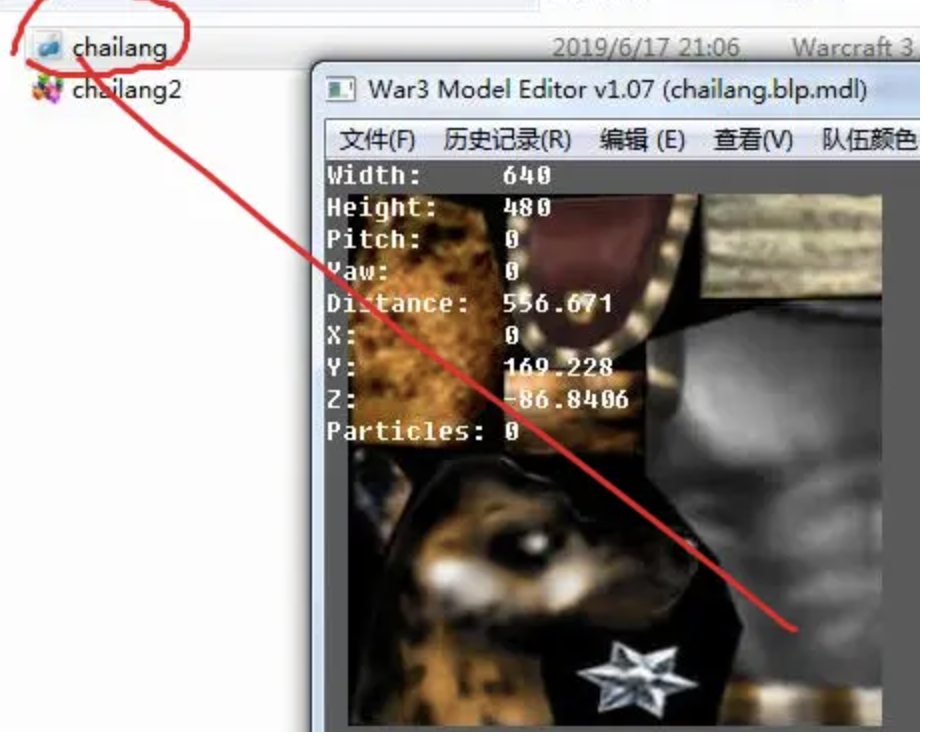

【1】用苹果软件打开这个蓝色图标的BLP格式文件，这就是魔兽贴图的标准格式，TGA其实魔兽也识别，但耗用空间巨大，华而不实，因此最合适的贴图格式还是首选BLP 

【2】这里我们需要用到改图一条龙，打开后

选择最后一个模型查看软件。

【3】文件转换-blp转换tga

【4】选择豺狼人blp贴图

【5】一定要记得选择转化成TGA 而非bmp，因为bmp会导致透明通道丢失。

【6】转换成tga的根本目的 是可以用ps软件打开，我们打开PS

 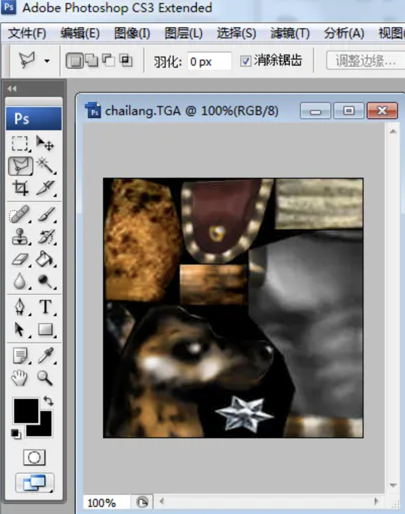

【7】打开后这就是在PS软件中的贴图了

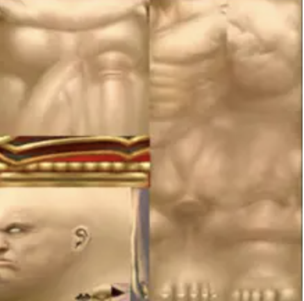 

第【2】讲中明确指出，学会站在巨人的肩膀，不过虽说用一些标准男身体贴图更方便，但比较抽象，对初学者也不太友好

 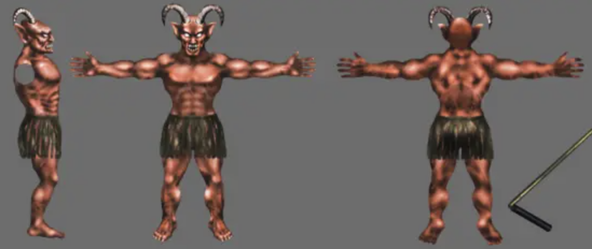

【8】因此为教学方便起见，我们用我这张邪神的贴图即可

【9】把它拖入ps中，放大镜可以调整比列大小方便操作。

 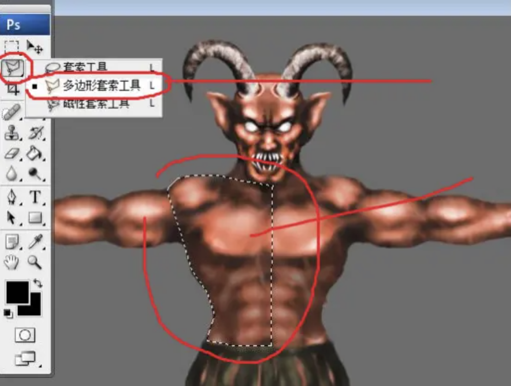

【10】而用这个多边形套索工具，配合鼠标右键就可以选择出需要的图片细节，也就是大家俗称的“抠图”【当然这个需要一定美术功底和熟练度】

 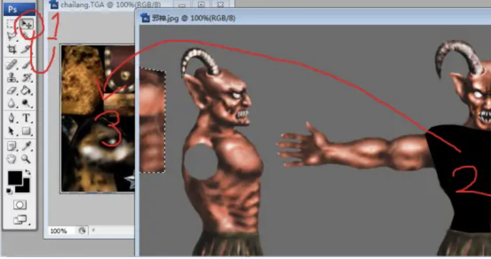

【11】好

1点击移动按钮

2拖拽被选取的区域

3拖进豺狼人贴图中

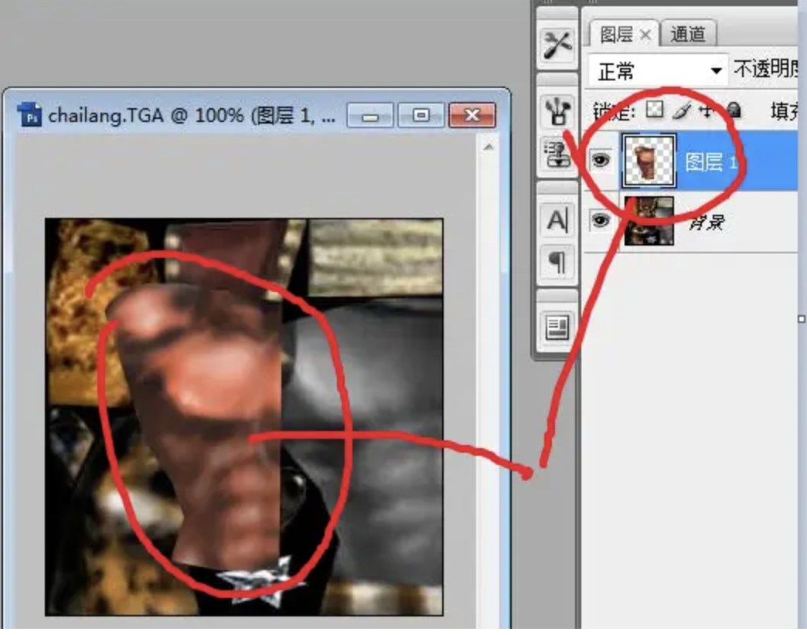

【12】这就算成功了

 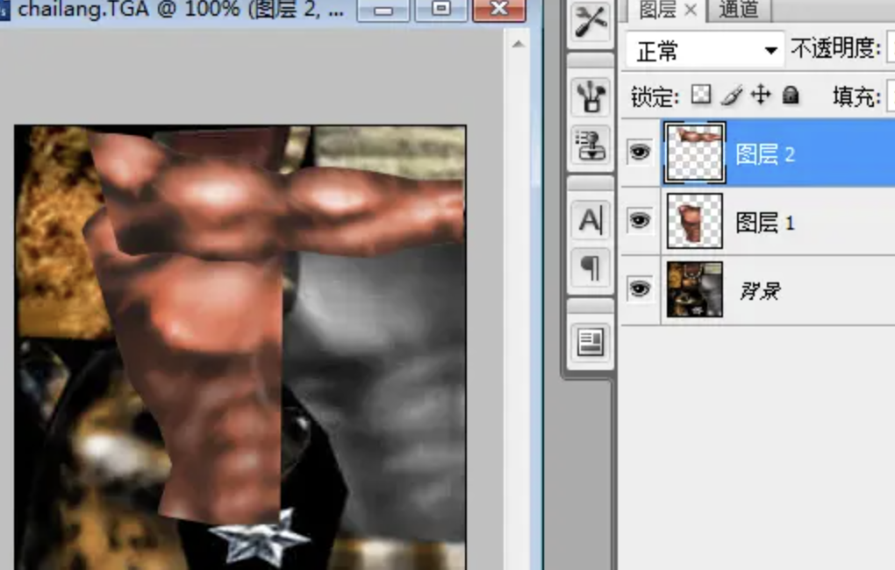

【13】同样方法 胳膊也给剪切出来了

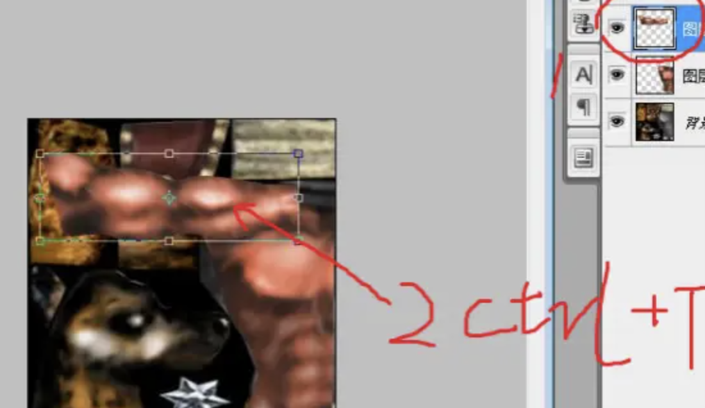 

【14】点击胳膊图层 ctrl+T旋转位置

 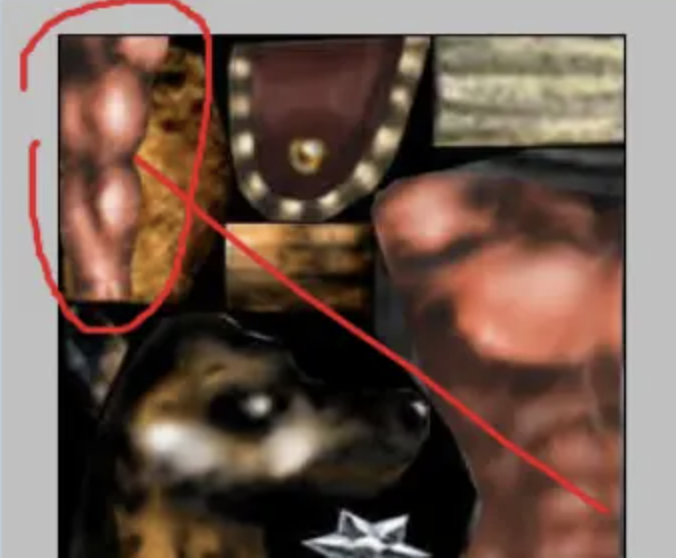

【15】并可以适当根据情况 放大缩小比列 最终调整到不遮挡其他有用贴图的位置，比如这里。

【16】点击图层2，Ctrl+E 

【17】把身体和胳膊合并成一个图层

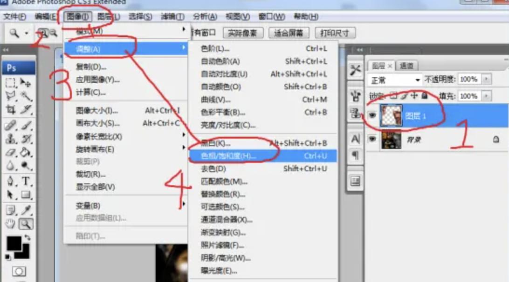

【18】在图层1的状态下，一次点击 图像-调整-色相饱和度

 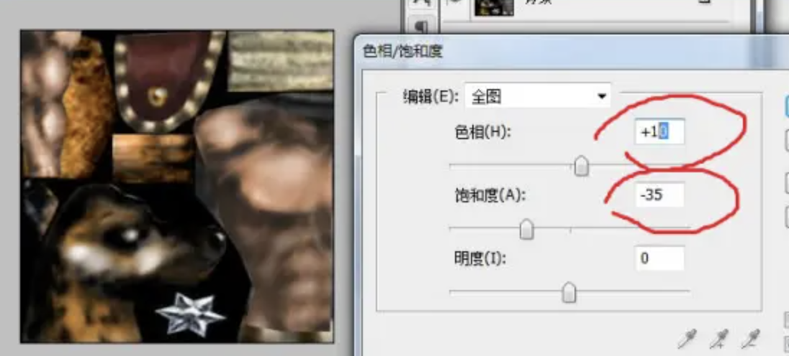

【19】色相+10点，保护度-35点，我们让身体看起来更像“正常人”

【20】好了之后存储为-TGA

【21】这个就是TGA

【22】特别注意，必须是32位，否则魔兽不识别

【23】回到 改图一条龙-模型观察器：文件转换，TGA转BLP 

【24】选是

【25】压缩品质默认85即可【如果嫌大可以适当缩小数值，一般情况下最小不要超过20，压缩的过小严重影响贴图品质】

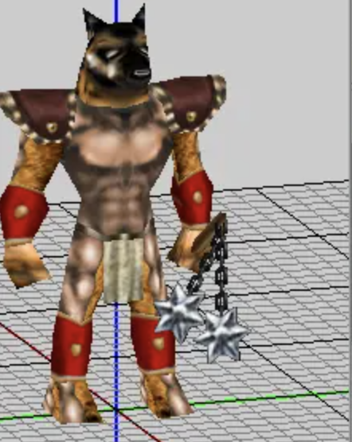 

【26】用螃蟹软件打开模型看看 是不是很多贴图都“错乱”了

【27】我看了下 主要就是1和3图层 所以我们之针对这2个图层进行调整即可【其实倒数移植的模型组都是如此，UV需要重新调整】

【28】首先我们全选中图层3中所有的顶点，然后点击UV编辑器，之前很多朋友不是总问什么叫UV么，现在黑旋风老师告诉你这个就是UV

 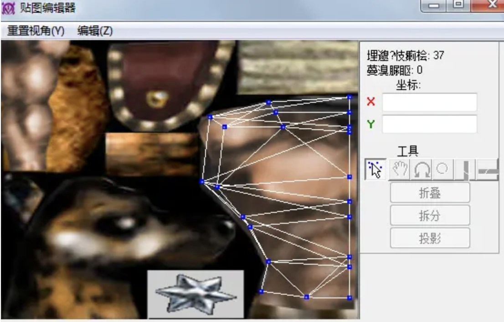

【29】大家可以看明白，这个豺狼人身体的uv布局很工整，完全可以直接调整比列和微细节就是成品了，但为教学展示，这里我教大家完整的展UV布局方法。

 

【30】首先确保在还没有点UV编辑器按钮之前，该模型组必须是正前视图模式

 

【31】然后点开UV编辑器按钮，第2步鼠标画方块全部选中所有的顶点，第2步点击【投影】按钮，这实际就等于 按照当前的视角展开UV了【当前视角为绝对正视图，正前方】

 

【32】如你所见，系统自动生成了正前方的区域形状，养成勤俭节约的好习惯，当初之所以只截取一半身体，就是为了省空间。

 

【33】先选取这部分的顶点，然后点击X轴镜像按钮【就是数字2的那个】

 

【34】然后点击手背移动按钮，把这些顶点移动到对应的另一边重叠即可

 

【35】对就像这样

 

【36】再点一次X轴镜像按钮调整下位置

 

【37】然后移动到身体贴图的正中间，按放大镜按钮调整大小【这个XY轴承可以自己慢慢尝试，输入同样大小的xy数值就可以保证比列不失调，大了就改小点，小了就再等比例增大】但出于教学和时间关系，黑旋风老师直接告诉大家：

 

【38】输入130也就是1.3倍，然后位置调整到这里大约就差不多了

 

【39】红叉，关闭uv模式

【40】预览下效果，很不错。

 

【41】同样方法 我们把图层1里的细节也调整下

 

【42】全选打开UV编辑器后发现有些复杂

 

【43】没关系，我们可以只选择部分，比如只选择胳膊模型组展UV

 

【44】这回简单了，一看就知道是胳膊，具体操作跟身体类似我就不细讲了，比如现在这样结构大体满意就可以直接开始调整，如果结构比较杂乱，就需要重新展次uv，然后放大缩小比列，旋转角度，修改形状，最终达到一种合适状态。

 

【45】最终调整成这样 大概就差不多

 

【46】大腿选择在这里

 

【47】手脚在这里

【48】最终的人皮肤色豺狼人就做好了，当然还存在一些瑕疵，我们下节课再调整。

PS别关闭，记得保存一个psd格式的图片，我们下节课会用到

记得保存成PSD格式
这节我们学会了自制简易贴图和修改uv布局，如果您感兴趣的话 ，请继续关注下一讲，在下一课当中我们会进一步学习如何调整贴图细节，以及简单的手绘贴图方法。 作者：黑旋风比蒙巨兽 https://www.bilibili.com/read/cv6738571/ 出处：bilibili