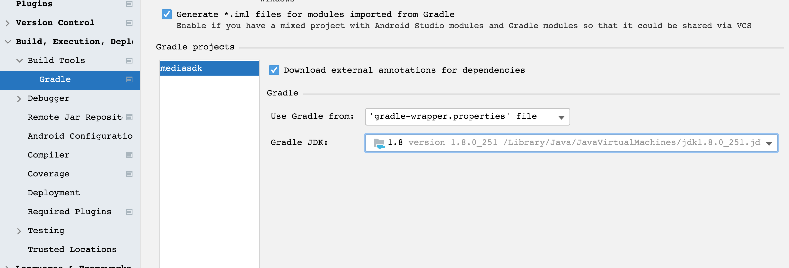

## java.lang.IllegalStateException: failed to analyze: java.lang.reflect.InvocationTargetException




## M1 Macbook跑ndk项目

**Unknown host CPU architecture: arm64**

https://stackoverflow.com/questions/69541831/unknown-host-cpu-architecture-arm64-android-ndk-siliconm1-apple-macbook-pro

Finder -> Go To Folder(/Users/mac/Library/Android/sdk/ndk/21.4.7075529) -> now edit **ndk-build** open it in text editor and paste below code script and re-run your project.


solved this issue:

Finder -> Go To Folder(/Users/mac/Library/Android/sdk/ndk/21.4.7075529) -> now edit **ndk-build** open it in text editor and paste below code script and re-run your project.

**from**

```
#!/bin/sh
DIR="$(cd "$(dirname "$0")" && pwd)"
$DIR/build/ndk-build "$@"
```

**to**

```
#!/bin/sh
DIR="$(cd "$(dirname "$0")" && pwd)"
arch -x86_64 /bin/bash $DIR/build/ndk-build "$@"
```