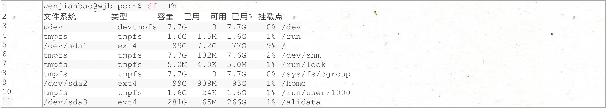

### **1. Java环境变量**

https://blog.csdn.net/zhanghuoding/article/details/42401381

**编辑/etc/profile，在最后加上如下3行：**

export JAVA_HOME=/usr/java/jdk1.8.0_65

export PATH=$JAVA_HOME/bin:$PATH

export CLASSPATH=$CLASSPATH:.:$JAVA_HOME/lib:$JAVA_HOME/jre/lib

**source /etc/profile**

### **2. 挂载分区**

https://www.cnblogs.com/52php/p/7638251.html

**如果删除和新建分区需要有gparted，如果被阉割了需要再安装**

**sudo apt-get install gparted**

硬盘是 500G，先前安装 Windows7 时，分了3个区，大小分别为 90G、100G、310G，现在用 Deepin 重装系统时，挂载情况如下：

/dev/sda1 分区作为 /（挂载点），类型为 ext4

/dev/sda2 分区作为 /home（挂载点），类型为 ext4

/dev/sda3 分区无挂载点，类型为 ext4

因为 /dev/sda3 还没有被挂载，也就用不了，，，挂载操作如下：

(1) 新建挂载目录 /alidata

| 1    | sudo mkdir /alidata |
| ---- | ------------------- |
|      |                     |

(2) 查看 /dev/sda3 分区的 UUID

| 1    | sudo blkid /dev/sda3 |
| ---- | -------------------- |
|      |                      |

结果如下：

| 1    | /dev/sda3: UUID="85182906-f43b-4b89-9f00-a67f86d39a36" TYPE="ext4" PARTUUID="a806b3e8-03" |
| ---- | ------------------------------------------------------------ |
|      |                                                              |

(3) 在文件 /etc/fstab 中，追加如下内容：

| 1    | UUID=85182906-f43b-4b89-9f00-a67f86d39a36 /alidata  ext4  defaults  0  2 |
| ---- | ------------------------------------------------------------ |
|      |                                                              |

其中第一列为 UUID， 第二列为挂载目录（该目录必须为空目录），第三列为文件系统类型，第四列为参数，第五列 0 表示不备份，最后一列必须为２或 0（除非引导分区为1）

使用命令mount -a看是否挂载成功，使用 ds -Th 看下磁盘使用详情：

ok，大功告成。

### **3. Git图形界面**