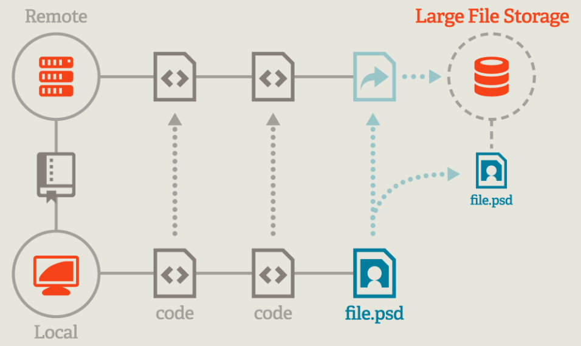

## Git上传大文件

突破GitHub的限制，使用 [git-lfs(Git Large File Storage)](https://git-lfs.github.com/) 支持单个文件超过100M

 

LFS 并不能像”变魔术一样”处理所有的大型数据：它需要记录并保存每一个变化。然而，这就把负担转移给了远程服务器 - 允许本地仓库保持相对的精简。

为了实现这个可能，LFS 耍了一个小把戏：它在本地仓库中并不保留所有的文件版本，而是仅根据需要提供检出版本中必需的文件。

但这引发了一个有意思的问题：如果这些庞大的文件本身没有出现在你的本地仓库中….改用什么来代替呢? LFS 保存轻量级指针中有真实的文件数据。当你用一个这样的指针去迁出一个修订版时，LFS 会很轻易地找到源文件（不在他上面可能就在服务器上，特殊缓存）然后你下载就行了。

因此，你最终只会得到你真正想要的文件 - 而不是一些你可能永远都不需要冗余数据。

```shell
# 1、安装git-lfs
brew install git-lfs

# 2、没有特别说明的情况下，LFS 不会处理大文件问题，因此，我们必须明确告诉 LFS 该处理哪些文件。将 FrameworkFold/XXXFramework/xxx的文件设置成大文件标示。
git lfs track "FrameworkFold/XXXFramework/xxx"

# 3、常规的push操作
git add .
git commit -m "add large file"
git push
```


## 冷门命令

*  git reset HEAD <fileName>   // 撤销add

* **git reset --soft HEAD^**	// 撤销commit

* git push --set-upstream origin 分支名 // 不提交代码，推送本地分支到远程仓库

* 从分支1拉出分支2，改动后想直接Push到分支2：

  git push origin branch2:branch1

* 批量删除分支： 

  比如删除名字带“cherry-pick”的所有分支: git branch | grep 'cherry-pick' | xargs git branch -D

  命令解析：

  * | 管道命令，用于将一串命令串联起来。前面命令的输出可以作为后面命令的输入。
  * git branch 用于列出本地所有分支
  * grep 搜索过滤命令。使用正则表达式搜索文本，并把匹配的行打印出来。
  * Xargs 参数传递命令。用于将标准输入作为命令的参数传给下一个命令。

​		
