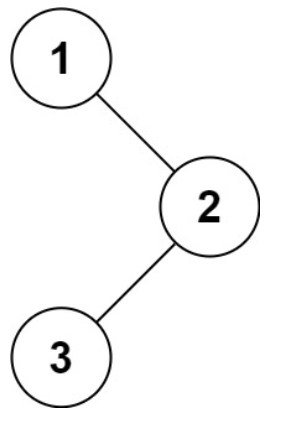

## 字符串相关

#### Java

public int length()

public String substring(int beginIndex, int endIndex)

public String substring(int beginIndex)

public native char charAt(int index)

public boolean isEmpty()


#### C++

size()

substr(int pos, int n) 截取s中从pos开始（包括0）的n个字符的子串，并返回

substr(pos)     截取s中从从pos开始（包括0）到末尾的所有字符的子串，并返回

at()

bool empty() const;


## 数组相关

#### Java

int arr[] = new int[] {1, 2, 3};

length	// <b>注意，没有()</b>


#### C++

 int arr[] = { 1,5,9,10,9,2 };

sizeof(arr) / sizeof (arr[0]);


## 容器相关

### 动态数组

#### Java

List<String> strs = new ArrayList<>();

boolean isEmpty();

for (String str: strs) {}	


#### C++

std::vector < std::string > strs;

std::vector<int> vec = {1,1,1,2,2,3};

std::vector<int> second (4,100);                       // 值为100的四个整数

vector<vector<int>> dp(m + 1, vector<int>(n + 1));	// 二维数组，相当于java的 

```java
int[][] dp = new int[ m + 1 ][ n + 1 ];
```


- **清空和交换**
  - `void clear(); 	// 移除所有元素，保持容量不变。
  - `void swap(vector& other); // 交换两个 `vector` 的内容。

* **大小和容量**

size_t size() const; // 返回当前元素数量。

`size_t capacity() const; // `返回当前分配的存储能力，不一定是当前元素数量。

void reserve(size_t new_cap);`//  请求将 `vector` 的容量至少扩展到 `new_cap

void resize(size_t count);`	// 调整 `vector 的大小，超出部分会被默认初始化。

bool empty() const _NOEXCEPT  {return this->__begin_ == this->__end_;}

* 遍历

for (size_t i = 0; i < vec.size(); ++i) {}	// **使用索引访问**：

for (const auto& value : vec) {}	// **使用范围 `for` 循环（C++11引入）**：

for (auto it = vec.begin(); it != vec.end(); ++it) {}	// **使用迭代器**：

std::for_each(vec.begin(), vec.end(), [] (const int& value) {}	// **使用标准算法（如 `std::for_each`）**：

* 删除元素

​		`iterator erase(iterator pos);`：移除指定位置的元素，并返回指向被移除元素之后的下一个元素的迭代器。

移除元素后，其后面的元素会被前移，以保持元素的连续性，这可能会导致性能开销（特别是在大 `vector` 中）。

​		`void pop_back();`：移除 `vector` 的最后一个元素。

* **添加元素**

​		void push_back(const T& value);  	// 在 `vector` 的末尾添加一个元素 `value`，并调整容量（如果需要）。

​		void emplace_back(T&& value);	// 在 `vector` 的末尾原地构造一个元素（通过传递参数），这可以避免不必要的拷贝或移动，性能更优。

​	**`	push_back`**:

​		通过拷贝或移动构造函数将元素插入末尾。

​		需要创建临时对象（如果传入的是临时对象）。

​	**`emplace_back`**:

​		直接在 `vector` 的末尾原地构造元素，接受构造参数。

​		避免了不必要的复制或移动，性能通常更好。

如果将一个 `std::vector` 的内容插入到另一个 `std::vector`。可以使用insert。比如二叉树中序遍历代码如下：



输入：root = [1,null,2,3]
输出：[1,3,2]

```c++
vector<int> inorderTraversal(TreeNode* root) {
  vector<int> ret;
  if (nullptr == root) {
    return ret;
  }

  vector<int> left = inorderTraversal(root->left);
  ret.insert(ret.end(), left.begin(), left.end());

  ret.push_back(root->val);

  vector<int> right = inorderTraversal(root->right);
  ret.insert(ret.end(), right.begin(), right.end());

  return ret;
}
```

将一个 `std::vector<int>` 从中间分成两个 `std::vector<int>`。可以如下：

```c++
// 初始化一个 std::vector<int>
std::vector<int> original = {1, 2, 3, 4, 5, 6, 7, 8, 9};

// 计算中间索引
size_t mid = original.size() / 2;

// 创建两个新的 std::vector<int>
// 第一个子 vector (first_half) 从原始 vector 的 begin() 到中间元素之前的元素。
std::vector<int> first_half(original.begin(), original.begin() + mid);
// 第二个子 vector (second_half) 从中间元素开始到原始 vector 的 end()。
std::vector<int> second_half(original.begin() + mid, original.end());
```

比如实现[将有序数组转换为二叉搜索树](https://leetcode.cn/problems/convert-sorted-array-to-binary-search-tree/)

给你一个整数数组 `nums` ，其中元素已经按 **升序** 排列，请你将其转换为一棵 平衡 二叉搜索树。

**示例 1：**


```
输入：nums = [-10,-3,0,5,9]
输出：[0,-3,9,-10,null,5]
解释：[0,-10,5,null,-3,null,9] 也将被视为正确答案：
```

题解：

```c++
/**
 * Definition for a binary tree node.
 * struct TreeNode {
 *     int val;
 *     TreeNode *left;
 *     TreeNode *right;
 *     TreeNode() : val(0), left(nullptr), right(nullptr) {}
 *     TreeNode(int x) : val(x), left(nullptr), right(nullptr) {}
 *     TreeNode(int x, TreeNode *left, TreeNode *right) : val(x), left(left), right(right) {}
 * };
 */
class Solution {
public:
    TreeNode* sortedArrayToBST(vector<int>& nums) {
        if (nums.empty()) {
            return nullptr;
        }

        int mid = nums.size() / 2;
        TreeNode* ret = new TreeNode(nums[mid]);

        vector<int> left_nums(nums.begin(), nums.begin() + mid);
        ret->left = sortedArrayToBST(left_nums);

        vector<int> right_nums(nums.begin() + mid + 1, nums.end());
        ret->right = sortedArrayToBST(right_nums);

        return ret;
    }
};
```


### 哈希表（K-V）

#### Java

Map<String, String> kv = new HashMap<>();

SparseArray<String> kv = new SparseArray<>();	// 基于二分查找，key只能是int

boolean containsKey(Object key);	// ArrayMap也是这个

如果是SparseArray，对应的是contains(int key);


// **1. 使用 Iterator 遍历 HashMap EntrySet**

Iterator < Entry < String, String >> iterator = kv.entrySet().iterator();
while (iterator.hasNext()) {
            Entry < String, String > entry = iterator.next();
}

// **2. 使用 Iterator 遍历 HashMap KeySet**

Iterator < String > iterator = coursesMap.keySet().iterator();
while (iterator.hasNext()) {
            Integer key = iterator.next();
            System.out.println(key);
            System.out.println(coursesMap.get(key));
}

// **3. 使用 For-each 循环遍历 HashMap**

for (Map.Entry < String, String > entry: kv.entrySet()) {
            System.out.println(entry.getKey());
            System.out.println(entry.getValue());
}

// **4. 使用 Lambda 表达式遍历 HashMap**

kv.forEach((key, value) -> {
            System.out.println(key);
            System.out.println(value);
});


#### C++

std::map<int, std::string> test_map = {{1, "one"}, {2, "two"}, {3, "three"}};	// 基于红黑树

std::unordered_map<std::string, std::shared_ptr<TestStruct>> pool;	// 基于Hash表

没有containsKey接口，需要用find查找

```c++
std::map<int, std::string> myMap = {{1, "one"}, {2, "two"}, {3, "three"}};
if (myMap.find(2) != myMap.end()) {
    // key 2 exists in the map
}

std::unordered_map<int, std::string> myUnorderedMap = {{1, "one"}, {2, "two"}, {3, "three"}};
if (myUnorderedMap.find(2) != myUnorderedMap.end()) {
    // key 2 exists in the unordered_map
}
```

也可以用**`operator[]`**。但对于 `std::unordered_map` 和 `std::map`，直接使用 `operator[]` 访问不存在的键时，会插入该键。为了避免这种行为，注意使用 `count()` 方法：

if (myMap.count(2) > 0) {    // key 2 exists in the map }


\- 迭代时，由于 `std::map` 是有序的，因此你可以假设遍历的顺序是根据键的升序。 

\- 如果在遍历期间修改 `std::map` 的内容（如插入或删除元素），则需特别小心，可能会导致未定义行为，尤其是在进行删除操作时。 

for (const auto& [key, value] : test_map) {}	// 1. 使用范围 `for` 循环：

for (auto it = test_map.begin(); it != test_map.end(); ++it) {}	//  2. 使用迭代器：

std::unordered_map遍历方式一样，\- 因为元素的顺序是不确定的，因此遍历时不能依赖于任何特定的顺序。 - 同样地，在遍历期间修改 `std::unordered_map` 的内容（插入或删除元素）也需小心，可能会导致迭代器失效。 

**使用 const 修饰符**： - 如果你在遍历时不打算修改容器的元素，请使用 `const auto&` 进行绑定，以避免不必要的复制。


### 哈希表（K）

#### Java

HashSet， 通过add , remove,clear方法增删

Set<String> set = new HashSet<>();

boolean contains(Object o);

int size();

isEmpty();

```java
// 使用迭代器遍历
Set<String> colors = new HashSet<>(Arrays.asList("红色", "绿色", "蓝色"));
Iterator<String> iterator = colors.iterator();
while (iterator.hasNext()) {
    String color = iterator.next();
    System.out.println(color);
}

// 使用增强型 for 循环遍历
Set<Integer> numbers = new HashSet<>(Arrays.asList(1, 2, 3, 4, 5));
for (int number : numbers) {
    System.out.println(number);
}

// 使用 Lambda 表达式遍历
Set<String> colors = new HashSet<>(Arrays.asList("红色", "绿色", "蓝色"));
colors.forEach(color -> {
    System.out.println(color); // 分别输出每个颜色
});

// 转换为数组
Set<String> colors = new HashSet<>(Arrays.asList("红色", "绿色", "蓝色"));
String[] colorArray = colors.toArray(new String[0]);
```


#### C++

std::set	// 基于红黑树

std::unordered_set	// 基于哈希表，只有key

都通过insert、emplace操作。

erase()

find()

count()	// 当key已经存在，则unordered_set_test.count(key) > 0

比如判断链表是否有环，除了常见的快慢指针做法，还可以用：

```c++
bool hasCycleByHashMap(ListNode *head) {
  std::unordered_set<ListNode*> saved_nodes;
  while (nullptr != head) {
    if (saved_nodes.count(head) > 0) {
      return true;
    }
    saved_nodes.insert(head);

    head = head->next;
  }

  return false;
}
```


std::set 的遍历方式

1. **使用范围 `for` 循环（C++11及以上）**：

   ```c++
   std::set<std::string> mySet = {"One", "Two", "Three"};
   for (const auto& s : mySet) {
       std::cout << s << std::endl;
   }
   ```

2. **使用迭代器**：

   ```c++
   std::set<std::string>::iterator it;
   for (it = mySet.begin(); it != mySet.end(); ++it) {
       std::cout << *it << std::endl;
   }
   ```

3. **使用标准算法（如 `std::for_each`）**：

   ```c++
   std::for_each(mySet.begin(), mySet.end(), [](const std::string& s) {
       std::cout << s << std::endl;
   });
   ```


### (双向)链表

#### Java

LinkedList

```java
LinkedList<String> linkedList = new LinkedList<>();
linkedList.add("One");
linkedList.add("Two");
linkedList.add("Three");

// 使用增强型 for 循环遍历
for (String s : linkedList) {
    System.out.println(s);
}

// 使用迭代器遍历
Iterator<String> iterator = linkedList.iterator();
while (iterator.hasNext()) {
    System.out.println(iterator.next());
}
```


#### C++

std::list

```c++
std::list<std::string> myList = {"One", "Two", "Three"};

// 使用范围 for 循环
for (const auto& s : myList) {
    std::cout << s << std::endl;
}

// 使用迭代器遍历
for (auto it = myList.begin(); it != myList.end(); ++it) {
    std::cout << *it << std::endl;
}
```


### 队列

#### Java

LinkedList实现，`offer`, `poll`, `peek` 方法来进行队列操作

ArrayDeque实现

```java
// public interface Queue<E> extends Collection<E> {
Queue<String> queue = new LinkedList<>();
queue.offer("One");				// Adds the specified element as the tail (last element) of this list.
queue.offerFirst("Two");	// Inserts the specified element at the front of this list.
queue.offerLast("Three");	// Inserts the specified element at the end of this list.

// 使用增强型 for 循环遍历
for (String s : queue) {
    System.out.println(s);
}

// 使用迭代器遍历
Iterator<String> iterator = queue.iterator();
while (iterator.hasNext()) {
    System.out.println(iterator.next());
}
```


#### C++

std::queue

std::deque

提供了 `push`, `pop`, `front`, `back` 方法进行队列操作

- 注意：`std::queue` 本身不支持迭代器遍历，必须通过 `std::deque` 或 `std::list` 来实现。

```c++
std::queue<std::string> myQueue;
myQueue.push("One");
myQueue.push("Two");
myQueue.push("Three");

// 遍历队列需用到std::deque
std::deque<std::string> tempQueue;
while (!myQueue.empty()) {
    tempQueue.push_back(myQueue.front());
    myQueue.pop();
}
for (const auto& s : tempQueue) {
    std::cout << s << std::endl;
}
```


