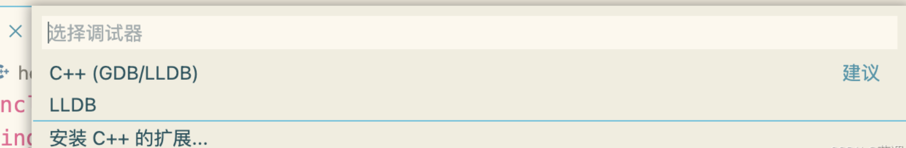

https://blog.csdn.net/lihuanyi1530/article/details/126875558

Macbook m1使用vsCode调试C++
下载安装vsCode和Clang
话不多说，直接进入正题，下面给出vsCode官方网址，大家下载安装即可。安装后可按提示安装Chinese插件。

https://code.visualstudio.com/
打开mac的终端，iterm也可，输入clang --version，查看是否安装clang编译器，若已安装，则进行下一步。

否则在终端中输入xcode-select --install，按照提示进行安装即可。


### 安装插件

1、C/C++

安装插件时会自行安装以下插件

2、CodeLLDB

安装LLDB时，会弹出Acquiring CodeLLDB platform package，可能会下载速度很慢进而提示使用vsix下载，我们直接选择手动下载安装，在下面网址选择[codelldb-aarch64-darwin.vsix](https://github.com/vadimcn/vscode-lldb/releases/download/v1.7.4/codelldb-aarch64-darwin.vsix)安装即可。

https://github.com/vadimcn/vscode-lldb/releases

从扩展中点击从VSIX安装。


### 配置环境

1、创建一个hello.cpp文件，随便写点代码进行测试。

2、点击终端->配置默认生成任务->C/C++ clang++，生成一个task.json文件，我们不做修改。

```json
{
	"version": "2.0.0",
	"tasks": [
		{
			"type": "cppbuild",
			"label": "C/C++: clang++ 生成活动文件",
			"command": "/usr/bin/clang++",
			"args": [
				"-fcolor-diagnostics",
				"-fansi-escape-codes",
				"-g",
				"${file}",
				"-o",
				"${fileDirname}/${fileBasenameNoExtension}"
			],
			"options": {
				"cwd": "${fileDirname}"
			},
			"problemMatcher": [
				"$gcc"
			],
			"group": {
				"kind": "build",
				"isDefault": true
			},
			"detail": "编译器: /usr/bin/clang++"
		}
	]
}

```

3、使用快捷键shift+command+p调出C/C++:编辑配置（json），此时会自动生成一个c_cpp_properties.json文件，同样不需要做修改。

```json
{
    "configurations": [
        {
            "name": "Mac",
            "includePath": [
                "${workspaceFolder}/**"
            ],
            "defines": [],
            "macFrameworkPath": [
                "/Library/Developer/CommandLineTools/SDKs/MacOSX.sdk/System/Library/Frameworks"
            ],
            "compilerPath": "/usr/bin/clang",
            "cStandard": "c17",
            "cppStandard": "c++17",
            "intelliSenseMode": "macos-clang-arm64"
        }
    ],
    "version": 4
}
```

4、在hello.cpp窗口，点击运行->添加配置->LLDB。



此时会生成一个launch.json文件，我们修改如下。

```json
{
    // 使用 IntelliSense 了解相关属性。 
    // 悬停以查看现有属性的描述。
    // 欲了解更多信息，请访问: https://go.microsoft.com/fwlink/?linkid=830387
    "version": "0.2.0",
    "configurations": [
        {
            "type": "lldb",
            "request": "launch",
            "name": "Debug",
            "program": "${fileDirname}/${fileBasenameNoExtension}",
            "args": [],
            "console": "integratedTerminal",
            "cwd": "${workspaceFolder}",
            "preLaunchTask": "C/C++: clang++ 生成活动文件"
        }
    ]
}
```

如果想调用外部终端进行输出，可在设置里搜索terminal external，将以下两项修改为external即可。


