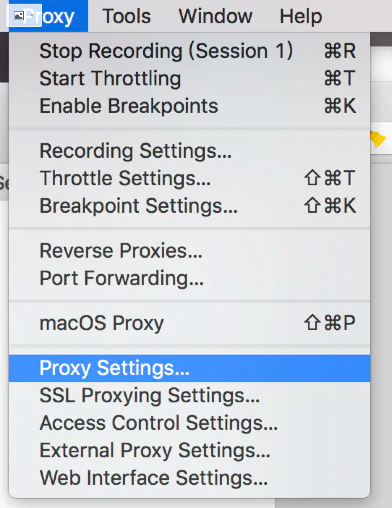
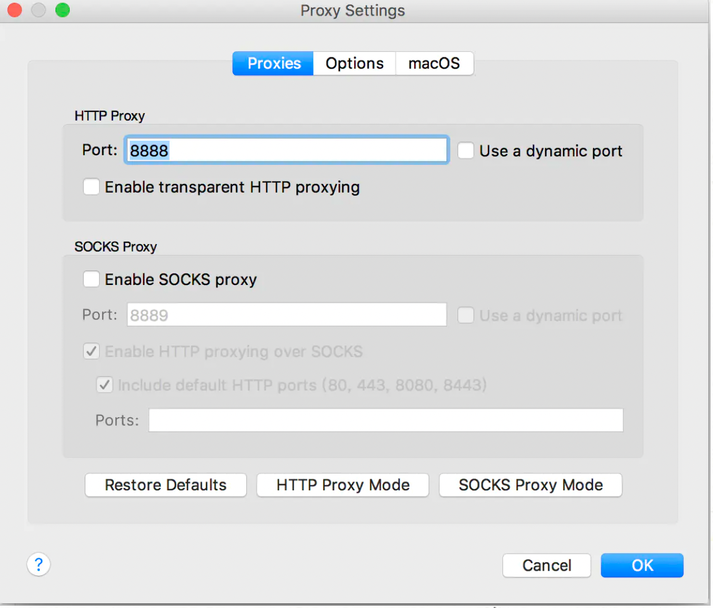
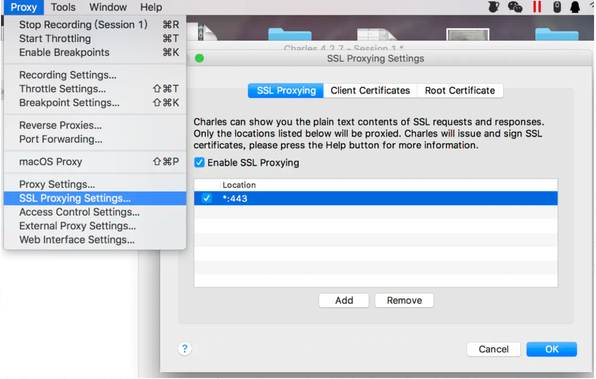
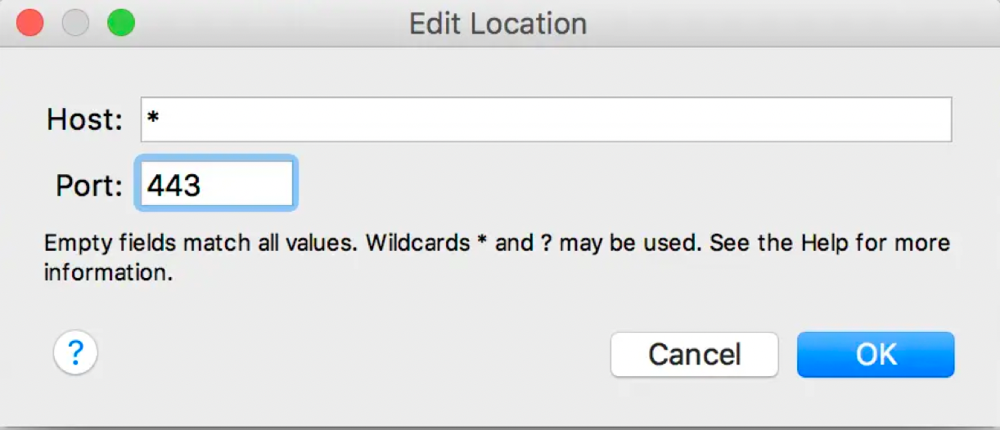
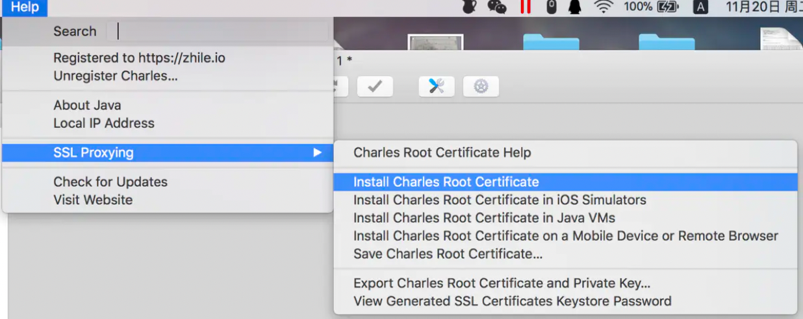
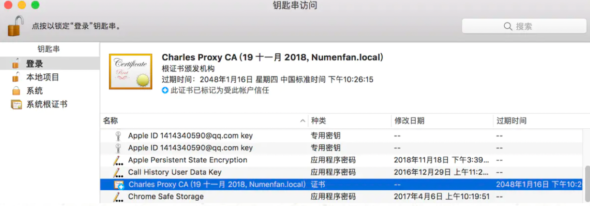
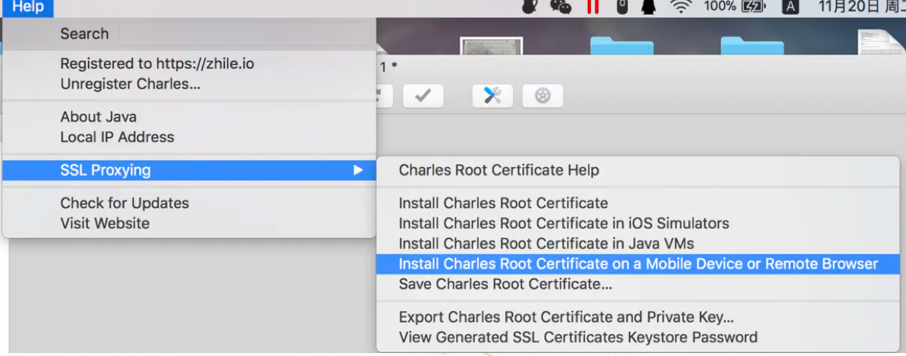
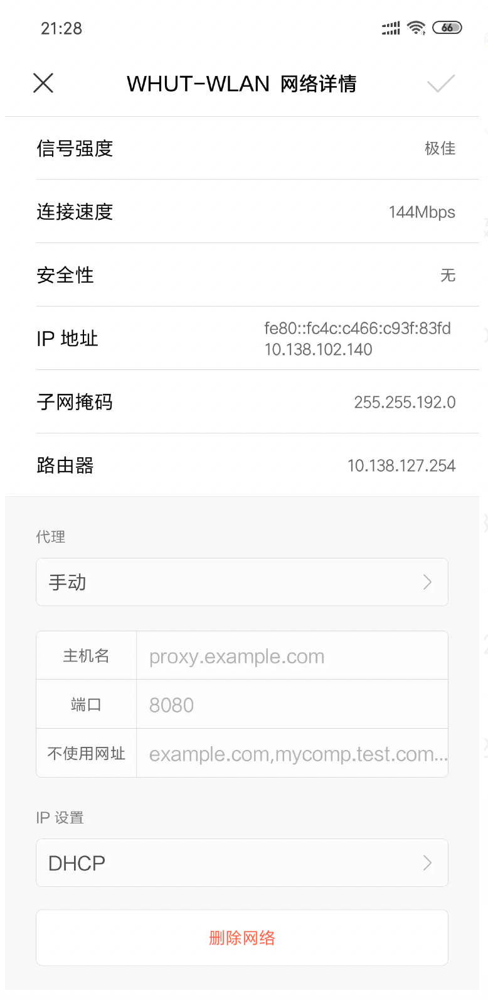

## Charles配置

#### 1. HTTP Proxy

 

 

系统使用的端口是8888，通常不需要修改，当然也可以自己进行修改。

#### 2. SSL Proxy

一开始是没有任何项的，这里点击Add。

 

host输入*, Port输入443。

#### 3. HTTPS配置证书

上面的操作以及可以抓一些http请求的包，但是现在很多请求都是https，因此需要安装相应证书，如下图：

 

随后可以看到下图：

 

这里需要信任Charles Proxy CA，我这里选择的是始终信任。

接下来需要为我们的移动端申请一个证书，如下图

 

到这里，电脑端的配置就全部结束了。接下来看移动端的配置

#### 4. 移动端配置

需要注意的是，移动端需要和pc端需要处于同一局域网内。

打开手机的wifi设置，点开已连接的Wi-Fi，设置代理为手动，主机名填pc端的ip，mac下用ifconfig查询，windows用ipconfig查询，端口号填8888(自己之前设置的端口)。

 

然后用手机浏览器在地址栏输入chls.pro/ssl，它会提示下载一个证书，下载完毕后安装就可以。

我用的小米手机自带的浏览器下载的证书，是无法安装的，貌似小米手机都不行，网上各种说法，最后我下载了个234浏览器下载后安装成功。

使用完毕后记得把代理改回来，不然会上不了网的！

有些手机，可以把.pem格式改成.crt格式就可以直接安装。或者从设置找到入口安装。