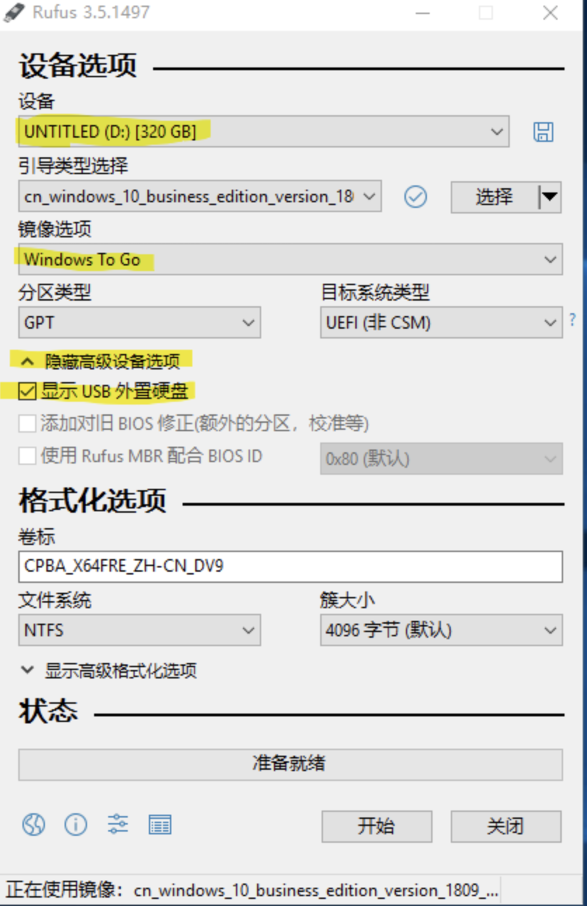
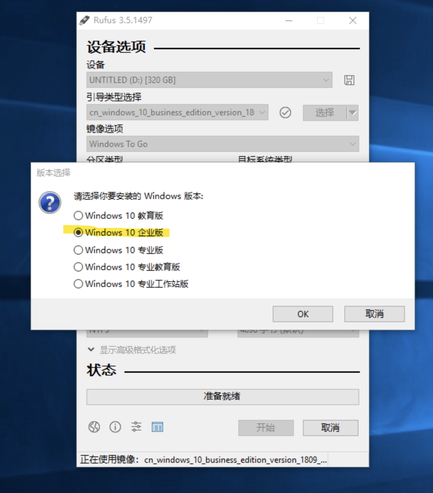
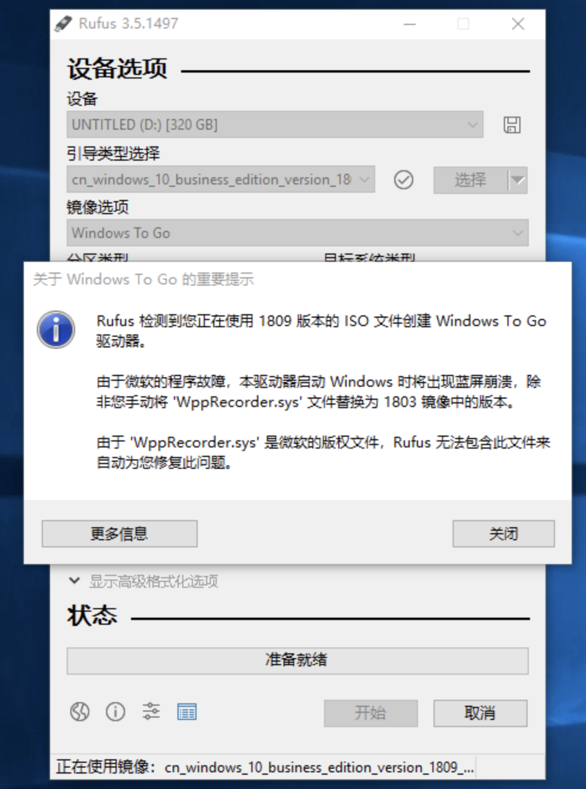
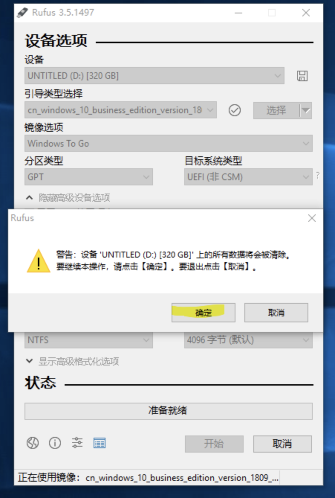
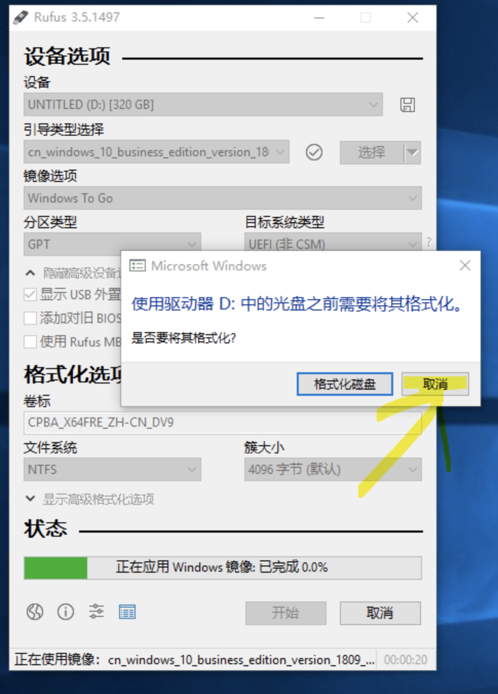
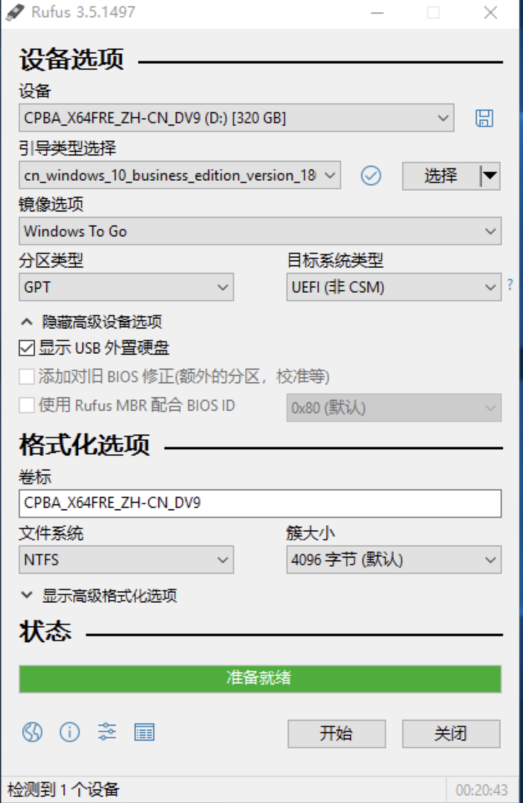
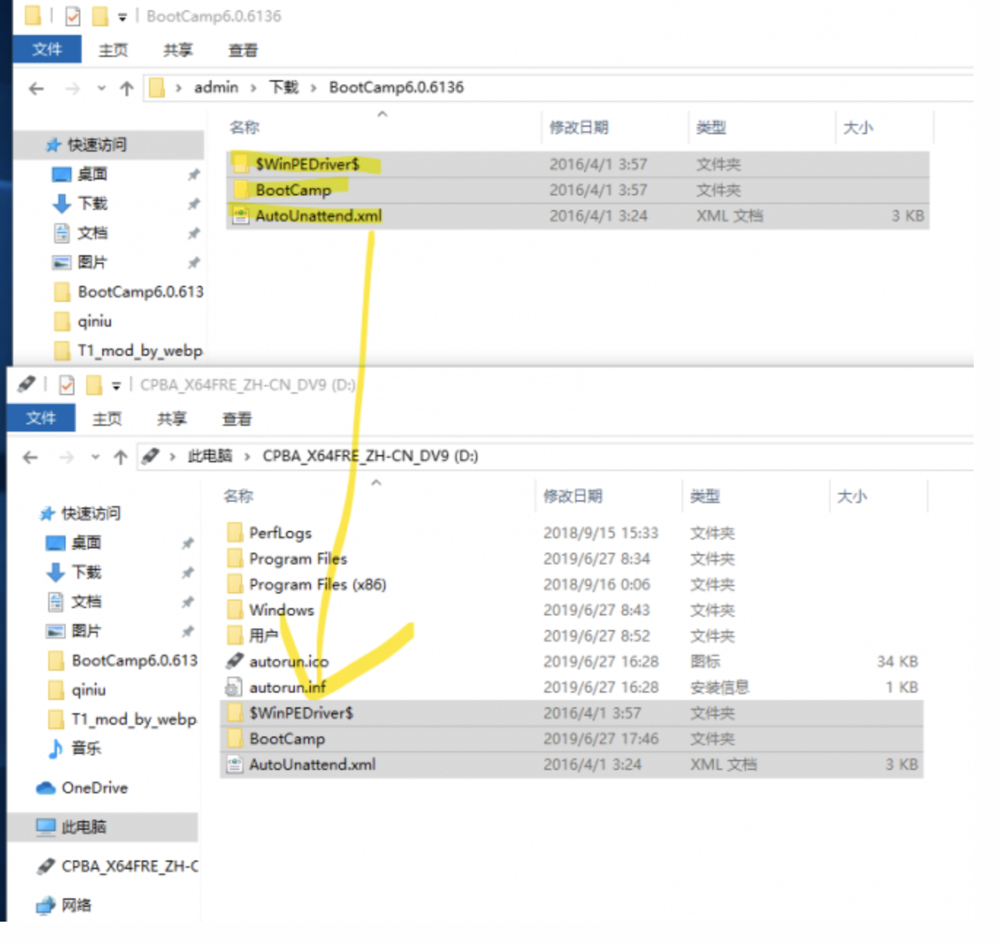
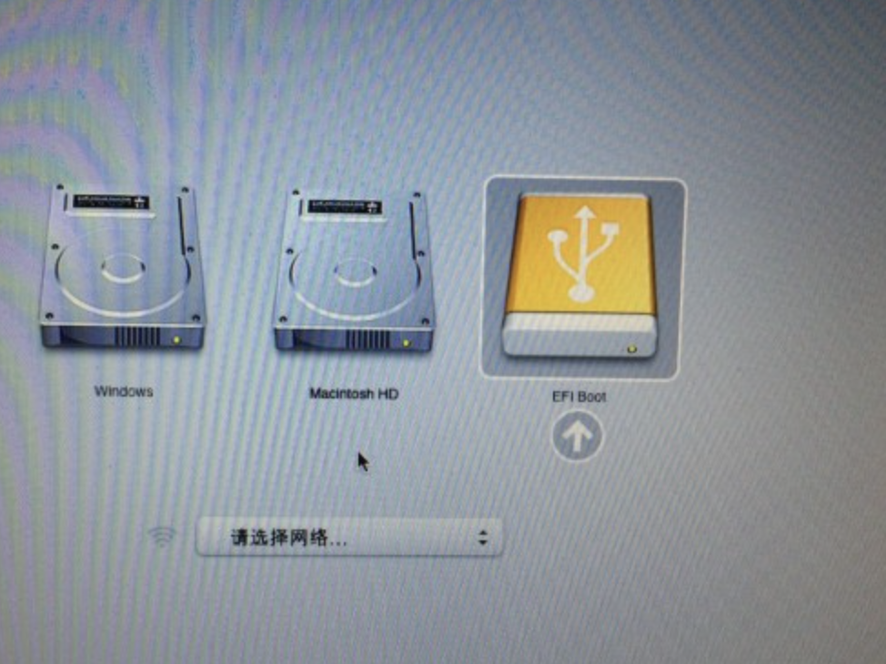
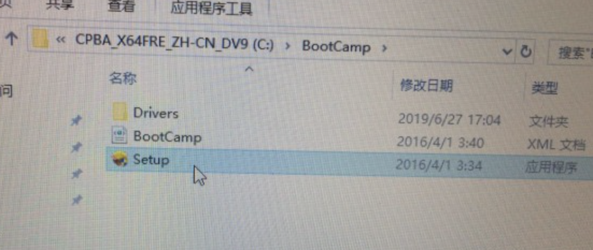

Windows To Go可以将 Windows 8/10完整安装到U盘、移动硬盘等便携设备上，让系统可以随身携带. 简单说来，这功能就是制作"在U盘上运行完整的 Windows系统". 而且这么方便的功能同时也支持Mac苹果电脑.

下面说说如何在Mac上使用 Windows To Go 把Windows 10系统安装到移动硬盘或U盘上.

首先你需要准备下面的设备
1, 一台2012年款以后的苹果电脑(太老的不支持Windows 10)
2, 可以运行Windows系统的电脑(可以是苹果电脑, 也可以PC, 甚至虚拟机)
3, 一个32G或以上的移动硬盘或者U盘, 强烈建议使用USB 3.0/3.1的移动SSD硬盘
4, Windows 10系统镜像
5, Rufus 一款Windows/Linux系统启动U盘制作工具
6, 苹果电脑对应的BootCamp驱动, 请在这里下载
https://www.applex.net/pages/bootcamp/

相关下载链接
Windows 10系统镜像

> 文件名: cn_windows_10_business_edition_version_1903_updated_june_2019_x64_dvd_830837d9.iso
>
> SHA1: ff547868bc224d41b61517119008caa869a78a8f
>
> 文件大小: 4.69GB
>
> 发布时间: 2019-06-19
>
> > ed2k://|file|cn_windows_10_business_edition_version_1903_updated_june_2019_x64_dvd_830837d9.iso|5032351744|DFF5FF3B87D209D16ECE7543255FA573|/
>
> 另外再提供老两个版本, 如果安装失败, 可以换个版本试试
>
> > ed2k://|file|cn_windows_10_business_editions_version_1809_updated_march_2019_x64_dvd_0f05144b.iso|5268158464|1188AC05C1E0FC792FFB57F39F6A5FF3|/
>
> > ed2k://|file|cn_windows_10_multiple_editions_version_1511_updated_feb_2016_x64_dvd_8380088.iso|4622118912|3824041FCDFCA670F4BCDAD827C4B63C|/

Rufus 下载地址
https://www.applex.net/downloads/rufus-3-5-windowsu.971/

BootCamp驱动(Windows系统驱动)
https://www.applex.net/pages/bootcamp/

准备开始吧
1, 先在Windows电脑上插入移动硬盘, 运行Rufus, 如果没有识别到移动硬盘请点击显示高级设备选型, 选择上显示USB外置硬盘. 选选择好镜像之前下载的Windows 10镜像. 镜像选项请选择Windows To Go, 其他默认, 可以参考本截图.

必须选择企业版

提示这个, 但我没有替换也正常安装, 不知道是不是现在的Win 10新版本已经修复这个问题了

如果这个时候提示这个请点取消, 要不然又要全部重新来过了.

制作完成后把之前下载对应的BootCamp驱动解压后放到移动硬盘的跟目录下

> 一般来说BootCamp驱动包括
> $WinPEDriver$
> BootCamp
> AutoUnattend.xml

> BootCamp驱动复制完成后就可以拔掉移动硬盘，然后去插入到苹果电脑上安装了.

然后再把移动硬盘插入到Mac电脑上, 按住Option不放, 启动Mac电脑, 选择最右边的图标(名称一般为EFI Boot)回车进去. 然后Windows系统会进行一些基本初始化设置, 这里可以根据自己的需求来自定义设定, 有些页面我就跳过了.

需要注意的是: 设置的时候有可能会Mac电脑自动重启, 若重启后没有进入正确的Windows系统,
那么请参考上面按住Option不放, 重启电脑, 选择最右边的EFI Boot进去.

进入Windows系统桌面后首先先安装BootCamp驱动
/BootCamp/Setup.exe

> 安装完成后重启电脑就好了.
>
> 至于Windows 系统激活就自己在网上搜索一下了啊
>
> 如果需要一些其他的Windows 10系统镜像可以在这里下载
> http://msdn.itellyou.cn/

Boot Camp列表-苹果电脑Windows驱动下载--支持百度网盘/独立服务器/迅雷地址下载

苹果电脑型号和年份可以在关于本机查询，也可以登录Apple官方网站输入Serial No.(序列号)查询

查询地址: https://checkcoverage.apple.com/cn/zh/

提示:什么A1278,A1466,A1502等这样的不是真正型号，只是外壳模具号码而已

| 电脑型号                             | Win 10 64位                                                  | Win 8/8.1 64位                                               | Win 7 64位                                                   | Win 7 32位                                                   | Win XP 32位                                   | Win安装方式 |
| ------------------------------------ | ------------------------------------------------------------ | ------------------------------------------------------------ | ------------------------------------------------------------ | ------------------------------------------------------------ | --------------------------------------------- | ----------- |
| MacBook Pro 13寸 2020年 M1           | N/A                                                          | -                                                            | -                                                            | -                                                            | -                                             | 不支持      |
| MacBook Pro 13寸 2020年初 4端口      | [6.1.7931](https://www.applex.net/threads/94156/)            | -                                                            | -                                                            | -                                                            | -                                             | ISO         |
| MacBook Pro 13寸 2020年初 2端口      | [6.1.7931](https://www.applex.net/threads/94156/)            | -                                                            | -                                                            | -                                                            | -                                             | ISO         |
| MacBook Pro 16寸 2019年末            | [6.1.7748](https://www.applex.net/threads/93793/)            | -                                                            | -                                                            | -                                                            | -                                             | ISO         |
| MacBook Pro 13寸 2019年中期 2端口    | [6.1.7577](https://www.applex.net/threads/93338/)            | -                                                            | -                                                            | -                                                            | -                                             | ISO         |
| MacBook Pro 15寸 2019年中期          | [6.1.7071](https://www.applex.net/threads/90861/)            | -                                                            | -                                                            | -                                                            | -                                             | ISO         |
| MacBook Pro 13寸 2019年中期 4端口    | [6.1.7071](https://www.applex.net/threads/90861/)            | -                                                            | -                                                            | -                                                            | -                                             | ISO         |
| MacBook Pro 15寸 带触控条 2018年中期 | [6.1.7071](https://www.applex.net/threads/90861/)            | -                                                            | -                                                            | -                                                            | -                                             | ISO         |
| MacBook Pro 13寸 带触控条 2018年中期 | [6.1.7071](https://www.applex.net/threads/90861/)            | -                                                            | -                                                            | -                                                            | -                                             | ISO         |
| **MacBook Pro 15寸 有触控条 2017年** | [6.1.6851](http://www.applex.net/threads/201715-macbook-pro-bootcamp6-1-6851.78135/) | -                                                            | -                                                            | -                                                            | -                                             | ISO         |
| MacBook Pro 13寸 有触控条 2017年     | [6.1.6813](http://www.applex.net/threads/2017macbook-pro-bootcamp-win-10.78134/) | -                                                            | -                                                            | -                                                            | -                                             | ISO         |
| MacBook Pro 13寸 无触控条 2017年     | [6.1.6813](http://www.applex.net/threads/2017macbook-pro-bootcamp-win-10.78134/) | -                                                            | -                                                            | -                                                            | -                                             | ISO         |
| MacBook Pro 15寸 2016年末            | [6.1.6655](http://www.applex.net/threads/76909/)             | -                                                            | -                                                            | -                                                            | -                                             | ISO         |
| MacBook Pro 13寸 2016年末 有触控条   | [6.1.6660](http://www.applex.net/threads/76758/)             | -                                                            | -                                                            | -                                                            | -                                             | ISO         |
| MacBook Pro 13寸 2016年末 无触控条   | [6.1.6660](http://www.applex.net/threads/76758/)             | -                                                            | -                                                            | -                                                            | -                                             | ISO         |
| MacBook Pro 15寸 2015年中            | [6.0.6136](http://www.applex.net/threads/60617/)             | [6.0.6136](http://www.applex.net/threads/60617/)             | -                                                            | -                                                            | -                                             | ISO         |
| MacBook Pro 13寸 2015年初            | [6.0.6136](http://www.applex.net/threads/60617/)             | [6.0.6136](http://www.applex.net/threads/60617/)             | -                                                            | -                                                            | -                                             | ISO         |
| MacBook Pro 13/15寸 2014年中         | [6.0.6136](http://www.applex.net/threads/60617/)             | [5.1.5640](http://support.apple.com/downloads/DL1721/zh_CN/BootCamp5.1.5640.zip) | [5.1.5640](http://support.apple.com/downloads/DL1721/zh_CN/BootCamp5.1.5640.zip) | -                                                            | -                                             | U盘         |
| MacBook Pro 13/15寸 2013年末         | [6.0.6136](http://www.applex.net/threads/60617/)             | [5.1.5640](http://support.apple.com/downloads/DL1721/zh_CN/BootCamp5.1.5640.zip) | [5.1.5640](http://support.apple.com/downloads/DL1721/zh_CN/BootCamp5.1.5640.zip) | -                                                            | -                                             | U盘         |
| MacBook Pro 13/15寸 2013年初         | [6.0.6136](http://www.applex.net/threads/60617/)             | [5.1.5621](http://support.apple.com/downloads/DL1720/zh_CN/BootCamp5.1.5621.zip) | [5.1.5621](http://support.apple.com/downloads/DL1720/zh_CN/BootCamp5.1.5621.zip) | -                                                            | -                                             | U盘         |
| MacBook Pro 13寸 2012年末            | [6.0.6136](http://www.applex.net/threads/60617/)             | [5.1.5621](http://support.apple.com/downloads/DL1720/zh_CN/BootCamp5.1.5621.zip) | [5.1.5621](http://support.apple.com/downloads/DL1720/zh_CN/BootCamp5.1.5621.zip) | -                                                            | -                                             | U盘         |
| MacBook Pro 13寸 Retina 2012年中     | [6.0.6136](http://www.applex.net/threads/60617/)             | [5.1.5621](http://support.apple.com/downloads/DL1720/zh_CN/BootCamp5.1.5621.zip) | [5.1.5621](http://support.apple.com/downloads/DL1720/zh_CN/BootCamp5.1.5621.zip) | [4.0.4326](http://support.apple.com/downloads/DL1636/zh_CN/BootCamp4.0.4326.zip) | -                                             | U盘         |
| MacBook Pro 13/15寸 2012年中         | [6.0.6136](http://www.applex.net/threads/60617/)             | [5.1.5621](http://support.apple.com/downloads/DL1720/zh_CN/BootCamp5.1.5621.zip) | [5.1.5621](http://support.apple.com/downloads/DL1720/zh_CN/BootCamp5.1.5621.zip) | [4.0.4255](http://support.apple.com/downloads/DL1635/zh_CN/BootCamp4.0.4255.zip) | -                                             | 光/U盘      |
| MacBook Pro 13/15/17寸 2011年末      | -                                                            | [5.1.5621](http://support.apple.com/downloads/DL1720/zh_CN/BootCamp5.1.5621.zip) | [5.1.5621](http://support.apple.com/downloads/DL1720/zh_CN/BootCamp5.1.5621.zip) | [4.0.4033](https://www.applex.net/threads/94200/)            | -                                             | 光盘        |
| MacBook Pro 13/15/17寸 2011年初      | -                                                            | [5.1.5621](http://support.apple.com/downloads/DL1720/zh_CN/BootCamp5.1.5621.zip) | [5.1.5621](http://support.apple.com/downloads/DL1720/zh_CN/BootCamp5.1.5621.zip) | [4.0.4033](https://www.applex.net/threads/94200/)            | -                                             | 光盘        |
| MacBook Pro 13寸 2010年中            | -                                                            | -                                                            | [4.0.4033](https://www.applex.net/threads/94200/)            | [4.0.4033](https://www.applex.net/threads/94200/)            | -                                             | 光盘        |
| MacBook Pro 15/17寸 2010年中         | -                                                            | [5.1.5621](http://support.apple.com/downloads/DL1720/zh_CN/BootCamp5.1.5621.zip) | [4.0.4033](https://www.applex.net/threads/94200/)            | [4.0.4033](https://www.applex.net/threads/94200/)            | -                                             | 光盘        |
| MacBook Pro 13/15/17寸 2009年中      | -                                                            | -                                                            | [4.0.4033](https://www.applex.net/threads/94200/)            | [4.0.4033](https://www.applex.net/threads/94200/)            | [3.0.0](http://www.applex.net/threads/60736/) | 光盘        |
| MacBook Pro 17寸 2009年初            | -                                                            | -                                                            | [4.0.4033](https://www.applex.net/threads/94200/)            | [4.0.4033](https://www.applex.net/threads/94200/)            | [3.0.0](http://www.applex.net/threads/60736/) | 光盘        |
| MacBook Pro 15/17寸 2008年初/末      | -                                                            | -                                                            | [4.0.4033](https://www.applex.net/threads/94200/)            | [4.0.4033](https://www.applex.net/threads/94200/)            | [3.0.0](http://www.applex.net/threads/60736/) | 光盘        |
| MacBook Pro 15/17寸 2.4/2.2 GHz      | -                                                            | -                                                            | -                                                            | [4.0.4033](https://www.applex.net/threads/94200/)            | [3.0.0](http://www.applex.net/threads/60736/) | 光盘        |
| MacBook Pro 15/17寸 Core 2 Duo       | -                                                            | -                                                            | -                                                            | -                                                            | [3.0.0](http://www.applex.net/threads/60736/) | 光盘        |
| MacBook Pro 15/17寸 镜面             | -                                                            | -                                                            | -                                                            | -                                                            | [3.0.0](http://www.applex.net/threads/60736/) | 光盘        |

| 电脑型号                     | Win 10 64位                                       | Win 8/8.1 64位                                               | Win 7 64位                                                   | Win 7 32位                                                   | Win XP 32位                                   | Win安装方式 |
| ---------------------------- | ------------------------------------------------- | ------------------------------------------------------------ | ------------------------------------------------------------ | ------------------------------------------------------------ | --------------------------------------------- | ----------- |
| MacBook Air 13寸 2020年 M1   | N/A                                               | -                                                            | -                                                            | -                                                            | -                                             | 不支持      |
| MacBook Air 13寸 2020年初    | [6.1.7854](https://www.applex.net/threads/94019/) | -                                                            | -                                                            | -                                                            | -                                             | ISO         |
| MacBook Air 13寸 2019年中期  | [6.1.7269](https://www.applex.net/threads/93341/) | -                                                            | -                                                            | -                                                            | -                                             | ISO         |
| MacBook Air 13寸 2018年末    | [6.1.7242](https://www.applex.net/threads/91939/) | -                                                            | -                                                            | -                                                            | -                                             | ISO         |
| MacBook Air 13寸 2017年      | [6.0.6136](http://www.applex.net/threads/60617/)  | [6.0.6136](http://www.applex.net/threads/60617/)             | -                                                            | -                                                            | -                                             | ISO         |
| MacBook Air 11/13寸 2015年初 | [6.0.6136](http://www.applex.net/threads/60617/)  | [6.0.6136](http://www.applex.net/threads/60617/)             | -                                                            | -                                                            | -                                             | ISO         |
| MacBook Air 11/13寸 2014年初 | [6.0.6136](http://www.applex.net/threads/60617/)  | [5.1.5640](http://support.apple.com/downloads/DL1721/zh_CN/BootCamp5.1.5640.zip) | [5.1.5640](http://support.apple.com/downloads/DL1721/zh_CN/BootCamp5.1.5640.zip) | -                                                            | -                                             | U盘         |
| MacBook Air 11/13寸 2013年中 | [6.0.6136](http://www.applex.net/threads/60617/)  | [6.0.6136](http://www.applex.net/threads/60617/)             | [5.1.5640](http://support.apple.com/downloads/DL1721/zh_CN/BootCamp5.1.5640.zip) | -                                                            | -                                             | U盘         |
| MacBook Air 11/13寸 2012年中 | [6.0.6136](http://www.applex.net/threads/60617/)  | [6.0.6136](http://www.applex.net/threads/60617/)             | [5.1.5621](http://support.apple.com/downloads/DL1720/zh_CN/BootCamp5.1.5621.zip) | [4.0.4326](http://support.apple.com/downloads/DL1636/zh_CN/BootCamp4.0.4326.zip) | -                                             | U盘         |
| MacBook Air 11/13寸 2011年中 | -                                                 | [5.1.5621](http://support.apple.com/downloads/DL1720/zh_CN/BootCamp5.1.5621.zip) | [5.1.5621](http://support.apple.com/downloads/DL1720/zh_CN/BootCamp5.1.5621.zip) | [4.0.4131](http://support.apple.com/downloads/DL1634/zh_CN/BootCamp4.0.4131.zip) | -                                             | U盘         |
| MacBook Air 11/13寸 2010年末 | -                                                 | -                                                            | [4.0.4033](https://www.applex.net/threads/94200/)            | [4.0.4033](https://www.applex.net/threads/94200/)            | -                                             | 光盘        |
| MacBook Air 13寸 2009年中    | -                                                 | -                                                            | -                                                            | [4.0.4033](https://www.applex.net/threads/94200/)            | [3.0.0](http://www.applex.net/threads/60736/) | 光盘        |
| MacBook Air 13寸 2008年初/末 | -                                                 | -                                                            | -                                                            | [4.0.4033](https://www.applex.net/threads/94200/)            | [3.0.0](http://www.applex.net/threads/60736/) | 光盘        |

| 电脑型号                       | Win 10 64位                                                  | Win 8/8.1 64位                                   | Win 7 64位                                        | Win 7 32位                                        | Win XP 32位                                   | Win安装方式 |
| ------------------------------ | ------------------------------------------------------------ | ------------------------------------------------ | ------------------------------------------------- | ------------------------------------------------- | --------------------------------------------- | ----------- |
| MacBook 12寸 2017年            | [6.1.6813](http://www.applex.net/threads/2017macbook-pro-bootcamp-win-10.78134/) | -                                                | -                                                 | -                                                 | -                                             | ISO         |
| MacBook 12寸 2016初            | [6.0.6427](http://www.applex.net/threads/67850/)             | [6.0.6427](http://www.applex.net/threads/67850/) | -                                                 | -                                                 | -                                             | ISO         |
| MacBook 12寸 2015初            | [6.0.6136](http://www.applex.net/threads/60617/)             | [6.0.6136](http://www.applex.net/threads/60617/) | -                                                 | -                                                 | -                                             | ISO         |
| MacBook 13寸 2010中            | -                                                            | -                                                | [4.0.4033](https://www.applex.net/threads/94200/) | [4.0.4033](https://www.applex.net/threads/94200/) | -                                             | 光盘        |
| MacBook 13寸 2009末            | -                                                            | -                                                | [4.0.4033](https://www.applex.net/threads/94200/) | [4.0.4033](https://www.applex.net/threads/94200/) | -                                             | 光盘        |
| MacBook 13寸 2009初/中         | -                                                            | -                                                | -                                                 | [4.0.4033](https://www.applex.net/threads/94200/) | [3.0.0](http://www.applex.net/threads/60736/) | 光盘        |
| MacBook 13寸 2008末 铝合金外壳 | -                                                            | -                                                | -                                                 | [4.0.4033](https://www.applex.net/threads/94200/) | [3.0.0](http://www.applex.net/threads/60736/) | 光盘        |
| MacBook 13寸 2008初            | -                                                            | -                                                | -                                                 | [4.0.4033](https://www.applex.net/threads/94200/) | [3.0.0](http://www.applex.net/threads/60736/) | 光盘        |
| MacBook 13寸 2007中/末         | -                                                            | -                                                | -                                                 | [4.0.4033](https://www.applex.net/threads/94200/) | [3.0.0](http://www.applex.net/threads/60736/) | 光盘        |
| MacBook 13寸 2006年末          | -                                                            | -                                                | -                                                 | [4.0.4033](https://www.applex.net/threads/94200/) | [3.0.0](http://www.applex.net/threads/60736/) | 光盘        |
| MacBook 13寸 2006年中          | -                                                            | -                                                | -                                                 | -                                                 | [3.0.0](http://www.applex.net/threads/60736/) | 光盘        |

| 电脑型号                  | Win 10 64位                                       | Win 8/8.1 64位                                               | Win 7 64位                                                   | Win 7 32位                                        | Win XP 32位                                   | Win安装方式 |
| ------------------------- | ------------------------------------------------- | ------------------------------------------------------------ | ------------------------------------------------------------ | ------------------------------------------------- | --------------------------------------------- | ----------- |
| iMac 27寸 5K 2020年       | [6.1.8082](https://www.applex.net/threads/94415/) | -                                                            | -                                                            | -                                                 | -                                             | ISO         |
| iMac 27寸 5K 2019年       | [6.1.7866](https://www.applex.net/threads/94155/) | -                                                            | -                                                            | -                                                 | -                                             | ISO         |
| iMac 21.5寸 4K 2019年     | [6.1.7866](https://www.applex.net/threads/94155/) | -                                                            | -                                                            | -                                                 | -                                             | ISO         |
| iMac Pro 27寸 5K 2017年   | [6.1.7866](https://www.applex.net/threads/94155/) | -                                                            | -                                                            | -                                                 | -                                             | ISO         |
| iMac 27寸 5K 2017年       | [6.1.7866](https://www.applex.net/threads/94155/) | -                                                            | -                                                            | -                                                 | -                                             | ISO         |
| iMac 21.5寸 4K 2017年     | [6.1.7866](https://www.applex.net/threads/94155/) | -                                                            | -                                                            | -                                                 | -                                             | ISO         |
| iMac 21.5寸 普通屏 2017年 | [6.1 6721](https://www.applex.net/threads/78133/) | -                                                            | -                                                            | -                                                 | -                                             | ISO         |
| iMac 21.5/27寸 2015年末   | [6.0 6237](http://www.applex.net/threads/60681/)  | [6.0 6237](http://www.applex.net/threads/60681/)             | -                                                            | -                                                 | -                                             | ISO         |
| iMac 27寸 5K 2015年中     | [6.0 6133](http://www.applex.net/threads/60617/)  | [6.0 6133](http://www.applex.net/threads/60617/)             | [5.1.5769](http://support.apple.com/downloads/DL1837/zh_CN/bootcamp5.1.5769.zip) | -                                                 | -                                             | ISO         |
| iMac 27寸 5K 2014年末     | [6.0 6133](http://www.applex.net/threads/60617/)  | [6.0 6133](http://www.applex.net/threads/60617/)             | [5.1.5769](http://support.apple.com/downloads/DL1837/zh_CN/bootcamp5.1.5769.zip) | -                                                 | -                                             | U盘         |
| iMac 21.5寸 2014年中      | [6.0 6133](http://www.applex.net/threads/60617/)  | [5.1.5722](http://support.apple.com/downloads/DL1836/zh_CN/bootcamp5.1.5722.zip) | [5.1.5722](http://support.apple.com/downloads/DL1836/zh_CN/bootcamp5.1.5722.zip) | -                                                 | -                                             | U盘         |
| iMac 21.5/27寸 2013年末   | [6.0 6133](http://www.applex.net/threads/60617/)  | [5.1.5640](http://support.apple.com/downloads/DL1721/zh_CN/BootCamp5.1.5640.zip) | [5.1.5640](http://support.apple.com/downloads/DL1721/zh_CN/BootCamp5.1.5640.zip) | -                                                 | -                                             | U盘         |
| iMac 21.5/27寸 2012年末   | [6.0 6133](http://www.applex.net/threads/60617/)  | [5.1.5621](http://support.apple.com/downloads/DL1720/zh_CN/BootCamp5.1.5621.zip) | [5.1.5621](http://support.apple.com/downloads/DL1720/zh_CN/BootCamp5.1.5621.zip) | -                                                 | -                                             | U盘         |
| iMac 21.5寸 2011年末      | -                                                 | [5.1.5621](http://support.apple.com/downloads/DL1720/zh_CN/BootCamp5.1.5621.zip) | [5.1.5621](http://support.apple.com/downloads/DL1720/zh_CN/BootCamp5.1.5621.zip) | [4.0.4033](https://www.applex.net/threads/94200/) | -                                             | 光盘        |
| iMac 21.5/27寸 2011年中   | -                                                 | [5.1.5621](http://support.apple.com/downloads/DL1720/zh_CN/BootCamp5.1.5621.zip) | [5.1.5621](http://support.apple.com/downloads/DL1720/zh_CN/BootCamp5.1.5621.zip) | [4.0.4033](https://www.applex.net/threads/94200/) | -                                             | 光盘        |
| iMac 27寸 2010年中        | -                                                 | [5.1.5621](http://support.apple.com/downloads/DL1720/zh_CN/BootCamp5.1.5621.zip) | [5.1.5621](http://support.apple.com/downloads/DL1720/zh_CN/BootCamp5.1.5621.zip) | [4.0.4033](https://www.applex.net/threads/94200/) | -                                             | 光盘        |
| iMac 21.5寸 2010年中      | -                                                 | -                                                            | [4.0.4033](https://www.applex.net/threads/94200/)            | [4.0.4033](https://www.applex.net/threads/94200/) | -                                             | 光盘        |
| iMac 21.5/27寸 2009年末   | -                                                 | -                                                            | [4.0.4033](https://www.applex.net/threads/94200/)            | [4.0.4033](https://www.applex.net/threads/94200/) | -                                             | 光盘        |
| iMac 20寸 2009年中        | -                                                 | -                                                            | -                                                            | [4.0.4033](https://www.applex.net/threads/94200/) | [3.0.0](http://www.applex.net/threads/60736/) | 光盘        |
| iMac 20/24寸 2009年初     | -                                                 | -                                                            | -                                                            | [4.0.4033](https://www.applex.net/threads/94200/) | [3.0.0](http://www.applex.net/threads/60736/) | 光盘        |
| iMac 20/24寸 2008年初     | -                                                 | -                                                            | -                                                            | [4.0.4033](https://www.applex.net/threads/94200/) | [3.0.0](http://www.applex.net/threads/60736/) | 光盘        |
| iMac 20/24寸 2007年中     | -                                                 | -                                                            | -                                                            | [4.0.4033](https://www.applex.net/threads/94200/) | [3.0.0](http://www.applex.net/threads/60736/) | 光盘        |
| iMac 17/20/24寸 2006年末  | -                                                 | -                                                            | -                                                            | [4.0.4033](https://www.applex.net/threads/94200/) | [3.0.0](http://www.applex.net/threads/60736/) | 光盘        |
| iMac 17 2006年初/中       | -                                                 | -                                                            | -                                                            | -                                                 | [3.0.0](http://www.applex.net/threads/60736/) | 光盘        |

| 电脑型号                 | Win 10 64位                                       | Win 8/8.1 64位                                               | Win 7 64位                                                   | Win 7 32位                                                   | Win XP 32位                                   | Win安装方式 |
| ------------------------ | ------------------------------------------------- | ------------------------------------------------------------ | ------------------------------------------------------------ | ------------------------------------------------------------ | --------------------------------------------- | ----------- |
| Mac Mini 2020年 M1       | N/A                                               | -                                                            | -                                                            | -                                                            | -                                             | 不支持      |
| Mac Mini 2018年末        | [6.1.7139](https://www.applex.net/threads/91919/) | -                                                            | -                                                            | -                                                            | -                                             | U盘         |
| Mac Mini 2014年末        | [6.0.6136](http://www.applex.net/threads/60617/)  | [5.1.5769](http://support.apple.com/downloads/DL1837/zh_CN/bootcamp5.1.5769.zip) | [5.1.5769](http://support.apple.com/downloads/DL1837/zh_CN/bootcamp5.1.5769.zip) | -                                                            | -                                             | U盘         |
| Mac Mini/Server 2012年末 | [6.0.6136](http://www.applex.net/threads/60617/)  | [5.1.5621](http://support.apple.com/downloads/DL1720/zh_CN/BootCamp5.1.5621.zip) | [5.1.5621](http://support.apple.com/downloads/DL1720/zh_CN/BootCamp5.1.5621.zip) | -                                                            | -                                             | U盘         |
| Mac Mini/Server 2011年中 | -                                                 | [5.1.5621](http://support.apple.com/downloads/DL1720/zh_CN/BootCamp5.1.5621.zip) | [5.1.5621](http://support.apple.com/downloads/DL1720/zh_CN/BootCamp5.1.5621.zip) | [4.0.4131](http://support.apple.com/downloads/DL1634/zh_CN/BootCamp4.0.4131.zip) | -                                             | U盘         |
| Mac Mini 2010年中        | -                                                 | -                                                            | [4.0.4033](https://www.applex.net/threads/94200/)            | [4.0.4033](https://www.applex.net/threads/94200/)            | -                                             | 光盘        |
| Mac Mini 2009年初/末     | -                                                 | -                                                            | -                                                            | [4.0.4033](https://www.applex.net/threads/94200/)            | [3.0.0](http://www.applex.net/threads/60736/) | 光盘        |
| Mac Mini 2007年中        | -                                                 | -                                                            | -                                                            | [4.0.4033](https://www.applex.net/threads/94200/)            | [3.0.0](http://www.applex.net/threads/60736/) | 光盘        |
| Mac Mini 2006年初        | -                                                 | -                                                            | -                                                            | -                                                            | [3.0.0](http://www.applex.net/threads/60736/) | 光盘        |

| 电脑型号         | Win 10 64位                                       | Win 8/8.1 64位                                               | Win 7 64位                                                   | Win 7 32位                                        | Win XP 32位                                   | Win安装方式 |
| ---------------- | ------------------------------------------------- | ------------------------------------------------------------ | ------------------------------------------------------------ | ------------------------------------------------- | --------------------------------------------- | ----------- |
| Mac Pro 2019年末 | [6.1.7667](https://www.applex.net/threads/93715/) | -                                                            | -                                                            | -                                                 | -                                             | ISO         |
| Mac Pro 2013年末 | [6.0.6136](https://www.applex.net/threads/60617/) | [6.0.6136](https://www.applex.net/threads/60617/)            | [5.1.5640](http://support.apple.com/downloads/DL1721/zh_CN/BootCamp5.1.5640.zip) | -                                                 | -                                             | U盘         |
| Mac Pro 2012年中 | -                                                 | [5.1.5621](http://support.apple.com/downloads/DL1720/zh_CN/BootCamp5.1.5621.zip) | [5.1.5621](http://support.apple.com/downloads/DL1720/zh_CN/BootCamp5.1.5621.zip) | -                                                 | -                                             | 光盘        |
| Mac Pro 2010年中 | -                                                 | [5.1.5621](http://support.apple.com/downloads/DL1720/zh_CN/BootCamp5.1.5621.zip) | [5.1.5621](http://support.apple.com/downloads/DL1720/zh_CN/BootCamp5.1.5621.zip) | [4.0.4033](https://www.applex.net/threads/94200/) | -                                             | 光盘        |
| Mac Pro 2009年初 | -                                                 | [5.1.5621](http://support.apple.com/downloads/DL1720/zh_CN/BootCamp5.1.5621.zip) | [5.1.5621](http://support.apple.com/downloads/DL1720/zh_CN/BootCamp5.1.5621.zip) | [4.0.4033](https://www.applex.net/threads/94200/) | [3.0.0](http://www.applex.net/threads/60736/) | 光盘        |
| Mac Pro 2008年初 | -                                                 | -                                                            | [4.0.4033](https://www.applex.net/threads/94200/)            | [4.0.4033](https://www.applex.net/threads/94200/) | [3.0.0](http://www.applex.net/threads/60736/) | 光盘        |
| Mac Pro 2007年初 | -                                                 | -                                                            | -                                                            | [4.0.4033](https://www.applex.net/threads/94200/) | [3.0.0](http://www.applex.net/threads/60736/) | 光盘        |
| Mac Pro 2006年中 | -                                                 | -                                                            | -                                                            | [4.0.4033](https://www.applex.net/threads/94200/) | [3.0.0](http://www.applex.net/threads/60736/) | 光盘        |

参考资料&说明

1,Apple Boot Camp 官方支持 https://www.apple.com/cn/support/bootcamp/

2,安装Windows 7或更低版本 https://support.apple.com/zh-cn/HT205016

3,Apple BootCamp官方下载地址 https://support.apple.com/zh_CN/downloads/bootcamp

4,苹果电脑安装双系统教程 Mac OS X+Windows 10 http://www.applex.net/threads/60711/

5,微软MSDN官方原版Windows镜像可以在这里下载 http://msdn.itellyou.cn/

6,若列表中链接失败，也可以在这里下载 [https://pan.baidu.com/s/1gKkOZKBKCFQw3cnykxTr8A ](https://pan.baidu.com/s/1gKkOZKBKCFQw3cnykxTr8A)密码: 4z1w

7,苹果电脑不支持Windows企业版(Enterprise)，只支持旗舰版、专业版或家庭版。

8, Apple技术支持电话: (+86)400-666-8800