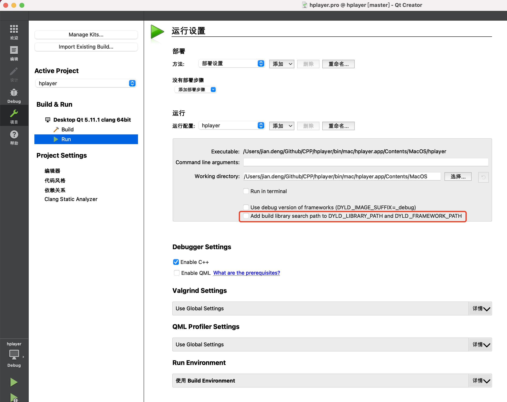

### SDL2

需要在.pro中LIBS中加上 -L/usr/local/lib

```cmake
LIBS += -L/usr/local/lib -lSDL2
```


### FFMPEG

和上面类似，如下：

```cmake
unix {
    ## opencv
    ##LIBS += -lopencv_highgui    \
    ##        -lopencv_imgproc    \
    ##        -lopencv_core       \

    ## FFmpeg
    LIBS += -L/usr/local/Cellar/ffmpeg/4.4_2/lib \
            -lavformat      \
            -lavdevice      \
            -lavcodec       \
            -lswresample    \
            -lswscale       \
            -lavutil        \
```


如果运行出现报错如下：

dyld: Symbol not found: __cg_jpeg_resync_to_restart
 Referenced from:
/System/Library/Frameworks/ImageIO.framework/Versions/A/ImageIO
 Expected in: /opt/local/lib/libJPEG.dylib
in /System/Library/Frameworks/ImageIO.framework/Versions/A/ImageIO

如果使用Qt Creator，则必须在Projects选项卡的Run部分中取消选中Add build library search path to DYLD_LIBRARY_PATH and DYLD_FRAMEWORK_PATH选项，如图：



