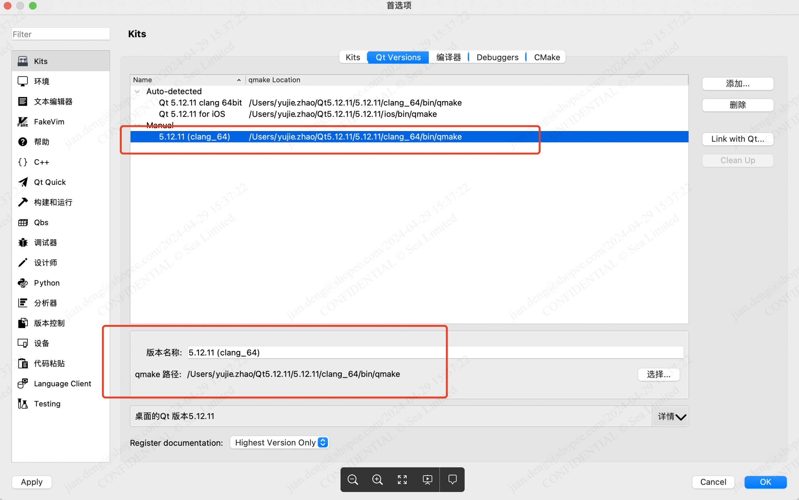
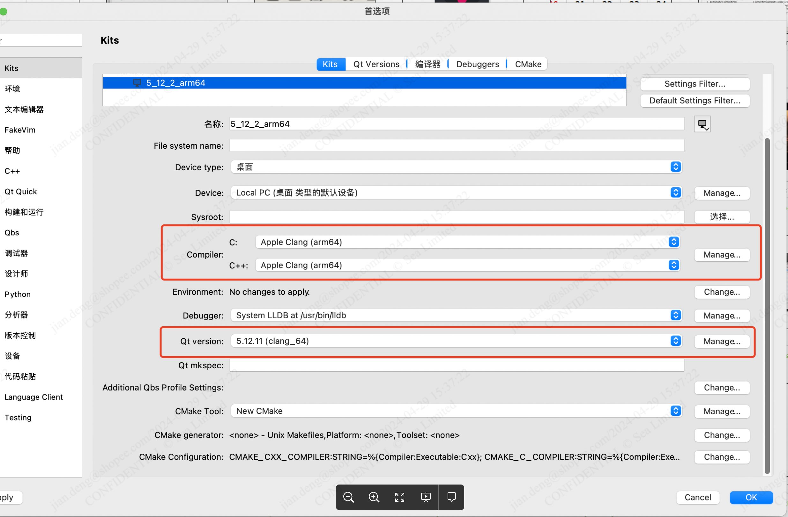

之前参考如下文档，但在Mac M1发现问题：

## **环境配置**

- 安装XCode（App store）

- 安装brew：命令行执行

  ```bash
  /bin/bash -c "$(curl -fsSL https://raw.githubusercontent.com/Homebrew/install/master/install.sh)"
  ```

- 安装CMake：brew install CMake

## **Qt 5.15.2 安装与配置**

**intel芯片 - x86_64**

- 方法1：在线安装器：https://download.qt.io/archive/online_installers/，安装Qt Creator与5.15.2，需要注册Qt账号，可以自定义选择安装组件和下载源码

- 方法2：brew

1. 1. 如本地已用brew安装qt@5其他版本，首先卸载该版本：brew uninstall qt@5
   2. 下载Qt 5.15.2 历史rb文件：https://git.garena.com/yuchen.su/editorqtbinary/-/blob/master/qt@5.rb
   3. 通过历史rb文件进行安装：brew install qt@5.rb
   4. 锁定该版本：brew pin qt@5
   5. brew install qt-creator

- 方法3: 使用现有binary；https://git.garena.com/yuchen.su/editorqtbinary/-/blob/master/Qt-5.15.2-x86_64.zip

**M1芯片 - arm64**

- 方法1：brew：同x86操作方法，brew会自动安装arm64版本
- 方法2：直接安装5.15.2，使用如下方法替换Qt库文件

#### M1芯片编译报错:

1. 错误：undefined symbols for architecture arm64，安装的Qt库默认为x86_64环境，M1芯片指令集为arm架构，编译直接报错

2. 查看是否M1芯片：屏幕左上角苹果图标—>关于本机—>芯片 查看型号

3. 解决方案1：

   1. 下载：https://git.garena.com/yuchen.su/editorqtbinary 中编译好的arm64的Qt动态库，解压，除bin目录外，将其他目录拷贝到Qt安装目录的clang_64下，覆盖替换
   2. 编译时的动态库权限报错：命令行运行 sudo spctl --master-disable，关闭权限检查

4. 解决方案2: 

   1. 手动指定arch参数

      1. QtCreator: 左侧边栏->项目→Build & Run的Build → Initial CMake parameters中增加一行

         -DCMAKE_OSX_ARCHITECTURES:STRING=arm64

#### 环境配置

1. 配置Qt运行环境变量，～/.bash_profile 或 ~./zshrc 中添加如下几行，QTDIR需要替换成本机的QT安装目录
2. export QTDIR=/Users/username/Qt5.15.2/5.15.2/clang_64. 
   export QT_DIR=$QTDIR
   export LD_LIBRARY_PATH=$LD_LIBRARY_PATH:$QTDIR/lib
   export QT_QPA_PLATFORM_PLUGIN_PATH=$QTDIR/plugins
   export PATH=$PATH:$QTDIR/bin

brew安装环境变量配置：

export LDFLAGS=-L/opt/homebrew/opt/qt@5/lib
export CPPFLAGS=-I/opt/homebrew/opt/qt@5/include
export PATH=/opt/homebrew/opt/qt@5/bin:$PATH

1. 命令行中运行source ~/.bash_profile 或 source ~/.zshrc使环境变量生效
2. echo ${QTDIR} 验证是否生效。打开的app需要重启以使环境变量在app中生效

## **编辑器项目**

1. 编辑器项目地址：https://git.garena.com/shopee/live-tech/shopeefun/SPMagicEditor
2. clone完毕拉取子模块：执行`git submodule update --init` 

## 非QtCreator查看Qt变量：

lldb使用教程：https://www.jianshu.com/p/6e6bb0d0ee78

## **代码格式化配置**

**QtCreator:**

**https://blog.csdn.net/tanxuan231/article/details/125189765?spm=1001.2014.3001.5501** 

**VSCode:**

**https://www.jianshu.com/p/b0f1fc194663** 

**CLion:**

**https://www.jetbrains.com/help/clion/clangformat-as-alternative-formatter.html** 

**https://blog.csdn.net/terence_10years/article/details/102646054**

## **Clangd配置**

**VSCode:**

**https://zhuanlan.zhihu.com/p/145430576** 

**https://juejin.cn/post/7126880493668139021**

## **QtCreator打开工程**

1. QtCreator打开根目录下的CMakeLists.txt文件
2. 配置QtCreator的工具链: 左上角菜单栏—>QtCraetor—>偏好设置配置QtVersion, Kits，注意Compiler中选择的选择，如果是M1芯片选择arm64，如果是intel芯片选择x64_86





## **Clion打开工程:**

Clion打开CMakeLists，CMake与compiler保持默认auto detech即可


## **XCode打开工程：**

命令行cd到CMakeLists所在目录，运行 cmake -G "Xcode" .  命令生成XCode工程。注意最后的. 表示当前目录

XCode打开生成的.*xcodeproj文件


## 问题

发现这种方式安卓的qt@5版本，由于路径上有@这个字符，导致Link With Qt一直会失败。