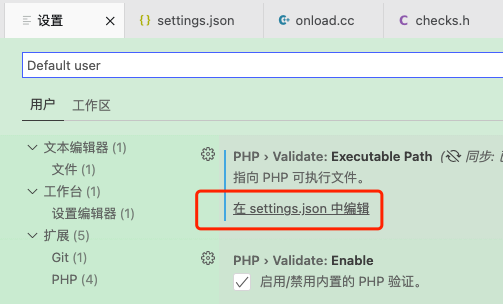

### 查看：

VSCode左下角 “管理 / Manage” -> “键盘快捷方式 / Keyboard Shortcuts” 

搜索，比如： “前进 / Go Forward 或 后退 / Go Back”


### 常用：

Ctrl + 鼠标左击跳到定义.

* 返回：

Windows: Alt + ← ;或者 鼠标侧键
Linux: Ctrl + Alt + - ;貌似数字键盘的减号没效果
Mac: Ctrl + -

* 前进：

Mac: Shift + Ctrl + -


### 修改：

* 修改快捷键：

  在键盘快捷方式下，”键绑定“下右键选择”更改键绑定“，弹框上选一个自己喜欢的快捷键，比如”后退“改为AS风格的"Command + ["

* 修改背景

  参考https://www.cxybb.com/article/Lean_on_Me/84552487

  * **首先下载并设置Atom One Light**

  * **之后打开用户设置，添加如下代码**

    ```json
    "workbench.colorCustomizations": {
        "[Atom One Light]": {
            "editor.background": "#C8EBCA55",   
        "sideBar.background": "#FFFFFF",
        "activityBar.background": "#ffffff",       
        },
    },
    ```

  * 新版本的VSCode的settings.json比较难找，需要设置中搜索后点击”在settings.json中编辑“

    

