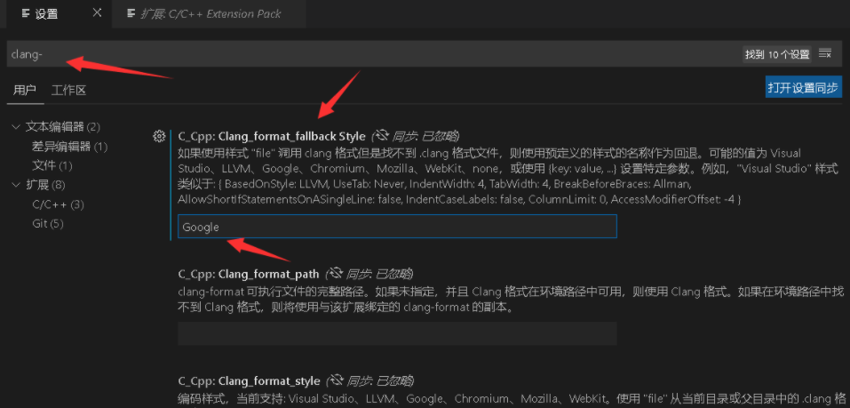
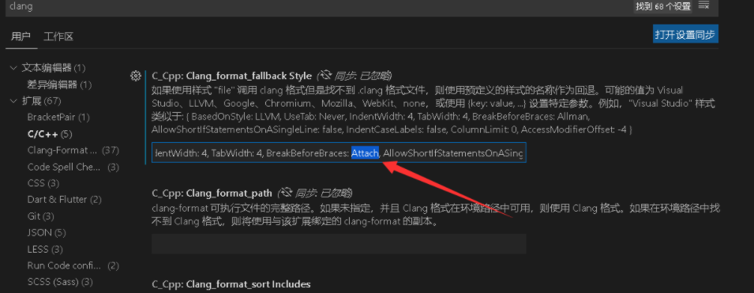

# 安装插件

- Clang-Format
- C/C++


# 谷歌规范

进入设置



cpp文件中右键，选择格式化文档，可以看到效果。


# 自己规范微调

进入设置


由于谷歌是缩进2个空格，括号不换行，
但我喜欢缩进4个空格，括号不换行。只能自定义设置了

设置BreakBeforeBraces 为 Attach 就好了，用下面这句代替原来的“Google”

```sh
{ BasedOnStyle: Google, UseTab: Never, IndentWidth: 4, TabWidth: 4, BreakBeforeBraces: Attach, AllowShortIfStatementsOnASingleLine: false, IndentCaseLabels: false, ColumnLimit: 0, AccessModifierOffset: -4 }
```

