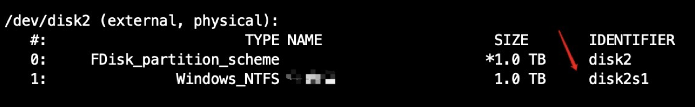

目前我需要用：

sudo umount /dev/disk2s1

sudo mount_ntfs -o rw,nobrowse /dev/disk2s1 ~/Desktop/Windows

大家都知道，Mac默认不能在NTFS格式的磁盘中写入内容。

然而简单几行命令解决所有问题。

大概的思路就是：Mac自动挂载的时候没有开放写权限，我们自己手动挂载一遍，把写权限加上。

#### 第一步：查看磁盘设备文件名

diskutil list

可以看到我移动硬盘被挂载了disk2的位置上，其中Windows那个磁盘设备文件名为disk2s1

#### 第二步：新建挂载点

这一步就是要告诉电脑，你这张盘要放在那里，就好像Windows电脑在你点击我的电脑之后可以看到所有的盘一样。

这里选择放在桌面。

其实是在桌面上新建一个叫Windows的文件夹：

mkdir ~/Desktop/Windows

#### 第三步：推出磁盘（重新挂载）

Mac默认挂载的时候不可写磁盘，这里我们需要重新挂载一次，但是在此之前，需要先取消挂载。

1. sudo umount /dev/disk2s1

#### 第四部：重新挂载

手动挂载

sudo mount_ntfs -o rw,nobrowse /dev/disk2s1 ~/Desktop/Windows

注意：重新挂载需要命令实现，手动插拔硬盘无效

本文参考：[https://my.oschina.net/iceTear/blog/1855817](https://link.zhihu.com/?target=https%3A//my.oschina.net/iceTear/blog/1855817)