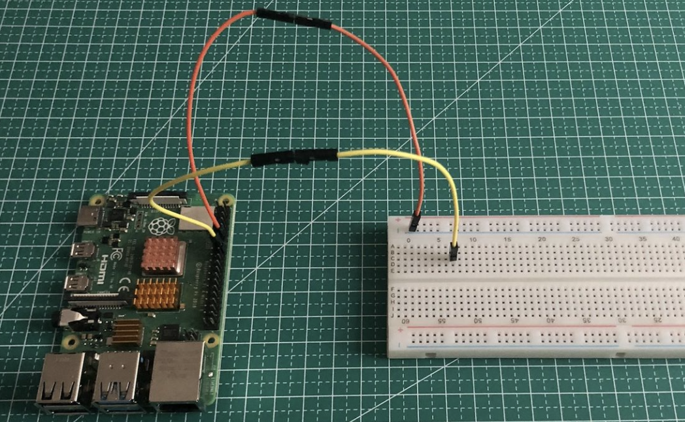

参考：https://zhuanlan.zhihu.com/p/353481373和https://zhuanlan.zhihu.com/p/356298533

学习如何用树莓派点亮LED灯(发光二极管)并控制其明暗程度，最后我们还会结合摩斯电码用LED灯来表示"Hello World"。我实现该项目涉及到的材料有：

1. 树莓派3B * 1
2. LED灯 * 1
3. 限流电阻220欧姆 * 1（五色环电阻颜色为：红红黑黑金（或银））
4. 杜邦线(公对母) * 2
5. 面包板 * 1 


## 1. 了解树莓派引脚

一共有40个引脚，每个引脚都带有编号，左列是奇数，右列是偶数。我们用到的引脚主要分为以下几类：

- GPIO (General-Purpose Input/Output)引脚：用来读取或输出高低电平，我们可以用该引脚达到与其他硬件交互的目的。
- Ground引脚：缩写为GND，用于接地。
- 3V3和5V引脚：给其他硬件供电。

我们可以在终端中输入**pinout**命令来快速查看当前版本树莓派的引脚图


## 2. 了解面包板

首先看下这张图：


从这张图中我们可以清楚地看到面包板的各个小孔是怎么相互连接的。**简单点来说，面包板就是一个装置里放了几根导线，然后加了一些可以连到导线的孔，导线与导线之间互不相连。**该面包板上下两边共有四条导线，每条导线将当前行中的所有小孔都连接了起来：


不过有些面包板不是这样的，比方说下面这个：


大家可以看到面包板上有红蓝颜色的线，这些线告诉我们在面包板两边的小孔，有哪些是相互连接的(其实就是大概告诉你导线的长度)。也就是说，这25个小孔是互连的：


> 注：面包板两边虽然有正极+和负极-符号，但并不是说只能将电源正极和负极连接到标有正负极的上下两行的那些小孔上。大家就将面包板看成导线，自由发挥即可。

现在我们用面包板来将LED灯点亮项目。

将杜邦线的母头连接到树莓派的引脚上(负极接14号GND引脚，正极接16号GPIO引脚)，将杜邦线的公头插到面包板中：

 

最后再插上限流电阻和LED灯。此时电路闭合，电流方向如下图：

 


## 3. 用Python控制GPIO

我们可以使用RPi.GPIO这个库来控制GPIO，通过以下命令即可安装：

```python
pip3 install RPi.GPIO
```

接着导入RPi.GPIO库(此时运行代码，如果没有任何报错，说明安装成功)：

```python
import RPi.GPIO as GPIO
```


在导入模块后要做的第一件事就是确定所采用的GPIO引脚编码方式：

```python
GPIO.setmode(GPIO.BOARD)
```

> **注：**树莓派的GPIO引脚有多种编码方式，如wiringPi、BCM、BOARD等。RPi.GPIO这个库提供BCM和BOARD编码方式，但在本系列教程中笔者将统一使用BOARD编码(即引脚上的编号)。使用该编码方式的好处是：树莓派各版本的BOARD编码方式是相同的，所以就算更换了树莓派版本，我们也无需修改代码。关于其他编码方式，笔者这里不作详解，大家可以自行去了解下。


确定完编码方式之后，我们就要设置所用到的GPIO引脚(先设置，再使用)：

```python
# 将引脚设置为输入模式
GPIO.setup(num, GPIO.IN)
 
# 将引脚设置为输出模式
GPIO.setup(num, GPIO.OUT)
```

我们可以通过GPIO.setup方法将相应引脚设置为输入模式或者输出模式，num即为引脚编号(请见1.1小节中的图片)。


设置完之后，我们就可以通过GPIO.input和GPIO.output来接收或者发送高低电平：

```python
# 通过GPIO.input方法来判断接收的是高电平还是低电平
if GPIO.input(num) == GPIO.HIGH:
    ...
else:
    ...
 
# 通过GPIO.output方法来发送高低电平
GPIO.output(num, GPIO.HIGH)
GPIO.output(num, GPIO.LOW)
```

我们可以用1或者True来代替GPIO.HIGH，用0或者False来代替GPIO.LOW。

> **注：**树莓派GPIO引脚输出的电压为3.3V。


使用完GPIO引脚后，我们要调用GPIO.cleanup()来将引脚释放掉：

```python
# 释放GPIO引脚资源
GPIO.cleanup()
```

如果不释放，那么再次运行代码后，会提示当前GPIO引脚正在使用当中：


如果不想要出现这提示，可以使用GPIO.setwatnings(False)来屏蔽掉。不过大家应该养成好习惯，记得加入这行代码，否则可能会对树莓派造成损坏。


## 4. 连接LED灯

首先我们来学习下如何区分LED灯的正负极，笔者这里提供两种方法：

1. 长腿的是正极，短腿的是负极。
2. 铁片小的是正极，铁片大的是负极。

 

接线示意图：

 


## 5. 点亮LED灯

要点亮LED灯，我们只需给它一个高电平即可：

```python
import RPi.GPIO as GPIO
import time
 
# 设置编码方式
GPIO.setmode(GPIO.BOARD)
 
# 设置GPIO引脚
GPIO.setup(16, GPIO.OUT)
 
# 用16号引脚输出一个高电平，灯亮
GPIO.output(16, GPIO.HIGH)
 
# 等3秒
time.sleep(3)
 
# 用16号引脚输出一个低电平，灯灭
GPIO.output(16, GPIO.LOW)
 
# 等3秒
time.sleep(3)
 
# 再亮灯
GPIO.output(16, GPIO.HIGH)
 
# 等3秒
time.sleep(3)
 
# 使用结束，释放引脚
GPIO.cleanup()
```

这里我们还引入了time模块来控制亮灯灭灯时长。最后结束时，调用GPIO.cleanup()释放了引脚资源。


## 5. 用LED灯表示摩斯电码

下面是摩斯电码对照表：

 

我们将它用python字典来表示：

```python
MORSE_DICT = {
    'A': '.-', 'B': '-...', 'C': '-.-.', 'D': '-..', 'E': '.', 'F': '..-.', 'G': '--.',
    'H': '....', 'I': '..', 'J': '.---', 'K': '-.-', 'L': '.-..', 'M': '--', 'N': '-.',
    'O': '---', 'P': '.--.', 'Q': '--.-', 'R': '.-.', 'S': '...', 'T': '-', 'U': '..-',
    'V': '...-', 'W': '.--', 'X': '-..-',  'Y': '-.--', 'Z': '--..',
 
    '1': '.----', '2': '..---', '3': '...--', '4': '....-', '5': '.....',
    '6': '-....', '7': '--...', '8': '---..', '9': '----.', '0': '-----',
}
```

那怎么用灯来表示摩斯电码呢？我们来看下图片上的这段话：


翻译出来是这样的：

1. 一个点算一个单位。
2. 一个横线算三个单位。
3. 单个字母的摩斯电码，其点线(点点或线线)间的间隔算一个单位。
4. 字母与字母间的间隔算三个单位。
5. 单词与单词间的间隔算七个单位。

好，那么我们规定一个单位算0.1秒，碰到点和线就亮相应时长，碰到间隔就灭相应时长。


现在我们就将LED灯摩斯电码结合起来表示"Hello World"这句话。以下是完整代码：

```python
import RPi.GPIO as GPIO
import time
 
# 设置编码方式
GPIO.setmode(GPIO.BOARD)
 
# 设置GPIO引脚
GPIO.setup(16, GPIO.OUT)
 
# 摩斯电码对照字典
MORSE_DICT = {
    'A': '.-', 'B': '-...', 'C': '-.-.', 'D': '-..', 'E': '.', 'F': '..-.', 'G': '--.',
    'H': '....', 'I': '..', 'J': '.---', 'K': '-.-', 'L': '.-..', 'M': '--', 'N': '-.',
    'O': '---', 'P': '.--.', 'Q': '--.-', 'R': '.-.', 'S': '...', 'T': '-', 'U': '..-',
    'V': '...-', 'W': '.--', 'X': '-..-',  'Y': '-.--', 'Z': '--..',
 
    '1': '.----', '2': '..---', '3': '...--', '4': '....-', '5': '.....',
    '6': '-....', '7': '--...', '8': '---..', '9': '----.', '0': '-----',
}
 
# 时长单位
UNIT = 0.1
 
 
def get_morse(sentence):
    """获取每个字母的摩斯电码"""
    morse_list = []
 
    for c in sentence.upper():
        morse = MORSE_DICT.get(c)
 
        if morse:
            morse_list.append(morse)
        else:
            morse_list.append(' '*7)
 
    print(morse_list)
    return morse_list
 
 
def show(morse_list):
    """遍历列表，用LED灯表示点、线和间隔"""
    for element in morse_list:
 
        # 单词间的间隔
        if ' ' in element:
            GPIO.output(16, GPIO.LOW)
            time.sleep(UNIT*7)
 
        # 点和线
        else:
            for i, c in enumerate(element):
                if c == '.':
                    GPIO.output(16, GPIO.HIGH)
                    time.sleep(UNIT)
 
                elif c == '-':
                    GPIO.output(16, GPIO.HIGH)
                    time.sleep(UNIT*3)
 
                # 点或线如果是最后一个的话，则不用算间隔
                if i != len(element)-1:
                    GPIO.output(16, GPIO.LOW)
                    time.sleep(UNIT)
 
            # 字母间的间隔
            GPIO.output(16, GPIO.LOW)
            time.sleep(UNIT*3)
 
 
def main():
    """主逻辑"""
    sentence = 'Hello World'            # 1
 
    morse_list = get_morse(sentence)    # 2
    show(morse_list)                    # 3
 
    GPIO.cleanup()                      # 4
 
 
if __name__ == '__main__':
    main()
```

1. 首先构造"Hello World"字符串，存储在sentence变量中。

2. 通过get_morse方法，循环遍历字符串中每个字符，转换成摩斯电码后添加到morse_list列表中。由于字典中的键是大写的，所以要调用upper()将sentence中的字符变为大写。碰到空字符时，就表示遇上了单词间的间隔，所以我们就往列表中添加7个空字符(1个字符为0.1秒)。"Hello World"打印出来的morse_list是这样的：

```python
['....', '.', '.-..', '.-..', '---', '       ', '.--', '---', '.-.', '.-..', '-..']
```

3. 接着我们调用show()来表示morse_list中的点、线以及间隔。

- 循环列表，如果元素中存在空字符' '，那么就表明现在碰到了单词间的间隔，输出低电平让灯灭掉，持续0.7秒；
- 如果不存在空字符，那么就是字母的摩斯电码，于是我们循环该摩斯电码中的每个字符。如果是点'.'，那么输出一个高电平，持续0.1秒；如果是线'-'，那么点亮0.3秒。点或线表示完之后就要表示间隔，持续0.1秒。不过如果点或者线已经是该摩斯电码中最后一个了的话，则无需表示间隔。
- 单个字母的摩斯电码循环完毕之后，就可以表示字母间的间隔了，持续0.3秒。

4. 表示完毕后，释放引脚资源。

