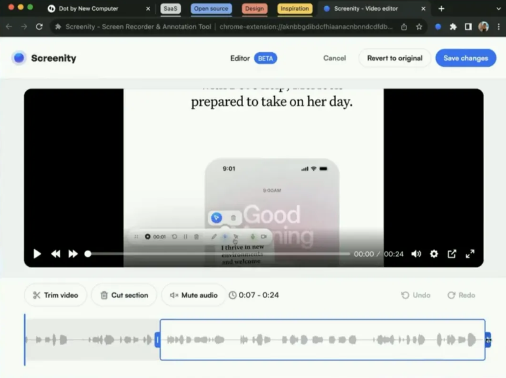

## 用不到 25 美元打造你的智能眼镜

OpenGlass 是一个开源的智能眼镜项目，旨在将任何普通眼镜转变为功能丰富的智能眼镜，成本不到 25 美元。

该项目由 BasedHardware 发起，**使用它可以记录生活、记忆遇到的人、识别对象、翻译文本等。**5天前正式开源。目前已经获得了 1.4k 的 Star。

```
开源地址：https://github.com/BasedHardware/OpenGlass
```


该项目的核心在于其低成本和易于组装的特性。用户可以利用 Seeed Studio XIAO ESP32 S3 Sense、EEMB LP502030 电池和 3D 打印的眼镜架等组件，自行组装智能眼镜。

项目中包含了硬件和软件的设置指南。硬件部分，用户需要通过 Arduino IDE 上传固件到 XIAO ESP32S3 开发板。软件部分，用户需要克隆 OpenGlass 仓库并安装依赖，然后添加必要的API密钥以启用特定功能。


项目中包含了硬件和软件的设置指南。硬件部分，用户需要通过Arduino IDE上传固件到XIAO ESP32S3开发板。软件部分，用户需要克隆 OpenGlass 仓库并安装依赖，然后添加必要的 API 密钥以启用特定功能。


## 开源视频下载工具

Lux 支持从多个流行的视频平台下载视频，包括但不限于 YouTube、Bilibili、Youku 等。它提供了多种下载选项，如选择特定视频流、下载整个播放列表、使用代理、多线程下载等。

**Lux 支持的视频网站情况如下表所示：**


**使用指南**

Lux 的使用非常简单，安装后，只需输入 `lux [参数] 视频链接` 命令即可开始下载。它还提供了丰富的参数选项，如 `-i` 查看视频信息、`-p` 下载播放列表、`-n` 设置下载线程数等。比如：

**下载 YouTube 视频命令：**

```
$ lux "https://www.youtube.com/watch?v=dQw4w9WgXcQ"
```

**查看视频信息而不下载命令：**

```
$ lux -i "https://www.youtube.com/watch?v=dQw4w9WgXcQ"
```

**下载指定的视频流命令：**

```
$ lux -f 248 "https://www.youtube.com/watch?v=dQw4w9WgXcQ"
```

下载 yotube 的视频效果：


****

**安装指南**

Lux 可以通过多种方式安装，包括使用 Homebrew（仅限 macOS）、Arch Linux、Void Linux、Windows 的 Scoop 和 Chocolatey ，以及跨平台的 Cask。

**通过 go install 安装：**

```
$ go install github.com/iawia002/lux@latest
```

**macOS 系统通过 Homebrew 安装：**

```
$ brew install lux
```

**Arch Linux 用户：**

可以通过访问如下的链接进行安装：https://aur.archlinux.org/packages/lux-dl

Windows 的用户可以通过 Scoop 进行安装：

```
$ scoop install lux
```


## 标星 10K 的屏幕录制工具

Screenity 是一个开源的屏幕录制工具，由开发者 Alyssa X开发。目前在 GitHub 上已经获得了 10.6k 的 Star。

该项目的设计理念是提供一种简单易用且功能强大的屏幕录制解决方案，支持多种录制模式，包括屏幕录像、摄像头录像以及两者的组合。

Screenity 是开源、免费的，不会收集、共享或出售用户的任何数据，不会限制用户的录制内容，也不会付费下载。

开发者Alyssa X 是一位女性的独立开发者，她已经独立开发过 12 款产品（拥有超过 16 万用户），两次入围年度 Product Hunt Maker ，是一位知名度比较高的开发者。

她开发、开源的产品深受用户喜爱，逛逛也对她之前的项目做过推荐，感兴趣可以移步之前的文章查阅。


**开源项目特性**

Screenity 的核心特性包括：

**多种录制模式：**用户可以选择仅录制屏幕、仅录制摄像头，或者同时录制屏幕和摄像头。是制作教程、演示、演示、分享反馈等的绝佳工具。还支持将录制的视频进行剪辑



**音频录制：**支持录制系统声音或麦克风声音，或者两者同时录制。

**编辑和注释：**在录制过程中，用户可以添加文字、箭头、高亮等注释，使视频更加直观。配备的绘图工具可在录制时为您的屏幕添加注释，以及许多其他功能可帮助您通过视频表达您的观点。

**GIF导出：**除了视频格式，Screenity还支持将录制内容导出为GIF动画。

**如何使用**

要部署 Screenity，用户需要遵循以下步骤：

\1. 访问 Chrome 网上应用店。

\2. 搜索 Screenity 并安装。

\3. 安装完成后，用户可以通过点击浏览器右上角的 Screenity 图标来开始使用。

```
开源地址：https://github.com/alyssaxuu/screenity
```


Screenity 以其简洁的界面和强大的功能，为需要进行屏幕录制的用户提供了一个极佳的选择。无论是制作教程视频、录制会议内容，还是创建演示文稿，Screenity都能够满足用户的需求。

**历史盘点**

逛逛 GitHub 每天推荐一个好玩有趣的开源项目。历史推荐的开源项目已经收录到 GitHub 项目，欢迎 Star：

```
地址：https://github.com/Wechat-ggGitHub/Awesome-GitHub-Repo
```


## 标星 43.1 K！最火跨平台笔记开源项目

Joplin 是一个开源的笔记和待办事项应用程序，由 Laurent Cozic（laurent22）开发，目前在 GitHub 上已经获得了 43k+ 的 Star，可见非常受欢迎。

**它为用户提供了一个跨平台的解决方案，用于创建、组织和同步笔记。**并因其强大的功能性和对用户隐私的重视而受到欢迎。

该开源笔记应用支持Markdown格式，允许用户以纯文本的形式书写和格式化笔记。这种格式不仅使得笔记易于阅读，而且也方便了笔记的迁移和长期保存。

用户可以轻松地对笔记进行搜索、复制、标记和修改，无论是直接在应用程序内还是在外部文本编辑器中。

```
开源地址：https://github.com/laurent22/joplin
```

**跨平台兼容性**

该开源项目考虑到了不同操作系统的用户，因此它提供了Windows、macOS、Linux、Android和iOS版本。这确保了用户无论使用何种设备，都能保持笔记的同步和访问。

**数据同步与安全**

数据同步是Joplin的另一大特色。它通过端到端加密技术，支持与Nextcloud、Dropbox、OneDrive和Joplin Cloud等云服务的同步。

这种同步机制不仅保证了数据的安全性，也使得用户在没有互联网连接的情况下，依然可以访问所有的笔记，这得益于Joplin的“离线优先”设计理念。

**媒体文件支持**

支持图像、视频、PDF 和音频文件。直接从应用程序创建数学表达式和图表。使用移动应用程序拍照并将其保存到笔记中。


**导入与导出**

Joplin 支持从 Evernote 导入笔记，包括格式化内容、资源和元数据。此外，它也支持纯 Markdown 文件的导入，这为用户从其他笔记应用迁移到 Joplin 提供了便利。

### **搜索与定制**

全文搜索功能，帮助用户快速定位所需信息。同时，应用程序的界面可以通过插件和主题进行定制，甚至用户还可以创建自己的插件和主题，以满足个性化需求。

### **Web Clipper**

Web Clipper工具允许用户直接从浏览器中保存网页和截屏，这对于需要收集在线信息的用户来说是一个实用的功能。


