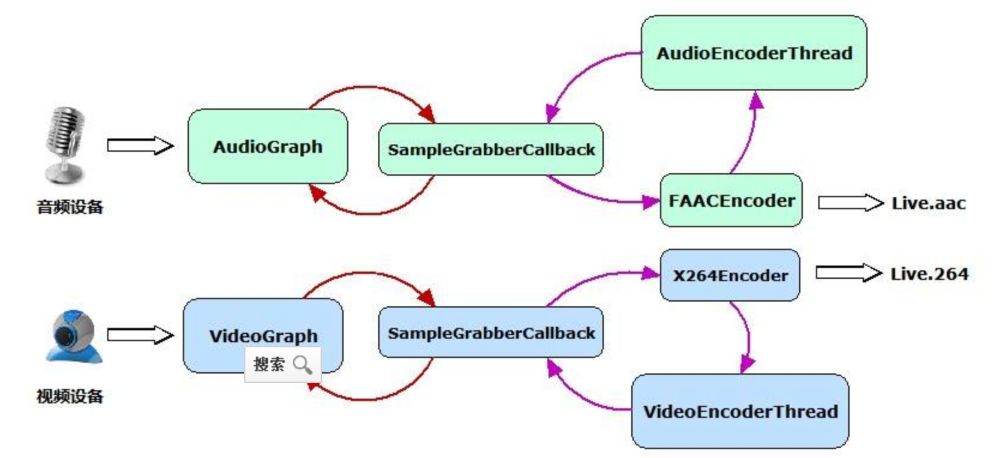

### 一、指代不同

1、 AAC-LC：低复杂性高级音频解码。是低比特率、优质音频 的高性能音频编码解码器。

2、AAC-HE：高效性高级音频解码。又称AAC+。

### 二、编码方式不同

1、 AAC-LC：比特率最高每通道256kbit/s，采样率8至96kHz 。

2、AAC-HE：HE-AAC注重于低码流的编码并很适合多声道文件，混合了AAC与SBR技术。SBR的关键是在低码流下提供全带宽的编码而不会产生产生多余的信号。

### 三、优势不同

1、 AAC-LC：被广泛用于商业市场，兼容更多设备播放，则建议采用AAC-LC格式；

2、AAC-HE：让核心编码去编码低频信号，而SBR解码器通过分析低频信号产生高频信号和一些保留在比特流中的指导信号，增加音频的带宽。

### 四、对于编解码

he aac一帧是2048个sample；

lc aac 一帧是1024个sample；

