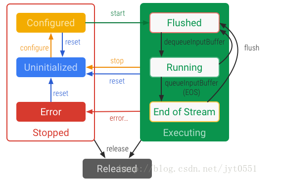

H.265编码算法作为新一代视频编码标准，在编码效果上有了很大的进步，同样清晰度的视频，265要比264有着更低的码率。关于265对比264的优越性，网上有更专业的文章来作分析，我也仅对这两种算法略知皮毛，因此不多阐述。

基于其更高的压缩比，H.265适用于安防行业再合适不过了！因为安防行业每天都有着海量的视频数据在产生，同时需要实时传输、分析、存储…在带宽和存储成本依然昂贵的今天，我们极度需要更低的码率！更低的码率就等同于更低的成本，因此今天各个安防厂商已经逐渐将视频设备由264转移到265了，这同时对于265编码也有着积极的推动作用。

同时，给我们码农带来的则是痛苦——意味着我们不得不做大量的兼容和适配工作。还好FFmpeg在好久之前就支持265的编解码算法了。这方面的文章也不少，包括雷神也专门写了系列博客,参考：http://blog.csdn.net/leixiaohua1020/article/details/46412897

而在安卓平台，伟大的Google也给我们带来了H.265(又称HEVC)的硬解码的接口的支持（值得注意的是，也支持H.265硬编码。后面我们会有专门文章来做介绍）。大家可以看看MediaCodec的API说明，接口简单，基本上就是下面Google画的流程图：



首先初始化解码器，可以使用解码器类型或者解码器名称进行初始化，一般使用解码器类型即可。

```java
// 使用解码器类型初始化
MediaCodec codec = MediaCodec.createDecoderByType("video/hevc");
// 使用解码器名称初始化，名称可通过MediaCodecList遍历所有解码器获取到
MediaCodec codec = MediaCodec.createByCodecName(name);
```

初始化之后，需要进行配置，这是最难的地方。配置时针对不同的解码器，需要不同的配置参数。对于HEVC，需要知道宽度、高度和CSD。CSD，即：Codec-specific Data，是指跟特定编码算法相关的一些参数，比如AAC的ADTS、H.264的SPS/PPS等。

<font color="red">下面表格是安卓平台支持的编码格式与CSD（code specific data）的说明</font>：

| Format     | CSD buffer #0                                                | CSD buffer #1                                                | CSD buffer #2                                                |
| :--------- | :----------------------------------------------------------- | :----------------------------------------------------------- | :----------------------------------------------------------- |
| AAC        | Decoder-specific information from ESDS*                      | Not Used                                                     | Not Used                                                     |
| VORBIS     | Identification header                                        | Setup header                                                 | Not Used                                                     |
| OPUS       | Identification header                                        | Pre-skip in nanosecs (unsigned 64-bit [native-order](https://developer.android.com/reference/java/nio/ByteOrder.html#nativeOrder()) integer.) This overrides the pre-skip value in the identification header. | Seek Pre-roll in nanosecs (unsigned 64-bit [native-order](https://developer.android.com/reference/java/nio/ByteOrder.html#nativeOrder()) integer.) |
| MPEG4      | Decoder-specific information from ESDS*                      | Not Used                                                     | Not Used                                                     |
| H.264 AVC  | SPS (Sequence Parameter Sets*)                               | PPS (Picture Parameter Sets*)                                | Not Used                                                     |
| H.265 HEVC | VPS (Video Parameter Sets*) + SPS (Sequence Parameter Sets*) + PPS (Picture Parameter Sets*) | Not Used                                                     | Not Used                                                     |
| VP9        | VP9 [CodecPrivate](http://wiki.webmproject.org/vp9-codecprivate) Data (optional) | Not Used                                                     | Not Used                                                     |

可以看到，对于H.265，CSD只需要“csd-0”参数，就是把VPS、SPS、PPS拼接到一起即可。因此整个配置过程可以说就是获取这三个分量的过程。
作者参考了雷神的博客后，大体上明白了这三个分量的提取方式。简单说，就是遍历数据，获取到00 00 01（或 00 00 00 01），再取出下一个字节，提取到nal_type。

```java
byte nal_spec = data[i + 3];
int nal_type = (nal_spec >> 1) & 0x03f;
```

再判断nal_type的值，vps/sps/pps对应的nal_type分别是：

```java
private static final int NAL_VPS = 32;
private static final int NAL_SPS = 33;
private static final int NAL_PPS = 34;
```

然后再到下一个00 00 01（或 00 00 00 01）结束
提取过程的代码如下:

```java
private static byte[] getvps_sps_pps(byte[] data, int offset, int length) {
    int i = 0;
    int vps = -1, sps = -1, pps = -1;
    do {
        if (vps == -1) {
            for (i = offset; i < length - 4; i++) {
                if ((0x00 == data[i]) && (0x00 == data[i + 1]) && (0x01 == data[i + 2])) {
                    byte nal_spec = data[i + 3];
                    int nal_type = (nal_spec >> 1) & 0x03f;
                    if (nal_type == NAL_VPS) {
                        // vps found.
                        if (data[i - 1] == 0x00) {  // start with 00 00 00 01
                            vps = i - 1;
                        } else {                      // start with 00 00 01
                            vps = i;
                        }
                        break;
                    }
                }
            }
        }
        if (sps == -1) {
            for (i = vps; i < length - 4; i++) {
                if ((0x00 == data[i]) && (0x00 == data[i + 1]) && (0x01 == data[i + 2])) {
                    byte nal_spec = data[i + 3];
                    int nal_type = (nal_spec >> 1) & 0x03f;
                    if (nal_type == NAL_SPS) {
                        // vps found.
                        if (data[i - 1] == 0x00) {  // start with 00 00 00 01
                            sps = i - 1;
                        } else {                      // start with 00 00 01
                            sps = i;
                        }
                        break;
                    }
                }
            }
        }
        if (pps == -1) {
            for (i = sps; i < length - 4; i++) {
                if ((0x00 == data[i]) && (0x00 == data[i + 1]) && (0x01 == data[i + 2])) {
                    byte nal_spec = data[i + 3];
                    int nal_type = (nal_spec >> 1) & 0x03f;
                    if (nal_type == NAL_PPS) {
                        // vps found.
                        if (data[i - 1] == 0x00) {  // start with 00 00 00 01
                            pps = i - 1;
                        } else {                    // start with 00 00 01
                            pps = i;
                        }
                        break;
                    }
                }
            }
        }
    } while (vps == -1 || sps == -1 || pps == -1);
    
    if (vps == -1 || sps == -1 || pps == -1) {
    		// 没有获取成功。
        return null;
    }
    // 计算csd buffer的长度。即从vps的开始到pps的结束的一段数据
    int begin = vps;
    int end = -1;
    for (i = pps; i < length - 4; i++) {
        if ((0x00 == data[i]) && (0x00 == data[i + 1]) && (0x01 == data[i + 2])) {
            if (data[i - 1] == 0x00) {  // start with 00 00 00 01
                end = i - 1;
            } else {                    // start with 00 00 01
                end = i;
            }
            break;
        }
    }
    if (end == -1 || end < begin) {
        return null;
    }
    
    // 拷贝并返回
    byte[] buf = new byte[end - begin];
    System.arraycopy(data, begin, buf, 0, buf.length);
    return buf;
}
```

提取成功后，我们再用它进行配置：

```java
    byte[] csd0 = getvps_sps_pps(data, offset, Math.min(length, 200));
    if (csd0== null) {
        throw new IOException("parse vps sps pps error...");
    }
    ByteBuffer csd0bf = ByteBuffer.allocate(csd0.length);
    csd0bf.put(csd0);
    csd0bf.clear();
    format.setByteBuffer("csd-0", csd0bf);
    format.setInteger(MediaFormat.KEY_WIDTH, width);
    format.setInteger(MediaFormat.KEY_HEIGHT, height);
    format.setString(MediaFormat.KEY_MIME, MIME_TYPE_HEVC);
    // config
    codec.configure(format, surface, null, 0);
```

我们将提取到的csd0转成ByteBuffer，再通过setByteBuffer设置到format里面，然后用format进行配置。
配置成功后，我们再启动解码器：

```java
    codec.start();
```

接下来就是对视频帧进行解码了。MediaCodec内部维护着一系列输入输出buffer，我们需要将265数据帧输入到输入队列，将解码后的视频数据从输出队列显示到界面。
对于输入，需要外部调用者申请（dequeue）buffer，并将视频帧拷贝到buffer，然后再释放（queue）给Codec；

```java
    int inputBufferId = codec.dequeueInputBuffer(timeoutUs);
    if (inputBufferId >= 0) {
      ByteBuffer inputBuffer = codec.getInputBuffer(…);
      // fill inputBuffer with valid data
      // 我们需要把我们接收到的视频帧数据copy到inputBuffer里
      …
      // 把buffer归还给codec
      codec.queueInputBuffer(inputBufferId, …);
    }
```

对于输出，外部调用者需要dequeue到outputbuffer，然后再做显示：

```java
     int outputBufferId = codec.dequeueOutputBuffer(…);
     if (outputBufferId >= 0) {
       ByteBuffer outputBuffer = codec.getOutputBuffer(outputBufferId);
       // outputBuffer is ready to be processed or rendered.
       …
       // 下面可以直接显示，视频会显示在surface上了。
       codec.releaseOutputBuffer(outputBufferId, …);
     }
```

如果一切顺利，应该看到了视频了，**every one is happy**~

记得退出时要释放解码库~

```java
    codec.stop();
    codec.release();
```

当然，不是所有的安卓机都支持H.265的硬解码，对于这些不支持硬解码的，使用ffmpeg进行软解即可，这方面资料也不在少数，现不做介绍。可能软解码效率就不是很高了。

现阶段硬解码已经适用于EasyPlayerPro项目当中。
在这里再简单介绍一下EasyPlayerPro，EasyPlayer Pro专业版全功能播放器是由EasyDarwin开源团队维护的一款支持RTSP、RTMP、HTTP、HLS多种流媒体协议的播放器版本。

EasyPlayerPro下载地址：https://fir.im/EasyPlayerPro

相关介绍见：http://www.easydarwin.org/article/news/117.html

版权声明：本文为博主原创文章，遵循[ CC 4.0 BY-SA ](https://creativecommons.org/licenses/by-sa/4.0/)版权协议，转载请附上原文出处链接和本声明。本文链接：https://blog.csdn.net/jyt0551/article/details/74502627