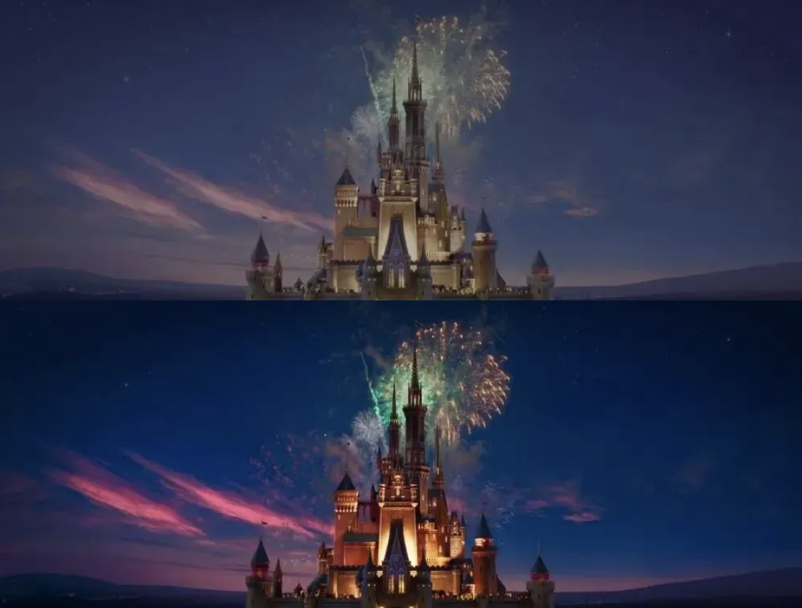

## 视频转码三方库

在研究端上视频转码压缩时，发现网上大部分的Demo或转码库是基于FFmpeg的，只有少部分的是采用Android的MediaCodec Api进行硬件转码的。

https://github.com/AbedElazizShe/LightCompressor

https://github.com/linkedin/LiTr

https://github.com/ypresto/android-transcoder

https://github.com/natario1/Transcoder

上述几个库的实现原理，其实都是参考的Android Encode cts :

https://android.googlesource.com/platform/cts/+/refs/heads/android10-c2f2-release/tests/tests/media/src/android/media/cts/EncodeDecodeTest.java。

使用一个自行准备的EGL Surface，将编码器解码原视频后的每帧画面，绘制到EGL Surface上，然后将这个EGL Surface作为编码器的输入源，然后再使用MediaMuxer混合音频、视频轨道，输出最终的视频文件。

使用HDR视频对上面几个库进行测试，发现只有LightCompressor能够在转码后，仍然是HDR视频。

HDR视频在经过其他几个库的转码后，就变成了SDR，且颜色出现了泛白的情况。就和在不支持HDR效果的设备上播放HDR视频一样，类似下面的效果：



比较了LightCompressor和其他库的实现区别后，发现LightCompressor在设置输出视频的mediaformat时，额外设置了Color_Standard，Color_Transfer，Color_Range。

```java
           if (Build.VERSION.SDK_INT > 23) {
               getColorStandard(inputFormat)?.let {
                   setInteger(MediaFormat.KEY_COLOR_STANDARD, it)
               }
               getColorTransfer(inputFormat)?.let {
                   setInteger(MediaFormat.KEY_COLOR_TRANSFER, it)
               }
               getColorRange(inputFormat)?.let {
                   setInteger(MediaFormat.KEY_COLOR_RANGE, it)
               }
           }
```

那么LightCompressor转码出来的HDR视频就是正确的么？


可以看到，原本10bit位深的HDR，变成了8bit位深。

## 如何正确处理HDR视频

首先一点，就是需要在支持HDR视频录制的设备上才能考虑将HDR视频转码输出成HDR视频。

### 将HDR转成颜色正确的SDR视频

既然使用了EGL Surface作为数据中转，那么其实可以在OpenGL中进行正确的颜色转化，**将BT.2020转成BT.709或BT.601**，再进行绘制。

这个的原理和在不支持HDR设备上播放HDR视频是一样的。可以参阅信念着了火的HDR转SDR系列文章，以及关键帧Keyframe的如何正确将 HDR 视频转换成 SDR 视频。

### 保持HDR视频格式

既然LightCompressor中设置Color_Standard、Color_Transfer、Color_Range后能输出半成品HDR了，说明这三个参数就是必要的，那么就需要对不正确的地方进行研究处理。

#### 8bit、10bit位深

变成8bit是因为在创建EGL Surface时，InputSurface中颜色空间使用的是RGB888。

```java
        // Configure EGL for recordable and OpenGL ES 2.0.  We want enough RGB bits
        // to minimize artifacts from possible YUV conversion.
        int[] attribList = {
                EGL14.EGL_RED_SIZE, 8,
                EGL14.EGL_GREEN_SIZE, 8,
                EGL14.EGL_BLUE_SIZE, 8,
                EGL14.EGL_RENDERABLE_TYPE, EGL14.EGL_OPENGL_ES2_BIT,
                EGLExt.EGL_RECORDABLE_ANDROID, 1,
                EGL14.EGL_NONE
        };
        int[] numConfigs = new int[1];
        if (!EGL14.eglChooseConfig(mEGLDisplay, attribList, 0, mConfigs, 0, mConfigs.length,
                numConfigs, 0)) {
            throw new RuntimeException("unable to find RGB888+recordable ES2 EGL config");
        }
```

所以在纹理层面上，就已经不是广色域了。

##### RGBA1010102

如果去查看最新的Android 13中的cts，可以发现里面已经支持了highBitDepth，就是把EGL环境配置成RGBA1010102。

```java
        // Configure EGL for recordable and OpenGL ES 2.0.  We want enough RGB bits
        // to minimize artifacts from possible YUV conversion.
        int eglColorSize = useHighBitDepth ? 10: 8;
        int eglAlphaSize = useHighBitDepth ? 2: 0;
        int recordable = useHighBitDepth ? 0: 1;
        int[] attribList = {
                EGL14.EGL_RED_SIZE, eglColorSize,
                EGL14.EGL_GREEN_SIZE, eglColorSize,
                EGL14.EGL_BLUE_SIZE, eglColorSize,
                EGL14.EGL_ALPHA_SIZE, eglAlphaSize,
                EGL14.EGL_RENDERABLE_TYPE, EGL14.EGL_OPENGL_ES2_BIT,
                EGLExt.EGL_RECORDABLE_ANDROID, recordable,
                EGL14.EGL_NONE
        };
```

这样是否真的可行？经过简单测试，很多设备都是不支持RGBA1010102配置的，只有那些可以拍摄杜比视界的小米设备可以支持。

在这些设备上，用上述配置，就能使得转码输出的HDR视频的位深为10bit。

##### **YUVP10**

实际上，Android阵营中，HDR视频的主要生产者，是华为设备，于2022年下半年推出的Vivid HDR视频。

像除华为外的其他设备，并没有在相机中默认启用HDR录制，而华为自2022年下半年mate50系列开始，就直接默认启用了Vivid HDR的录制，这就使得华为设备录制的HDR视频量超过了Android总HDR视频量的50%。

而对于Vivid HDR视频，在华为设备上是无法使用RGBA1010102的，会使得编码器在编码时报错。那么就需要使用YUVP10来处理Vivid HDR视频。

EGL的配置如下：

```java
public static final String EGL_YUV_EXT_NAME = "EGL_EXT_yuv_surface";

public static final int EGL_YUV_BUFFER_EXT = 0x3300;
public static final int EGL_YUV_ORDER_EXT = 0x3301;
public static final int EGL_YUV_ORDER_YUV_EXT = 0x3302;
public static final int EGL_YUV_NUMBER_OF_PLANES_EXT = 0x3311;
public static final int EGL_YUV_SUBSAMPLE_EXT = 0x3312;
public static final int EGL_YUV_DEPTH_RANGE_EXT = 0x3317;
public static final int EGL_YUV_CSC_STANDARD_EXT = 0x330A;
public static final int EGL_YUV_PLANE_BPP_EXT = 0x331A;
public static final int EGL_YUV_SUBSAMPLE_4_2_0_EXT = 0x3313;
public static final int EGL_YUV_DEPTH_RANGE_LIMITED_EXT = 0x3318;
public static final int EGL_YUV_DEPTH_RANGE_FULL_EXT = 0x3319;
public static final int EGL_YUV_CSC_STANDARD_601_EXT = 0x330B;
public static final int EGL_YUV_CSC_STANDARD_709_EXT = 0x330C;
public static final int EGL_YUV_CSC_STANDARD_2020_EXT = 0x330D;
public static final int EGL_YUV_PLANE_BPP_0_EXT = 0x331B;
public static final int EGL_YUV_PLANE_BPP_8_EXT = 0x331C;
public static final int EGL_YUV_PLANE_BPP_10_EXT = 0x331D;


int[] attribList = {
        EGL14.EGL_SURFACE_TYPE, EGL14.EGL_WINDOW_BIT,
        EGL14.EGL_RENDERABLE_TYPE, EGL14.EGL_OPENGL_ES2_BIT,
        EGL14.EGL_COLOR_BUFFER_TYPE, GLUtils.EGL_YUV_BUFFER_EXT,
        GLUtils.EGL_YUV_ORDER_EXT, GLUtils.EGL_YUV_ORDER_YUV_EXT,
        GLUtils.EGL_YUV_NUMBER_OF_PLANES_EXT, 2,
        GLUtils.EGL_YUV_SUBSAMPLE_EXT, GLUtils.EGL_YUV_SUBSAMPLE_4_2_0_EXT,
        GLUtils.EGL_YUV_DEPTH_RANGE_EXT, GLUtils.EGL_YUV_DEPTH_RANGE_LIMITED_EXT,
        GLUtils.EGL_YUV_CSC_STANDARD_EXT, GLUtils.EGL_YUV_CSC_STANDARD_2020_EXT,
        GLUtils.EGL_YUV_PLANE_BPP_EXT, GLUtils.EGL_YUV_PLANE_BPP_10_EXT,
        EGL14.EGL_NONE
};
```

使用YUVP10，也就意味着，OpenGL需要处理的纹理，也得是YUV的。因此在cts中能够找到的，用于编码器输出绘制帧的TextureRender类，里面的shader glsl也需要修改。

原先的shader是面向rgba纹理的：

```glsl
#extension GL_OES_EGL_image_external : require      
precision mediump float;                            
varying vec2 vTextureCoord;                         
uniform samplerExternalOES sTexture;                
void main() {                                       
  gl_FragColor = texture2D(sTexture, vTextureCoord);
}                                                   
```

这里需要改成YUV纹理：

```glsl
#version 300 es                                     
#extension GL_EXT_YUV_target : require              
#extension GL_OES_EGL_image_external : require      
#extension GL_OES_EGL_image_external_essl3 : require
precision highp float;                              
                                                    
uniform __samplerExternal2DY2YEXT sTexture;         
                                                    
in vec2 vTextureCoord;                              
layout (yuv) out vec4 color;                        
                                                    
void main()                                         
{                                                   
    color = texture(sTexture, vTextureCoord);       
}                                                   
```

需要注意的是，上面fragment着色器处理YUV纹理，需要用到ES 3版本，处理RGBA纹理用的是ES 2版本，因此vertex着色器也需要对应换成ES 3的实现。

使用YUV纹理后，就能够将Vivid HDR转码输出10bit的HDR视频了。

理论上而言，在设备支持的情况下使用YUV纹理，应该是能够处理所有的HDR视频的，并不局限于Vivid HDR视频。

#### HDR元数据

HDR视频除了颜色空间和普通视频有差别外，最重要的就是HDR视频会额外携带HDR元数据，里面携带了亮度信息，用于对视频局部进行亮度调整。

HDR元数据包括静态元数据和HDR 10+有的动态元数据。

##### 静态元数据

静态元数据的设置很简单，直接从MediaFormat中提取即可。

```java
if (inputFormat.containsKey(MediaFormat.KEY_HDR_STATIC_INFO)) {
    outputFormat.setByteBuffer(MediaFormat.KEY_HDR_STATIC_INFO,
            inputFormat.getByteBuffer(MediaFormat.KEY_HDR_STATIC_INFO));
}
```

##### 动态元数据

使用ffprobe命令，可以提取帧里面的动态元数据：

```shell
ffprobe -show_frames -select_streams v video.mp4 -print_format json
```

杜比视界及Vivid HDR提取结果：


基本每帧里，都会携带这个信息。

而在使用RGBA1010102或YUVP10进行转码后输出的10bit HDR视频中，并不能提取到这些信息。说明HDR元数据丢失了，没有被写进转码输出的视频中。

那这时，就需要我们手动提取HDR元数据，然后手动丢个编码器了。

###### **提取HDR动态元数据**

在解码器解码HDR视频时，在onOutputBufferAvailable回调中，是会把每帧中的额外信息带出来的（如果有的话），HDR元数据就在其中。

```java
@Override
public void onOutputBufferAvailable(@NonNull MediaCodec codec, int index,
                                    @NonNull MediaCodec.BufferInfo info) {
    byte[] hdr10Info = null;
    if (android.os.Build.VERSION.SDK_INT >= android.os.Build.VERSION_CODES.Q) {
        MediaFormat format = codec.getOutputFormat();
        //这个就是HDR元数据
        ByteBuffer hdrByteBuffer = format.getByteBuffer(MediaFormat.KEY_HDR10_PLUS_INFO);
        if (hdrByteBuffer != null) {
            int limit = hdrByteBuffer.limit();
            if (limit > 0) {
                hdr10Info = new byte[limit];
                hdrByteBuffer.get(hdr10Info);
            }
        }
    }
}
```

###### **向编码器写入动态元数据**

提取了HDR元数据后，只需要将元数据手动设置给编码器即可。

```java
//hdr10+的元数据需要手动写给编码器
Bundle codecParameters = new Bundle();
codecParameters.putByteArray(MediaCodec.PARAMETER_KEY_HDR10_PLUS_INFO, hdr10Info);
if (mEncoder != null) {
    mEncoder.setParameters(codecParameters);
}
```

###### **帧和元数据对应**

需要注意的是，如果对解码器和编码器采用异步模式，那么向编码器设置元数据的时机，就需要额外处理。因为如果解码器非常快的解析了2帧元数据，并设置给了编码器，这时编码器只吐出了一帧，那么就会出现把原视频第二帧的元数据设置给了第一帧的情况。

因此需要做手动的同步处理，解码器解一帧，编码器编一帧，再解码器解一帧······，保证元数据的对应关系。

完成后，重新使用`ffprobe`命令验证一下元数据即可。

##### 杜比视界特殊代码

按照上面代码处理杜比视界的话，会发现虽然属性、元数据都有了，但颜色还是不正确，其实对于杜比视界，还有一个参数需要设置。

在解码器configure之前设置参数：

```java
Bundle transferBundle = new Bundle();
String value = "transfer.hlg"; //还有一种是"transfer.dolby"
transferBundle.putString("vendor.dolby.codec.transfer.value", value);
mDecoder.setParameters(transferBundle);
```

这样杜比视界的视频转码后的颜色就是正确的。

## END

按照上面的方法处理，就能够转码HDR视频后仍然输出HDR视频了。

Git项目代码：MediaCodecExample

```
https://github.com/joechan-cq/MediaCodecExample
```


