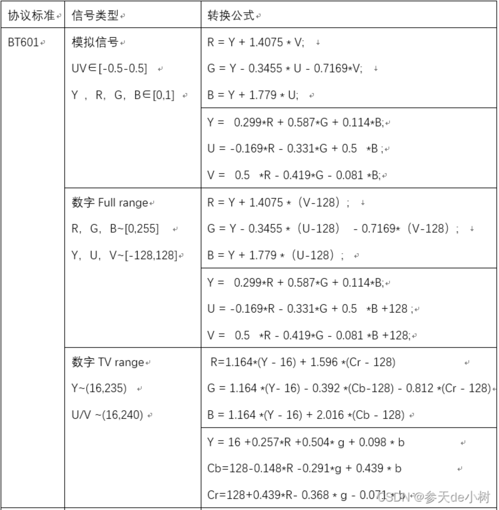
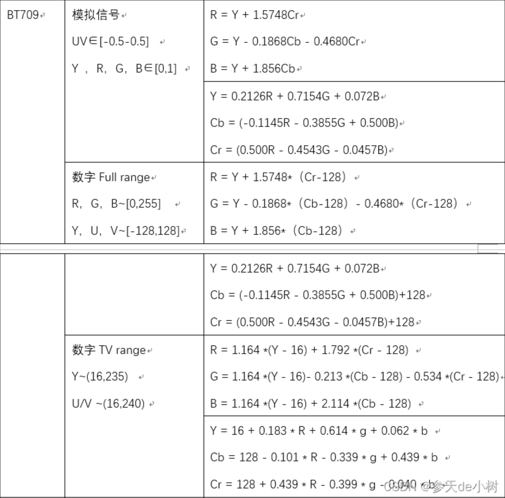
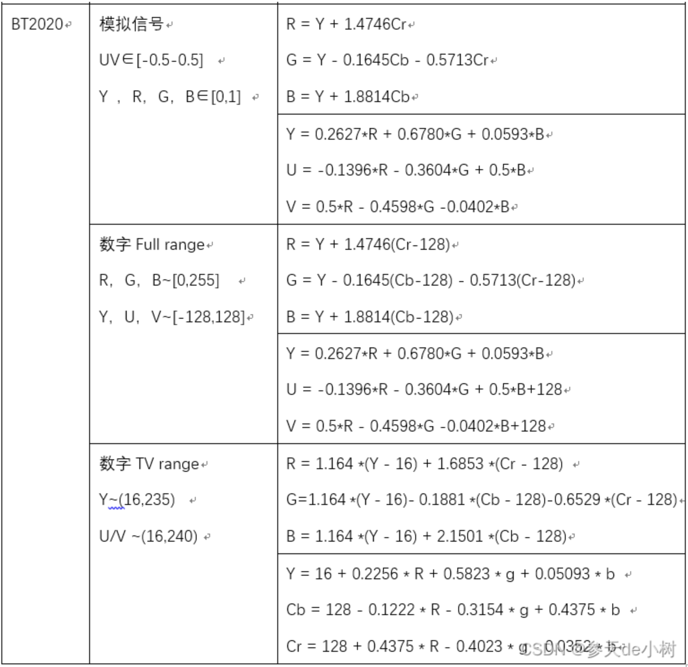

参考： https://blog.csdn.net/m18612362926/article/details/127667954

## 1.前言

RGB,YUV（YCbCr）是常用的颜色空间。RGB图像又称真彩色图像，R、G、B分别代表红、绿、蓝3种不同的颜色。YCbCr模型广泛用于数字视频，Y表示亮度，Cb、Cr分别为蓝色分量和红色分量相对于参考值的坐标。

       不同标准下RGB与YUV之间的转换公式不同，主要有BT601、BT709、BT2020三个标准。网上查到的公式杂乱，在这里做一个系统的总结。

YUV 是YUV颜色空间模式的总称，YUV模式有以下类型：

YUV ： YUV是一种模拟型号， Y∈ [0,1]   U,V∈[-0.5,0.5] 

YCbCr ：也叫YCC或者Y'CbCr，YCbCr 是数字信号，它包含两种形式，分别为TV range和full range，TV range 主要是广播电视采用的标准， full range主要是pc端采用的标准，所以full range 有时也叫 pc range。

TV range 的各个分量的范围为： YUV  Y∈[16,235]   Cb∈[16-240]   Cr∈[16-240] 。

full range 的各个分量的范围均为：0-255 。

PC机显卡输出的为full range模式。

## 2.转换公式

#### BT601

#### BT709

#### BT2020

