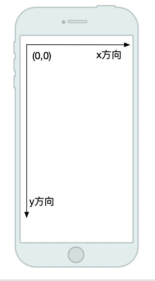
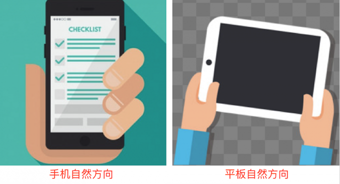
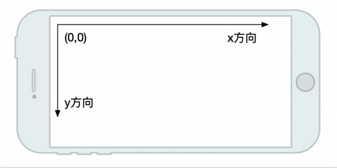
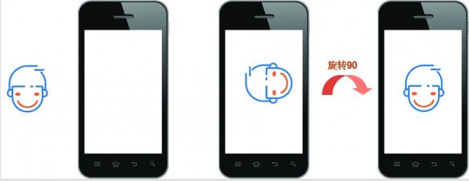
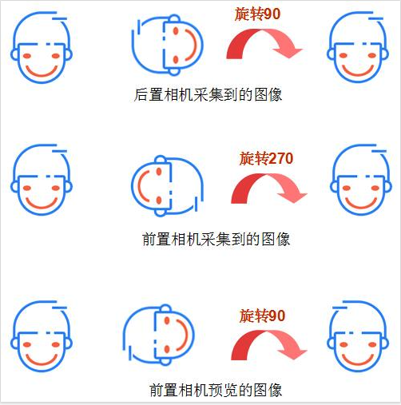

## 数据回调

#### CPU数据回调

```java
mCamera.setPreviewTexture(new SurfaceTexture(GLES11Ext.GL_TEXTURE_EXTERNAL_OES));
final ByteBuffer buffer = ByteBuffer.allocateDirect(calcFrameSize(width, height));
mCamera.addCallbackBuffer(buffer.array());

mCamera.setPreviewCallbackWithBuffer((bytes, camera) -> {
  mCamera.addCallbackBuffer(buffer.array());
});
```

调用前需要addCallbackBuffer和setPreviewTexture，不然可能数据不会回调。回调后也要继续addCallbackBuffer，不然不会继续回调。


#### 2. GPU数据回调

```java
mCamera.setPreviewTexture(mSurfaceTexture);
mSurfaceTexture.setOnFrameAvailableListener(surfaceTexture -> {
  synchronized (SSPEditorEglBase.LOCK) {
    surfaceTexture.updateTexImage();
  }
  surfaceTexture.getTransformMatrix(mTransformMatrix);
  final long timeStampNs = surfaceTexture.getTimestamp();

  if (null != mListener) {
    mListener.onTextureFrameAvailable(mOesTextureId, mTransformMatrix, timeStampNs);
  }
});
```

调用前必须setPreviewTexture，不然不会回调。


## 方向

### 方向

这里的设置方向有两种：图像预览方向和拍照方向。在这之前，需要先介绍几个概念：

- 屏幕坐标方向
- 设备自然方向
- 摄像头传感器方向
- 相机预览方向

### 屏幕坐标方向

在Android系统中，以屏幕左上角为坐标系统的原点(0,0)坐标，该坐标系是固定不变的，不会因为设备方向的变化而改变。



### 屏幕自然方向

每个设备都有一个自然方向，手机和平板自然方向不一样，如图所示，这里盗个图：



默认情况下，平板的自然方向是横屏，而手机的自然方向是竖屏方向。Android系统可以通过View的`OrientationEventListener`监听设备方向，回调方法：

```
abstract public void onOrientationChanged(int orientation);
```

`onOrientationChanged`返回0到359的角度，其中0表示自然方向。


### 摄像头传感器方向



手机相机的图像数据都是来自于摄像头硬件的图像传感器，这个传感器在被固定到手机上后有一个默认的取景方向，方向一般是和手机横屏方向一致，如上图所示。


### 相机预览方向

将摄像头传感器捕获的图像，显示在屏幕上的方向，就是相机预览方向。默认情况下，和摄像头传感器方向一致，可以通过Camera API进行改变。
Camaer1可以使用`setDisplayOrientation`设置预览方向***（注意前置和后置方向是不一样的。这个要设置好，OES拿到的矩阵前置和后置是一样的）***，Camera2则可以通过TextureView来实现。
不同的摄像头位置，`orientation`是不一样的，orientation就是摄像头传感器方向顺时针旋转到屏幕自然方向的角度。

#### 后置

后置的`orientation`90



对横屏来说，屏幕的自然方向和相机的摄像头传感器方向一致的。
对竖屏来说，看到的图像逆时针旋转了90度，因此预览方向需要顺时针旋转90度，才能与屏幕的自然方向保持一致。

#### 前置

前置的`orientation`270，收集到图像后(没有经过镜像处理)，但是要显示到屏幕上，就要按照屏幕自然方向的坐标系来进行显示，需要顺时针旋转270度，才能和设备自然方向一致。预览的时候，做了镜像处理，所以只需要顺时针旋转90度，就能和设置自然方向一致。
那么Camera1和Camera2具体设置预览方向的代码，来自[cameraview](https://github.com/google/cameraview)：

**Camera1**

```java
private int calcDisplayOrientation(int screenOrientationDegrees) {
    if (mCameraInfo.facing == Camera.CameraInfo.CAMERA_FACING_FRONT) {
        return (360 - (mCameraInfo.orientation + screenOrientationDegrees) % 360) % 360;    // compensate the mirror
    } else {  // back-facing
        return (mCameraInfo.orientation - screenOrientationDegrees + 360) % 360;
    }
}
```

代码中区分了前置和后置摄像头。

- 后置：`(mCameraInfo.orientation - screenOrientationDegrees + 360) % 360`，恢复到自然方向需要顺时针旋转，而屏幕逆时针旋转正好抵掉了摄像头的旋转，两者差值+360取模。
- 前置：`(mCameraInfo.orientation + screenOrientationDegrees) % 360`，屏幕竖直方向看到的是一个镜像，360-`(mCameraInfo.orientation + screenOrientationDegrees) % 360`，顺时针旋转这个差值可以到自然方向，只不过这是个镜像，左右翻转了

**Camera2**
使用的TextureView的setTransform进行旋转，并有区分横竖屏。

```java
/**
* Configures the transform matrix for TextureView based on {@link #mDisplayOrientation} and
* the surface size.
*/
void configureTransform() {
    Matrix matrix = new Matrix();
    if (mDisplayOrientation % 180 == 90) {
        final int width = getWidth();
        final int height = getHeight();
        // Rotate the camera preview when the screen is landscape.
        matrix.setPolyToPoly(
                new float[]{
                        0.f, 0.f, // top left
                        width, 0.f, // top right
                        0.f, height, // bottom left
                        width, height, // bottom right
                }, 0,
                mDisplayOrientation == 90 ?
                        // Clockwise
                        new float[]{
                                0.f, height, // top left
                                0.f, 0.f, // top right
                                width, height, // bottom left
                                width, 0.f, // bottom right
                        } : // mDisplayOrientation == 270
                        // Counter-clockwise
                        new float[]{
                                width, 0.f, // top left
                                width, height, // top right
                                0.f, 0.f, // bottom left
                                0.f, height, // bottom right
                        }, 0,
                4);
    } else if (mDisplayOrientation == 180) {
        matrix.postRotate(180, getWidth() / 2, getHeight() / 2);
    }
    mTextureView.setTransform(matrix);
}
```


### 拍照方向

设置预览方向并不会改变拍出照片的方向。
对于后置相机，相机采集到的图像和相机预览的图像是一样的，只需要旋转后置相机orientation度。
对于前置相机来说，相机预览的图像和相机采集到的图像是镜像关系。
采集的图像：顺时针旋转270度后，与屏幕自然方向一致。
预览的图像：顺时针旋转90度后，与屏幕自然方向一致。
最后盗用一张图来说明：



#### Camera1

使用`mCameraParameters.setRotation()`设置拍照后图像方向：

```java
mCameraParameters.setRotation(calcCameraRotation(displayOrientation));
......
/**
* Calculate camera rotation
*
* This calculation is applied to the output JPEG either via Exif Orientation tag
* or by actually transforming the bitmap. (Determined by vendor camera API implementation)
*
* Note: This is not the same calculation as the display orientation
*
* @param screenOrientationDegrees Screen orientation in degrees
* @return Number of degrees to rotate image in order for it to view correctly.
*/
private int calcCameraRotation(int screenOrientationDegrees) {
    if (mCameraInfo.facing == Camera.CameraInfo.CAMERA_FACING_FRONT) {
        return (mCameraInfo.orientation + screenOrientationDegrees) % 360;
    } else {  // back-facing
        final int landscapeFlip = isLandscape(screenOrientationDegrees) ? 180 : 0;
        return (mCameraInfo.orientation + screenOrientationDegrees + landscapeFlip) % 360;
    }
}
```

相机采集到的图像，只需要旋转相机orientation度。

#### Camera2

根据`CameraCharacteristics.SENSOR_ORIENTATION`，使用`captureRequest`设置了JPEG图像的旋转方向。

```java
// Calculate JPEG orientation.
@SuppressWarnings("ConstantConditions")
int sensorOrientation = mCameraCharacteristics.get(
        CameraCharacteristics.SENSOR_ORIENTATION);
captureRequestBuilder.set(CaptureRequest.JPEG_ORIENTATION,
        (sensorOrientation +
                mDisplayOrientation * (mFacing == Constants.FACING_FRONT ? 1 : -1) +
                360) % 360);
```


参考https://yeungeek.github.io/2020/01/24/AndroidCamera-Orientation/