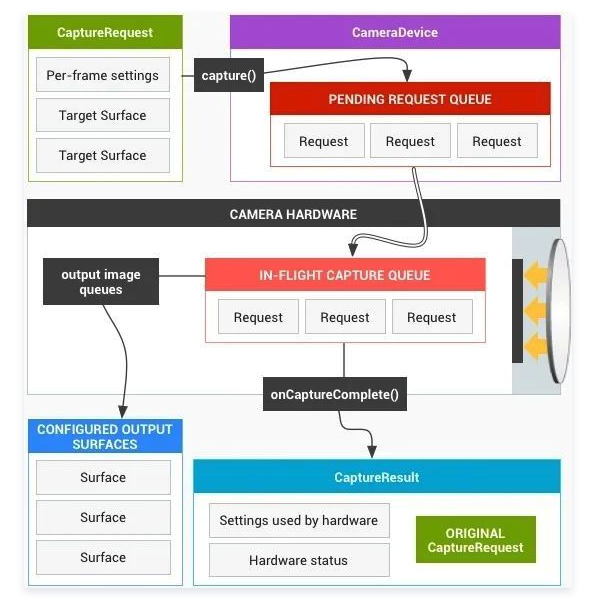
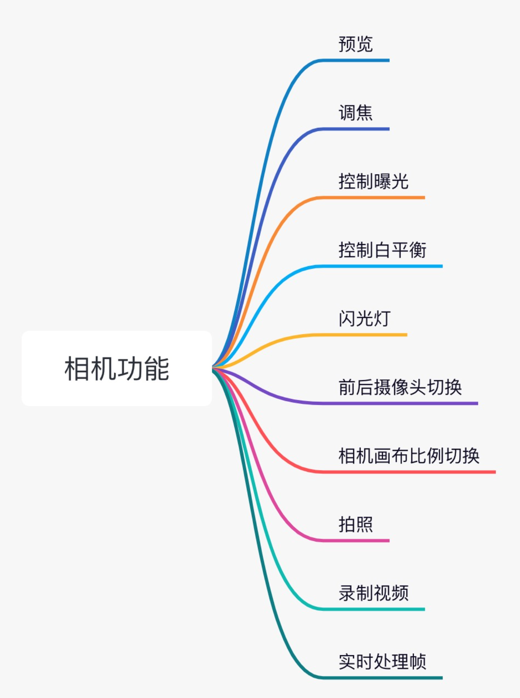
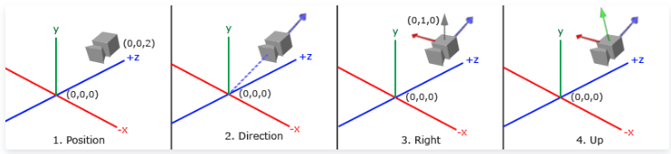

我们接下来要分享VideoEditor中的相机处理模块，但是在分享之前，还是有必要将Camera的一些问题给理清楚，磨刀不误砍柴工，只有比较清晰地掌握Camera的一些特点和应用的规律，后续在优化性能和解决问题的时候就不会手忙脚乱了。


**Camera1和Camera2**

从Android 5.0开始，Android源码引入了Camera2——android.hardware.camera2，之前的Camera——android.hardware.Camera也可以使用，只不过不太建议了。简单概括一下：Camera1有一些固有的缺点，导致Android不得不放弃它。

- Camera1的接口调用都是同步等待的过程，如果执行产生耗时，会影响这个调用流程，虽然可以通过设置子线程处理，但是也还是有点麻烦。
- Camera1提供的优化方法比较少，基本上无法定制化开发Camera，相机开发的处理空白，开发者无法像手机系统那样将手伸到底层，所以可优化的空间很少。
- Camera1提供的相机状态比较少。

Camera2在设计的时候采用Pipeline的模式，它按照顺序处理相机Sensor返回的每一帧然后返给客户端。学习音视频的同学应该很熟悉这种模式，视频解码一帧放入队列，然后另外一个线程分别从这个队列中取出帧，我想之所以这样设置也是为了异步处理。为此Camera2提出了CaptureRequest概念，它认为预览是连续的CaptureRequest，拍照是某个瞬间的CaptureRequest，如下图所示：



相对Camera1，Camera2改进了很多：

- **支持在开启相机之前检查相机信息：**在Camera1上，你无法在打开相机之前检查相机的信息，因为相机的信息必须通过Camera实例提供；但是Camera2提供了CameraCharacteristics专门提供相机的信息，你可以在不打开相机的情况下检查相机的信息。
- **支持在不打开预览的情况下拍照：**在Camera1上，你必须首先打开相机，然后开启预览，之后才能开启拍照。Camera2将这个过程设置成CaptureRequest，你可以在不打开预览的情况下拍照，当然这种情况应用确实不多，不过这正说明Camera2的过程的解耦化做得比较好。
- **支持一次拍摄多张不同格式和尺寸的照片：**在Camera1上，你每次拍照只能拍摄一张。Camera2不仅支持连拍，而且通过设置，还可以支持你连拍过程中拍摄不同尺寸和格式的照片。
- **支持连拍：**同上。
- **控制曝光时间：**在Camera2上你可以在规定的曝光时长范围之后设置拍照的曝光时间，适当的曝光时间可以让画面更加清晰，得到的照片清晰度更高。
- **灵活的3A控制：**3A就是AF(Auto Focus)、AE(Auto Exposure)、AWB(Auto White Balance)，你不仅可以根据需要灵活的配置3A，而且可以实时获取3A状态，定制化程度高了不止一点。


**Camera主要功能**

我们使用Camera，主要为了实现什么功能？下面列出了一个相机应用所应该支持的功能，我们接下来的分享中也是会挑一些重点来讲解一下。

实现一个相机应用，需要结合OpenGL实现渲染绘制，OpenGL通过矩阵运算可以将相机帧以特定的比例映射到渲染画布上，使用OpenGL处理的好处还有后期兼容滤镜、特效等画面处理非常方便。编码使用MediaCodec硬编码和x264/x265软编码来处理视频帧。




**TextureView/SurfaceView/GLSurfaceView**

相机的画布可以使用TextureView、SurfaceView、GLSurfaceView三种，之前我写过一篇比较TextureView和SurfaceView的文章：[聊聊SurfaceView和TextureView](http://mp.weixin.qq.com/s?__biz=MzIwNzI1ODYxMA==&mid=2247483996&idx=1&sn=f2927f3066e8d1fa1eb6554a55d980e9&chksm=971454c1a063ddd7b385a91803fda10195f832a937d56d2c88c984b843d7dfb5e81467f9f502&scene=21#wechat_redirect)，这儿不赘述了，GLSurfaceView集成自SurfaceView，不过内部有一个GLThread创建了一个EGLContext环境，很多相机应用也采用了GLSurfaceView，著名的有gpuimage：https://github.com/cats-oss/android-gpuimage，这个渲染的view看你的选择，如果你的核心逻辑都在底层，建议你采用SurfaceView，EGL环境在native层创建，将GLSurfaceView那一套逻辑移出来。

**Camera调整画布**

开发相机应用中最基本的需要调整画布，实现9/16、3/4、1/1比例，如下图：我们知道标准的相机Size比例只有9/16、3/4，基本上没有1/1的比例的，所以Camera出帧的比例想要设置成1/1的，一般会采用OpenGL渲染，将相机帧投影到渲染画布上。

要定义一个摄像机，我们需要它在世界空间中的位置、观察的方向、一个指向它右侧的向量以及一个指向它上方的向量。创建三个矩阵：正交矩阵、观察矩阵、位移矩阵可以监察相机中物体最终的移动变换。



```c++
glm::mat4 projection = glm::ortho(0.f, static_cast<float>(target_width),
                                  static_cast<float>(target_height), 0.f, 1.f, 100.f);
glm::vec3 position = glm::vec3(0.f, 0.f, 10.f);
glm::vec3 direction = glm::vec3(0.f, 0.f, 0.f);
glm::vec3 up = glm::vec3(0.f, 1.f, 0);
glm::mat4 view_matrix = glm::lookAt(position, direction, up);
auto matrix = glm::mat4(1);
matrix = glm::translate(matrix, glm::vec3(translation_x_, translation_y_, 1.f));
matrix = glm::translate(matrix, glm::vec3(frame_width / 2, frame_height / 2, 0.f));
matrix = glm::rotate(matrix, glm::radians(rotate_), glm::vec3(0.f, 0.f, 1.f));
matrix = glm::scale(matrix, glm::vec3(scale_, scale_, 1.f));
matrix = glm::translate(matrix, glm::vec3(-frame_width / 2, -frame_height / 2, 0.f));
matrix = projection * view_matrix * matrix;    
```

建议参考：

https://learnopengl-cn.github.io/01%20Getting%20started/09%20Camera/


**一个Crash**

使用Camera1的时候有一个地方需要注意了，比较容易出错，导致crash。

```shell
java.lang.RuntimeException: Camera is being used after Camera.release() was called
at android.hardware.Camera.setHasPreviewCallback(Native Method)
at android.hardware.Camera.access$600(Camera.java:156)
at android.hardware.Camera$EventHandler.handleMessage(Camera.java:1286)
at android.os.Handler.dispatchMessage(Handler.java:107)
at android.os.Looper.loop(Looper.java:213)
at android.app.ActivityThread.main(ActivityThread.java:8178)
at java.lang.reflect.Method.invoke(Native Method)
at com.android.internal.os.RuntimeInit$MethodAndArgsCaller.run(RuntimeInit.java:513)
at com.android.internal.os.ZygoteInit.main(ZygoteInit.java:1101)
```

这个crash堆栈是从Camera.setHasPreviewCallback上报的，应该是挂在native层，翻一下源码看一下，在android_hardware_Camera.cpp中找到了具体的源码：

```c++
static void android_hardware_Camera_setHasPreviewCallback(JNIEnv *env, jobject thiz, jboolean installed, jboolean manualBuffer)
{
    ALOGV("setHasPreviewCallback: installed:%d, manualBuffer:%d", (int)installed, (int)manualBuffer);
    // Important: Only install preview_callback if the Java code has called
    // setPreviewCallback() with a non-null value, otherwise we'd pay to memcpy
    // each preview frame for nothing.
    JNICameraContext* context;
    sp<Camera> camera = get_native_camera(env, thiz, &context);
    if (camera == 0) return;

    // setCallbackMode will take care of setting the context flags and calling
    // camera->setPreviewCallbackFlags within a mutex for us.
    context->setCallbackMode(env, installed, manualBuffer);
}

sp<Camera> get_native_camera(JNIEnv *env, jobject thiz, JNICameraContext** pContext)
{
    sp<Camera> camera;
    Mutex::Autolock _l(sLock);
    JNICameraContext* context = reinterpret_cast<JNICameraContext*>(env->GetLongField(thiz, fields.context));
    if (context != NULL) {
        camera = context->getCamera();
    }
    ALOGV("get_native_camera: context=%p, camera=%p", context, camera.get());
    if (camera == 0) {
        jniThrowRuntimeException(env,
                "Camera is being used after Camera.release() was called");
    }

    if (pContext != NULL) *pContext = context;
    return camera;
}
```

其实根本原因还是在Camera已经调用release的时候底层还在使用Camera实例。

```javascript
public final void setPreviewCallback(PreviewCallback cb) {
    mPreviewCallback = cb;
    mOneShot = false;
    mWithBuffer = false;
    if (cb != null) {
        mUsingPreviewAllocation = false;
    }
    // Always use one-shot mode. We fake camera preview mode by
    // doing one-shot preview continuously.
    setHasPreviewCallback(cb != null, false);
}
```

这个方法是启动相机的时候，相机会通过这个回调给上层不断地回调预览帧，我们发生问题的场景，在Camera.release之后，并没有将setPreviewCallback置空，这时候底层想回调帧到上层，但是却发现Camera实例都不在了，所以发生了crash。

```javascript
if (mCamera != null) {
    mCamera.setPreviewCallback(null);
    mCamera.stopPreview();
    mCamera.release();
}
```

相机开发中还会遇到很多问题，如果大家遇到什么奇怪的问题给私信分享一下。我们一起讨论下。