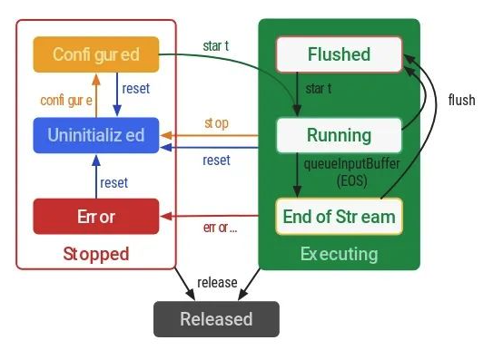
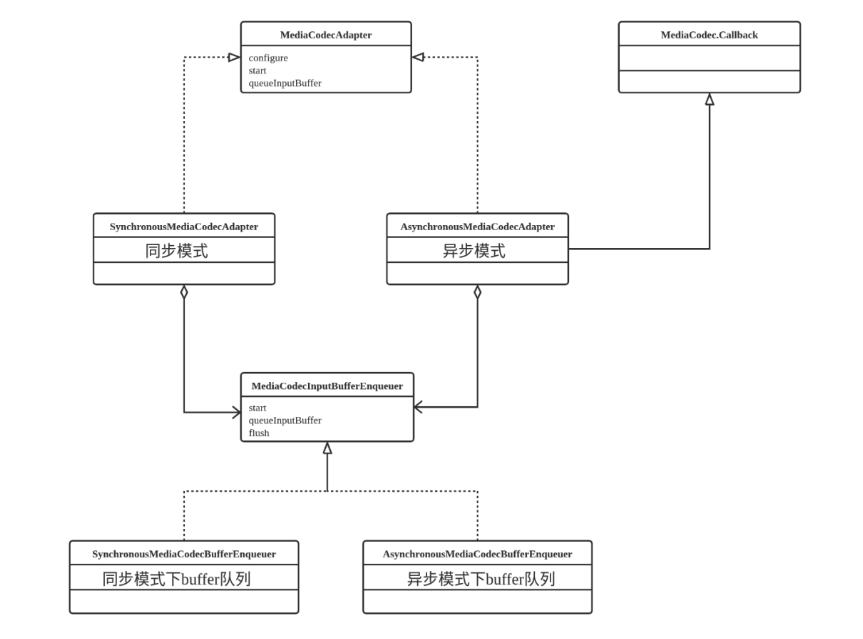
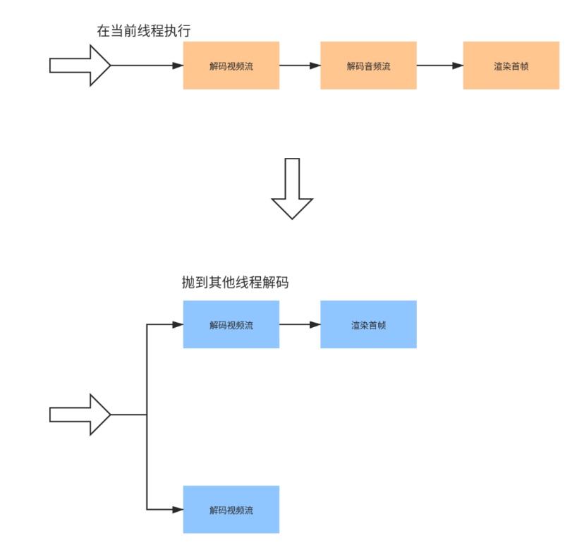

争分夺秒的优化--->为了提供极致的视频播放体验
熟悉MediaCodec解码原理的肯定知道, MediaCodec提供了同步模式和异步模式两种模式:


## MediaCodec异步模式

Android L以及Andrioid L以上的版本提供了异步模式, 通过在codec--->configure中设置callback来将数据处理放在异步线程中完成,然后在回调中处理解码出的数据,给开发者设置了回调,你可以在回调中根据自己的需求来处理原始数据.

- 在调用configure配置MediaCodec之前需要为MediaCodec设置callback，需要实现MediaCodec.Callback接口并重写其中的方法：onInputBufferAvailable 、onOutputBufferAvailable、onOutputFormatChanged、onError，工作时MediaCodec会利用　　　 这四个回调方法来自动的通知Client什么时候input buffer有效，什么时候output buffer有效，什么时候media format发生变化，什么时候运行出错，也是在这些方法中Client向Codec送入数据并得到处理的结果及获取Codec的一些其他信息。
- 异步模式下MediaCodec的状态转换会有些许不同，在调用start方法后会直接进入Running状态;
- 异步处理模式下，调用MediaCodec.start()后Codec 立即进入Running子状态，通过设置的callback中的回调方法onInputBufferAvailable()会自动收到可用(empty)的input buffer，此时可以根据input buffer id调用getInputBuffer(id)得到这个buffer，并将需要的处理的数据写入该buffer中，最后调用queueInputBuffer(id, ...)将该buffer提交给Codec处理；
- Codec每处理完一帧数据就会将处理结果写入一个空的output buffer,并通过回调函数onOutputBufferAvailable来通知Client来读取结果，Client可以根据output bufffer id调用getOutputBuffer(id)获取该buffer并读取结果，完毕后可以调用releaseOutputBuffer(id, ...)释放该buffer给Codec再次使用。

 

```Java
MediaCodec codec = MediaCodec.createByCodecName(name);
MediaFormat mOutputFormat; // member variable 
codec.setCallback(new MediaCodec.Callback() {
  @Override  
  void onInputBufferAvailable(MediaCodec mc, int inputBufferId) {
    ByteBuffer inputBuffer = codec.getInputBuffer(inputBufferId); // fill inputBuffer with valid data …
    codec.queueInputBuffer(inputBufferId, …);  
  }   

  @Override  
  void onOutputBufferAvailable(MediaCodec mc, int outputBufferId, …) {    
    ByteBuffer outputBuffer = codec.getOutputBuffer(outputBufferId);    
    MediaFormat bufferFormat = codec.getOutputFormat(outputBufferId); // option A    
    // bufferFormat is equivalent to mOutputFormat    
    // outputBuffer is ready to be processed or rendered.    …    
    codec.releaseOutputBuffer(outputBufferId, …);  
  }

  @Override  
  void onOutputFormatChanged(MediaCodec mc, MediaFormat format) {    
    // Subsequent data will conform to new format.    
    // Can ignore if using getOutputFormat(outputBufferId)    
    mOutputFormat = format; // option B  
  }

  @Override  void onError(…) {    …  } }
); 

codec.configure(format, …); 
mOutputFormat = codec.getOutputFormat(); // option B 
codec.start(); 
// wait for processing to complete 
codec.stop(); 
codec.release();
```

codec.start()执行的核心处理都放在异步线程中完成,所以又称为异步模式


## MediaCodec同步模式

同步模式当然就是不另起线程去解码数据, 在执行完codec.start()之后,通过codec实例获取InputBuffer和OuputBuffer来获取数据.

- 同步模式下,MediaCodec调用start()方法后会进入Flushed子状态，然后第一次调用dequeueInputBuffer()后才会进入Running子状态。
- 这种模式下，程序需要在一个无限循环中通过调用dequeueInputBuffer(...)和dequeueOutputBuffer(...)来不断地请求Codec是否有可用的input buffer 或 output buffer：
- 如果有可用的input buffer：根据得到的buffer id,调用getInputBuffer(id)获取该buffer，并向其中写入待处理的数据，然后调用queueInputBuffer(id,..)提交到Codec进行处理
- 如果有可用的output buffer: 根据得到的buffer id,调用getOutputBuffer(id)获取该buffer，读取其中的处理结果，然后调用releaseOutputBuffer(id,..)释放该buffer供Codec再次使用
- 处理过程中还可能受到一些特殊标记的buffer id,比如MediaCodec.INFO_OUTPUT_FORMAT_CHANGED，要作出恰当处理

```java
MediaCodec codec = MediaCodec.createByCodecName(name); 
codec.configure(format, …); 
MediaFormat outputFormat = codec.getOutputFormat(); // option B
codec.start(); 
for (;;) {
  int inputBufferId = codec.dequeueInputBuffer(timeoutUs);
  if (inputBufferId >= 0) {    
    ByteBuffer inputBuffer = codec.getInputBuffer(…);    
    // fill inputBuffer with valid data …    
    codec.queueInputBuffer(inputBufferId, …);  
  }  
  int outputBufferId = codec.dequeueOutputBuffer(…);  
  if (outputBufferId >= 0) {    
    ByteBuffer outputBuffer = codec.getOutputBuffer(outputBufferId);    
    MediaFormat bufferFormat = codec.getOutputFormat(outputBufferId); 
    // option A    
    // bufferFormat is identical to outputFormat    
    // outputBuffer is ready to be processed or rendered. …    
    codec.releaseOutputBuffer(outputBufferId, …);  
  } else if (outputBufferId == MediaCodec.INFO_OUTPUT_FORMAT_CHANGED) {    
    // Subsequent data will conform to new format.    
    // Can ignore if using getOutputFormat(outputBufferId)    
    outputFormat = codec.getOutputFormat(); // option B  
  } 
} 

codec.stop(); 
codec.release();
```

我们为了提升ExoPlayer的渲染性能,核心的思路是两个:

> - MediaCodec从同步模式切换为异步模式
> - 播放器在独立的线程中将input buffer提交给MediaCodec


## ExoPlayer中异步模式的应用

MediaCodecRenderer.java中初始化MediaCodec函数中, 会根据设置的mode来建立同步或者异步模式的codec

```java
codec = MediaCodec.createByCodecName(codecName);      
if (mediaCodecOperationMode == OPERATION_MODE_ASYNCHRONOUS_DEDICATED_THREAD && Util.SDK_INT >= 23) {        
  codecAdapter = new AsynchronousMediaCodecAdapter(codec, getTrackType());      
} else if (mediaCodecOperationMode == OPERATION_MODE_ASYNCHRONOUS_DEDICATED_THREAD_ASYNCHRONOUS_QUEUEING && Util.SDK_INT >= 23) {
  codecAdapter = new AsynchronousMediaCodecAdapter(codec, /* enableAsynchronousQueueing= */ true, getTrackType());      
} else {        
  codecAdapter = new SynchronousMediaCodecAdapter(codec);      
}
```



AsynchronousMediaCodecAdapter.java继承MediaCodec.Callback,实现MediaCodec解码的异步模式,同时定义一个专用的HandlerThread,用来处理解码消息.同时在AsynchronousMediaCodecAdapter.java中定义一个buffer队列来处理codec解码出来的原始数据.

```java
@Override  
public void onInputBufferAvailable(MediaCodec codec, int index) {    
  synchronized (lock) {      
    mediaCodecAsyncCallback.onInputBufferAvailable(codec, index);    
  }
}

@Override  
public void onOutputBufferAvailable(MediaCodec codec, int index, MediaCodec.BufferInfo info) {    
  synchronized (lock) {      
    mediaCodecAsyncCallback.onOutputBufferAvailable(codec, index, info);    
  }
}
```

在回调到onInputBufferAvailable函数,将空闲的input buffer存在队列中,然后不断dequeueInputBufferIndex获取对应的input buffer位置,向里面写入原始数据, 开始解码.

解码完成,在onOutputBufferAvailable回调中获取解码完的原始数据,读取完解码之后的原始数据之后,Codec需要将output buffer释放.腾出空间,方便后续的解码数据写入.



从改善前和改善后的流程分析来看, 改善后的流程***节省了等待音频解析的时间***,可以在异步线程中解出视频流数据立即渲染出来, 提升了渲染性能.


## 参考文档

https://medium.com/google-exoplayer/improved-rendering-performance-operating-mediacodec-in-asynchronous-mode-and-asynchronous-buffer-3026207850b2

