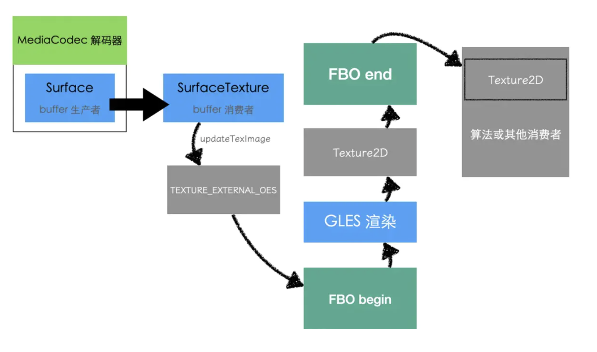
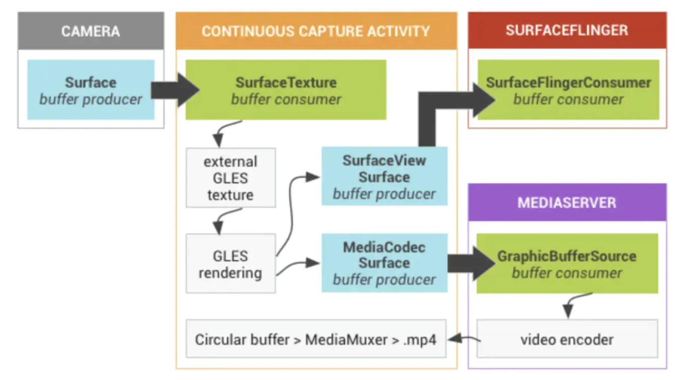
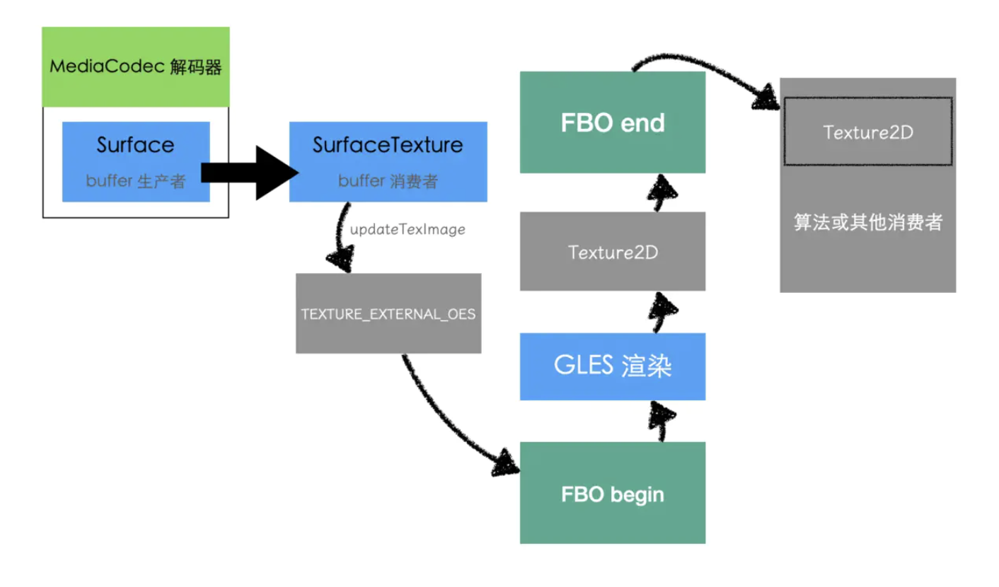

# 背景

在客户端中存在一种应用场景：需要将 MediaCodec 或者 Camera 产生的图像，通过 OpenGL 交给算法做特效，由于算法可能是基于普通的 Texture2D 纹理实现的，而 Android 上更常用的则是 *GL_TEXTURE_EXTERNAL_OES* 纹理，算法一般都是基于 OpenGL 而不是 OpenGLES 环境实现的，所以就需要客户端这边做一个转换工作。



这个转换工作当然最好是在 GPU 中能完成的，因为如果通过 CPU 从 OES 纹理中读出图像数据，再提交到 2D 纹理中，这一来一回，即浪费 CPU 页占有了内存，很不划算。所以就出现了这篇文章，如何利用 OpenGL 将 OES 纹理渲染到普通 2D 纹理上。


# GL_TEXTURE_EXTERNAL_OES 纹理

<font color="red">外部 GLES 纹理 (GL_TEXTURE_EXTERNAL_OES) </font>与传统 GLES 纹理 (GL_TEXTURE_2D) 的区别如下：

- 外部纹理直接在从 BufferQueue 接收的数据中渲染纹理多边形。
- 外部纹理渲染程序的配置与传统的 GLES 纹理渲染程序不同。
- 外部纹理不一定可以执行所有传统的 GLES 纹理活动。

外部纹理的主要优势是它们能够直接从 BufferQueue 数据进行渲染。在 Android 平台上，**BufferQueue** 是连接图形数据生产方和消费方的队列，也就表示 OES 纹理能直接拿到某些生产方产生的图形数据进行渲染。


# OES Texture 渲染到 TEXTURE_2D

比如现在有个需求：使用 MediaCodec 解码视频，最终需要将解码的每一帧渲染到外部设置的一个 TEXTURE_2D 纹理上。

实现方案：MediaCodec 支持将解码结果输出到 Surface 中，我们可以通过构造一个绑定了 OES 纹理的 SurfaceTexture 来为 MediaCodec 构造一个输出 Surface。当解码结果写入到 Surface 的 BufferQueue 之后，再利用 SurfaceTexture 将结果从 BufferQueue 渲染到 OES 纹理上，然后再通过 OpegGL 管道流水线操作将 OES 纹理上的内容渲染到 TEXTURE_2D 纹理：

**MediaCodec 解码到 Surface 伪代码如下：**


```java
oesTextureId = x
sTexture = SurfaceTexture(oesTextureId)
outputSurface = Surface(sTexture)
decoder.setOutputSurface(outputSurface)
```

这里可以借鉴 grafika 中 Buffer 的生成和消费流程:



**然后在参考了 grafika 的流程后设计的流程：**



正如上图所示，**从 TextureOES 到 Texture2D 的关键是利用 FBO(帧缓冲)**。在执行 OpenGL 渲染之前，开始 FBO，渲染完成之后关闭 FBO。


