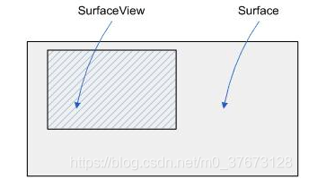
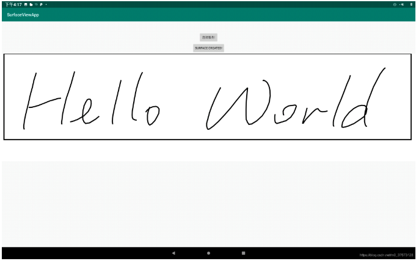

最近在开发地图项目，项目上要求将地图的service和hmi分成两个APP开发，即地图提供的搜索、算路、导航等服务在一个APP中，map的展示在一个APP中。开发中涉及到了mapview的跨进程绘制方案，即surfaceView的跨进程渲染，在此记录一下。


### SurfaceView和View的区别

SurfaceView作为Android界面的载体，与View是一样的作用，谷歌提供SurfaceView的目的是什么呢。

我们都知道，<font color="red">View的刷新机制是监听nativie层的刷新监听，底层每隔16.6ms就会调用onVsync()方法通知app刷新界面，收到监听后View需要在16.6ms之内完成界面的刷新绘制，否则就会出现丢帧情况。</font>而这一系列操作都是在主线程完成的，这也是有时候绘制复杂，界面卡顿的原因。

SurfaceView可以在子线程中绘制，不会影响主线程的响应，且SurfaceView在底层使用了双缓冲机制，避免了屏幕闪烁的问题


### 双缓冲技术

双缓冲技术是游戏开发中的一个重要的技术。当一个动画争先显示时，程序又在改变它，前面还没有显示完，程序又请求重新绘制，这样屏幕就会不停地闪烁。

而双缓冲技术是把要处理的图片在内存中处理好之后，再将其显示在屏幕上。双缓冲主要是为了解决 反复局部刷屏带来的闪烁。把要画的东西先画到一个内存区域里，然后整体的一次性画出来。

因此，View适合被动刷新界面的情况下使用（用户操作触发刷新），SurfaceView适合主动刷新界面的情况使用。

本文所讲的是SurfaceView在跨进程方案中的使用。项目中使用aidl技术作为跨进程通信的手段，但aidl只能传递序列化的对象，图商提供的mapView明显不符合传递规则，**因此，只能用surfaceView作为地图的载体，将surface通过跨进程传递给service渲染，同时将surfaceView的点击事件传递给service处理。**

为了更好地描述跨进程的实现，就以最简单的例子来阐述，意在过程，不在细节。

采用Aidl实现跨进程通信，直接看代码：


### Service

首先定义一个aidl接口，这是实现aidl通信的第一步，注意在APP中同样需要定义一个完全相同的接口，且包名需要保持一致。

```java
// SurfaceViewManager.aidl
package com.skydianshi.surfaceaidlservice;

import android.view.Surface;
import android.view.MotionEvent;

// Declare any non-default types here with import statements

interface SurfaceViewManager {
    // SurfaceView onCreate时调用
    void surfaceCreated(in Surface surface);
    // SurfaceView onChange时调用
    void surfaceChanged(in Surface surface);
    // SurfaceView onDestroy时调用
    void surfaceDestroyed(in Surface surface);
    // 发送SurfaceView的Touch事件
    void sendTouchEvent(in MotionEvent event);
}
```


Service的代码特别简单，就是在客户端绑定成功将aidl的实现类作为binder返回，方便客户端调用，SurfaceManager是SurfaceViewManager的实现类，在后文会讲到，也是实现SurfaveView跨进程绘制的关键实现类。

```java
public class MyService extends Service {
    public MyService() {
    }

    @Override
    public void onCreate() {
        Log.e("MyService", "onCreate");
        super.onCreate();
    }

    @Override
    public IBinder onBind(Intent intent) {
        // 将SurfaceManager作为Binder返回。
        return new SurfaceManager().asBinder();
    }

    @Override
    public boolean onUnbind(Intent intent) {
        Log.e("MyService", "onUnbind");
        return super.onUnbind(intent);
    }
}
```


这里要注意的是，一定要将service的exported属性置为true，否则客户端无法跨进程绑定该Service。

```xml
  <service
      android:name=".MyService"
      android:exported="true"
  </service>
```

具体的实现了什么功能待会儿再讲，我们先看一下客户端的搭建。


### 客户端

首先要将aidl接口原封不动的copy过来，包名啥的一个都不能错。

界面也很简单，就两个按钮，一个SurfaceView。两个按钮分别控制service的绑定和SurfaceView的创建，SurfaceView初始化不显示，服务连接成功后再启动SurfaceView的生命周期。

```xml
<?xml version="1.0" encoding="utf-8"?>
<androidx.constraintlayout.widget.ConstraintLayout xmlns:android="http://schemas.android.com/apk/res/android"
    xmlns:app="http://schemas.android.com/apk/res-auto"
    xmlns:tools="http://schemas.android.com/tools"
    android:layout_width="match_parent"
    android:layout_height="match_parent"
    tools:context=".MainActivity">

    <Button
        android:id="@+id/bind_service"
        android:layout_width="wrap_content"
        android:layout_height="wrap_content"
        android:text="连接服务!"
        android:layout_marginTop="50dp"
        app:layout_constraintLeft_toLeftOf="parent"
        app:layout_constraintRight_toRightOf="parent"
        app:layout_constraintTop_toTopOf="parent" />

    <Button
        android:id="@+id/create_surface"
        android:layout_width="wrap_content"
        android:layout_height="wrap_content"
        android:text="Surface created!"
        android:layout_marginTop="100dp"
        app:layout_constraintLeft_toLeftOf="parent"
        app:layout_constraintRight_toRightOf="parent"
        app:layout_constraintTop_toTopOf="parent" />

    <SurfaceView
        android:id="@+id/surface"
        android:layout_width="match_parent"
        android:layout_height="500dp"
        android:layout_marginTop="150dp"
        app:layout_constraintTop_toTopOf="parent"
        android:visibility="gone"/>

</androidx.constraintlayout.widget.ConstraintLayout>
```


客户端需要做的事不多，只需要将Surface传给service，并做好SurfaceView的生命周期管理即可，其他的交给service去处理。**不禁要问一下，为什么可以传递Surface呢，为什么service拿到Surface就能跨进程绘制SurfaceView呢？**

首先回答一下第一个问题，跨进程传递的对象必须实现了Parceble接口，而Surface实现了，满足了跨进程传递的基本条件，所以它可以传递。

第二个问题的答案在于Surface，SurfaceView和SurfaceHolder这三个类中，从命名上就可以看出他们跟Surface的关系不简单。详细的说明可以去看一下Surface、SurfaceView、SurfaceHolder及SurfaceHolder.Callback之间的关系*https://blog.csdn.net/u013898698/article/details/79397437*

这里简单总结一下文中所述：


### Surface：

官方定义Surface为“由屏幕显示内容合成器(screen compositor)所管理的原生缓冲器的句柄”，可以理解为绘制内容所真正存在的地方

- **通过Surface（因为Surface是句柄）就可以获得原生缓冲器以及其中的内容。就像在C语言中，可以通过一个文件的句柄，就可以获得文件的内容一样；**
- **原生缓冲器（rawbuffer）是用于保存当前窗口的像素数据的。**
- **查看源码可以发现，Surface中有一个Canvas成员，专门用于画图的。**

**所以，Surface中的Canvas成员，是专门用于供程序员画图的场所，就像黑板一样；其中的原生缓冲器是用来保存数据的地方；**Surface本身的作用类似一个句柄，得到了这个句柄就可以得到其中的Canvas、原生缓冲器以及其它方面的内容。

**通过对Surface的描述，我们可以知道，Surface相当于一个句柄，拿到Surface就可以持有其中的Canvas对象，原生缓冲器等，这也解释了为啥将Surface传递给Service就可以跨进程绘制的问题。**

那问题又来了，通过Surface是可以将内容绘制成功保存到原生缓冲器中，但那仅仅是绘制在内存中，但SurfaceView怎么展现的呢？


### SurfaceView

首先我们从名字来看一下，SurfaceView，简单分析不就是展示Surface的View嘛，再来看一下Surface怎么来的，SurfaceView.getHolder().getSurface。哦，Surface是SurfaceViewHolder从SurfaceView中拿到的，具体怎么拿到的先不管。

在Android中Surface是从Object派生而来，且实现了Parcelable接口。看到Parcelable就让人能很自然地想到数据容器，SurfaceView就是用来展示Surface中的数据的。在这个层面上而言，Surface就是管理数据的地方，SurfaceView就是展示数据的地方。

用一张图来表示Surface和SurfaceView的关系： 




### SurfaceViewHolder

SurfaceHolder是一个接口，其作用就像一个关于Surface的监听器。通过其内部的静态子接口SurfaceHolder.Callback提供访问和控制SurfaceView背后的Surface 相关的方法 ，它通过三个回调方法，让我们可以感知到Surface的创建、销毁或者改变。除了生命周期的管理外，他还提供了很多重要的方法：

- abstract void addCallback(SurfaceHolder.Callbackcallback)，添加Surface生命周期变化的回调接口。
- abstract Canvas lockCanvas()，锁定Surface中的画布并返回该画布，拿到画布之后就可以基于该画布绘制内容了，加锁是为了防止多个线程同步访问该画布。
- abstract Canvas lockCanvas(Rectdirty)，锁定指定区域的画布，效率更高
- abstract void unlockCanvasAndPost(Canvascanvas)，绘制完成后，释放同步锁并提交更改，SurfaceView也将展示新的内容，与此同时，Surface中相关数据会被丢失。

从设计模式的高度来看，Surface、SurfaceView和SurfaceHolder实质上就是广为人知的MVC，即Model-View-Controller。Model就是模型的意思，或者说是数据模型，或者更简单地说就是数据，也就是这里的Surface；View即视图，代表用户交互界面，也就是这里的SurfaceView；SurfaceHolder很明显可以理解为MVC中的Controller（控制器）。这样看起来三者之间的关系就清楚了很多。

好了，这下对于为何传递Surface应该有了更为清晰的认识了，简单来说，就是在客户端提供Surface的展示位SurfaceView，在服务端对Surface进行渲染并提交，就可以在客户端展示更新后的页面，需要注意的是，一定要注意Surface生命周期的管理，这部分由SurfaceHolder来负责。来看一下客户端的代码。

```java
public class MainActivity extends AppCompatActivity implements View.OnClickListener , SurfaceHolder.Callback, SurfaceView.OnTouchListener{

    Button bindServiceBt;
    Button createSurfaceBt;
    SurfaceView surfaceView;
    SurfaceViewManager manager;

    @Override
    protected void onCreate(Bundle savedInstanceState) {
        super.onCreate(savedInstanceState);
        setContentView(R.layout.activity_main);
        initView();
    }

    @SuppressLint("ClickableViewAccessibility")
    private void initView() {
        bindServiceBt = findViewById(R.id.bind_service);
        createSurfaceBt = findViewById(R.id.create_surface);
        surfaceView = findViewById(R.id.surface);
        bindServiceBt.setOnClickListener(this);
        createSurfaceBt.setOnClickListener(this);
        surfaceView.getHolder().addCallback(this);
        surfaceView.setClickable(true);
        surfaceView.setOnTouchListener(this);
    }

    @Override
    public void onClick(View view) {
        switch (view.getId()) {
            case R.id.bind_service:
                // 绑定service
                Intent intent = new Intent();
                intent.setClassName("com.skydianshi.surfaceaidlservice", "com.skydianshi.surfaceaidlservice.MyService");
                bindService(intent, serviceConn, Context.BIND_AUTO_CREATE);
                break;
            case R.id.create_surface:
                // 将SurfaceView设为可见，这也是SurfaceView生命周期的开始。
                surfaceView.setVisibility(View.VISIBLE);
                break;
            default:
                break;
        }
    }

    ServiceConnection serviceConn = new ServiceConnection() {
        @Override
        public void onServiceConnected(ComponentName componentName, IBinder iBinder) {
            Log.e("MainActivity", "onServiceConnected: success");
            // 连接成功后拿到管理器
            manager = SurfaceViewManager.Stub.asInterface(iBinder);
        }

        @Override
        public void onServiceDisconnected(ComponentName componentName) {

        }
    };

    /**
     * 将SurfaceView的生命周期对应时间点完成绘制
     */
    @Override
    public void surfaceCreated(SurfaceHolder surfaceHolder) {
        try {
            manager.surfaceCreated(surfaceHolder.getSurface());
        } catch (RemoteException e) {
            e.printStackTrace();
        }
    }

    @Override
    public void surfaceChanged(SurfaceHolder surfaceHolder, int i, int i1, int i2) {
        try {
            manager.surfaceChanged(surfaceHolder.getSurface());
        } catch (RemoteException e) {
            e.printStackTrace();
        }
    }

    @Override
    public void surfaceDestroyed(SurfaceHolder surfaceHolder) {
        try {
            manager.surfaceDestroyed(surfaceHolder.getSurface());
        } catch (RemoteException e) {
            e.printStackTrace();
        }
    }

    /**
     * 将SurfaceView的Touch事件传递给Service处理
     */
    @Override
    public boolean onTouch(View view, MotionEvent motionEvent) {
        try {
            manager.sendTouchEvent(motionEvent);
        } catch (RemoteException e) {
            e.printStackTrace();
        }
        return false;
    }
}
```

客户端的代码就讲完了，总结一下就是做了三件事：

1. 绑定服务并拿到服务端的管理Binder，通过该Manager来调用服务端的方法。
2. 实现了SurfaceHolder的回调方法，在Surface的各生命周期中调用了服务端对应的方法，具体的处理会在服务端实现（比如在Surface的onCreate方法和onChange方法之间绘图）
3. 将SurfaceView的Touch事件发送给服务端处理。

还剩下服务端最后一部分代码，SurfaceViewManager的实现类，这部分代码也很简单。

```java
public class SurfaceManager extends SurfaceViewManager.Stub {
    Canvas mCanvas;
    Paint mPaint;
    Path mPath;
    private Surface mSurface;

    @Override
    public void surfaceCreated(Surface surface) throws RemoteException {
        Log.i("SurfaceManager", "surfaceCreated: ");
        // 拿到客户端Surface
        mSurface = surface;
        // 路径
        mPath = new Path();
        mPath.moveTo(0, 100);
        draw();
    }

    @Override
    public void surfaceChanged(Surface surface) throws RemoteException {
        Log.i("SurfaceManager", "surfaceChanged: ");
    }

    @Override
    public void surfaceDestroyed(Surface surface) throws RemoteException {
        Log.i("SurfaceManager", "surfaceDestroyed: ");
    }

    @Override
    public void sendTouchEvent(MotionEvent event) throws RemoteException {
        int x = (int) event.getX();
        int y = (int) event.getY();

        switch (event.getAction()){
            case MotionEvent.ACTION_DOWN:
                mPath.moveTo(x, y);
                break;
            case MotionEvent.ACTION_MOVE:
                mPath.lineTo(x, y);
                draw();
                break;
            case MotionEvent.ACTION_UP:
                break;
        }
    }

    // 绘图
    private void draw() {
        try {
            mPaint = new Paint();
            mPaint.setColor(Color.BLACK);
            mPaint.setStyle(Paint.Style.STROKE);
            mPaint.setStrokeWidth(5);
            mPaint.setAntiAlias(true);

            //获得canvas对象
            mCanvas = mSurface.lockCanvas(new Rect(0,0,1920,500));
            Log.e("SurfaceManager", "canvas size" + mCanvas.getWidth() + "-" + mCanvas.getHeight());
            //绘制背景
            mCanvas.drawColor(Color.WHITE);

            mCanvas.drawRect(10, 0, 1900,400, mPaint);
            //绘制路径
            mCanvas.drawPath(mPath, mPaint);
        }catch (Exception e){
            e.printStackTrace();
        }finally {
            if (mCanvas != null){
                //释放canvas对象并提交画布
                mSurface.unlockCanvasAndPost(mCanvas);
            }
        }
    }
}
```

代码比较简单也有批注，就不多加描述了，主要实现的就是手写板的功能。拿到画布之后根据手指touch的位置进行划线并提交，客户端进行展示绘制图像。 



至此跨进程Surface渲染的demo就讲完了，比较简单，但基本流程算是讲完了，其中还有很多代码细节需要深究，比如Surface的生命周期管理，SurfaceView展示Surface的底层逻辑等，感兴趣的小伙伴可以继续深究下去。

> *原文链接: https://blog.csdn.net/m0_37673128/article/details/113265492*


### **题目**

另一个重要的原因是，GPU 更适合图形、图像的处理，裸眼3D效果中有大量的缩放和位移操作，都可在 java 层通过一个 矩阵 对几何变换进行描述，通过 shader 小程序中交给 GPU 处理 ——因此，理论上 OpenGL 的渲染性能比其它几个方案更好一些。

如上图所示，每个头部边缘关键点和头部中心点确定一条直线，这条直线可以用二元一次方程来表示，它与上述矩形边的交点，可以通过求解二元一次方程得出。

实现代码路径见阅读原文末。