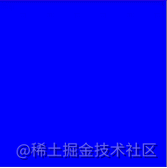
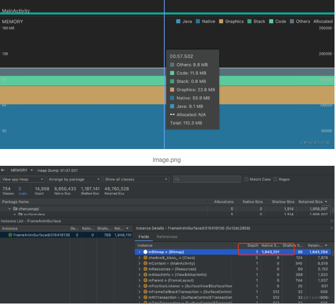

# 一、SurfaceView

以刷新率为60Hz的手机为例，屏幕刷新的时间间隔是16ms，如果View在16ms内没有执行完绘图操作，就会造成掉帧，所以一些绘制`频繁且复杂`的控件如果单纯继承View在主线程去绘制则很难避免卡顿

SurfaceView基于`双缓冲技术`很好的解决了普通View在主线程绘制频繁且繁重的绘图任务是造成卡顿的问题，SurfaceView`自带画布`且`支持在子线程中去更新画布内容`


#### 1.1 双缓冲技术

双缓冲技术涉及两个图形缓冲区，其中一个为`前端缓冲区`，另一个为`后端缓冲区`，前端缓冲区对应屏幕正在显示的内容，后端缓冲区则是接下来要渲染的图形缓冲区。通过`surfaceHolder.unlockCanvas()`获取后端缓冲区，对他进行绘制后调用`surfaceHolder.unlockCanvasAndPost(mCanvas)`将后端缓冲区和前端缓冲区进行交换，后端缓冲区变成前端缓冲区，并把内容显示在屏幕上，而原来的前端缓冲区则变成了后端缓冲区，等待下一次surfaceHolder.lockCanvas()时返回给用户，如此往复


#### 1.2 SurfaceView基本使用

```kotlin
class MySurfaceView @JvmOverloads constructor(
    context: Context,
    attrs: AttributeSet? = null,
    defStyleAttr: Int = 0
) : SurfaceView(context, attrs, defStyleAttr), SurfaceHolder.Callback {

    private var mSurfaceHolder: SurfaceHolder = holder
    private lateinit var mCanvas: Canvas
    private var mIsDrawing = false
    private var mBgColor: Int = Color.RED
    private var mColors =
        intArrayOf(Color.RED, Color.BLACK, Color.BLUE, Color.DKGRAY, Color.GREEN, Color.YELLOW)

    init {
        mSurfaceHolder.addCallback(this)
        isFocusable = true
        isFocusableInTouchMode = true
        keepScreenOn = true
    }

    override fun surfaceCreated(p0: SurfaceHolder) {
        mIsDrawing = true
        Thread{
            while (mIsDrawing) {
                drawContent()
                mBgColor = mColors[Random().nextInt(mColors.size)]
            }
        }.start()
    }

    override fun surfaceChanged(p0: SurfaceHolder, p1: Int, p2: Int, p3: Int) {
    }

    override fun surfaceDestroyed(p0: SurfaceHolder) {
        mIsDrawing = false
    }

    private fun drawContent() {
        try {
            Thread.sleep(1000)

            mCanvas = mSurfaceHolder.lockCanvas()
            mCanvas.drawColor(mBgColor)
        } catch (e: Exception) {
            e.printStackTrace()
        } finally {
            mSurfaceHolder.unlockCanvasAndPost(mCanvas)
        }
    }
}
```

上面的控件继承SurfaceView实现SurfaceHolder.Callback接口，实现1s变化一次控件背景色



```
与普通View不同的是，SurfaceView它有自己的Surface 在WMS和SF中，它与宿主窗口是分离的
```

也因此，Surface不在View hierachy中，它的显示也不受View的属性控制，SurfaceView 不能嵌套使用。在7.0版本之前不能进行平移，缩放等变换，也不能放在其它ViewGroup中，在7.0版本之后可以进行平移，缩放等变换。

SurfaceView涉及三个概念

- Surface：保存着缓存画布和绘图内容的相关各种信息
- SurfaceView：代表用户的交互界面
- SurfaceHolder：SurfaceView需通过SurfaceHolder来操作Surface

Surface-SurfaceView-SurfaceHolder有点类似于MVC模型，View通过Control与Model层交互，SurfaceView负责把Surface的数据展示在出来，并且需要通过SurfaceHolder这个控制层才能于Surface交互


#### 1.3 SurfaceView使用场景

上面的栗子中通过mSurfaceHolder.lockCanvas()获得画布，绘制完成后，通过mSurfaceHolder.unlockCanvasAndPost(mCanvas)把画布交换到前端缓冲区并显示，而在普通的view中调用通过invalidate()触发draw(Canvas canvas)直接绘制画布。

在SurfaceView中调用invalidate()是无法触发draw(Canvas canvas)方法的，因为它在构造方法中调动了`setWillNotDraw(true)`设置了这个控件无需调用draw()方法，类似设置了setWillNotDraw(true)还有LinearLayout等容器控件一般也是不需要执行draw()方法的

这也表明Google开发者希望我们在使用SurfaceView时通过子线程去获取缓存画布进行绘制

总的来说SurfaceView使用场景：

- 当界面需要不停的主动更新，且绘制处理的数据量比较大时适合使用SurefaceView
- 当界面需要被动更新，如手势触摸等场景则不合适使用，因为onTouch收到的事件是在主线程，而SurfaceView绘制是在自己的子线程，触发一次绘制还涉及到线程之间的通信，这显然是不合适使用SurfaceView的


### 二、TextureView

和SurfaceView不同，TextureView`它不会在WMS中单独创建窗口，而是作为View hierachy中的一个普通View`，因此可以和其它普通View一样进行移动，旋转，缩放，动画等变化。值得注意的是`TextureView必须在硬件加速的窗口中使用`


#### 2.1 TextureView基本用法

```kotlin
class MyTextureView @JvmOverloads constructor(
    context: Context,
    attrs: AttributeSet? = null,
    defStyleAttr: Int = 0
) : TextureView(context, attrs, defStyleAttr), TextureView.SurfaceTextureListener {
    private var mIsRunning = false
    private lateinit var mThread: Thread
    private var mFps = 1F
    private var mCanvas: Canvas? = null
    private var mColors =
        intArrayOf(Color.RED, Color.BLACK, Color.BLUE, Color.DKGRAY, Color.GREEN, Color.YELLOW)

    init {
        surfaceTextureListener = this
    }

    override fun onSurfaceTextureAvailable(p0: SurfaceTexture, p1: Int, p2: Int) {
        mIsRunning = true
        mThread = Thread {
            while (true) {
                val startTime = System.currentTimeMillis()
                drawContent()
                val needTime = startTime - System.currentTimeMillis()
                val oneFrameTime = 1000 / mFps
                if (needTime < oneFrameTime) {
                    Thread.sleep((oneFrameTime - needTime).toLong())
                }
            }
        }
        mThread.start()
    }

    private fun drawContent() {
        try {
            mCanvas = lockCanvas()
            mCanvas?.drawColor(mColors[Random().nextInt(mColors.size)])
        } catch (e: Exception) {
            e.printStackTrace()
        } finally {
            mCanvas?.let {
                unlockCanvasAndPost(it)
            }
        }
    }

    override fun onSurfaceTextureSizeChanged(p0: SurfaceTexture, p1: Int, p2: Int) {

    }

    override fun onSurfaceTextureDestroyed(p0: SurfaceTexture): Boolean {
        mIsRunning = false
        return mIsRunning
    }

    override fun onSurfaceTextureUpdated(p0: SurfaceTexture) {

    }
}
```

类似于上面的SurefaceView的栗子一样，实现了1s变化一次背景色


#### 2.2 SurfaceView和TextView区别

这个是面试中经常问到的问题，可以从下面几个方面做比较

|            | SurfaceView                   | TextureView |
| :--------- | :---------------------------- | :---------- |
| 内存       | 低                            | 高          |
| 绘制       | 及时                          | 1~3帧的延迟 |
| 耗电       | 低                            | 高          |
| 动画与截图 | (Android 7.0之前的版本)不支持 | 支持        |


### 三、SurfaceView实例-帧动画优化避免OOM

Android为帧动画的实现提供了`AnimationDrawable`的实现方式

```kotlin
val duration = 60
val animationDrawable = AnimationDrawable()
val intArray = Util.getSourceId()
for (sourceId in intArray) {
    ContextCompat.getDrawable(this, sourceId)?.let {
        animationDrawable.addFrame(it, duration)
    }
}
imgView.setImageDrawable(animationDrawable)
animationDrawable.start()
```

但是在实际使用中会造成内存问题，因为AnimationDrawable会把每一帧的图片都以bitmap的形式加载到内存中，内存占用过高造成频繁gc,甚至最终OOM

Bitmap的内存占用计算公式为像素个数*Bitmap的色彩模式，色彩模式ARGB_8888占用4个字节，无透明通道的RGB_565占用2个字节

```
针对这一个问题的优化方案就是针对Bitmap内存占用的优化，我们可以通过SurfaceView在子线程去逐帧绘制Bitmap，下一帧的Bitmap复用上一帧的Bitmap内存，达到内存复用的目的，避免了所有帧图片都全部加载进内存造成OOM
```

大致实现如下

```kotlin
class FrameAnimSurface @JvmOverloads constructor(
    context: Context,
    attrs: AttributeSet? = null,
    defStyleAttr: Int = 0
) : SurfaceView(context, attrs, defStyleAttr), SurfaceHolder.Callback {

    private var mSurfaceHolder: SurfaceHolder = holder
    private lateinit var mCanvas: Canvas
    private var mIsDrawing = false

    //当前播放图片的下标
    private var mCurrentIndex = 0

    //一张图片执行的时长
    private var mDuration = 60

    //复用的bitmap
    private var mBitmap: Bitmap? = null

    private var mResources = Util.getSourceId()

    private var mBitmapRect = Rect()

    private var mViewRect: Rect = Rect()

    private var mPaint: Paint = Paint()

    private var mOptions: BitmapFactory.Options = BitmapFactory.Options()

    init {
        //bitmap复用需设置可变类型
        mOptions.inMutable = true
        mOptions.inPreferredConfig = Bitmap.Config.RGB_565

        val options = BitmapFactory.Options()
        options.inJustDecodeBounds = true
        BitmapFactory.decodeResource(resources, mResources[0], options)
        mBitmapRect.set(0, 0, options.outWidth, options.outHeight)

        mSurfaceHolder.addCallback(this)
        isFocusable = true
        isFocusableInTouchMode = true
        keepScreenOn = true
    }

    override fun surfaceCreated(p0: SurfaceHolder) {
        mViewRect.set(0, 0, width, height)
        mIsDrawing = true
        Thread {
            while (mIsDrawing) {
                for (resourceId in mResources) {
                    val beginTime = System.currentTimeMillis()
                    createBitmap(resourceId)
                    draw()
                    val userTime = System.currentTimeMillis() - beginTime
                    if (userTime < mDuration) {
                        Thread.sleep(mDuration - userTime)
                    }
                }
            }
        }.start()
    }

    override fun surfaceDestroyed(p0: SurfaceHolder) {
        mIsDrawing = false
    }

    private fun draw() {
        try {
            mCanvas = mSurfaceHolder.lockCanvas()
            mBitmap?.let { bmp ->
                mCanvas.drawBitmap(bmp, mBitmapRect, mViewRect, mPaint)
            }

        } catch (e: Exception) {
            e.printStackTrace()
        } finally {
            mSurfaceHolder.unlockCanvasAndPost(mCanvas)
        }
    }

    override fun surfaceChanged(p0: SurfaceHolder, p1: Int, p2: Int, p3: Int) {}

    private fun createBitmap(resourceId: Int) {
        mBitmap = BitmapFactory.decodeResource(resources, resourceId, mOptions)
        //复用bitmap
        mOptions.inBitmap = mBitmap
    }
}
```

实现效果如下


通过Profile对内存的占用情况进行分析，内存占用低且平稳



对内存堆栈分析，为mBitmap分配了一个对象，占用了1843201bit的Native内存

单张图片宽为720 高1280，Bitmap.Config设置RGB_565模式，一张图片理论上所占用的内存为 720 * 1280 * 2=1843200 ，正好等于上图堆栈中的1843201，表明只创建了一个mBitmap实例，达到了内存复用的目的


### 四、源码地址

*https://github.com/daleige/AndroidSample*

来源：*https://juejin.cn/post/7082645693441474573*