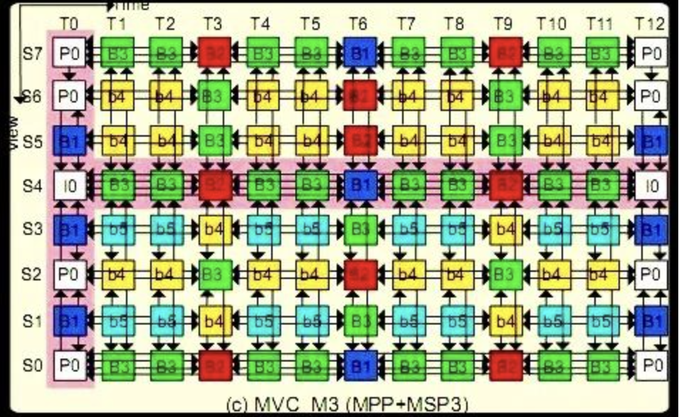
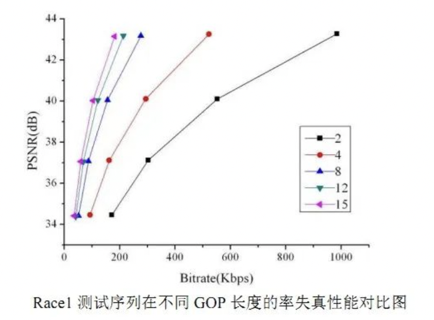

## H.264简介

H.264是新一代的编码标准，以高压缩高质量和支持多种网络的流媒体传输著称。

在H.264协议里定义了三种帧，完整编码的帧叫 I 帧，参考之前的 I 帧生成的只包含差异部分编码的帧叫 P 帧，还有一种参考前后的帧编码的帧叫 B 帧。
H.264采用的核心算法是**帧内压缩和帧间压缩，帧内压缩是生成 I 帧的算法，帧间压缩是生成 B 帧和 P 帧的算法。**

## 序列的说明

在H.264中图像以序列为单位进行组织，一个序列是一段图像编码后的数据流，以 I 帧开始，到下一个 I 帧结束。

**一个序列的第一个图像叫做 IDR 图像（立即刷新图像），IDR 图像都是 I 帧图像。**

**H.264 引入 IDR 图像是为了解码的重同步，当解码器解码到 IDR 图像时，立即将参考帧队列清空，将已解码的数据全部输出或抛弃，重新查找参数集，开始一个新的序列**。

这样，如果前一个序列出现重大错误，在这里可以获得重新同步的机会。IDR 图像之后的图像永远不会使用 IDR 之前的图像的数据来解码。
一个序列就是一段内容差异不太大的图像编码后生成的一串数据流。

当运动变化比较少时，一个序列可以很长，因为运动变化少就代表图像画面的内容变动很小，所以就可以编一个 I 帧，然后一直 P 帧、B 帧了。

当运动变化多时，可能一个序列就比较短了，比如就包含一个 I 帧和 3、4个P帧。

## 3 种帧的说明

### I帧

I 帧：帧内编码帧 ，I 帧表示关键帧，你可以理解为这一帧画面的完整保留；解码时只需要本帧数据就可以完成（因为包含完整画面）。

### P帧

P 帧：前向预测编码帧。P 帧表示的是这一帧跟之前的一个关键帧（或P 帧）的差别，解码时需要用之前缓存的画面叠加上本帧定义的差别，生成最终画面。
P帧的预测与重构：P 帧是以 I 帧为参考帧,在 I 帧中找出 P 帧“某点”的预测值和运动矢量，取预测差值和运动矢量一起传送。

在接收端根据运动矢量从 I 帧中找出 P 帧“某点”的预测值并与差值相加以得到 P 帧“某点”样值,从而可得到完整的 P 帧。

### B帧

B 帧：双向预测内插编码帧。B 帧是双向差别帧，也就是 B 帧记录的是本帧与前后帧的差别（具体比较复杂，有 4 种情况，但我这样说简单些）。

换言之，**要解码 B 帧，不仅要取得之前的缓存画面，还要解码之后的画面，通过前后画面的与本帧数据的叠加取得最终的画面。B 帧压缩率高，但是解码时 CPU 会比较累。**
B 帧的预测与重构：B 帧以前面的 I 或 P 帧和后面的 P 帧为参考帧,“找出”B 帧“某点”的预测值和两个运动矢量,并取预测差值和运动矢量传送。

接收端根据运动矢量在两个参考帧中“找出(算出)”预测值并与差值求和,得到 B帧“某点”样值,从而可得到完整的 B 帧。

注：I、B、P 各帧是根据压缩算法的需要，是人为定义的,它们都是实实在在的物理帧。一般来说，I 帧的压缩率是7（跟JPG差不多），P 帧是20，B 帧可以达到50。

可见使用 B 帧能节省大量空间，节省出来的空间可以用来保存多一些 I 帧，这样在相同码率下，可以提供更好的画质。

下面举例说明：

在如上图中，**GOP (Group of Pictures)** 长度为 13，S0~S7 表示 8 个视点，T0~T12 为 GOP 的 13 个时刻。每个 GOP 包含帧数为视点数 GOP 长度的乘积。在该图中一个 GOP 中，包含 94 个 B 帧。B 帧占一个 GOP 总帧数的 90.38%。

**GOP 越长，B 帧所占比例更高，编码的率失真性能越高。**下图测试序列 Race1 在不同 GOP 下的率失真性能对比。

## 压缩算法的说明

h264的压缩方法：
（1）分组：把几帧图像分为一组(GOP，也就是一个序列)，为防止运动变化,帧数不宜取多。
（2）定义帧：将每组内各帧图像定义为三种类型,即 I 帧、B 帧和 P 帧;
（3）预测帧：以I帧做为基础帧，以 I 帧预测 P 帧,再由 I 帧和 P 帧预测 B 帧;
（4）数据传输：最后将 I 帧数据与预测的差值信息进行存储和传输。

**帧内（Intraframe）压缩也称为空间压缩（Spatial compression）**。**当压缩一帧图像时，仅考虑本帧的数据而不考虑相邻帧之间的冗余信息**，这实际上与静态图像压缩类似。帧内一般采用有损压缩算法，由于帧内压缩是编码一个完整的图像，所以可以独立的解码、显示。帧内压缩一般达不到很高的压缩，跟编码 jpeg 差不多。
**帧间（Interframe）压缩的原理是：相邻几帧的数据有很大的相关性，或者说前后两帧信息变化很小的特点。**也即连续的视频其相邻帧之间具有冗余信息,根据这一特性，压缩相邻帧之间的冗余量就可以进一步提高压缩量，减小压缩比。帧间压缩也称为时间压缩（Temporal compression），它通过比较时间轴上不同帧之间的数据进行压缩。

**帧间压缩一般是无损的。**帧差值（Frame differencing）算法是一种典型的时间压缩法，它通过比较本帧与相邻帧之间的差异，仅记录本帧与其相邻帧的差值，这样可以大大减少数据量。

## I 帧与 IDR 帧的区别

**IDR（Instantaneous Decoding Refresh）--即时解码刷新。**
**I 和 IDR 帧都是使用帧内预测的。它们都是同一个东西而已，在编码和解码中为了方便，要首个 I 帧和其他 I 帧区别开，所以才把第一个首个 I 帧叫 IDR，这样就方便控制编码和解码流程。**

IDR 帧的作用是立刻刷新，使错误不致传播,从IDR帧开始，重新算一个新的序列开始编码。而 I 帧不具有随机访问的能力，这个功能是由 IDR 承担。IDR 会导致DPB（参考帧列表——这是关键所在）清空，而 I 不会。

IDR 图像一定是 I 图像，但I图像不一定是 IDR 图像。一个序列中可以有很多的I图像，I 图像之后的图像可以引用 I 图像之间的图像做运动参考。

一个序列中可以有很多的 I 图像，I 图像之后的图象可以引用I图像之间的图像做运动参考。
**对于 IDR 帧来说，在 IDR 帧之后的所有帧都不能引用任何 IDR 帧之前的帧的内容**，与此相反，对于普通的 I 帧来说，位于其之后的 B- 和 P- 帧可以引用位于普通 I- 帧之前的 I- 帧。

**从随机存取的视频流中，播放器永远可以从一个 IDR 帧播放，因为在它之后没有任何帧引用之前的帧。但是，不能在一个没有 IDR 帧的视频中从任意点开始播放，因为后面的帧总是会引用前面的帧。**

举个例子，在一段视频中，存在以下帧：I P B P B P B B P I P B…

如果这段视频应用了多重参照帧，那么蓝色的 P 帧在参照他前面的 I 帧（红色）的同时，还可能会参照 I 帧之前的 P （绿色），由于 I 帧前后的场景可能会有很大的反差甚至根本不同。

所以此时 P 帧参考I帧之前的帧不但会没有意义，反而会造成很多问题。所以一种新型的帧被引入，那就是 IDR 帧。

如果这段视频应用了多重参考帧的同时采用了 IDR 帧，那么帧的顺序就会变成这样：I P B P B P B B P IDR P B…

由于 IDR 帧禁止后面的帧向自己前面的帧参照，所以这回那个(蓝色)的 P 帧就不会参照绿色的 P 帧了。

> 文章来源：https://blog.csdn.net/qq_29350001/article/details/73770702
>
> 作者：聚优致成