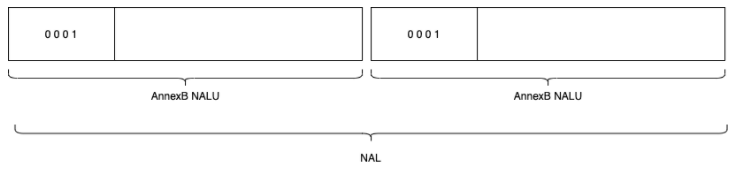
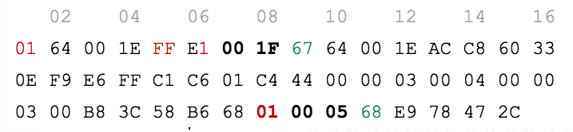

H264码流(H.265码流是Annex-B和HVCC格式)分两种组织（包装）方式，一种是AnnexB格式，一种是AVCC格式。

* AVCC格式 也叫AVC1格式，MPEG-4格式，字节对齐，因此也叫Byte-Stream Format。用于mp4/flv/mkv, VideoToolbox。

* Annex-B格式 也叫MPEG-2 transport stream format格式（ts格式）, ElementaryStream格式。

对于这两种格式，各家的支持程度也不太一样，例如，<font color="red">Android 硬解码 MediaCodec 只接受 AnnexB 格式的数据，而 Apple 的 VideoToolBox，只支持 avcC 的格式</font>。

首先要了解的是H.264编码规范<font color="red">只是规定了如何编码，并没有规定以何种方式来排列编码后的数据</font>。就如同AES算法只是规定如何加密一组数据，并没有强制规定如果分组。H.264规范没有规定如何组织数据，但是在附录B中提供了一种可选方案，即Annex B格式。


## H.264 NALU 概念

H.264视频编码后的数据叫NALU(Network Abstraction Layer Units)。
NALU有多种类型，<font color="red">分为两大类：VCL(Video Coding Layer) 和 非VCL。VCL是图像编码数据，非VCL为编码参数信息</font>。NALU结构头部指明类型，类型字段如下。

| **NALU类型** | **说明**                                                     | **是否VCL** |
| ------------ | ------------------------------------------------------------ | ----------- |
| 0            | Unspecified                                                  | non-VCL     |
| 1            | Coded slice of a non-IDR picture                             | VCL         |
| 2            | Coded slice data partition A                                 | VCL         |
| 3            | Coded slice data partition B                                 | VCL         |
| 4            | Coded slice data partition C                                 | VCL         |
|              | Coded slice of an IDR picture                                | VCL         |
| 6            | Supplemental enhancement information (SEI)                   | non-VCL     |
| 7            | Sequence parameter set **(SPS)**                             | non-VCL     |
| 8            | Picture parameter set **(PPS)**                              | non-VCL     |
| 9            | Access unit delimiter                                        | non-VCL     |
| 10           | End of sequence                                              | non-VCL     |
| 11           | End of stream                                                | non-VCL     |
| 12           | Filler data                                                  | non-VCL     |
| 13           | Sequence parameter set extension                             | non-VCL     |
| 14           | Prefix NAL unit                                              | non-VCL     |
| 15           | Subset sequence parameter set                                | non-VCL     |
| 16           | Depth parameter set                                          | non-VCL     |
| 17...18      | Reserved                                                     | non-VCL     |
| 19           | Coded slice of an auxiliary coded picture without partitioning | non-VCL     |
| 20           | Coded slice extension                                        | non-VCL     |
| 21           | Coded slice extension for depth view components              | non-VCL     |
| 22...23      | Reserved                                                     | non-VCL     |
| 24...31      | Unspecified                                                  | non-VCL     |

***SPS： 序列参数集，包含解码配置，比如profile level 分辨率和帧率等***。
***PPS：图像参数集，包含有关熵编码模式、分片组、运动预测和去块滤波器等信息***。
IDR: 立即解码刷新单元，这种NALU包含一个完整的图像序列，不依赖其他NALU就可以独立解码和显示，即一种特殊的I帧。

值得注意的是，一个NALU即使是VCL NALU 也并不一定表示一个视频帧。因为一个帧的数据可能比较多，可以分片为多个NALU来储存。一个或者多个NALU组成一个访问单元AU，一个AU包含一个完整的帧。


## H.264 码流格式

H264码流分两种组织方式，一种是AnnexB格式，一种是AVCC格式。

区别有两点：一个是参数集(SPS, PPS)组织格式；一个是分隔。


#### AnnexB格式

[start code]NALU | [start code] NALU |...

 

这种格式比较常见，也就是我们熟悉的每个帧前面都有<font color="red">0x00 00 00 01或者0x00 00 01作为起始码</font>。.H264文件就是采用的这种格式，每个帧前面都要有个起始码。***SPS PPS等也作为一类NALU存储在这个码流中，一般在码流最前面***。也就是说这种格式包含VCL 和 非VCL 类型的NALU。

假如我们把多个 NALU 写到一个文件里面去，多个 NALU 首位相连穿成一串，因为 NALU 本身长度不一，也没有具体的标识符用来表明自己是一个独立的 NALU，那么我们在读取这个文件的时候其实并没有办法将写到一起 NALU 有效得进行区分。为了解决这个问题，我们必须给 NALU 添加上一些数据(0x00 00 00 01或者0x00 00 01)，将各个 NALU 进行分割。 AnnexB 就是用来对 NALU 层进行包装的一种格式。

AnnexB 格式的原理非常简单，就是在一个 NALU 前面加上三个或者四个字节，这些字节的内容是 0 0 0 1 或者 0 0 1。当我们读取一个 H264 流的时候，一旦遇到 0 0 0 1 或者 0 0 1，我们就认为一个新的 NALU 开始了，因此，这些用来做分隔符的字节，一般也被称为 start code， 起始码。


#### AVCC格式

([extradata]) | ([length] NALU) | ([length] NALU) | ...
***这种模式也叫AVC1格式，没有起始码***，<font color="red">每个帧最前面几个字节（通常4字节）是帧长度</font>。这里的NALU一般没有SPS PPS等参数信息，参数信息属于额外数据extradata存在其他地方。

在介绍 avcC 格式之前，我们先来介绍一下两个特殊的 NALU，这两个 NALU 就是 SPS 和 PPS，SPS 和 PPS 存放了解码一路 H.264 码流的必要的参数信息，也就是说，你想要解码一路 H.264，就必须首先获取到 SPS 和 PPS。

在 AnnexB 中，SPS 和 PPS 被当做了普通的 NALU 进行处理；而在 avcC 中，SPS 和 PPS 信息被当做了特殊的信息进行了处理。

在一路采用 avcC 打包的 H.264 流之中，我们首先看到的将是一段被称之为 <font color="red">extradata</font> 的数据，这段数据定义了这个 H.264 流的基本属性数据，当然，也包含了 SPS 和 PPS 数据。

***比如ffmpeg中解析mp4文件后sps pps存在streams[index]->codecpar->extradata;中***。也就是说这种码流通常只包含VCL类型NALU。

extradata示例：

 

extradata示例答案：

```cmake
extradata    如上
   extrasize    47
05| FF          NAL size:  4字节	# FF的最后两位，即二进制11
06| E1          SPS num:   1		 # E1中，E(1110)的最后1位再加后4位(0001)
07| 00 1F       SPS size:  31字节
09| 67          NAL type:  SPS
40| 01          PPS num:   1
41| 00 05       PPS size:  5字节
42| 68          NAL type:  PPS
```


这些extradata通常有如下格式（可以根据这个规则ffmpeg解析mp4文件的SPS和PPS）

```
bits      
8   version ( always 0x01 )  
8   avc profile ( sps[0][1] )  
8   avc compatibility ( sps[0][2] )  
8   avc level ( sps[0][3] )  
6   reserved ( all bits on )  
2   NALULengthSizeMinusOne    // 这个值是（前缀长度-1）
3   reserved ( all bits on )  
5   number of SPS NALUs (usually 1)  
        repeated once per SPS:  
16  SPS size  
        variable SPS NALU data  
8   number of PPS NALUs (usually 1)  
        repeated once per PPS  
16  PPS size  
        variable PPS NALU data
```

我们注意一下这个值 NALULengthSizeMinusOne，通过将这个值加 1 ，我们就得出了后续每个 NALU 前面前缀（也就是表示长度的整数）的字节数。

例如，extradata示例图中，这个 NALULengthSizeMinusOne 是 3（前面的FF的最后两位是NALULengthSizeMinusOne，也就是二进制11），那么每个 NALU 前面前缀的长度就是 4 个字节。我们在读取后续数据时，可以先读 4 个字节，然后把这四个字节转成整数，就是这个 NALU 的长度了，注意，这个长度并不包含起始的4个字节，是单纯 NALU 的长度。

翻译如下：

第1字节：version (通常0x01)
第2字节：avc profile (值同第1个sps的第2字节)
第3字节：avc compatibility (值同第1个sps的第3字节)
第4字节：avc level (值同第1个sps的第3字节)
第5字节前6位：保留全1
第5字节后2位：NALU Length 字段大小减1，通常这个值为3，即NAL码流中使用3+1=4字节表示NALU的长度
第6字节前3位：保留，全1
第6字节后5位：SPS NALU的个数，通常为1
第7字节开始后接1个或者多个SPS数据
	SPS结构 [16位 SPS长度][SPS NALU data]

SPS数据后
第1字节：PPS的个数，通常为1
第2字节开始接1个或多个PPS数据
	PPS结构 [16位 PPS长度][SPS NALU data]

上述内容参考 https://titanwolf.org/Network/Articles/Article?AID=7efa4423-1e7d-46e0-ba19-6f5c6eec84a7