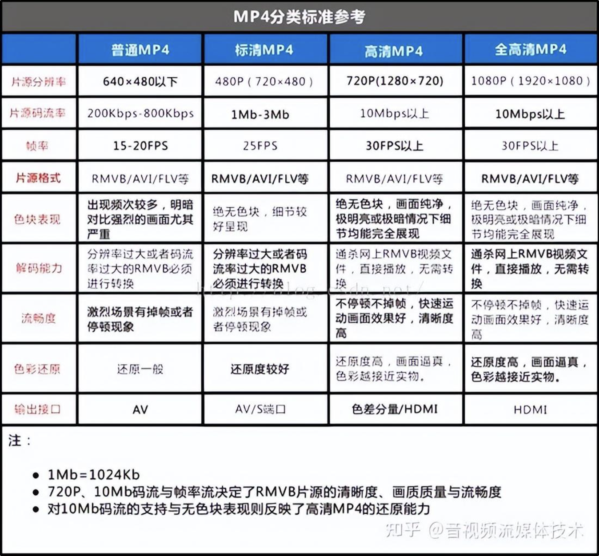

## 一、音视频的一些名词解释

### 1. 码率

指视频文件在单位时间内使用的数据流量，也叫码流率。码率越大，说明单位时间内取样率越大，数据流精度就越高，这样表现出来的的效果就是：视频画面更清晰画质更高。

一般以秒为单位，如：128 kbps，表示每秒通过网络传送的数据量为 128k bit.

### 2. 帧率

指视频每秒钟包含多少张画面，一般单位为fps。

帧率越高，表示单位时间内图像帧的个数，普通的视频文件一般在25fps - 30fps之间，表示每秒钟25-30张图像，而一般涉及到游戏等帧率会比较高一些，一般>60fps。在其他的参数一定的情况下，帧率越高，视频或游戏的流畅度更好，反之，帧率越低，视频或游戏的流畅度越次，低于15fps的时候人眼一般都会比较感觉到明显的卡顿

### 3.分辨率

分辨率就是(矩形)图片的长度和宽度，即图片的尺寸。分辨率影响图像大小，与图像大小成正比：分辨率越高，图像越大；分辨率越低，图像越小。



## 二、H264视频编码格式

**为什么要做编码压缩：**

 

对于视频数据而言，视频编码的最主要目的是数据压缩。这是因为动态图像的像素形式表示数据量极为巨大，存储空间和传输带宽完全无法满足保存和传输的需求。例如，图像的每个像素的三个颜色分量RGB各需要一个字节表示，那么每一个像素至少需要3字节，分辨率1280×720的图像的大小为2.76M字节。

如果对于同样分辨率的视频，如果帧率为25帧/秒，那么传输所需的码率将达到553Mb/s！如果对于更高清的视频，如1080P、4k、8k视频，其传输码率更是惊人。这样的数据量，无论是存储还是传输都无法承受。因此，对视频数据进行压缩称为了必然之选。

视频信息为什么可以被压缩

视频信息之所以存在大量可以被压缩的空间，是因为其中本身就存在大量的数据冗余。其主要类型有：

1. 时间冗余：视频相邻的两帧之间内容相似，存在运动关系
2. 空间冗余：视频的某一帧内部的相邻像素存在相似性
3. 编码冗余：视频中不同数据出现的概率不同
4. 视觉冗余：观众的视觉系统对视频中不同的部分敏感度不同


### 1. 视频压缩编码的基本技术

#### 1）. 预测编码

预测编码可以用于处理视频中的时间和空间域的冗余。视频处理中的预测编码主要分为两大类：帧内预测和帧间预测。

帧内预测：预测值与实际值位于同一帧内，用于消除图像的空间冗余；帧内预测的特点是压缩率相对较低，然而可以独立解码，不依赖其他帧的数据；通常视频中的关键帧都采用帧内预测。

帧间预测：帧间预测的实际值位于当前帧，预测值位于参考帧，用于消除图像的时间冗余；帧间预测的压缩率高于帧内预测，然而不能独立解码，必须在获取参考帧数据之后才能重建当前帧。

通常在视频码流中，I帧全部使用帧内编码，P帧/B帧中的数据可能使用帧内或者帧间编码。

#### 2）. 变换编码

目前主流的视频编码算法均属于有损编码，通过对视频造成有限而可以容忍的损失，获取相对更高的编码效率。而造成信息损失的部分即在于变换量化这一部分。在进行量化之前，首先需要将图像信息从空间域通过变换编码变换至频


### 2. H.264 视频编码结构

H.264编解码主要分为五部分：帧间和帧内预测（Estimation）、变换（Transform）和反变换、量化（Quantization）和反量化、环路滤波（Loop Filter）、熵编码（Entropy Coding）。

在H.264进行编码的过程中，每一帧的H图像被分为一个或多个切片(slice)进行编码。每一个切片包含多个宏块(MB,Macroblock)。宏块是H.264标准中基本的编码单元，其基本结构包含一个包含16×16个亮度像素块和两个8×8色度像素块，以及其他一些宏块头信息。在对一个宏块进行编码时，每一个宏块会分割成多种不同大小的子块进行预测。

帧内预测采用的块大小可能为16×16或者4×4，帧间预测/运动补偿采用的块可能有7种不同的形状：16×16、16×8、8×16、8×8、8×4、4×8和4×4。相比于早期标准只能按照宏块或者半个宏块进行运动补偿，H.264所采用的这种更加细分的宏块分割方法提供了更高的预测精度和编码效率。在变换编码方面，针对预测残差数据进行的变换块大小为4×4或8×8（仅在FRExt版本支持）。相比于仅支持8×8大小的变换块的早期版本，H.264避免了变换逆变换中经常出现的失配问题。

 

在H.264 中，分为： 序列、图像、片、宏块、子宏块五个层次

 


一帧图片经过 H.264 编码器之后，就被编码为一个或多个切片（slice），而装载着这些切片（slice）的载体，就是 NALU。

什么是 NALU 呢？

H.264 原始码流(又称为裸流)，是有一个接一个的NALU组成的，而它的功能分为两层: 视频编码层(VCL, Video Coding Layer)和网络提取层(NAL, Network Abstraction Layer)。VCL 数据即编码处理的输出，它表示被压缩编码后的视频数据序列，网络提取层(NAL, Network Abstraction Layer)将VCL封装，成为一个个NALU。 NALU的结构是：NAL头+RBSP

 

切片的主要作用是用作宏块（Macroblock）的载体。

切片之所以被创造出来，主要目的是为限制误码的扩散和传输。

如何限制误码的扩散和传输？

每个切片（slice）都应该是互相独立被传输的，某片的预测（片（slice）内预测和片（slice）间预测）不能以其它片中的宏块（Macroblock）为参考图像。

 

**切片可分为 切片头和切片数据【如上】，一个切片的数据又被分成若干个宏块【如下】。**

 

分片数据中则是宏块，其实宏块存储像素数据的地方。

宏块是视频信息的主要承载者，因为它包含着每一个像素的亮度和色度信息。视频解码最主要的工作则是提供高效的方式从码流中获得宏块中的像素阵列。

组成部分：一个宏块由一个16×16亮度像素和附加的一个8×8 Cb和一个 8×8 Cr 彩色像素块组成。每个图象中，若干宏块被排列成片的形式。

 

从上图中，可以看到，宏块中包含了宏块类型、预测类型、Coded Block Pattern、Quantization Parameter、像素的亮度和色度数据集等等信息。

**对于切片（slice）来讲，分为以下几种类型：**

I片：只包 I宏块，I 宏块利用从当前片中已解码的像素作为参考进行帧内预测(不能取其它片中的已解码像素作为参考进行帧内预测)。

P片：可包 P和I宏块，P 宏块利用前面已编码图象作为参考图象进行帧内预测，一个帧内编码的宏块可进一步作宏块的分割:即 16×16、16×8、8×16 或 8×8 亮度像素块(以及附带的彩色像素);如果选了 8×8 的子宏块，则可再分成各种子宏块的分割，其尺寸为 8×8、8×4、4×8 或 4×4 亮度像素块(以及附带的彩色像素)。

B片：可包 B和I宏块，B 宏块则利用双向的参考图象(当前和 来的已编码图象帧)进行帧内预测。

SP片(切换P)：用于不同编码流之间的切换，包含 P 和/或 I 宏块

SI片：扩展档次中必须具有的切换，它包 了一种特殊类型的编码宏块，叫做 SI 宏块，SI 也是扩展档次中的必备功能。

NALU 整体结构可以呼之欲出了，以下就引用 H.264 文档当中的一幅图了

 

## 3. I帧、B帧、P帧

**DTS、PTS、GOP**

- DTS : 解码时间戳
- PTS: 显示时间戳
- GOP : 一组完整的IBP帧画面

GOP 是画面组，一个 GOP 是一组连续的画面。下图GOP(Group of Picture)所示:

 

GOP 一般有两个数字，如 M = 3，N = 12，M 制定 I 帧与 P 帧之间的距离，N 指定两个 I 帧之间的距离。那么现在的 GOP 结构是:

```
I BBP BBP BBP BB I
```

增大图片组能有效的减少编码后的视频体积，但是也会降低视频质量，至于怎么取舍，得看需求了。

从上图,可以看到,DTS和PTS的顺序是不一致的,并且每组GOP中开头都是I帧,然后后面都是B、P帧,如果开头的I帧图像质量比较差时，也会影响到一个GOP中后续B、P帧的图像质量.

I帧(intra picture) : 帧内编码帧,自身可以通过视频解压算法解压成一张单独的完整的图片；

B帧(bidirectional) : 双向预测内插编码帧,参考前面和后面两帧的数据加上本帧的变化而得出的本帧数据

P帧 : 前向预测编码帧,参考前面而得出的本帧数据.