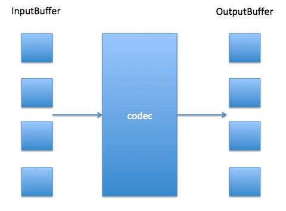

## 背景

随着多媒体产业的发展，手机端对视频解码性能要求越来越高。如果采用cpu进行解码，则会占用很多cpu资源。现在主流做法是利用手机gpu资源进行视频解码。Android系统在Android4.0(API 16)增加了 MediaCodec，可以支持app调用java接口，进而使用底层硬件的音视频编解码能力。Android ndk在 Android 5.0(API21) 提供了对应的Native方法。功能大体相同。

MediaCodec 可以处理编码，也可以处理解码；可以处理音频，也可以处理视频，里面有软解（cpu），也有硬解（gpu）。具体手机Android 系统一般会写在 media_codecs.xml 上。不同手机位置不一样。根据我的经验，大多数手机上是/system/etc/目录下。


## Android MediaCodec内部大致结构

 

如上图所示，mediacodec 内部有两种缓冲，一种是InputBuffer，另一种是OutputBuffer。两种缓冲的大小一般是底层硬件的代码决定。解码过程中，Client需要不断的查询InputBuffer和OutputBuffer的情况，如果InputBuffer有空闲，则应放入相应码流；如果OutputBuffer有输出，则应该及时去消费视频帧并且释放。

codec则内部自启线程，也是不断的查询InputBuffer和OutputBuffer的情况，如果OutputBuffer有空闲并且有未处理的InputBuffer，则去解码一帧；否则挂起。


## 配置解码器

```c++
AMediaCodec_configure(handle,format,surface, crypto, flag)
```

这个函数有两个需要注意，一个是mediaFormat，另一个是surface.crypto是加密相关的，很少用到。flag是编码应该注意的参数，解码一般填0。

mediaFormat 是Client需要提前告诉解码器的一些参数格式，包括width，height， sps， pps等。例如：

```c++
AMediaFormat* videoFormat = AMediaFormat_new();
AMediaFormat_setString(videoFormat, "mime", "video/avc");
AMediaFormat_setInt32(videoFormat, AMEDIAFORMAT_KEY_WIDTH, width); // 视频宽度 
AMediaFormat_setInt32(videoFormat, AMEDIAFORMAT_KEY_HEIGHT, height); // 视频高度 
AMediaFormat_setBuffer(videoFormat, "csd-0", sps, spsSize); // sps 
AMediaFormat_setBuffer(videoFormat, "csd-1", pps, ppsSize); // pps
```

如果直接将sps，pps放到第一个I帧之前，format不设置，也能解码成功。如果提前设置的话，configure函数应该可以提前检查参数，如果参数不支持，则提前返回失败。

surface参数直接决定了解码器 的工作方式。我们如果传入一个nativeWindow，则解码器接完之后的AImage将会通过Release方法直接渲染到surface上，然后就有画面了。这样省去了图像从GPU到CPU，CPU再到GPU的拷贝，效率较高；如果我们传入nullptr，我们则需要通过接口将图像地址获取。这样有个好处就是后面可以接一些CPU的图像处理，达到我们的要求，然后再进行图像渲染。


## 数据流程

启动之后就开始送数据，取数据进行解码了。根据之前的大致结构描述，数据流程也基本分为两步，送数据主要围绕InputBuffer展开，取数据主要围绕OutputBuffer展开。为了达到最佳实践，我们发现最好是用两个线程分别处理这两个过程，以免互相影响导致效率降低。


### 1.送数据

送数据分3步骤，第一步，获取InputBufferIndex.这步的主要目的是看看InputBuffer是不是满了。如果InputBuffer满，则上游应该进行相应的数据缓存操作。

```c++
MediaCodec_dequeueInputBuffer(handle, 2000);
```

第二步，获取InputBuffer地址，然后填数据：

```c++
AMediaCodec_getInputBuffer(handle, idx, &size);
```

第三步，告诉MediaCodec我们数据填好了：

```c++
AMediaCodec_queueInputBuffer(handle, idx, 0, bufferSize, pts, 0);
```

*** 注意：Android 硬解码只支持AnnexB 格式的码流，也就是 00 00 00 01 开头的码流，如果是avcc 字节长度开头的码流，需要提前转一下。*** 


### 2.取数据

取数据相对送数据复杂一些，第一步获取index，这是看看有没有解码好的帧:

```c++
AMediaCodec_dequeueOutputBuffer(handle, &info, 2000);
```

如果有，则取帧。若surface填nullptr，则可以通过接口获取数据地址:

```c++
AMediaCodec_getOutputBuffer(handle, idx, &outsize);
```

如果surface之前填有值，我们可以通过release接口直接将图像渲染到Surface上：

```c++
AMediaCodec_releaseOutputBuffer(handle, idx, bRender);
```

取数据需要注意一点的就是getOutputBuffer时候可能会获取到一些负值。并且这些负值都是很有意义的。例如`AMEDIACODEC_INFO_OUTPUT_FORMAT_CHANGED`就表示了输出格式发生改变等等。我们需要关注这些信息，及时更新解码器的输出格式。


## 硬解码业务路线

### 1.代替软解的硬解码

最简单的方式，就是configure时候Surface填null，然后将解码后的数据拷贝出来。这样做的有点很明显，就是跟之前的软解逻辑基本一样，外面并不需要改变太多，之前的VideoProcess 也能接着用，也不需要渲染引擎的配合，封装性好。缺点是多了一次解码器内存到自己内存的拷贝。


### 2.利用解码器缓存

如果我们针对业务一的拷贝做优化，减少拷贝，这就是第二种业务路线。我们可以利用解码器的缓存进行输出存储。也就是说，我们调用ouputBuffer之后，获得输出缓存index，并不着急拷贝出图像。而是等到渲染时候，调用GetOutputBuffer获取图像指针，然后调用Image2D,进行生成gpu纹理。


### 3.利用GPU Image直接渲染

如果我们configure传surface，我们可以通过gpu传递的方法，直接进行渲染，这样可以<font color="red">减少GPU <-> CPU之间的内存拷贝</font>。首先configure时候传surface，我们调用ouputBuffer之后，获得输出缓存index，得到渲染时候，直接调用releaseOutputBuffer(handle,idx,true),则解码器的图像直接渲染到surface图像上了。

这样虽然效率高，但是弊端也很明显，第一，那就是图像后处理做不了。第二，这种方案依赖解码器缓存，这会带来一些问题。如果解码器被提前析构，则缓存内容都没有了。又或者一些播放业务逻辑对解码器缓存要求较多（比如***倒放***），这也做不了。


### 4. 利用GPU Image，SurfaceTexture类渲染到OpenGL管线

针对业务路线3，Android系统也考虑到这个问题，提供我们一种方案做折中。我们可以先建立自己的OpenGL环境，然后从建立Texture，通过Texture建立SurfaceTexture，然后取出surface，进行Configure。这样，MediaCodec的Release就渲染到SurfaceTexture类了。然后我们调用Update方法，就同步到OpenGL的Texture上了。之后可以接各种后处理，然后swapbuffer进行显示等等。

这样处理得话，基本所有的业务逻辑都可以满足。但是有一个小问题就是流畅性不足。具体为：当输出一个surface，并且OpenGL还没消费这个surface时候，解码输出是被阻塞的（awaitNewImage）。也就是说，outputBuffer和OpenGL cosume 这个surface必须串行执行。如果并行，则会有覆盖的问题。

因此我们可以采取一步小调整：将OpenGL得到的Texture 拷贝一份（是GPU->GPU复制，纹理复制）。这样OpenGL就不会阻塞解码输出了。但是代价会带来拷贝性能损耗。


### 5.多路同步，增大流畅性

Android 6.0 （API23）新增了一个接口 —— setOutputSurface。顾名思义，这个可以动态的设置输出的Surface。这就完美解决了上面的问题。具体为，我们可以事先建立多个Texture，然后OutputBuffer时候循环输出到任意一个空闲Texture并标记为带数据，当OpenGL消费了图像之后，将Texture回归空闲。这样相当于在OutputBuffer和OpenGL消费之间建立了一个纹理缓冲。可以完成多线程并行的需求。

缺点很明显就是需要Android 6.0才能支持，不过现在通过Android统计面板https://link.juejin.im/?target=https%3A%2F%2Fdeveloper.android.com%2Fabout%2Fdashboards%2F

能看到大部分手机都在Android 6.0之上。


## 加快解码和渲染处理方案

在我们直接使用MediaCodec进行解码和渲染时，一般情况下大家可以都习惯性在同一个线程中完成MediaCodec的解码和渲染，其实际我们应该拆分成两部分来处理，将解码和渲染放入不同线程完成，如此就会加快解码和渲染，其实现原理是，同一个线程中，解码和渲染将会被互相影响，而渲染是有一个Fence栅栏Buffer标记，可以简单理解为VSync屏幕刷新周期信号，若是60fps则VSync将会在16.67ms通知屏幕刷新信号一次，因此若在调用MediaCodec的渲染接口【AMediaCodec_releaseOutputBuffer】时（java层MediaCodec同理），将会在buffer处理放入Surface时被Fence栅栏wait。

因此若放在不同线程，那么将不会相互影响，即解码和渲染都将会被加快。

先写结论：
软解码时将会被阻塞渲染，而硬解码时将会是异步直接归还Buffer给Surface，但是本文要讨论的是，解码器分为了输入队列和输出队列，我们应该将输入队列和输出队列分两个线程进行解码，原因是输出队列可能会多次执行即一个输入Buffer可能会在收到多次输出Buffer才结束当前帧解码完成，另外若是硬解码器则可以将输出队列和渲染操作放入同一个线程，如此将会加快解码和渲染。


## 参考文档

https://blog.csdn.net/u010029439/article/details/102519884

https://blog.csdn.net/u012430727/article/details/119275326

Google的官方文档关于 Android MediaCodec 还是很详细的。应该还有很多隐藏属性待我们发觉。我们要多查查官方文档手册：

java文档：https://link.juejin.im/?target=https%3A%2F%2Fdeveloper.android.com%2Freference%2Fandroid%2Fmedia%2FMediaCodec

ndk文档：https://link.juejin.im/?target=https%3A%2F%2Fdeveloper.android.com%2Fndk%2Freference%2Fgroup%2Fmedia%25E3%2580%2581

同时 Android Samples 有Sample Code,可供参考

https://link.juejin.im/?target=https%3A%2F%2Fgithub.com%2Fgooglesamples%2Fandroid-BasicMediaDecoder%2F

ffmpeg上也有相关封装，具体文件为：/libavcodec/mediacodecdec.c