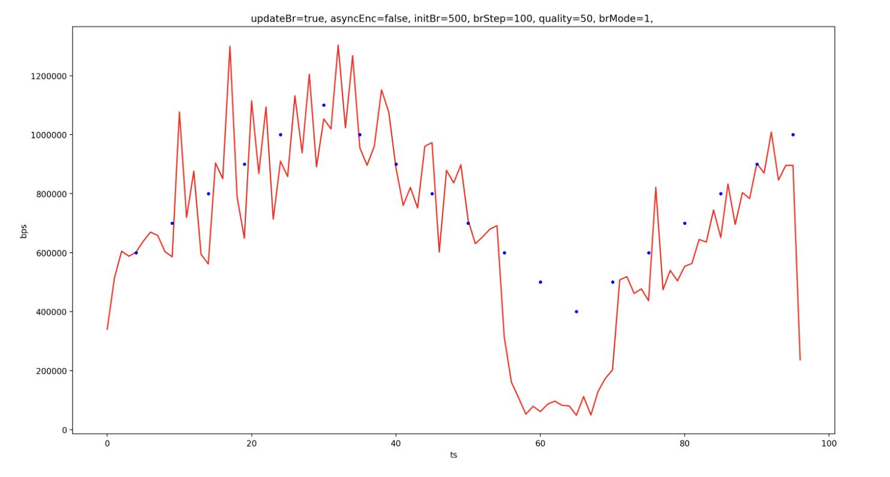

## 如何做流控？

首先我们要对流控有一个基本的概念。

### 流控基本概念

流控就是流量控制。这里我们举两个例子：TCP 和视频编码。对 TCP 来说就是控制单位时间内发送数据包的数据量，对编码来说就是控制单位时间内输出数据的数据量。为什么要控制？就是为了在一定的限制条件下，收益最大化。

TCP 传输的限制条件是网络带宽，流控就是在避免造成或者加剧网络拥塞的前提下，尽可能利用网络带宽。带宽够、网络好，我们就加快速度发送数据包，出现了延迟增大、丢包之后，就放慢发包的速度（因为继续高速发包，可能会加剧网络拥塞，反而发得更慢）。

视频编码的限制条件最初是解码器的能力，码率太高就会无法解码，后来随着 codec 的发展，解码能力不再是瓶颈，限制条件变成了传输带宽/文件大小，我们希望在控制数据量的前提下，画面质量尽可能高。

一般编码器都可以设置一个目标码率，但编码器的实际输出码率不会完全符合设置，因为在编码过程中实际可以控制的并不是最终输出的码率，而是编码过程中的一个量化参数（Quantization Parameter，QP），它和码率并没有固定的关系，而是取决于图像内容。

无论是要发送的 TCP 数据包，还是要编码的图像，都可能出现“尖峰”，也就是短时间内出现较大的数据量。TCP 面对尖峰，可以选择不为所动（尤其是网络已经拥塞的时候），这没有太大的问题，但如果视频编码也对尖峰不为所动，那图像质量就会大打折扣了。因为如果有几帧数据量特别大，但我们仍要把码率控制在原来的水平，那势必要损失更多的信息，因此图像失真就会更严重，通常的表现是画面出现很多小方块，看上去像是打了马赛克一样，我们称之为“方块效应”：


### 安卓硬编码流控

MediaCodec 流控相关的接口并不多，一是配置时设置目标码率和码率控制模式，二是动态调整目标码率（API 19+）。

**配置时指定目标码率和码率控制模式**：

```java
mediaFormat.setInteger(MediaFormat.KEY_BIT_RATE, bitRate);
mediaFormat.setInteger(MediaFormat.KEY_BITRATE_MODE,
        MediaCodecInfo.EncoderCapabilities.BITRATE_MODE_VBR);
// 其他配置

mVideoCodec.configure(mediaFormat, null, null, MediaCodec.CONFIGURE_FLAG_ENCODE);
```

码率控制模式在 `MediaCodecInfo.EncoderCapabilities` 类中定义了三种，在 [framework 层有另一套名字](http://androidxref.com/7.1.1_r6/xref/frameworks/native/include/media/openmax/OMX_Video.h#237)和它们的值一一对应：

- CQ 对应于 `OMX_Video_ControlRateDisable`，它表示完全不控制码率，尽最大可能保证图像质量；
- CBR 对应于 `OMX_Video_ControlRateConstant`，它表示编码器会尽量把输出码率控制为设定值，即我们前面提到的“不为所动”；
- VBR 对应于 `OMX_Video_ControlRateVariable`，它表示编码器会根据图像内容的复杂度（实际上是帧间变化量的大小）来动态调整输出码率，图像复杂则码率高，图像简单则码率低；

**动态调整目标码率**：

```java
Bundle param = new Bundle();
param.putInt(MediaCodec.PARAMETER_KEY_VIDEO_BITRATE, bitrate);
mediaCodec.setParameters(param);
```

API 是很简单，但我们究竟该用哪种模式？调整码率在各个模式下是否有用，效果如何？接下来就让我们探讨一下这些问题。


### MediaCodec 流控测试

首先我们考虑一下如何测试，而测试最关键的部分就是控制变量了。大家可能会想到通过相机采集数据后送进编码器，但相机采集的问题就在于每次测试采进来的内容肯定是不一样的，那结果的差异就不能排除内容差异的干扰。所以我们需要一个内容不变的数据源，视频文件就是一个很好的选择：使用同一个视频文件，用 MediaExtractor 提取视频数据，解码器解码后把数据送进编码器，再按照同样的调整码率策略，对比编码器输出码率。

此外，我们可以让解码器把数据输出到一个 SurfaceTexture，并在 SurfaceTexture 的回调中让数据花开两枝，一枝到预览，一枝到编码器，这样我们就可以一边测试，一遍欣赏视频内容了 :)

测试的大体思路就是这样，实现过程的细节这里就不赘述了，测试项目的源码可以从 [GitHub](https://github.com/Piasy/InsideCodec/tree/master/MediaCodecRcTest) 获取，*项目里有彩蛋 :)*

下面我们看看各个模式调整码率的效果对比：





红色折线是统计的每秒输出码率，蓝色圆点是调整码率的操作，从上到下依次是 CQ、VBR、CBR。可以看到，CQ 模式下输出码率和设置的目标码率确实没什么关系，而 VBR 和 CBR 输出码率基本都紧跟目标码率，但明显 CBR 更稳，且 VBR 下调码率会出现“血崩”的情况。

如果解码器支持码率波动较大，显然输出码率随视频内容波动是更好的选择，因为这样能提升整体画质，但 VBR 输出码率的走势真的是在跟随图像复杂度（帧间变化量）的吗？这个问题留着以后探究。

接下来我们看看各个模式下不调整码率时的输出码率：


从上到下依次是 CQ、VBR、CBR，可以看到，CBR 确实很稳。

而对比调整码率和不调整码率 CQ 的结果，我们可以发现 CQ 模式下调整码率不起作用，这符合预期，因为 CQ 的定义就是如此。虽然 MediaFormat 里面有一个隐藏的 `KEY_QUALITY`，文档表明是搭配 CQ 使用的，但在 Nexus 5X 7.1.2 上实测，修改 quality 不会影响输出码率。

更多测试结果，可以从 [GitHub 项目](https://github.com/Piasy/InsideCodec/tree/master/MediaCodecRcTest/results)中获取。

**回到前面的问题，我们究竟应该用哪种模式？**

- 对于质量要求高、不在乎带宽（例如本地存文件）、解码器支持码率剧烈波动的情况，显然 CQ 是不二之选；
- VBR 输出码率会在一定范围内波动，对于小幅晃动，方块效应会有所改善，但对剧烈晃动仍无能为力，而连续调低码率则会导致码率急剧下降，如果无法接受这个问题，那 VBR 就不是好的选择；
- WebRTC 使用的是 CBR，稳定可控是 CBR 的优点，一旦稳定可控，那我们就可以自己实现比较可靠的控制了；

**2018.05.04 Update**：

- VBR 在画面内容保持静止时，码率会降得很低，一旦画面内容开始动起来，码率上升会跟不上，就会导致画面质量很差；
- VBR 上调码率后，有可能导致中间网络路径的丢包/延迟增加，进而导致问题；
- CBR 会存在关键帧后的几帧内容模糊的问题，如果关键帧间隔较短，可以观察到明显的「呼吸效应」；
- WebRTC 使用的方案是 CBR + 长关键帧间隔，这样「呼吸效应」就不是那么明显，而 CBR 确实能增强画面质量；

*前两点援引自 [Twitch blog](https://blog.twitch.tv/better-broadcasting-with-cbr-d45fd4ed199)*。

当然在编写这个测试项目的过程中，也是遇到了几个小问题的：

- 主线程创建 extractor、decoder、encoder，子线程使用，extractor/decoder 会抛 IllegalStateException，创建和使用在同一个线程就没问题（主线程或子线程都可以）；
- decoder 直接输出到 encoder 的 Surface，编出来的视频是花屏，原因是 encoder 的输出尺寸和视频尺寸不一样，把输出尺寸改为和视频尺寸一样就可以了；但 decoder -> SurfaceTexture -> encoder，中间加入一次 OpenGL 绘制，输出尺寸不同就没问题；
- 调整码率后 encoder 输出码率直降为 1/10，死活没想明白怎么回事，在 [StackOverflow](https://stackoverflow.com/q/45548675/3077508) 上面一问，还真有人帮我把代码看出问题了，原来是调整码率时，单位用得不对，忘记 `* 1000` 了，还好不是啥坑 :)


### 关键帧

MediaCodec 有两种方式触发输出关键帧，一是由配置时设置的 `KEY_FRAME_RATE` 和 `KEY_I_FRAME_INTERVAL` 参数自动触发，二是运行过程中通过 `setParameters` 手动触发输出关键帧。

自动触发实际是按照帧数触发的，例如设置帧率为 25 fps，关键帧间隔为 2s，那就会每 50 帧输出一个关键帧，一旦实际帧率低于配置帧率，那就会导致关键帧间隔时间变长。由于 MediaCodec 启动后就不能修改配置帧率/关键帧间隔了，所以如果希望改变关键帧间隔帧数，就必须重启编码器。

手动触发输出关键帧：

```
Bundle param = new Bundle();
param.putInt(MediaCodec.PARAMETER_KEY_REQUEST_SYNC_FRAME, 0);
mediaCodec.setParameters(param);
```

对于 H.264 编码，WebRTC 设置的关键帧间隔时间为 20s，~~显然仅靠自动触发是不可能的，因此它会根据实际输出帧的情况，决定何时手动触发输出一个关键帧，也就是前面提到的 `checkKeyFrameRequired` 函数了~~。而这样做的原因，就是更可控，这和码率模式使用 CBR 是一个道理。

*2017.08.10 Update: WebRTC H.264 编码时，关键帧还真是 20s 一个，那一旦发生了丢包，怎么解码呢？肯定有其他补救措施，这个问题，也留在之后再探究了。*

### 方块效应优化

前面我们提到，VBR 的码率存在一个波动范围，因此使用 VBR 可以在一定程度上优化方块效应，但对于视频内容的剧烈变化，VBR 就只能望洋兴叹了。

WebRTC 的做法是，获取每个输出帧的 QP 值，如果 QP 值过大，就说明图像复杂度太高，如果 QP 值持续超过上界，那就重启编码器，用更低的输出分辨率来编码；如果 QP 值过低，则说明图像复杂度太低，如果 QP 值持续低于下界，也会重启编码器，用更高的输出分辨率来编码。关于 QP 值的获取，可以查看 [WebRTC 相关代码](https://chromium.googlesource.com/external/webrtc/+/master/webrtc/common_video/h264/h264_bitstream_parser.cc)。


## 有哪些坑？

- 虽然 `mVideoCodec.createInputSurface` 从 API 18 就已经引入，但用在某些 API 18 的机型上会导致编码器输出数据量特别小，画面是黑屏，所以 Surface 输入模式从 API 19 启用；
- [Grafika](https://github.com/google/grafika) 的示例中，它是在相机数据回调中先消费输出，再绘制输入，这样会导致每帧的输出都要等一帧的时间，其实我们可以先绘制输入，再消费输出，`dequeueOutputBuffer` 可以指定一个超时时间，通常 10ms 就足够绝大部分的帧编完了，这样我们就可以优化掉这一帧的延迟；当然，这个优化只有当此处成为瓶颈了才有必要，如果网络传输如果还有几秒的延迟，那这几十毫秒的优化是没有任何意义的；
- 如果不正确设置 presentationTime，有些设备的编码器会丢掉输入帧，或者输出帧图像质量很差，参见 [bigflake FAQ #8](http://bigflake.com/mediacodec/#q8)
- 取出 output buffer 后，要手动设置 `position` 和 `limit`，有些设备的编码器不会设置这两个值，导致无法正确取出数据；取出 input buffer 后，要手动调用 `clear`；参见 [bigflake FAQ #11](http://bigflake.com/mediacodec/#q11)

## 总结

在 WebRTC 源码导读系列的前三篇中，我们依次分析了采集、预览、编码，在下一篇里，我将对这三块内容做一个整理，并把 WebRTC 中相关的 Java 代码剥离出来，形成一个可以单独使用的模块：VideoCRE（Capture, Render, Encode），以及分享在这个过程中针对内存抖动问题做的一系列优化。敬请期待 :)

**参考文章**

- 视频压缩编码和音频压缩编码的基本原理
- Rate Control and H.264
- CBR vs VBR Encoding

**本文是 Piasy 原创，原文链接**： https://blog.piasy.com/2017/08/08/WebRTC-Android-HW-Encode-Video/