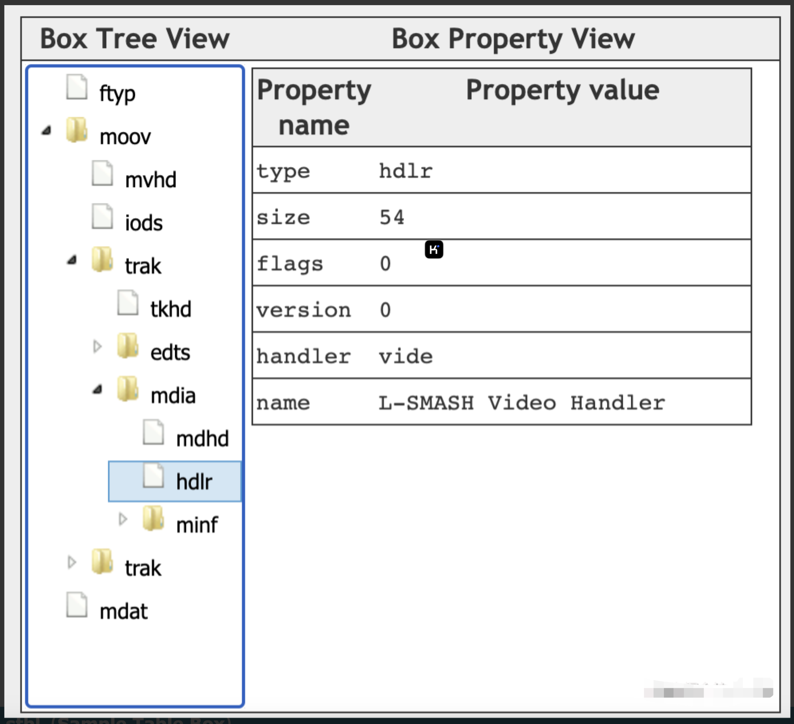

## MP4文件格式概览

MP4文件由多个box组成，每个box存储不同的信息，且box之间是树状结构，如下图所示。


box类型有很多，下面是3个比较重要的顶层box：

- ftyp：File Type Box，描述文件遵从的MP4规范与版本；
- moov：Movie Box，媒体的metadata信息，有且仅有一个。
- mdat：Media Data Box，存放实际的媒体数据，一般有多个；


虽然box类型有很多，但基本结构都是一样的。下一节会先介绍box的结构，然后再对常见的box进行进一步讲解。

下表是常见的box，稍微看下有个大致的印象就好，然后直接跳到下一节。


## MP4 Box简介

1个box由两部分组成：box header、box body。

1. box header：box的元数据，比如box type、box size。
2. box body：box的数据部分，实际存储的内容跟box类型有关，比如mdat中body部分存储的媒体数据。

box header中，只有type、size是必选字段。当size==0时，存在largesize字段。在部分box中，还存在version、flags字段，这样的box叫做Full Box。当box body中嵌套其他box时，这样的box叫做container box。


### Box Header

字段定义如下：

- type：box类型，包括 “预定义类型”、“自定义扩展类型”，占4个字节；
  - 预定义类型：比如ftyp、moov、mdat等预定义好的类型；
  - 自定义扩展类型：如果type==uuid，则表示是自定义扩展类型。size（或largesize）随后的16字节，为自定义类型的值（extended_type）
- size：包含box header在内的整个box的大小，单位是字节。当size为0或1时，需要特殊处理：
  - size等于0：box的大小由后续的largesize确定（一般只有装载媒体数据的mdat box会用到largesize）；
  - size等于1：当前box为文件的最后一个box，通常包含在mdat box中；
- largesize：box的大小，占8个字节；
- extended_type：自定义扩展类型，占16个字节；

Box的伪代码如下：

```cpp
aligned(8) class Box (unsigned int(32) boxtype, optional unsigned int(8)[16] extended_type) {
    unsigned int(32) size;
    unsigned int(32) type = boxtype;
    if (size==1) {
        unsigned int(64) largesize;
    } else if (size==0) {
        // box extends to end of file
    }
    if (boxtype==‘uuid’) {
        unsigned int(8)[16] usertype = extended_type;
    } 
}
```


### Box Body

box数据体，不同box包含的内容不同，需要参考具体box的定义。有的 box body 很简单，比如 ftyp。有的 box 比较复杂，可能嵌套了其他box，比如moov。


### Box vs FullBox

在Box的基础上，扩展出了FullBox类型。相比Box，FullBox 多了 version、flags 字段。

- version：当前box的版本，为扩展做准备，占1个字节；
- flags：标志位，占24位，含义由具体的box自己定义；

FullBox 伪代码如下：

```scala
aligned(8) class FullBox(unsigned int(32) boxtype, unsigned int(8) v, bit(24) f) extends Box(boxtype) {
	unsigned int(8) version = v;
	bit(24) flags = f;
}
```

FullBox主要在moov中的box用到，比如 `moov.mvhd`，后面会介绍到。

```scala
aligned(8) class MovieHeaderBox extends FullBox(‘mvhd’, version, 0) {
	// 字段略... 
}
```


## ftyp（File Type Box）

ftyp用来指出当前文件遵循的规范，在介绍ftyp的细节前，先科普下isom。

### 什么是isom

isom（ISO Base Media file）是在 MPEG-4 Part 12 中定义的一种基础文件格式，MP4、3gp、QT 等常见的封装格式，都是基于这种基础文件格式衍生的。

MP4 文件可能遵循的规范有mp41、mp42，而mp41、mp42又是基于isom衍生出来的。

> 3gp(3GPP)：一种容器格式，主要用于3G手机上；
> QT：QuickTime的缩写，.qt 文件代表苹果QuickTime媒体文件；

### ftyp定义

ftyp 定义如下：

```scala
aligned(8) class FileTypeBox extends Box(‘ftyp’) {  
  unsigned int(32) major_brand;  
  unsigned int(32) minor_version;  
  unsigned int(32) compatible_brands[]; // to end of the box  
}  
```

下面是是 brand 的描述，其实就是具体封装格式对应的代码，用4个字节的编码来表示，比如 mp41。

> A brand is a four-letter code representing a format or subformat. Each file has a major brand (or primary brand), and also a compatibility list of brands.

ftyp 的几个字段的含义：

- major_brand：比如常见的 isom、mp41、mp42、avc1、qt等。它表示“最好”基于哪种格式来解析当前的文件。举例，major_brand 是 A，compatible_brands 是 A1，当解码器同时支持 A、A1 规范时，最好使用A规范来解码当前媒体文件，如果不支持A规范，但支持A1规范，那么，可以使用A1规范来解码；
- minor_version：提供 major_brand 的说明信息，比如版本号，不得用来判断媒体文件是否符合某个标准/规范；
- compatible_brands：文件兼容的brand列表。比如 mp41 的兼容 brand 为 isom。通过兼容列表里的 brand 规范，可以将文件 部分（或全部）解码出来；

> 在实际使用中，不能把 isom 做为 major_brand，而是需要使用具体的brand（比如mp41），因此，对于 isom，没有定义具体的文件扩展名、mime type。

下面是常见的几种brand，以及对应的文件扩展名、mime type，更多brand可以参考 [这里](http://fileformats.archiveteam.org/wiki/Boxes/atoms_format#Brands) 。


下面是实际例子的截图，不赘述。


### 关于AVC/AVC1

在讨论 MP4 规范时，提到AVC，有的时候指的是“AVC文件格式”，有的时候指的是"AVC压缩标准（H.264）"，这里简单做下区分。

- AVC文件格式：基于 ISO基础文件格式 衍生的，使用的是AVC压缩标准，可以认为是MP4的扩展格式，对应的brand 通常是 avc1，在MPEG-4 PART 15 中定义。
- AVC压缩标准（H.264）：在MPEG-4 Part 10中定义。
- ISO基础文件格式(Base Media File Format) 在 MPEG-4 Part 12 中定义。

## moov（Movie Box）

Movie Box，存储 mp4 的 metadata，一般位于mp4文件的开头。

```scala
aligned(8) class MovieBox extends Box(‘moov’){ }
```

moov中，最重要的两个box是 mvhd 和 trak：

- mvhd：Movie Header Box，mp4文件的整体信息，比如创建时间、文件时长等；
- trak：Track Box，一个mp4可以包含一个或多个轨道（比如视频轨道、音频轨道），轨道相关的信息就在trak里。trak是container box，至少包含两个box，tkhd、mdia；

> mvhd针对整个影片，tkhd针对单个track，mdhd针对媒体，vmhd针对视频，smhd针对音频，可以认为是从 宽泛 > 具体，前者一般是从后者推导出来的。

### mvhd（Movie Header Box）

MP4文件的整体信息，跟具体的视频流、音频流无关，比如创建时间、文件时长等。

定义如下：

```verilog
aligned(8) class MovieHeaderBox extends FullBox(‘mvhd’, version, 0) { if (version==1) {
      unsigned int(64)  creation_time;
      unsigned int(64)  modification_time;
      unsigned int(32)  timescale;
      unsigned int(64)  duration;
   } else { // version==0
      unsigned int(32)  creation_time;
      unsigned int(32)  modification_time;
      unsigned int(32)  timescale;
      unsigned int(32)  duration;
}
template int(32) rate = 0x00010000; // typically 1.0
template int(16) volume = 0x0100; // typically, full volume const bit(16) reserved = 0;
const unsigned int(32)[2] reserved = 0;
template int(32)[9] matrix =
{ 0x00010000,0,0,0,0x00010000,0,0,0,0x40000000 };
      // Unity matrix
   bit(32)[6]  pre_defined = 0;
   unsigned int(32)  next_track_ID;
}
```

字段含义如下：

- creation_time：文件创建时间；
- modification_time：文件修改时间；
- timescale：一秒包含的时间单位（整数）。举个例子，如果timescale等于1000，那么，一秒包含1000个时间单位（后面track等的时间，都要用这个来换算，比如track的duration为10,000，那么，track的实际时长为10,000/1000=10s）；
- duration：影片时长（整数），根据文件中的track的信息推导出来，等于时间最长的track的duration；
- rate：推荐的播放速率，32位整数，高16位、低16位分别代表整数部分、小数部分（[16.16]），举例 0x0001 0000 代表1.0，正常播放速度；
- volume：播放音量，16位整数，高8位、低8位分别代表整数部分、小数部分（[8.8]），举例 0x01 00 表示 1.0，即最大音量；
- matrix：视频的转换矩阵，一般可以忽略不计；
- next_track_ID：32位整数，非0，一般可以忽略不计。当要添加一个新的track到这个影片时，可以使用的track id，必须比当前已经使用的track id要大。也就是说，添加新的track时，需要遍历所有track，确认可用的track id；

### tkhd（Track Box）

单个 track 的 metadata，包含如下字段：

- version：tkhd box的版本；
- flags：按位或操作获得，默认值是7（0x000001 | 0x000002 | 0x000004），表示这个track是启用的、用于播放的 且 用于预览的。
  - Track_enabled：值为0x000001，表示这个track是启用的，当值为0x000000，表示这个track没有启用；
  - Track_in_movie：值为0x000002，表示当前track在播放时会用到；
  - Track_in_preview：值为0x000004，表示当前track用于预览模式；
- creation_time：当前track的创建时间；
- modification_time：当前track的最近修改时间；
- track_ID：当前track的唯一标识，不能为0，不能重复；
- duration：当前track的完整时长（需要除以timescale得到具体秒数）；
- layer：视频轨道的叠加顺序，数字越小越靠近观看者，比如1比2靠上，0比1靠上；
- alternate_group：当前track的分组ID，alternate_group值相同的track在同一个分组里面。同个分组里的track，同一时间只能有一个track处于播放状态。当alternate_group为0时，表示当前track没有跟其他track处于同个分组。一个分组里面，也可以只有一个track；
- volume：audio track的音量，介于0.0~1.0之间；
- matrix：视频的变换矩阵；
- width、height：视频的宽高；

定义如下：

```java
aligned(8) class TrackHeaderBox 
  extends FullBox(‘tkhd’, version, flags){ 
	if (version==1) {
	      unsigned int(64)  creation_time;
	      unsigned int(64)  modification_time;
	      unsigned int(32)  track_ID;
	      const unsigned int(32)  reserved = 0;
	      unsigned int(64)  duration;
	   } else { // version==0
	      unsigned int(32)  creation_time;
	      unsigned int(32)  modification_time;
	      unsigned int(32)  track_ID;
	      const unsigned int(32)  reserved = 0;
	      unsigned int(32)  duration;
	}
	const unsigned int(32)[2] reserved = 0;
	template int(16) layer = 0;
	template int(16) alternate_group = 0;
	template int(16) volume = {if track_is_audio 0x0100 else 0}; const unsigned int(16) reserved = 0;
	template int(32)[9] matrix= { 0x00010000,0,0,0,0x00010000,0,0,0,0x40000000 }; // unity matrix
	unsigned int(32) width;
	unsigned int(32) height;
}
```

例子如下：


### hdlr（Handler Reference Box）

声明当前track的类型，以及对应的处理器（handler）。

handler_type的取值包括：

- vide（0x76 69 64 65），video track；
- soun（0x73 6f 75 6e），audio track；
- hint（0x68 69 6e 74），hint track；

name为utf8字符串，对handler进行描述，比如 L-SMASH Video Handler（参考 [这里](http://avisynth.nl/index.php/LSMASHSource)）。

```scala
aligned(8) class HandlerBox extends FullBox(‘hdlr’, version = 0, 0) { 
	unsigned int(32) pre_defined = 0;
	unsigned int(32) handler_type;
	const unsigned int(32)[3] reserved = 0;
   	string   name;
}
```



## stbl（Sample Table Box）

MP4文件的媒体数据部分在mdat box里，而stbl则包含了这些媒体数据的索引以及时间信息，了解stbl对解码、渲染MP4文件很关键。

在MP4文件中，媒体数据被分成多个chunk，每个chunk可包含多个sample，而sample则由帧组成（通常1个sample对应1个帧），关系如下：


stbl中比较关键的box包含stsd、stco、stsc、stsz、stts、stss、ctts。下面先来个概要的介绍，然后再逐个讲解细节。

### stco / stsc / stsz / stts / stss / ctts / stsd 概述

下面是这几个box概要的介绍：

- stsd：给出视频、音频的编码、宽高、音量等信息，以及每个sample中包含多少个frame；
- stco：thunk在文件中的偏移；
- stsc：每个thunk中包含几个sample；
- stsz：每个sample的size（单位是字节）；
- stts：每个sample的时长；
- stss：哪些sample是关键帧；
- ctts：帧解码到渲染的时间差值，通常用在B帧的场景；

### stsd（Sample Description Box）

stsd给出sample的描述信息，这里面包含了在解码阶段需要用到的任意初始化信息，比如 编码 等。对于视频、音频来说，所需要的初始化信息不同，这里以视频为例。

伪代码如下：

```scala
aligned(8) abstract class SampleEntry (unsigned int(32) format) extends Box(format){
	const unsigned int(8)[6] reserved = 0;
	unsigned int(16) data_reference_index;
}

// Visual Sequences
class VisualSampleEntry(codingname) extends SampleEntry (codingname){ 
	unsigned int(16) pre_defined = 0;
	const unsigned int(16) reserved = 0;
	unsigned int(32)[3] pre_defined = 0;
	unsigned int(16) width;
	unsigned int(16) height;
	template unsigned int(32) horizresolution = 0x00480000; // 72 dpi 
	template unsigned int(32) vertresolution = 0x00480000; // 72 dpi 
	const unsigned int(32) reserved = 0;
	template unsigned int(16) frame_count = 1;
	string[32] compressorname;
	template unsigned int(16) depth = 0x0018;
	int(16) pre_defined = -1;
}

// AudioSampleEntry、HintSampleEntry 定义略过


aligned(8) class SampleDescriptionBox (unsigned int(32) handler_type) extends FullBox('stsd', 0, 0){
	int i ;
	unsigned int(32) entry_count;
	for (i = 1 ; i u entry_count ; i++) {
	      switch (handler_type){
	        case ‘soun’: // for audio tracks
				AudioSampleEntry();
				break;
			case ‘vide’: // for video tracks
			   VisualSampleEntry();
			   break;
			case ‘hint’: // Hint track
			   HintSampleEntry();
			   break;	         
		}
	}
}
```

在SampleDescriptionBox 中，handler_type 参数 为 track 的类型（soun、vide、hint），entry_count 变量代表当前box中 smaple description 的条目数。

> stsc 中，sample_description_index 就是指向这些smaple description的索引。

针对不同的handler_type，SampleDescriptionBox 后续应用不同的 SampleEntry 类型，比如video track为VisualSampleEntry。

VisualSampleEntry包含如下字段：

- data_reference_index：当MP4文件的数据部分，可以被分割成多个片段，每一段对应一个索引，并分别通过URL地址来获取，此时，data_reference_index 指向对应的片段（比较少用到）；
- width、height：视频的宽高，单位是像素；
- horizresolution、vertresolution：水平、垂直方向的分辨率（像素/英寸），16.16定点数，默认是0x00480000（72dpi）；
- frame_count：一个sample中包含多少个frame，对video track来说，默认是1；
- compressorname：仅供参考的名字，通常用于展示，占32个字节，比如 AVC Coding。第一个字节，表示这个名字实际要占用N个字节的长度。第2到第N+1个字节，存储这个名字。第N+2到32个字节为填充字节。compressorname 可以设置为0；
- depth：位图的深度信息，比如 0x0018（24），表示不带alpha通道的图片；

> In video tracks, the frame_count field must be 1 unless the specification for the media format explicitly documents this template field and permits larger values. That specification must document both how the individual frames of video are found (their size information) and their timing established. That timing might be as simple as dividing the sample duration by the frame count to establish the frame duration.

例子如下：


### stco（Chunk Offset Box）

chunk在文件中的偏移量。针对小文件、大文件，有两种不同的box类型，分别是stco、co64，它们的结构是一样的，只是字段长度不同。

chunk_offset 指的是在文件本身中的 offset，而不是某个box内部的偏移。

在构建mp4文件的时候，需要特别注意 moov 所处的位置，它对于chunk_offset 的值是有影响的。有一些MP4文件的 moov 在文件末尾，为了优化首帧速度，需要将 moov 移到文件前面，此时，需要对 chunk_offset 进行改写。

stco 定义如下：

```scss
# Box Type: ‘stco’, ‘co64’
# Container: Sample Table Box (‘stbl’) Mandatory: Yes
# Quantity: Exactly one variant must be present

aligned(8) class ChunkOffsetBox
	extends FullBox(‘stco’, version = 0, 0) { 
	unsigned int(32) entry_count;
	for (i=1; i u entry_count; i++) {
		unsigned int(32)  chunk_offset;
	}
}

aligned(8) class ChunkLargeOffsetBox
	extends FullBox(‘co64’, version = 0, 0) { 
	unsigned int(32) entry_count;
	for (i=1; i u entry_count; i++) {
		unsigned int(64)  chunk_offset;
	}
}
```

如下例子所示，第一个chunk的offset是47564，第二个chunk的偏移是120579，其他类似。


### stsc（Sample To Chunk Box）

sample 以 chunk 为单位分成多个组。chunk的size可以是不同的，chunk里面的sample的size也可以是不同的。

- entry_count：有多少个表项（每个表项，包含first_chunk、samples_per_chunk、sample_description_index信息）；
- first_chunk：当前表项中，对应的第一个chunk的序号；
- samples_per_chunk：每个chunk包含的sample数；
- sample_description_index：指向 stsd 中 sample description 的索引值（参考stsd小节）；

```scss
aligned(8) class SampleToChunkBox
	extends FullBox(‘stsc’, version = 0, 0) { 
	unsigned int(32) entry_count;
	for (i=1; i u entry_count; i++) {
		unsigned int(32) first_chunk;
		unsigned int(32) samples_per_chunk; 
		unsigned int(32) sample_description_index;
	}
}
```

前面描述比较抽象，这里看个例子，这里表示的是：

- 序号1~15的chunk，每个chunk包含15个sample；
- 序号16的chunk，包含30个sample；
- 序号17以及之后的chunk，每个chunk包含28个sample；
- 以上所有chunk中的sample，对应的sample description的索引都是1；

| first_chunk | samples_per_chunk | sample_description_index |
| :---------: | :---------------: | :----------------------: |
|      1      |        15         |            1             |
|     16      |        30         |            1             |
|     17      |        28         |            1             |


### stsz（Sample Size Boxes）

每个sample的大小（字节），根据 sample_size 字段，可以知道当前track包含了多少个sample（或帧）。

有两种不同的box类型，stsz、stz2。

stsz：

- sample_size：默认的sample大小（单位是byte），通常为0。如果sample_size不为0，那么，所有的sample都是同样的大小。如果sample_size为0，那么，sample的大小可能不一样。
- sample_count：当前track里面的sample数目。如果 sample_size==0，那么，sample_count 等于下面entry的条目；
- entry_size：单个sample的大小（如果sample_size==0的话）；

```scss
aligned(8) class SampleSizeBox extends FullBox(‘stsz’, version = 0, 0) { 
	unsigned int(32) sample_size;
	unsigned int(32) sample_count;
	if (sample_size==0) {
		for (i=1; i u sample_count; i++) {
			unsigned int(32)  entry_size;
		}
	}
}
```

stz2：

- field_size：entry表中，每个entry_size占据的位数（bit），可选的值为4、8、16。4比较特殊，当field_size等于4时，一个字节上包含两个entry，高4位为entry[i]，低4位为entry[i+1]；
- sample_count：等于下面entry的条目；
- entry_size：sample的大小。

```scala
aligned(8) class CompactSampleSizeBox extends FullBox(‘stz2’, version = 0, 0) { 
	unsigned int(24) reserved = 0;
	unisgned int(8) field_size;
	unsigned int(32) sample_count;
	for (i=1; i u sample_count; i++) {
		unsigned int(field_size) entry_size;
	}
}
```

例子如下：


### stts（Decoding Time to Sample Box）

stts包含了DTS到sample number的映射表，主要用来推导每个帧的时长。

```scala
aligned(8) class TimeToSampleBox extends FullBox(’stts’, version = 0, 0) {
	unsigned int(32)  entry_count;
	int i;
	for (i=0; i < entry_count; i++) {
		unsigned int(32)  sample_count;
		unsigned int(32)  sample_delta;
	}
}
```

- entry_count：stts 中包含的entry条目数；
- sample_count：单个entry中，具有相同时长（duration 或 sample_delta）的连续sample的个数。
- sample_delta：sample的时长（以timescale为计量）

还是看例子，如下图，entry_count为3，前250个sample的时长为1000，第251个sample时长为999，第252~283个sample的时长为1000。

> 假设timescale为1000，则实际时长需要除以1000。


### stss（Sync Sample Box）

mp4文件中，关键帧所在的sample序号。如果没有stss的话，所有的sample中都是关键帧。

- entry_count：entry的条目数，可以认为是关键帧的数目；
- sample_number：关键帧对应的sample的序号；（从1开始计算）

```scss
aligned(8) class SyncSampleBox
   extends FullBox(‘stss’, version = 0, 0) {
   unsigned int(32)  entry_count;
   int i;
   for (i=0; i < entry_count; i++) {
      unsigned int(32)  sample_number;
   }
}
```

例子如下，第1、31、61、91、121...271个sample是关键帧。


### ctts（Composition Time to Sample Box）

从解码（dts）到渲染（pts）之间的差值。

对于只有I帧、P帧的视频来说，解码顺序、渲染顺序是一致的，此时，ctts没必要存在。

对于存在B帧的视频来说，ctts就需要存在了。当PTS、DTS不相等时，就需要ctts了，公式为 CT(n) = DT(n) + CTTS(n) 。

```scala
aligned(8) class CompositionOffsetBox extends FullBox(‘ctts’, version = 0, 0) { unsigned int(32) entry_count;
      int i;
   for (i=0; i < entry_count; i++) {
      unsigned int(32)  sample_count;
      unsigned int(32)  sample_offset;
   }
}
```

例子如下，不赘述：


## fMP4（Fragmented mp4）

fMP4 跟普通 mp4 基本文件结构是一样的。普通mp4用于点播场景，fmp4通常用于直播场景。

它们有以下差别：

- 普通mp4的时长、内容通常是固定的。fMP4 时长、内容通常不固定，可以边生成边播放；
- 普通mp4完整的metadata都在moov里，需要加载完moov box后，才能对mdat中的媒体数据进行解码渲染；
- fMP4中，媒体数据的metadata在moof box中，moof 跟 mdat （通常）结对出现。moof 中包含了sample duration、sample size等信息，因此，fMP4可以边生成边播放；

举例来说，普通mp4、fMP4顶层box结构可能如下。以下是通过笔者编写的MP4解析小工具打印出来，代码在文末给出。

```cpp
// 普通mp4
ftyp size=32(8+24) curTotalSize=32
moov size=4238(8+4230) curTotalSize=4270
mdat size=1124105(8+1124097) curTotalSize=1128375

// fmp4
ftyp size=36(8+28) curTotalSize=36
moov size=1227(8+1219) curTotalSize=1263
moof size=1252(8+1244) curTotalSize=2515
mdat size=65895(8+65887) curTotalSize=68410
moof size=612(8+604) curTotalSize=69022
mdat size=100386(8+100378) curTotalSize=169408
```

怎么判断mp4文件是普通mp4，还是fMP4呢？一般可以看下是否存在存在mvex（Movie Extends Box）。


## mvex（Movie Extends Box）

当存在mvex时，表示当前文件是fmp4（非严谨）。此时，sample相关的metadata不在moov里，需要通过解析moof box来获得。

伪代码如下：

```scala
aligned(8) class MovieExtendsBox extends Box(‘mvex’){ }
```

### mehd（Movie Extends Header Box）

mehd是可选的，用来声明影片的完整时长（fragment_duration）。如果不存在，则需要遍历所有的fragment，来获得完整的时长。对于fmp4的场景，fragment_duration一般没办法提前预知。

```scala
aligned(8) class MovieExtendsHeaderBox extends FullBox(‘mehd’, version, 0) {
	if (version==1) {
		unsigned int(64)  fragment_duration;
	} else { // version==0
		unsigned int(32)  fragment_duration;
	}
}
```

### trex（Track Extends Box）

用来给 fMP4 的 sample 设置各种默认值，比如时长、大小等。

```scss
aligned(8) class TrackExtendsBox extends FullBox(‘trex’, 0, 0){ 
	unsigned int(32) track_ID;
	unsigned int(32) default_sample_description_index; 
	unsigned int(32) default_sample_duration;
	unsigned int(32) default_sample_size;
	unsigned int(32) default_sample_flags
}
```

字段含义如下：

- track_id：对应的 track 的 ID，比如video track、audio track 的ID；
- default_sample_description_index：sample description 的默认 index（指向stsd）；
- default_sample_duration：sample 默认时长，一般为0；
- default_sample_size：sample 默认大小，一般为0；
- default_sample_flags：sample 的默认flag，一般为0；

default_sample_flags 占4个字节，比较复杂，结构如下：

> 老版本规范里，前6位都是保留位，新版规范里，只有前4位是保留位。is_leading 含义不是很直观，下一小节会专门讲解下。

- reserved：4 bits，保留位；
- is_leading：2 bits，是否 leading sample，可能的取值包括：
  - 0：当前 sample 不确定是否 leading sample；（一般设为这个值）
  - 1：当前 sample 是 leading sample，并依赖于 referenced I frame 前面的 sample，因此无法被解码；
  - 2：当前 sample 不是 leading sample；
  - 3：当前 sample 是 leading sample，不依赖于 referenced I frame 前面的 sample，因此可以被解码；
- sample_depends_on：2 bits，是否依赖其他sample，可能的取值包括：
  - 0：不清楚是否依赖其他sample；
  - 1：依赖其他sample（不是I帧）；
  - 2：不依赖其他sample（I帧）；
  - 3：保留值；
- sample_is_depended_on：2 bits，是否被其他sample依赖，可能的取值包括：
  - 0：不清楚是否有其他sample依赖当前sample；
  - 1：其他sample可能依赖当前sample；
  - 2：其他sample不依赖当前sample；
  - 3：保留值；
- sample_has_redundancy：2 bits，是否有冗余编码，可能的取值包括：
  - 0：不清楚是否存在冗余编码；
  - 1：存在冗余编码；
  - 2：不存在冗余编码；
  - 3：保留值；
- sample_padding_value：3 bits，填充值；
- sample_is_non_sync_sample：1 bits，不是关键帧；
- sample_degradation_priority：16 bits，降级处理的优先级（一般针对如流传过程中出现的问题）；

例子如下：


### 关于 is_leading

is_leading 不是特别好解释，这里贴上原文，方便大家理解。

> A leading sample (usually a picture in video) is defined relative to a reference sample, which is the immediately prior sample that is marked as “sample_depends_on” having no dependency (an I picture). A leading sample has both a composition time before the reference sample, and possibly also a decoding dependency on a sample before the reference sample. Therefore if, for example, playback and decoding were to start at the reference sample, those samples marked as leading would not be needed and might not be decodable. A leading sample itself must therefore not be marked as having no dependency.

为方便讲解，下面的 leading frame 对应 leading sample，referenced frame 对应 referenced samle。

以 H264编码 为例，H264 中存在 I帧、P帧、B帧。由于 B帧 的存在，视频帧的 解码顺序、渲染顺序 可能不一致。

mp4文件的特点之一，就是支持随机位置播放。比如，在视频网站上，可以拖动进度条快进。

很多时候，进度条定位的那个时刻，对应的不一定是 I帧。为了能够顺利播放，需要往前查找最近的一个 I帧，如果可能的话，从最近的 I帧 开始解码播放（也就是说，不一定能从前面最近的I帧播放）。

将上面描述的此刻定位到的帧，称作 leading frame。leading frame 前面最近的一个 I 帧，叫做 referenced frame。

回顾下 is_leading 为 1 或 3 的情况，同样都是 leading frame，什么时候可以解码（decodable），什么时候不能解码（not decodable）？

> 1: this sample is a leading sample that has a dependency before the referenced I‐picture (and is therefore not decodable);
> 3: this sample is a leading sample that has no dependency before the referenced I‐picture (and is therefore decodable);

1、is_leading 为 1 的例子： 如下所示，帧2（leading frame） 解码依赖 帧1、帧3（referenced frame）。在视频流里，从 帧2 往前查找，最近的 I帧 是 帧3。哪怕已经解码了 帧3，帧2 也解不出来。


2、is_leading 为 3 的例子： 如下所示，此时，帧2（leading frame）可以解码出来。


## moof（Movie Fragment Box）

moof是个container box，相关 metadata 在内嵌box里，比如 mfhd、 tfhd、trun 等。

伪代码如下：

```scala
aligned(8) class MovieFragmentBox extends Box(‘moof’){ }
```


### mfhd（Movie Fragment Header Box）

结构比较简单，sequence_number 为 movie fragment 的序列号。根据 movie fragment 产生的顺序，从1开始递增。

```scala
aligned(8) class MovieFragmentHeaderBox extends FullBox(‘mfhd’, 0, 0){
	unsigned int(32)  sequence_number;
}
```

### traf（Track Fragment Box）

```scala
aligned(8) class TrackFragmentBox extends Box(‘traf’){ }
```

对 fmp4 来说，数据被氛围多个 movie fragment。一个 movie fragment 可包含多个track fragment（每个 track 包含0或多个 track fragment）。每个 track fragment 中，可以包含多个该 track 的 sample。

> 每个 track fragment 中，包含多个 track run，每个 track run 代表一组连续的 sample。


### tfhd（Track Fragment Header Box）

tfhd 用来设置 track fragment 中 的 sample 的 metadata 的默认值。

伪代码如下，除了 track_ID，其他都是 可选字段。

```scss
aligned(8) class TrackFragmentHeaderBox extends FullBox(‘tfhd’, 0, tf_flags){
	unsigned int(32) track_ID;
	// all the following are optional fields 
	unsigned int(64) base_data_offset; 
	unsigned int(32) sample_description_index; 
	unsigned int(32) default_sample_duration; 
	unsigned int(32) default_sample_size; 
	unsigned int(32) default_sample_flags
}
```

sample_description_index、default_sample_duration、default_sample_size 没什么好讲的，这里只讲解下 tf_flags、base_data_offset。

首先是 tf_flags，不同 flag 的值如下（同样是求按位求或） ：

- 0x000001 base‐data‐offset‐present：存在 base_data_offset 字段，表示 数据位置 相对于整个文件的 基础偏移量。
- 0x000002 sample‐description‐index‐present：存在 sample_description_index 字段；
- 0x000008 default‐sample‐duration‐present：存在 default_sample_duration 字段；
- 0x000010 default‐sample‐size‐present：存在 default_sample_size 字段；
- 0x000020 default‐sample‐flags‐present：存在 default_sample_flags 字段；
- 0x010000 duration‐is‐empty：表示当前时间段不存在sample，default_sample_duration 如果存在则为0 ，；
- 0x020000 default‐base‐is‐moof：如果 base‐data‐offset‐present 为1，则忽略这个flag。如果 base‐data‐offset‐present 为0，则当前 track fragment 的 base_data_offset 是从 moof 的第一个字节开始计算；

sample 位置计算公式为 base_data_offset + data_offset，其中，data_offset 每个 sample 单独定义。如果未显式提供 base_data_offset，则 sample 的位置的通常是基于 moof 的相对位置。

举个例子，比如 tf_flags 等于 57，表示 存在 base_data_offset、default_sample_duration、default_sample_flags。


base_data_offset 为 1263 （ftyp、moov 的size 之和为 1263）。


### trun（Track Fragment Run Box）

trun 伪代码如下：

```scss
aligned(8) class TrackRunBox extends FullBox(‘trun’, version, tr_flags) {
   unsigned int(32)  sample_count;
   // the following are optional fields
   signed int(32) data_offset;
   unsigned int(32)  first_sample_flags;
   // all fields in the following array are optional
   {
      unsigned int(32)  sample_duration;
      unsigned int(32)  sample_size;
      unsigned int(32)  sample_flags
      if (version == 0)
         { unsigned int(32) sample_composition_time_offset; }
      else
         { signed int(32) sample_composition_time_offset; }
   }[ sample_count ]
}
```

前面听过，track run 表示一组连续的 sample，其中：

- sample_count：sample 的数目；
- data_offset：数据部分的偏移量；
- first_sample_flags：可选，针对当前 track run中 第一个 sample 的设置；

tr_flags 如下，大同小异：

- 0x000001 data‐offset‐present：存在 data_offset 字段；
- 0x000004 first‐sample‐flags‐present：存在 first_sample_flags 字段，这个字段的值，只会覆盖第一个 sample 的flag设置；当 first_sample_flags 存在时，sample_flags 则不存在；
- 0x000100 sample‐duration‐present：每个 sample 都有自己的 sample_duration，否则使用默认值；
- 0x000200 sample‐size‐present：每个 sample 都有自己的 sample_size，否则使用默认值；
- 0x000400 sample‐flags‐present：每个 sample 都有自己的 sample_flags，否则使用默认值；
- 0x000800 sample‐composition‐time‐offsets‐present：每个 sample 都有自己的 sample_composition_time_offset；
- 0x000004 first‐sample‐flags‐present，覆盖第一个sample的设置，这样就可以把一组sample中的第一个帧设置为关键帧，其他的设置为非关键帧；

举例如下，tr_flags 为 2565。此时，存在 data_offset 、first_sample_flags、sample_size、sample_composition_time_offset。


## 编程实践：解析MP4文件结构

纸上得来终觉浅，绝知此事要coding。根据 mp4 文件规范，可以写个简易的 mp4 文件解析工具，比如前文对比 普通mp4、fMP4 的 box 结构，就是笔者自己写的分析脚本。

核心代码如下，完整代码有点长，可以在 [笔者的github](https://github.com/chyingp/blog/tree/master/demo/2020.08.24-mp4-analyze) 上找到。

```javascript
class Box {
	constructor(boxType, extendedType, buffer) {
		this.type = boxType; // 必选，字符串，4个字节，box类型
		this.size = 0; // 必选，整数，4个字节，box的大小，单位是字节
		this.headerSize = 8; // 
		this.boxes = [];

		// this.largeSize = 0; // 可选，8个字节
		// this.extendedType = extendedType || boxType; // 可选，16个字节
		this._initialize(buffer);
	}

	_initialize(buffer) {				
		this.size = buffer.readUInt32BE(0); // 4个字节
		this.type = buffer.slice(4, 8).toString(); // 4个字节

		let offset = 8;

		if (this.size === 1) {
			this.size = buffer.readUIntBE(8, 8); // 8个字节，largeSize
			this.headerSize += 8;
			offset = 16;
		} else if (this.size === 1) {
			// last box
		}

		if (this.type === 'uuid') {
			this.type = buffer.slice(offset, 16); // 16个字节
			this.headerSize += 16;
		}
	}

	setInnerBoxes(buffer, offset = 0) {
		const innerBoxes = getInnerBoxes(buffer.slice(this.headerSize + offset, this.size));

		innerBoxes.forEach(item => {
			let { type, buffer } = item;

			type = type.trim(); // 备注，有些box类型不一定四个字母，比如 url、urn

			if (this[type]) {
				const box = this[type](buffer);
				this.boxes.push(box);
			} else {
				this.boxes.push('TODO 待实现');
				// console.log(`unknowed type: ${type}`);
			}
		});
	}
}

class FullBox extends Box {
	constructor(boxType, buffer) {
		super(boxType, '', buffer);

		const headerSize = this.headerSize;

		this.version = buffer.readUInt8(headerSize); // 必选，1个字节
		this.flags = buffer.readUIntBE(headerSize + 1, 3); // 必选，3个字节

		this.headerSize = headerSize + 4;
	}
}

// FileTypeBox、MovieBox、MediaDataBox、MovieFragmentBox 代码有点长这里就不贴了
class Movie {
	constructor(buffer) {

		this.boxes = [];
		this.bytesConsumed = 0;

		const innerBoxes = getInnerBoxes(buffer);

		innerBoxes.forEach(item => {
			const { type, buffer, size } = item;
			if (this[type]) {
				const box = this[type](buffer);
				this.boxes.push(box);
			} else {
				// 自定义 box 类型
			}
			this.bytesConsumed += size;
		});
	}

	ftyp(buffer) {
		return new FileTypeBox(buffer);
	}

	moov(buffer) {
		return new MovieBox(buffer);
	}

	mdat(buffer) {
		return new MediaDataBox(buffer);
	}

	moof(buffer) {
		return new MovieFragmentBox(buffer);
	}
}

function getInnerBoxes(buffer) {
	let boxes = [];
	let offset = 0;
	let totalByteLen = buffer.byteLength;

	do {
		let box = getBox(buffer, offset);
		boxes.push(box);

		offset += box.size;
	} while(offset < totalByteLen);

	return boxes;
}

function getBox(buffer, offset = 0) {
	let size = buffer.readUInt32BE(offset); // 4个字节
	let type = buffer.slice(offset + 4, offset + 8).toString(); // 4个字节

	if (size === 1) {
		size = buffer.readUIntBE(offset + 8, 8); // 8个字节，largeSize
	} else if (size === 0) {
		// last box
	}

	let boxBuffer = buffer.slice(offset, offset + size);

	return {
		size,
		type,
		buffer: boxBuffer
	};
}
```

## 写在后面

受限于时间，同时为了方便讲解，部分内容可能不是很严谨，如有错漏，敬请指出。如有问题，也欢迎随时交流。

## 相关链接

ISO/IEC 14496-12:2015 Information technology — Coding of audio-visual objects — Part 12: ISO base media file format
https://www.iso.org/standard/68960.html

Introduction to QuickTime File Format Specification
https://developer.apple.com/library/archive/documentation/QuickTime/QTFF/QTFFPreface/qtffPreface.html#//apple_ref/doc/uid/TP40000939-CH202-TPXREF101

AVC_(file_format)
http://fileformats.archiveteam.org/wiki/AVC_(file_format)

AV1 Codec ISO Media File Format Binding
https://aomediacodec.github.io/av1-isobmff/


github博客：https://github.com/chyingp/blog
新浪微博：http://weibo.com/chyingp
站酷主页：http://www.zcool.com.cn/u/346408/


## MP4格式的内容总结

MP4 格式包含多个重要的数据结构，主要包括以下几类：

1. **盒（Box）结构**：MP4 文件由多个嵌套的盒（或称为“atom”）组成。每个盒都包含一个头部和数据部分。头部通常包括盒的大小和类型。常见的盒包括：
   - **ftyp**：文件类型盒，包含文件的品牌信息。
   - **moov**：媒体信息盒，包含关于视频和音频流的信息（如时长、码率、采样率等）。
     - **mvhd**：版本、时长等媒体总体信息。
     - **trak**：跟踪盒，包含每条媒体流的信息。
       - **tkhd**：跟踪头信息，包含时长、宽高等。
       - **mdia**：媒体盒，包含具体媒体的解码信息。
         - **minf**：媒体信息盒，包含解码器需要的具体信息。
         - **stbl**：样本表，描述视频或音频样本的布局和时间信息。
   - **mdat**：媒体数据盒，实际存储音频和视频流数据的地方。
2. **时间码**：MP4 格式使用时间戳（通常以样本时间和持续时间的方式）来同步音频和视频流，确保流的播放是协调的。
3. **元数据**：MP4 还可以包含元数据，如标题、艺术家、专辑、封面图像等信息。


### 解封装MP4的过程

解封装 MP4 文件的过程主要包括以下步骤：

1. **读取文件**：打开 MP4 文件并开始读取数据流。
2. **解析盒结构**：
   - 读取盒的大小和类型。
   - 判断盒的类型，根据类型执行不同的解析操作。
   - 如果是 `moov` 盒，将其内容解析为媒体信息；如果是 `mdat` 盒，则读取媒体数据。
3. **提取媒体信息**：
   - 在解析 `moov` 盒的过程中，提取出 `trak` 盒中的音频和视频流信息。
   - 可能还需解析样本表 `stbl`，获取样本的时间戳、大小和位置等信息。
4. **提取音频和视频数据**：
   - 从 `mdat` 盒中提取实际的音频和视频样本数据，通常以流式的方式读取以节省内存。
   - 根据样本时间戳将它们存储到合适的数据结构中，以便后续播放或处理。
5. **处理元数据**：
   - 如果 `moov` 中包含元数据，可以在这个步骤中提取并存储这些信息。


### 示例代码

下面是 Python 中简化的解封装 MP4 文件的伪代码示例，使用了 `struct` 模块来读取二进制数据。

```python
import struct

def read_box(file):
    box_size, box_type = struct.unpack('>I4s', file.read(8))
    box_type = box_type.decode('utf-8')
    return box_size, box_type

def parse_mp4(filename):
    with open(filename, 'rb') as f:
        while True:
            current_box_size, box_type = read_box(f)
            print(f'Reading box: {box_type}, size: {current_box_size}')
            
            # 根据 box_type 进行不同的解析
            if box_type == 'moov':
                # 解析 moov 盒
                # ...
            elif box_type == 'mdat':
                # 读取 mdat 盒数据
                # ...
            
            # 跳过当前盒内容
            f.seek(current_box_size - 8, 1)  # 8 是 box_size 和 box_type 的大小

# 示例调用
parse_mp4('example.mp4')
```

### 总结

MP4 格式是一个灵活的多媒体容器，能够存储音频、视频及其元数据。解封装 MP4 文件的过程涉及读取并解析不同的盒结构，提取媒体信息、样本数据和元数据等内容。这一过程在播放、编辑或转换媒体内容中非常关键。